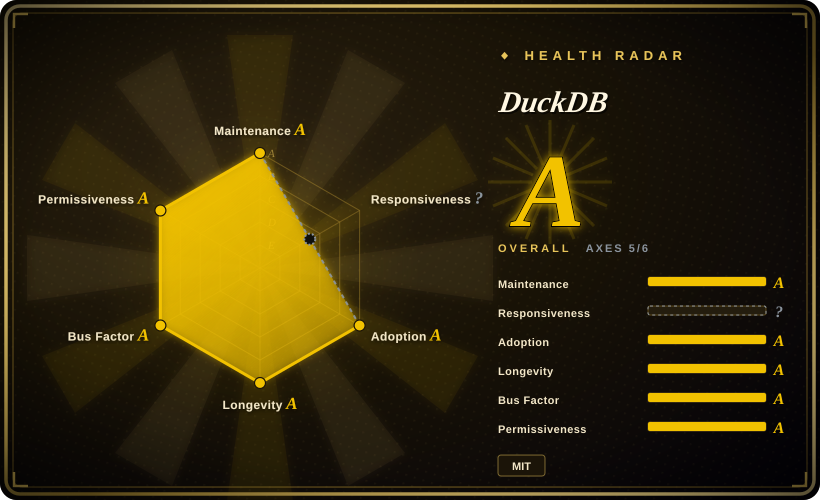
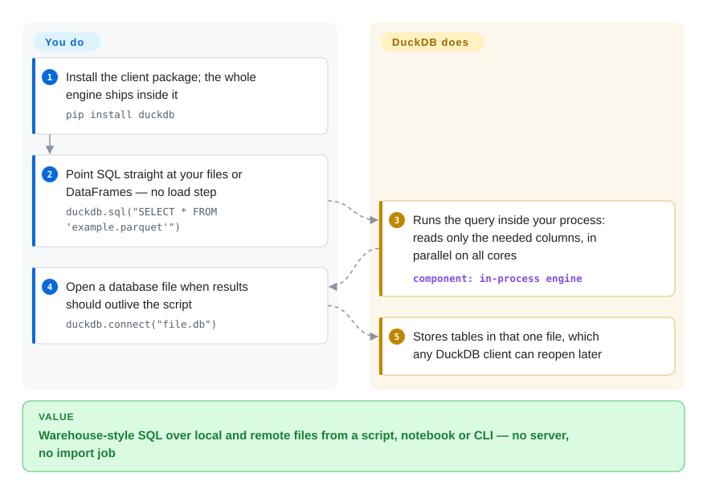

# DuckDB

You have a 20 GB folder of Parquet or CSV files and a question to ask it, and pandas runs out of memory while standing up a database server just to run one `GROUP BY` feels absurd. DuckDB is an analytical SQL engine that runs inside your Python, R or CLI process and queries those files where they lie.

## When to use

You are a data scientist, analytics engineer or backend developer with data sitting in files — exports in S3, Parquet from a pipeline, a few CSVs from finance — and you need joins, window functions and aggregates over it. pandas either chokes on memory or makes you hand-write the join logic; a Postgres or ClickHouse server would mean provisioning, loading and access control for what is really one script or notebook. You `pip install duckdb`, write `SELECT … FROM 'events/*.parquet'`, and the query runs in-process at warehouse speed on your laptop or a single CI runner.

Pick DuckDB over ClickHouse when there is one consumer process and no service to operate; pick ClickHouse when many users must query one continuously growing dataset. Pick it over SQLite or Turso when the workload is analytical scans rather than many small transactional writes. Pick it over Polars when you want SQL (and a persistent database file) rather than a DataFrame API; pick it over Spark when the data fits on one machine — which, with DuckDB's out-of-core execution, covers far more than RAM size.

## How it works

DuckDB is a library: the entire database engine is linked into your process, the way SQLite is, so there is no server, port or user management. You hand it SQL; it plans the query, reads only the columns it needs from Parquet, CSV, JSON, DataFrames or its own file format, and executes it with a *vectorized* engine — one that processes batches of values per operation instead of one row at a time — across all CPU cores. Without a filename it works purely in memory; `duckdb.connect("file.db")` gives you a single-file database that persists and can be reopened from any DuckDB client. What it does for you: parsing files, parallel execution, spilling to a temporary directory when memory runs out, and installing *extensions* (add-on modules such as `httpfs` for S3/HTTP) automatically the first time a query needs them. What stays yours: concurrency — exactly one process may write a database file at a time — plus pinning a version and deciding whether extensions may be downloaded from DuckDB's repository at runtime.

<!-- flow-steps:begin (generated from flows/duckdb.json by tools/flow_card.py — do not edit) -->

Text version of the flow

1. **You**: Install the client package; the whole engine ships inside it — `pip install duckdb`
2. **You**: Point SQL straight at your files or DataFrames — no load step — `duckdb.sql("SELECT * FROM 'example.parquet'")`
3. **DuckDB**: Runs the query inside your process: reads only the needed columns, in parallel on all cores — component: `in-process engine`
4. **You**: Open a database file when results should outlive the script — `duckdb.connect("file.db")`
5. **DuckDB**: Stores tables in that one file, which any DuckDB client can reopen later

**Value**: Warehouse-style SQL over local and remote files from a script, notebook or CLI — no server, no import job

<!-- flow-steps:end -->

## When NOT to use

- **Several processes or services must write the same database concurrently.** In-process DuckDB allows one read-write process per file (others may only open it read-only). Use PostgreSQL for a shared transactional store, or [ClickHouse](clickhouse.md) for a shared analytical server. Within DuckDB, the docs' stable answer is DuckLake with a PostgreSQL catalog; the Quack client-server protocol is still beta (introduced in v1.5.3, maturity targeted for v2.0).
- **The workload is OLTP — many small inserts/updates from concurrent users.** DuckDB's optimistic concurrency fails the second of two transactions touching the same row ("Transaction conflict"), and its storage is tuned for scans. Use SQLite or [Turso](turso.md) for embedded transactional storage, PostgreSQL for a server.
- **The data genuinely exceeds one machine, or many analysts need a governed shared warehouse.** DuckDB scales up, not out. Use Spark or Trino for distributed processing, or a ClickHouse cluster for a shared low-latency store.
- **The database file lives on a network share accessed from several hosts.** DuckDB coordinates through file locks and its docs ask for extra caution on NAS and cross-OS shared directories. Give each host its own copy, or move to a server database.
- **You run air-gapped or under strict supply-chain rules and cannot vet runtime downloads.** Autoloading fetches core extensions from DuckDB's extension repository on first use. Pre-install and pin extensions, or disable autoloading; if that is impractical, Polars or pandas (plain PyPI wheels) may be easier to audit.
- **You cannot absorb a major-version upgrade soon.** DuckDB v2.0.0 is scheduled for 2026-10-21 and the default branch is already `v2.0-cyanoptera`. If stability matters more than features, pin the v1.4 LTS line (one year of community support per LTS) and test v2.0 separately.

## Comparison

| Alternative | In index | Our verdict | Tradeoff |
|---|---|---|---|
| [ClickHouse](clickhouse.md) | ✅ | Pick ClickHouse when many users and services query one continuously growing dataset through a server; pick DuckDB when a single process analyses files and you want nothing to operate. | ClickHouse handles concurrent ingestion and dashboards but is a service to deploy and tune; DuckDB is zero-ops but single-writer per file. |
| [Turso](turso.md) | ✅ | Pick Turso (or SQLite) when an app needs embedded transactional storage with many small writes; pick DuckDB when the embedded workload is scans, joins and aggregates. | Row-oriented SQLite-format storage is fast for point reads/writes and slow for wide scans; DuckDB's columnar engine is the reverse. |
| Polars | 未收录 | Pick Polars when your team thinks in DataFrame expressions inside Python/Rust; pick DuckDB when you want SQL, a persistent database file and the same engine from Python, R, Java, Wasm and a CLI. | Both are fast single-node columnar engines; Polars gives a typed DataFrame API but no database file, DuckDB gives a full SQL database and can query Polars frames directly. |
| Apache Spark | 未收录 | Pick Spark when data and compute must span a cluster; pick DuckDB when one machine is enough, which removes the cluster entirely. | Spark scales out with JVM cluster overhead and slower small-job latency; DuckDB starts in milliseconds but stops at one node. |
| pandas | 未收录 | Pick pandas for small in-memory frames inside an existing pandas codebase; pick DuckDB once joins or aggregates outgrow RAM or get hard to express. | pandas is ubiquitous and flexible but eager and memory-bound; DuckDB can run SQL over pandas DataFrames directly, so the two often coexist. |

## Tech stack

- **Language:** C++ (C++17 compiler required to build; CMake + Python 3 for the build tooling).
- **Engine:** columnar, vectorized query execution with MVCC and optimistic concurrency control inside one process; own single-file storage format plus direct readers for Parquet, CSV and JSON.
- **Clients:** standalone CLI and clients for Python, R, Java, Wasm and others (several live in separate repos, e.g. `duckdb/duckdb-python`).
- **Extensions:** loadable modules (core and community repositories) for remote storage, formats and catalogs; some are built in, others are downloaded on demand.

## Dependencies

- **Runtime:** none beyond the client package or CLI binary — no server, no external database. Python ≥ 3.10 for the Python client.
- **Network (optional but default-on):** extension autoloading downloads core extensions such as `httpfs` from DuckDB's extension repository the first time a query needs them.
- **For multi-writer setups:** DuckLake needs a catalog database (PostgreSQL recommended) and object storage; Quack needs a DuckDB instance acting as server (beta).
- **Storage:** local disk for the database file and a temporary directory for spilling.

## Ops difficulty

**Low.** There is nothing to deploy: it is a dependency in your `requirements.txt` or a single CLI binary, and a database is one file you can copy. The real operational work is version discipline — pick a release line (LTS vs latest), re-test before major upgrades, and pin or pre-install extensions in production and CI — plus designing around the one-writer-process rule. Memory defaults to 80% of RAM for the buffer manager, so containerised jobs should set `memory_limit` explicitly.

## Health & viability

- **Maintenance (as of 2026-10-08):** very active. v1.5.6 shipped 2026-09-28, patch releases roughly monthly, a published release calendar, and v2.0.0 scheduled for 2026-10-21. Every other minor release is an LTS with a year of community support; DuckDB Labs sells support beyond that.
- **Governance / bus factor:** the code is copyrighted to the Stichting DuckDB Foundation (a Dutch non-profit foundation), while the core team works at DuckDB Labs. 227 contributors were active in the last 12 months; the top contributor carries roughly a quarter of recent commits — a real team, though with an identifiable lead maintainer.
- **Backing & longevity:** repo created 2018-06 (about 8 years) and continuously active, with a foundation holding the IP and a company funding development — a solid Lindy prior for an analytical engine.
- **Adoption:** ~42k stars, ~3.9k forks, ~8.6M release-asset downloads and broad embedding in data tools. The radar's A rests on release-asset and Homebrew installs (14,053 in 90 days, 2026-10-09): the main `duckdb` PyPI package now links to the separate duckdb-python repo, so the scorer reads no registry package for this one.
- **Risk flags:** MIT license, no relicense history. The responsiveness axis was not scorable in this run (no qualifying issues in the scorer's window; the previous run graded it B on only 4 issues), so read it as unknown rather than poor. The imminent v2.0 major release is the main near-term change risk.

## Caveats (unverified)

- [未验证] Whether DuckDB v2.0 changes the on-disk storage format or breaks client APIs was not checked; the release calendar marks dates as tentative.
- [推断] Vectorized, columnar execution and reading only needed columns from Parquet are DuckDB's documented design, summarised here without re-reading the internals docs for this sync.
- [推断] Characterisations of Polars, Spark and pandas in the comparison come from general knowledge of those projects, not re-read for this page.
- [推断] The adoption grade leaves out PyPI downloads of `duckdb`, the most common way to install it, because that package is published from duckdb/duckdb-python; the grade is already A without them.
- [未验证] "Top contributor ≈ a quarter of recent commits" is the scorer's `top1_share` (0.261), not an independent count.
