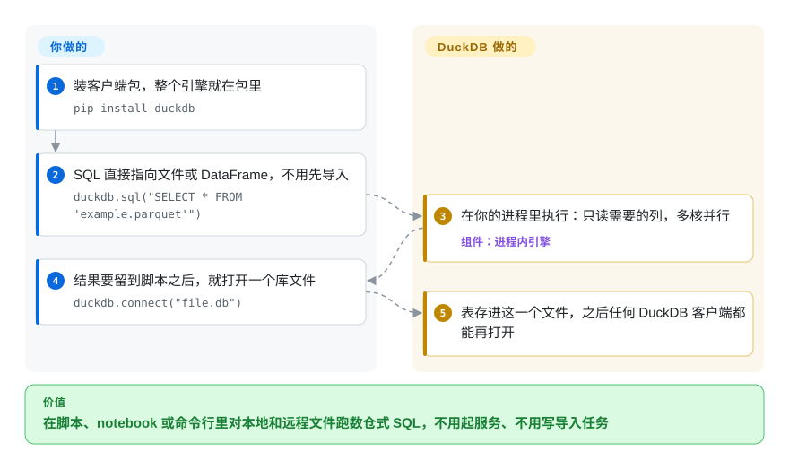

# DuckDB

手里有一个 20 GB 的 Parquet 或 CSV 文件夹，想问它一个问题：pandas 一读就爆内存，可为了跑一条 `GROUP BY` 专门搭一台数据库服务器又太荒唐。DuckDB 是一个跑在你的 Python、R 或命令行进程里的分析型 SQL 引擎，文件放在哪就直接在哪查。

## 何时使用

你是数据科学家、分析工程师或后端开发，数据躺在文件里——S3 上的导出、流水线产出的 Parquet、财务给的几个 CSV——你需要对它们做 join、窗口函数和聚合。pandas 要么内存不够，要么逼你手写 join 逻辑；起一台 Postgres 或 ClickHouse 服务端，又意味着为一个脚本或 notebook 去开机器、导数据、配权限。你 `pip install duckdb`，写一句 `SELECT … FROM 'events/*.parquet'`，查询就在进程里以数仓级速度跑完，笔记本或一台 CI 机器就够。

只有一个使用方进程、不想运维任何服务时，选 DuckDB 而不是 ClickHouse；很多人要查同一份持续增长的数据时选 ClickHouse。负载是分析型扫描、而不是大量小事务写入时，选它而不是 SQLite 或 Turso。想用 SQL（还要一个持久化的库文件）而不是 DataFrame API 时，选它而不是 Polars；数据一台机器放得下时选它而不是 Spark——由于 DuckDB 能在内存不够时落盘计算，“放得下”远比内存大小宽松。

## 怎么用起来

DuckDB 是一个库：整个数据库引擎链接进你的进程，就像 SQLite 那样，所以没有服务端、端口和用户管理。你把 SQL 交给它；它生成执行计划，只从 Parquet、CSV、JSON、DataFrame 或它自己的文件格式里读需要的列，再用*向量化*引擎——每次操作处理一批值，而不是一行一行处理——在所有 CPU 核上执行。不给文件名时它完全在内存里工作；`duckdb.connect("file.db")` 则给你一个持久化的单文件数据库，之后任何 DuckDB 客户端都能再打开。它替你做的：解析文件、并行执行、内存不够时把中间结果写到临时目录，以及在查询第一次用到时自动安装*扩展*（附加模块，比如读 S3/HTTP 的 `httpfs`）。留给你的：并发——同一时间只能有一个进程写一个库文件——以及钉住版本、决定是否允许运行时从 DuckDB 的仓库下载扩展。

<!-- flow-steps:begin (generated from flows/duckdb.json by tools/flow_card.py — do not edit) -->

流程文字版

1. **你**：装客户端包，整个引擎就在包里 — `pip install duckdb`
2. **你**：SQL 直接指向文件或 DataFrame，不用先导入 — `duckdb.sql("SELECT * FROM 'example.parquet'")`
3. **DuckDB**：在你的进程里执行：只读需要的列，多核并行 — 组件：`进程内引擎`
4. **你**：结果要留到脚本之后，就打开一个库文件 — `duckdb.connect("file.db")`
5. **DuckDB**：表存进这一个文件，之后任何 DuckDB 客户端都能再打开

**价值**：在脚本、notebook 或命令行里对本地和远程文件跑数仓式 SQL，不用起服务、不用写导入任务

<!-- flow-steps:end -->

## 何时不用

- **多个进程或服务要同时写同一个库。** 进程内模式下，一个库文件只允许一个读写进程（其他进程只能只读打开）。共享的事务型存储用 PostgreSQL，共享的分析服务用 [ClickHouse](clickhouse.zh.md)。在 DuckDB 体系内，文档给出的稳定方案是用 PostgreSQL 做 catalog 的 DuckLake；Quack 客户端/服务端协议仍是 beta（v1.5.3 引入，目标在 v2.0 成熟）。
- **负载是 OLTP——大量并发用户的小插入、小更新。** DuckDB 用乐观并发控制，两个事务改同一行时后一个直接失败（“Transaction conflict”），存储也是为扫描调优的。嵌入式事务存储用 SQLite 或 [Turso](turso.zh.md)，服务端用 PostgreSQL。
- **数据确实超出一台机器，或者很多分析师需要一个有治理的共享数仓。** DuckDB 只能纵向扩展，不能横向扩展。分布式处理用 Spark 或 Trino，共享的低延迟存储用 ClickHouse 集群。
- **库文件放在网络共享盘上，被多台主机访问。** DuckDB 靠文件锁协调，文档要求在 NAS 和跨操作系统的共享目录上格外小心。给每台主机各放一份，或者换成服务端数据库。
- **你在隔离网络里运行，或者供应链规定严格、没法审核运行时下载。** 自动加载会在首次使用时从 DuckDB 的扩展仓库下载核心扩展。预先安装并钉住扩展，或者关掉自动加载；做不到的话，Polars 或 pandas（普通 PyPI wheel）可能更容易审计。
- **近期承受不起一次大版本升级。** DuckDB v2.0.0 计划在 2026-10-21 发布，默认分支已经是 `v2.0-cyanoptera`。稳定比新功能重要时，钉在 v1.4 LTS 线上（每个 LTS 有一年社区支持），另行测试 v2.0。

## 横向对比

| 替代品 | 是否收录 | 我们的评价 | 取舍 |
|---|---|---|---|
| [ClickHouse](clickhouse.zh.md) | ✅ | 很多用户和服务要通过服务端查询同一份持续增长的数据时选 ClickHouse；单个进程分析文件、什么都不想运维时选 DuckDB。 | ClickHouse 能扛并发写入和看板，但它是一个要部署和调优的服务；DuckDB 零运维，但每个库文件只能一个进程写。 |
| [Turso](turso.zh.md) | ✅ | 应用需要嵌入式事务存储、有大量小写入时选 Turso（或 SQLite）；嵌入式负载是扫描、join 和聚合时选 DuckDB。 | SQLite 格式的行存储点读点写快、宽表扫描慢；DuckDB 的列式引擎正好相反。 |
| Polars | 未收录 | 团队习惯在 Python/Rust 里写 DataFrame 表达式时选 Polars；想要 SQL、持久化库文件、并在 Python、R、Java、Wasm 和命令行里用同一个引擎时选 DuckDB。 | 两者都是快速的单机列式引擎；Polars 提供带类型的 DataFrame API 但没有库文件，DuckDB 是完整的 SQL 数据库，还能直接查询 Polars 的 DataFrame。 |
| Apache Spark | 未收录 | 数据和计算必须跨集群时选 Spark；一台机器够用时选 DuckDB，整个集群都省了。 | Spark 能横向扩展，代价是 JVM 集群开销和小任务启动慢；DuckDB 毫秒级启动，但止步于单节点。 |
| pandas | 未收录 | 已有 pandas 代码、数据量小、全在内存里时用 pandas；join 或聚合超出内存、或者很难用 pandas 表达时换 DuckDB。 | pandas 无处不在、很灵活，但立即求值、受内存限制；DuckDB 能直接对 pandas DataFrame 跑 SQL，所以两者常常并存。 |

## 技术栈

- **语言：** C++（构建需要 C++17 编译器，构建工具用 CMake 和 Python 3）。
- **引擎：** 列式、向量化的查询执行，单进程内用 MVCC 和乐观并发控制；自有的单文件存储格式，另有直接读取 Parquet、CSV、JSON 的读取器。
- **客户端：** 独立的命令行程序，以及 Python、R、Java、Wasm 等客户端（其中几个在单独的仓库里，比如 `duckdb/duckdb-python`）。
- **扩展：** 可加载模块（分核心仓库和社区仓库），提供远程存储、文件格式和 catalog 支持；有些内置，有些按需下载。

## 依赖

- **运行时：** 除了客户端包或命令行二进制，什么都不需要——没有服务端，也没有外部数据库。Python 客户端要求 Python ≥ 3.10。
- **网络（可选，但默认开启）：** 扩展自动加载会在查询第一次需要时，从 DuckDB 的扩展仓库下载 `httpfs` 等核心扩展。
- **多写入方方案：** DuckLake 需要一个 catalog 数据库（推荐 PostgreSQL）和对象存储；Quack 需要一个充当服务端的 DuckDB 实例（beta）。
- **存储：** 本地磁盘存放库文件，另需一个用于落盘计算的临时目录。

## 运维难度

**低。** 没有东西要部署：它就是 `requirements.txt` 里的一个依赖，或者一个命令行二进制，一个数据库就是一个可以复制的文件。真正的运维工作是版本纪律——选定发布线（LTS 还是最新版），大版本升级前重新测试，在生产和 CI 里钉住或预装扩展——以及围绕“只能一个进程写”这条规则做设计。缓冲区默认最多用 80% 的内存，所以在容器里跑任务时应显式设置 `memory_limit`。

## 健康度与可持续性

- **维护（截至 2026-10-08）：** 非常活跃。v1.5.6 于 2026-09-28 发布，补丁版本大约每月一次，有公开的发布日历，v2.0.0 计划在 2026-10-21 发布。每隔一个小版本就是一个 LTS，享有一年社区支持；超出后由 DuckDB Labs 提供付费支持。
- **治理/巴士因子：** 代码版权归 Stichting DuckDB Foundation（荷兰的非营利基金会），核心团队在 DuckDB Labs 工作。过去 12 个月有 227 名活跃贡献者；头号贡献者约占近期提交的四分之一——是真正的团队，但有一位明确的主导维护者。
- **背书与长期性：** 仓库建于 2018-06（约 8 年），一直持续活跃，基金会持有知识产权、公司出资开发——作为分析引擎，Lindy 先验扎实。
- **采用度：** 约 4.2 万 star、约 3.9 千 fork、release 资产约 860 万次下载，被大量数据工具嵌入。雷达上的 A 依据的是 release 资产下载和 Homebrew 安装（90 天 14,053 次，2026-10-09）：PyPI 上的主包 `duckdb` 现在链接到单独的 duckdb-python 仓库，所以评分器不再给这个仓库读注册表包。
- **风险信号：** MIT 许可证，没有改许可证的历史。本轮没能给响应度打分（打分器的时间窗口内没有符合条件的 issue；上一轮只基于 4 个 issue 打了 B），应理解为“未知”而不是“差”。近期最大的变更风险是即将到来的 v2.0 大版本。

## 存疑（未验证）

- [未验证] 没有核实 DuckDB v2.0 是否改变磁盘存储格式或破坏客户端 API；发布日历注明日期是暂定的。
- [推断] 向量化列式执行、只从 Parquet 读取需要的列，是 DuckDB 文档中的设计，这里是概括，本次同步没有重读内部实现文档。
- [推断] 对比表里对 Polars、Spark、pandas 的描述来自对这些项目的一般了解，本页没有重新阅读它们的资料。
- [推断] 采用度没有计入 PyPI 上 `duckdb` 包的下载量，而这是最常见的安装方式，因为该包从 duckdb/duckdb-python 发布；不算它，采用度也已经是 A。
- [未验证] “头号贡献者约占四分之一”是打分器的 `top1_share`（0.261），不是独立统计。
