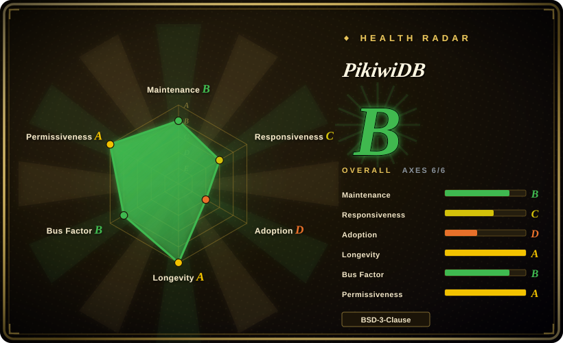
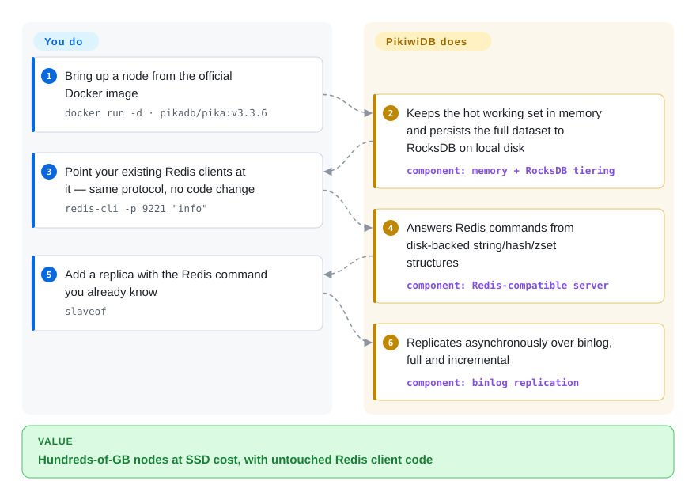

# PikiwiDB

A Redis-protocol-compatible, disk-backed KV store (RocksDB engine) built by Qihoo360's infra team — keeps hot data in memory and persists the full dataset to disk so a single node can hold hundreds of GB the way Redis can't. (This repo is the home of the project historically known as **Pika**.)

## When to use

You run a large Redis deployment and you've hit the wall: a single instance is pushing past 16–64 GB, memory is your dominant hardware cost, failover after an OOM takes minutes to reload the dataset, and your masters keep filling replication buffers. You don't want to rewrite your application — every client speaks the Redis protocol and you lean on `string`/`hash`/`list`/`zset`/`set` plus pub/sub. You stand up PikiwiDB, point your existing Redis clients at it unchanged, and now the working set stays in memory while the full dataset lives on RocksDB on local SSD — so one node holds hundreds of GB instead of tens, the cost-per-GB drops, and restarts don't have to re-warm everything from RAM.

You reach for it specifically when the dataset is **big and cost-sensitive** rather than latency-critical at every key: analytics-adjacent caches, large hash/zset structures, or a Redis tier whose memory bill has gotten painful. You can run it single-node with `slaveof` master-slave replication, stand it up from the official `pikadb/pika` Docker image, or scale horizontally under the bundled Codis proxy for sharding, and migrate from Redis with the project's tools without touching application code.

## How it works

PikiwiDB is a drop-in Redis protocol server whose durability comes from disk, not RAM. It answers the Redis RESP wire protocol on its own port (9221 in the README's Docker example), so your existing clients connect unchanged; in front sits a multi-granularity memory cache for the hot working set, and behind it the full dataset lives in RocksDB — a log-structured merge-tree (an append-then-compact on-disk structure) — with one RocksDB instance per data type (string, hash, list, zset, set, …) under a multi-threaded model. Writes settle to disk asynchronously, and because the dataset already lives on disk, a restart does not need to load everything into memory up front — the hot set gets cached back lazily as queries arrive. What the project does for you: protocol compatibility, hot/cold tiering, persistence, and binlog-based `slaveof` replication (full and incremental). What stays yours: the Linux/macOS host and SSD, LSM tuning (compaction, disk sizing, backups), the choice between the v3.x and v4.x release lines, and the Codis proxy topology if you shard.

<!-- flow-steps:begin (generated from flows/pikiwidb.json by tools/flow_card.py — do not edit) -->

Text version of the flow

1. **You**: Bring up a node from the official Docker image — `docker run -d · pikadb/pika:v3.3.6`
2. **PikiwiDB**: Keeps the hot working set in memory and persists the full dataset to RocksDB on local disk — component: `memory + RocksDB tiering`
3. **You**: Point your existing Redis clients at it — same protocol, no code change — `redis-cli -p 9221 "info"`
4. **PikiwiDB**: Answers Redis commands from disk-backed string/hash/zset structures — component: `Redis-compatible server`
5. **You**: Add a replica with the Redis command you already know — `slaveof`
6. **PikiwiDB**: Replicates asynchronously over binlog, full and incremental — component: `binlog replication`

**Value**: Hundreds-of-GB nodes at SSD cost, with untouched Redis client code

<!-- flow-steps:end -->

## When NOT to use

- **Your dataset already fits comfortably in RAM.** If you're under Redis's memory ceiling, plain Redis (or KeyDB/Dragonfly) gives lower and more predictable latency; a disk-backed store adds I/O variance you don't need.
- **You need pure in-memory microsecond latency on every op.** RocksDB reads can hit disk; p99 is governed by your SSD and LSM compaction, not RAM. PikiwiDB trades latency for capacity — that's the whole point, and the wrong trade if latency is sacred.
- **You depend on the newest or most exotic Redis commands/modules.** Compatibility targets *commonly used* data structures and commands; Redis modules (RedisJSON, RediSearch, Redis Functions) and the latest command additions are not the same surface. Verify your exact command set. [未验证]
- **You want a turnkey managed service.** This is server software you operate yourself — RocksDB tuning, compaction, backups, and the Codis topology are your responsibility.
- **You're uneasy about a renamed/forked lineage.** The project carries the Pika history and a dual release line (a v3.x and a v4.x stream); pin a version and read its docs rather than assuming the two lines are interchangeable. [未验证]

## Comparison

| Alternative | In index | Our verdict | Tradeoff |
|---|---|---|---|
| Redis | 未收录 | Choose Redis when you need the in-memory original with the richest ecosystem. | In-memory original; lowest latency and richest command/module ecosystem, but bounded by RAM and expensive per-GB at large scale. PikiwiDB is the disk-backed capacity play, not a latency upgrade. |
| KeyDB | 未收录 | Choose KeyDB when you need a multithreaded Redis fork that stays memory-resident. | Multithreaded Redis fork, still memory-resident; helps throughput, not the capacity-vs-RAM-cost problem PikiwiDB targets. |
| Dragonfly | 未收录 | Choose Dragonfly when you need a modern high-throughput Redis-compatible store. | Modern multithreaded Redis-compatible store; very high throughput but in-memory-first, BSL-licensed — different licensing and capacity model. |
| SSDB | 未收录 | Choose SSDB when you need an older LevelDB-backed Redis-like disk store. | Older LevelDB-backed Redis-ish disk store; similar idea, smaller/aging community and weaker protocol fidelity than PikiwiDB. |
| Kvrocks (Apache) | 未收录 | Choose Kvrocks when you need a RocksDB-backed Redis-protocol Apache project. | RocksDB-backed, Redis-protocol, now an Apache project; the closest direct competitor — weigh Apache governance vs PikiwiDB's OpenAtom/Qihoo backing. |

## Tech stack

- **Language:** C++ (multi-threaded model; build requires a C++17 compiler, gcc/g++ ≥ 9, cmake ≥ 3.18 per the README).
- **Storage engine:** RocksDB (LSM tree on local disk); each data structure backed by its own RocksDB instance.
- **Replication:** binlog-based asynchronous master-slave (`slaveof`), full and incremental sync.
- **Clustering:** Codis proxy architecture (groups of master-slave sets) for sharding/elastic scaling.
- **Protocol:** Redis RESP wire protocol; supports string/hash/list/zset/set/geo/hyperloglog/pubsub/bitmap/stream/ACL per the README.
- **Tenancy:** the README headline now describes the system as *multi-tenant* (a v4.x-era claim); the isolation semantics were not verified here. [推断]

## Dependencies

- **OS:** Linux (CentOS, Ubuntu, Rocky) and macOS per the README; local disk (SSD strongly advised for an LSM store).
- **Build:** from source, per the README — a compiler with C++17 support (gcc/g++ ≥ 9), make, cmake ≥ 3.18, autoconf; `./build.sh` drives the build (artifacts land in `output/`).
- **Containers:** an official `pikadb/pika` Docker image with a documented `docker run` / docker-compose path.
- **Cluster mode:** the bundled Codis proxy components if you shard; otherwise a single binary + config for master-slave.
- **No external datastore** — RocksDB is embedded; the persistence is local to each node.

## Ops difficulty

**Medium-to-high.** Single-node master-slave is approachable — a binary, a config, `slaveof`. The burden is real once you scale or care about tail latency: RocksDB means you inherit LSM operational concerns (compaction tuning, write amplification, disk sizing, snapshot/backup), and the Codis cluster mode adds a proxy topology with its own dashboard, groups, and migration mechanics to operate. Capacity planning shifts from "how much RAM" to "how much SSD plus compaction headroom." Expect to invest in monitoring disk I/O and compaction, not just memory. Migrating from Redis is documented and tool-assisted, but validating command compatibility for your workload is on you.

## Health & viability

- **Responsiveness**: radar grades it C (median first response 175.2 hours over the scored window) — questions get answered, slowly.
- **Maintenance (2026-09).** Default-branch (`unstable`) last commit 2026-09-01; releases: v4.0.4-alpha (2026-09-01), v4.0.3 (2026-06-17), v3.5.7 (2026-06-18) — **active but cautious**: the newest v4 build carries an `-alpha` suffix and the gap between v4.0.2 (2025-03) and v4.0.3 (2026-06) shows the pace is not fast. Not archived.
- **Governance / backing.** Hosted under the **OpenAtom Foundation** with origins in **Qihoo360**'s infrastructure team — foundation backing plus a corporate origin is a healthier bus-factor signal than a lone maintainer, though the core contributor set stays concentrated. [推断]
- **Age & Lindy verdict.** Repo created 2014-11 (~11 years, inherited from the Pika lineage) and **still actively shipping** ⇒ a **strong Lindy** signal — a long-proven Redis-on-disk implementation, not a hyped newcomer. [推断]
- **Adoption.** ~6.1k stars, ~1.17k forks (GitHub API 2026-09-28), 76 open issues. The README's user showcase claims production deployments at 360 (10k+ instances, 1.8TB each), Weibo (10k+ instances), Ximalaya (6k+ instances, 120TB+) and Getui — vendor-claimed, dated, but a real deployment track. [未验证]
- **Risk flags.** The Pika→PikiwiDB rename and parallel v3/v4 lines remain the main confusion risk — and the newest line is still alpha-suffixed; BSD-3-Clause is permissive with no relicense history found. Documentation skews Chinese-first. [推断]

## Caveats (unverified)

- [未验证] Stars ~6.1k, forks ~1.17k, 76 open issues as of 2026-09-28 (GitHub API) — volatile, indicative only.
- [未验证] The exact Redis command/data-structure compatibility surface (and gaps vs Redis modules / newest commands) is the README's framing; verify against your workload's command set.
- [未验证] The relationship and compatibility between the v3.x and v4.x release lines, and which is recommended for new deployments, is not asserted here — read the repo's current release notes. v4.0.4 carries an `-alpha` suffix despite being returned as the latest release; its prerelease status should be confirmed before pinning.
- [推断] "SSD strongly advised" and the LSM operational concerns are inferred from the RocksDB engine, not a measured benchmark in this repo.
- [推断] The "no full-memory re-warm on restart, hot set cached back lazily" behavior is inferred from the README's hot/cold tiering and multi-granularity caching description, not documented recovery semantics.
- [未验证] The "multi-tenant" descriptor in the README headline: what tenancy means concretely (namespaces? per-tenant quotas/isolation?) was not verified from docs or source.
- [未验证] The README's user showcase (360/Weibo/Ximalaya/Getui instance counts) is an upstream claim with no date attached; treat as historical evidence, not current.
