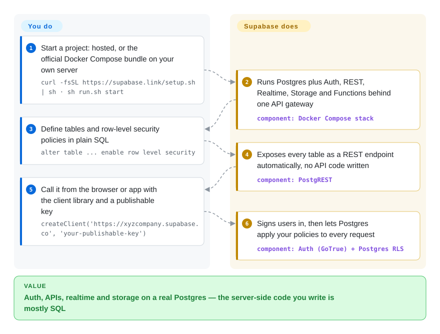

# Supabase

Before your app can show its first screen, you need sign-up and login, an API, file uploads and live updates — and wiring that up yourself means four services and their glue before any product code exists. Supabase hands you a real Postgres database with those pieces already attached, so most of your "backend" becomes SQL tables and access policies.

## When to use

You are building a web or mobile app — a small team, maybe a solo founder — and you need users, a database, an API, file storage and realtime updates this month, not after a quarter of backend work. Firebase would get you there fast, but its document store makes relational data, reporting joins and leaving the platform painful later. Rolling your own means Postgres plus an auth server, a REST layer, an upload service, a websocket server and a gateway, each with its own config and upgrades.

You reach for Supabase because every piece sits on one Postgres database you can open with `psql`: tables become REST (and GraphQL) endpoints automatically, users come from its auth service, and access control is Postgres row-level security — a policy like "users can read only their own rows" written once in SQL and enforced on every request. Pick it over Firebase when relational data and an exit path matter; over Appwrite or PocketBase when you specifically want Postgres and its extensions (`pgvector` for embeddings, PostGIS for geodata); over a DIY Postgres + PostgREST stack when you would rather adopt an integrated, maintained bundle than assemble and upgrade the parts yourself.

## How it works

Supabase is a set of separate open-source services arranged around one Postgres database, rather than a single program. The repo you are reading holds the dashboard (Studio), the docs, and the official Docker Compose bundle that wires the services together; each service lives in its own repo. On top of Postgres it runs PostgREST (turns your tables into a REST API), Auth (sign-up/login that issues *JWTs* — signed tokens saying who the user is), Realtime (an Elixir server that streams database changes over websockets), Storage (file API whose permissions also live in Postgres), an Edge Runtime for Deno-based functions, and Supavisor (a connection pooler), all behind one API gateway. What it does for you: running and connecting those services, generating the API from your schema, and checking every request's token so Postgres can apply your row-level security policies. What stays yours: the schema and the policies — forget to enable row-level security on a table and the API exposes it — and, if you self-host, secrets, backups, upgrades and the database's capacity.

<!-- flow-steps:begin (generated from flows/supabase.json by tools/flow_card.py — do not edit) -->

Text version of the flow

1. **You**: Start a project: hosted, or the official Docker Compose bundle on your own server — `curl -fsSL https://supabase.link/setup.sh | sh · sh run.sh start`
2. **Supabase**: Runs Postgres plus Auth, REST, Realtime, Storage and Functions behind one API gateway — component: `Docker Compose stack`
3. **You**: Define tables and row-level security policies in plain SQL — `alter table ... enable row level security`
4. **Supabase**: Exposes every table as a REST endpoint automatically, no API code written — component: `PostgREST`
5. **You**: Call it from the browser or app with the client library and a publishable key — `createClient('https://xyzcompany.supabase.co', 'your-publishable-key')`
6. **Supabase**: Signs users in, then lets Postgres apply your policies to every request — component: `Auth (GoTrue) + Postgres RLS`

**Value**: Auth, APIs, realtime and storage on a real Postgres — the server-side code you write is mostly SQL

<!-- flow-steps:end -->

## When NOT to use

- **You plan to self-host in production without someone who will own it.** The self-hosted bundle is "community-supported", and its README warns the default configuration "is not secure for production use" until every default secret is replaced. Use Supabase's hosted platform (not a repo) if you want the integrated stack without operating it, or managed Postgres plus a smaller auth service if you only need part of it.
- **The workload is heavy analytics or OLAP.** Supabase is a transactional Postgres. Send event-scale aggregates to [ClickHouse](clickhouse.md) (server) or [DuckDB](duckdb.md) (in-process), or a hosted warehouse, and keep Supabase for the app's live data.
- **Your architecture needs many independent databases with separate lifecycles.** A Supabase project is built around one Postgres database. Run your own Postgres clusters (or a document store such as MongoDB) per service instead.
- **Your team will not write SQL.** Schemas, migrations and especially row-level security policies are SQL; a wrong policy is a data leak. Firebase (not a repo) or Appwrite keep the data model in SDKs and console rules instead.
- **You need low-latency writes from every region.** Supabase offers read replicas, but writes go to one primary in one region. Use a distributed SQL database such as CockroachDB or YugabyteDB.
- **Your primary store must be non-relational (document, wide-column, graph).** Supabase is Postgres all the way down; use MongoDB, ScyllaDB or Neo4j for those models.

## Comparison

| Alternative | In index | Our verdict | Tradeoff |
| --- | --- | --- | --- |
| Firebase | not a repo | Pick Firebase when you want a fully managed Google backend with the deepest mobile SDKs and no database design; pick Supabase when you need relational SQL and the option to self-host or leave. | Firebase removes all ops and schema work but locks data into Firestore's document model and Google's platform; Supabase gives you portable Postgres at the cost of writing SQL and policies. |
| Appwrite | 未收录 | Pick Appwrite when you want a self-hosted Firebase-style backend whose permissions and data are managed through its own SDKs and console; pick Supabase when you want direct Postgres access and extensions. | Appwrite hides the database behind its own collections API, so you skip SQL; Supabase exposes the database itself, so you get joins, extensions and `psql`, but you own the schema. |
| PocketBase | 未收录 | Pick PocketBase for a small app or prototype that should run as one binary with an embedded SQLite file; pick Supabase when you need Postgres scale, extensions and a multi-service platform. | PocketBase is trivial to deploy and back up (one process, one file) but stops at single-node SQLite; Supabase scales further but self-hosting means a dozen containers. |
| Hasura | 未收录 | Pick Hasura when the need is a GraphQL API over existing databases with fine-grained permissions; pick Supabase when you also need auth, storage, realtime and functions in one bundle. | Hasura focuses on the API layer across several databases; Supabase is narrower on databases (Postgres only) but covers the rest of the backend. |
| Self-hosted Postgres + PostgREST + an auth server | 未收录 | Assemble the parts yourself only when you need to swap components or run a minimal subset; otherwise take Supabase, which already integrates and versions the same building blocks. | DIY gives full control and fewer moving parts you did not choose, but you write the glue, the gateway config and the upgrade matrix that Supabase's Compose bundle maintains for you. |

## Tech stack

- **PostgreSQL** — the core; the bundle ships the `supabase/postgres` image (Postgres 17 by default, a Postgres 15 override exists) with extensions such as `pgvector`, PostGIS and `pg_graphql`.
- **PostgREST** (Haskell) — auto-generated REST API.
- **Auth / GoTrue** (Go) — JWT-based sign-up, login and sessions.
- **Realtime** and **Supavisor** (Elixir) — websocket change streams and Postgres connection pooling.
- **Storage API** and **postgres-meta** (TypeScript) — file API with permissions in Postgres, and a REST API for managing Postgres.
- **Edge Runtime** (Rust, Deno-based) — runs JavaScript/TypeScript/WASM functions.
- **Envoy** — default API gateway in the self-hosted bundle (Kong available as an override).
- **Studio** (TypeScript/Next.js) — the dashboard, living in this repo.

## Dependencies

- **Hosted:** none on your side beyond the client libraries (`@supabase/supabase-js`, Flutter, Swift, Python and others).
- **Self-hosted:** Docker with Compose; the docs list a minimum of 4 GB RAM, 2 CPU cores and 40 GB SSD (8 GB / 4 cores / 80 GB recommended).
- **Storage backend:** local file storage by default; an S3-compatible object store via optional overrides.
- **Email:** an SMTP provider for auth emails (confirmation, password reset).
- **Optional:** Logflare + Vector for logs and analytics (adds resource requirements).

## Ops difficulty

**Low on the hosted platform; medium-to-high self-hosted.** Hosted, you manage schema, policies and plan limits. Self-hosted, you run about a dozen containers: rotate every default secret and key (helper scripts exist), put TLS in front, back up Postgres, apply the roughly monthly image updates (`update.sh`, with a published version history for rollback), and size Postgres yourself. Some platform features are documented for the hosted service first, and self-hosted help comes from the community rather than Supabase support.

## Health & viability

- **Maintenance (as of 2026-10-08):** very active — commits every week, monthly releases of the platform repo (v1.26.08 on 2026-08-07) and a refreshed self-hosted image set on 2026-09-09.
- **Responsiveness:** issues get a first response in a median of about 14.8 hours (26 qualifying issues in the scorer's window), slower than the previous run's 5.2 hours but still fast.
- **Governance / bus factor:** owned and steered by Supabase Inc. Contributions are widely spread — the top three contributors account for about 26.5% of recent commits across 181 active contributors in the last 12 months — but the roadmap is the company's.
- **Backing & longevity:** repo created 2019-10 (about 7 years, 2,553 days), continuously active and venture-backed; a good Lindy prior for a platform this young, with the usual dependency on the company's commercial success.
- **Adoption:** ~111k stars and ~16k forks; the scorer could not grade adoption because the platform repo has no single canonical package to measure.
- **Risk flags:** the core repos are Apache-2.0 or MIT (PostgREST is MIT, Postgres under its own permissive license) with no relicense so far. The real dependency risk is on the hosted business: self-hosting is supported by the community, not the company.

## Caveats (unverified)

- [未验证] Supabase Inc.'s funding and runway were not verified from primary sources.
- [未验证] Exact feature parity between the hosted platform and the self-hosted bundle is not documented in one place; some features (e.g. SSO, managed backups, branching) may be hosted-only.
- [推断] Characterisations of Appwrite, PocketBase and Hasura in the comparison (data model, deployment shape, license) come from general knowledge, not re-read for this page.
- [未验证] `pgvector` performance at very large scale (billions of embeddings) inside a shared Supabase Postgres was not benchmarked.
- [推断] Read-replica latency versus a true multi-region distributed database was not benchmarked; the single-primary-region statement follows from the architecture.
