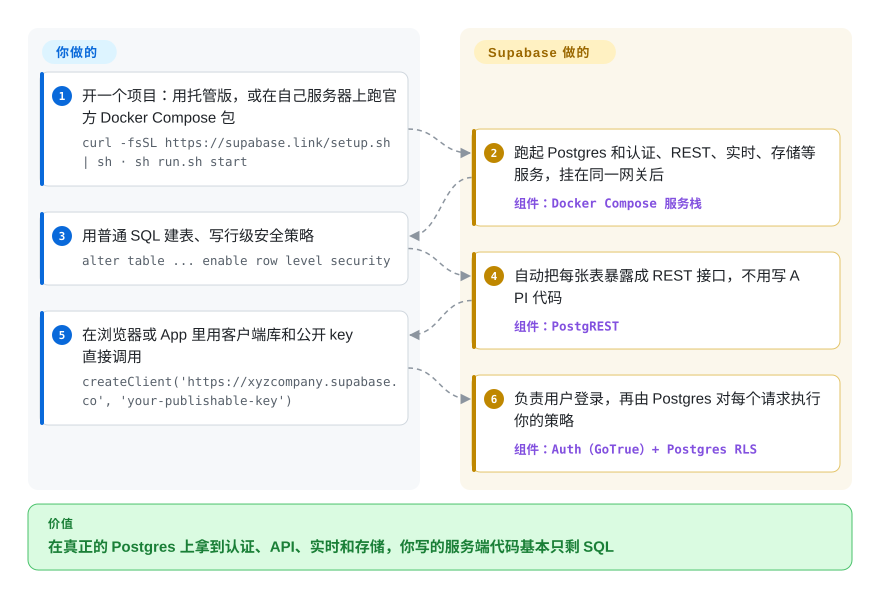

# Supabase

应用还没出第一屏，你就得先有注册登录、API、文件上传和实时刷新——自己搭意味着在写任何产品代码之前，先要接好四个服务和它们之间的胶水。Supabase 给你一个真正的 Postgres 数据库，这些部件已经接在上面，你的“后端”大部分变成了 SQL 表和访问策略。

## 何时使用

你在做一个 Web 或移动应用——小团队，也许只有你一个创始人——这个月就需要用户体系、数据库、API、文件存储和实时更新，而不是先花一个季度写后端。Firebase 能让你很快上线，但它的文档型存储会让关系数据、报表 join 和日后迁出平台都很痛苦。自己搭则意味着 Postgres 加一个认证服务、一层 REST、一个上传服务、一个 websocket 服务和一个网关，每个都有自己的配置和升级。

这时想到 Supabase，是因为所有部件都建在同一个你能用 `psql` 打开的 Postgres 上：表自动变成 REST（以及 GraphQL）接口，用户来自它的认证服务，访问控制就是 Postgres 的行级安全（row-level security）——像“用户只能读自己的行”这样的策略用 SQL 写一次，每个请求都会执行。关系数据和退出路径重要时，选它而不是 Firebase；明确想要 Postgres 及其扩展（`pgvector` 存向量、PostGIS 处理地理数据）时，选它而不是 Appwrite 或 PocketBase；宁可用一个集成好、有人维护的整包，也不想自己组装和升级各个部件时，选它而不是自搭 Postgres + PostgREST。

## 怎么用起来

Supabase 不是一个程序，而是一组围绕同一个 Postgres 数据库排布的独立开源服务。你看到的这个仓库放的是控制台（Studio）、文档，以及把各服务连起来的官方 Docker Compose 包；每个服务都在自己的仓库里。在 Postgres 之上，它运行 PostgREST（把表变成 REST API）、Auth（注册登录，签发 *JWT*——一种带签名、说明“这是谁”的令牌）、Realtime（用 Elixir 写的服务，通过 websocket 推送数据库变更）、Storage（文件 API，权限同样存在 Postgres 里）、跑 Deno 函数的 Edge Runtime，以及连接池 Supavisor，全部挂在一个 API 网关后面。它替你做的：运行并连接这些服务，根据你的表结构生成 API，检查每个请求的令牌，让 Postgres 执行你的行级安全策略。留给你的：表结构和策略——哪张表忘了开行级安全，API 就会把它整个暴露出去——以及自托管时的密钥、备份、升级和数据库容量。

<!-- flow-steps:begin (generated from flows/supabase.json by tools/flow_card.py — do not edit) -->

流程文字版

1. **你**：开一个项目：用托管版，或在自己服务器上跑官方 Docker Compose 包 — `curl -fsSL https://supabase.link/setup.sh | sh · sh run.sh start`
2. **Supabase**：跑起 Postgres 和认证、REST、实时、存储等服务，挂在同一网关后 — 组件：`Docker Compose 服务栈`
3. **你**：用普通 SQL 建表、写行级安全策略 — `alter table ... enable row level security`
4. **Supabase**：自动把每张表暴露成 REST 接口，不用写 API 代码 — 组件：`PostgREST`
5. **你**：在浏览器或 App 里用客户端库和公开 key 直接调用 — `createClient('https://xyzcompany.supabase.co', 'your-publishable-key')`
6. **Supabase**：负责用户登录，再由 Postgres 对每个请求执行你的策略 — 组件：`Auth（GoTrue）+ Postgres RLS`

**价值**：在真正的 Postgres 上拿到认证、API、实时和存储，你写的服务端代码基本只剩 SQL

<!-- flow-steps:end -->

## 何时不用

- **打算在生产环境自托管，却没有人负责它。** 自托管包是“社区支持”的，它的 README 警告默认配置“不适合生产使用”，必须先换掉所有默认密钥。想要这一整套又不想运维，就用 Supabase 的托管平台（非仓库）；只需要其中一部分，就用托管 Postgres 加一个更小的认证服务。
- **负载是重度分析或 OLAP。** Supabase 是事务型 Postgres。事件级聚合交给 [ClickHouse](clickhouse.zh.md)（服务端）、[DuckDB](duckdb.zh.md)（进程内）或托管数仓，Supabase 只放应用的在线数据。
- **架构需要很多生命周期各自独立的数据库。** 一个 Supabase 项目围绕一个 Postgres 数据库构建。每个服务各跑自己的 Postgres 集群（或 MongoDB 这类文档库）。
- **团队不愿写 SQL。** 表结构、迁移，尤其是行级安全策略都是 SQL；策略写错就是数据泄露。Firebase（非仓库）或 Appwrite 把数据模型放在 SDK 和控制台规则里。
- **需要每个地区都有低延迟写入。** Supabase 有只读副本，但写入都落在一个地区的主库上。改用 CockroachDB 或 YugabyteDB 这类分布式 SQL 数据库。
- **主存储必须是非关系型（文档、宽列、图）。** Supabase 从头到尾都是 Postgres；这些模型用 MongoDB、ScyllaDB 或 Neo4j。

## 横向对比

| 替代品 | 是否收录 | 我们的评价 | 取舍 |
| --- | --- | --- | --- |
| Firebase | 非仓库 | 想要完全托管的 Google 后端、最全的移动端 SDK、不想设计数据库时选 Firebase；需要关系型 SQL、并保留自托管或迁出的选项时选 Supabase。 | Firebase 免去全部运维和表结构设计，但数据锁在 Firestore 的文档模型和 Google 平台里；Supabase 给你可迁移的 Postgres，代价是要写 SQL 和策略。 |
| Appwrite | 未收录 | 想要自托管、Firebase 风格、权限和数据都通过它自己的 SDK 和控制台管理的后端时选 Appwrite；想直接访问 Postgres、用它的扩展时选 Supabase。 | Appwrite 把数据库藏在自己的 collections API 后面，你不用写 SQL；Supabase 直接暴露数据库，你能用 join、扩展和 `psql`，但表结构归你管。 |
| PocketBase | 未收录 | 小应用或原型、希望一个二进制加一个内嵌 SQLite 文件就能跑时选 PocketBase；需要 Postgres 的规模、扩展和多服务平台时选 Supabase。 | PocketBase 部署和备份极其简单（一个进程、一个文件），但止步于单节点 SQLite；Supabase 能扩得更远，但自托管意味着十几个容器。 |
| Hasura | 未收录 | 需求是在现有数据库上加一个带细粒度权限的 GraphQL API 时选 Hasura；还需要认证、存储、实时和函数打成一包时选 Supabase。 | Hasura 专注 API 层，能覆盖多种数据库；Supabase 数据库只支持 Postgres，但把后端其余部分都包了。 |
| 自托管 Postgres + PostgREST + 认证服务 | 未收录 | 只有在需要替换组件或只跑最小子集时才自己拼；否则用 Supabase，它已经把同样的积木集成好并统一了版本。 | 自己拼能完全掌控、没有你没选过的组件，但胶水代码、网关配置和升级兼容矩阵都得自己写，这些 Supabase 的 Compose 包已经替你维护。 |

## 技术栈

- **PostgreSQL**——核心；包里用 `supabase/postgres` 镜像（默认 Postgres 17，另有 Postgres 15 的覆盖配置），带 `pgvector`、PostGIS、`pg_graphql` 等扩展。
- **PostgREST**（Haskell）——自动生成 REST API。
- **Auth / GoTrue**（Go）——基于 JWT 的注册、登录和会话。
- **Realtime** 和 **Supavisor**（Elixir）——websocket 变更推送和 Postgres 连接池。
- **Storage API** 和 **postgres-meta**（TypeScript）——权限存在 Postgres 里的文件 API，以及管理 Postgres 的 REST API。
- **Edge Runtime**（Rust，基于 Deno）——运行 JavaScript/TypeScript/WASM 函数。
- **Envoy**——自托管包默认的 API 网关（Kong 可作为覆盖配置启用）。
- **Studio**（TypeScript/Next.js）——控制台，就在这个仓库里。

## 依赖

- **托管版：** 你这边只需要客户端库（`@supabase/supabase-js`、Flutter、Swift、Python 等）。
- **自托管：** 带 Compose 的 Docker；文档列出的最低配置是 4 GB 内存、2 核 CPU、40 GB SSD（推荐 8 GB、4 核、80 GB）。
- **存储后端：** 默认本地文件存储；通过可选覆盖配置接 S3 兼容对象存储。
- **邮件：** 发送认证邮件（确认、重置密码）的 SMTP 服务。
- **可选：** 用于日志和分析的 Logflare + Vector（会增加资源需求）。

## 运维难度

**托管版低，自托管中到高。** 托管版你只管表结构、策略和套餐额度。自托管要跑十来个容器：轮换所有默认密钥和 key（有辅助脚本），前面加 TLS，备份 Postgres，大约每月应用一次镜像更新（`update.sh`，并有公开的版本历史便于回滚），还要自己规划 Postgres 容量。部分平台功能的文档以托管版为先，自托管遇到问题靠社区而不是 Supabase 官方支持。

## 健康度与可持续性

- **维护（截至 2026-10-08）：** 非常活跃——每周都有提交，平台仓库每月发版（v1.26.08 于 2026-08-07 发布），自托管镜像组合在 2026-09-09 刚更新过。
- **响应度：** issue 首次响应的中位数约 14.8 小时（打分器窗口内 26 个符合条件的 issue），比上一轮的 5.2 小时慢，但依然很快。
- **治理/巴士因子：** 由 Supabase Inc. 拥有和主导。贡献很分散——过去 12 个月 181 名活跃贡献者中，前三名约占近期提交的 26.5%——但路线图属于公司。
- **背书与长期性：** 仓库建于 2019-10（约 7 年，2553 天），持续活跃，有风险投资支持；对这个年纪的平台来说 Lindy 先验不错，但照例依赖公司的商业成败。
- **采用度：** 约 11.1 万 star、约 1.6 万 fork；打分器没能给采用度打分，因为平台仓库没有单一的规范包可供度量。
- **风险信号：** 核心仓库是 Apache-2.0 或 MIT（PostgREST 是 MIT，Postgres 用它自己的宽松许可证），至今没有改许可证。真正的依赖风险在托管业务：自托管由社区支持，而不是公司。

## 存疑（未验证）

- [未验证] Supabase Inc. 的融资和资金跑道没有从一手来源核实。
- [未验证] 托管平台和自托管包之间确切的功能对等情况没有集中记录；某些功能（如 SSO、托管备份、分支）可能只在托管版提供。
- [推断] 对比表里对 Appwrite、PocketBase、Hasura 的描述（数据模型、部署形态、许可证）来自一般了解，本页没有重新阅读它们的资料。
- [未验证] 没有对共享的 Supabase Postgres 中 `pgvector` 在极大规模（数十亿条向量）下的性能做基准测试。
- [推断] 没有对比测试只读副本和真正多区域分布式数据库的延迟；“主库在单一地区”的说法是从架构推出来的。
