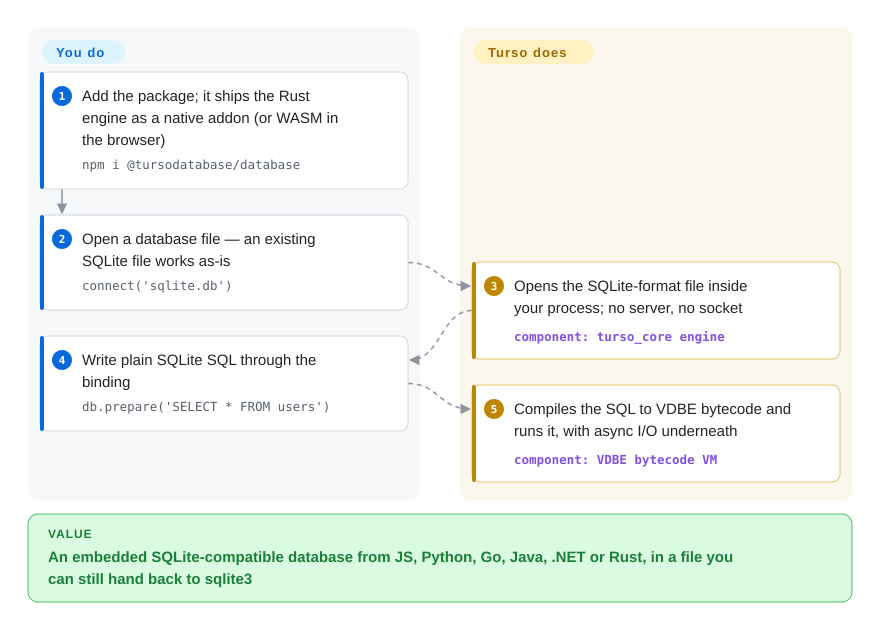

# Turso Database

Your app keeps its data in a SQLite file, and the second concurrent write gets `database is locked`, every query blocks the thread, and changing the engine means forking a large C codebase. Turso is a from-scratch Rust rewrite of SQLite that opens the same files and speaks the same SQL, and adds async I/O, an opt-in multi-writer mode and vector search — at pre-1.0 maturity.

## When to use

You are building a local-first app, an agent runtime or an edge service in TypeScript, Rust or Python that already treats SQLite as "the database is a file next to the process". Two things keep hurting: bursts of writes from several connections end in `SQLITE_BUSY: database is locked` because SQLite allows exactly one writer, and your async runtime has to push every query onto a thread pool because SQLite's I/O is blocking. You also want embeddings stored next to the rows instead of in a separate vector service. You reach for Turso: `npm i @tursodatabase/database`, point it at the existing `.db` file, and keep the same SQL, while getting a native async API, `BEGIN CONCURRENT` transactions (row-level conflict detection under an MVCC journal mode — *MVCC*: every writer works on its own row versions, and conflicts are only checked at commit), built-in vector functions, and the same engine in the browser through WebAssembly.

The deciding tradeoff against its substitutes: over **SQLite** you trade over two decades of proven reliability and the full feature surface for a memory-safe, async, actively extended engine; over **libSQL** (Turso Inc.'s earlier C fork of SQLite) you trade the longer production record and the much larger install base for the codebase where the same company now puts its development effort. Pick it when those new capabilities are worth being an early adopter of a pre-1.0 database engine — not as a drop-in reliability upgrade.

## How it works

Turso is a library that lives inside your process, like SQLite: there is no server to run. You call a language binding (JS via a native addon or WASM, Python, Go without CGO, Java/JDBC, .NET, Rust), and the Rust core parses your SQL, compiles it into bytecode for a small virtual machine called the VDBE — the same design SQLite uses — and executes it against pages of a file in SQLite's on-disk format. What the project does for you: the storage engine, write-ahead log (a side file where changes land before being merged into the main file), transactions, async I/O (io_uring on Linux), and extras such as vector functions, CDC (a change feed you can subscribe to) and, behind flags, full-text search, encryption and incremental views. What stays yours: choosing which experimental flags you can trust with real data, keeping backups (the project's own FAQ asks for this before 1.0), and staying in one process per database file. A second "frontend" compiles the Postgres dialect and wire protocol onto the same VM, but that path is experimental; the SQLite path is the one this card follows.

<!-- flow-steps:begin (generated from flows/turso.json by tools/flow_card.py — do not edit) -->

Text version of the flow

1. **You**: Add the package; it ships the Rust engine as a native addon (or WASM in the browser) — `npm i @tursodatabase/database`
2. **You**: Open a database file — an existing SQLite file works as-is — `connect('sqlite.db')`
3. **Turso Database**: Opens the SQLite-format file inside your process; no server, no socket — component: `turso_core engine`
4. **You**: Write plain SQLite SQL through the binding — `db.prepare('SELECT * FROM users')`
5. **Turso Database**: Compiles the SQL to VDBE bytecode and runs it, with async I/O underneath — component: `VDBE bytecode VM`

**Value**: An embedded SQLite-compatible database from JS, Python, Go, Java, .NET or Rust, in a file you can still hand back to sqlite3

<!-- flow-steps:end -->

## When NOT to use

- **The data is critical and you need proven reliability today.** Use **SQLite** itself. Turso is v0.8.x; its FAQ says 1.0 has not been reached and to keep independent backups, and on 2026-09-30 a search found 35 open issues mentioning corruption (e.g. an `ALTER COLUMN` path that leaves secondary indexes stale, #7077). SQLite's test discipline and two-decade record are exactly what a young rewrite cannot have yet.
- **Several processes share one database file** (gunicorn/uWSGI workers, a cron job plus the web app, a CLI poking the app's DB). Use **SQLite** in WAL mode. Turso's manual lists "No multi-process access"; the `.tshm` multi-process WAL is behind `--experimental-multiprocess-wal`, and COMPAT.md states mixed SQLite + Turso multi-process access is not supported.
- **You depend on the full SQLite surface.** Use **SQLite** or **libSQL**. As of COMPAT.md on 2026-09-30: `WITH RECURSIVE` is not supported, window functions lack `lag`/`lead`/`ntile` and custom frames, `load_extension` loads only Turso-native extensions (not SQLite `.so`/`.dll`), triggers on views and custom collations are missing, rollback-journal modes (`delete`, `truncate`, …) are refused, and text must be valid UTF-8 (invalid bytes become U+FFFD where SQLite keeps them).
- **You want concurrent writers as the headline reason.** `BEGIN CONCURRENT` needs the MVCC journal mode, which the manual's Journal Mode section marks "not production ready" (while another section calls it "supported") and COMPAT.md documents a window where a reported-successful write is silently rolled back. If you need many writers in production, use **PostgreSQL** (or SQLite with a single-writer queue).
- **You want managed replication/sync to a cloud copy that is already battle-tested.** Use **libSQL** with its embedded replicas: `@libsql/client` had ~11.4M npm downloads in the month to 2026-09-28 vs ~284k for `@tursodatabase/database`. Turso's `@tursodatabase/sync` targets the hosted Turso Cloud, and the self-hostable `tursodb --sync-server` is documented as having no authentication or multi-tenancy (for local/dev use); an open deadlock in the sync engine (#8369) was reported in 2026-08.
- **You need a real Postgres.** The Postgres frontend is experimental and its own compatibility doc warns some clauses "parse and run but their semantics are silently dropped". Use **PostgreSQL**, or **PGlite** for an embedded/WASM Postgres.
- **The workload is analytics** (scans and aggregates over millions of rows, Parquet/CSV). Use [DuckDB](duckdb.md): Turso is a row-store OLTP engine like SQLite, not a columnar one.

## Comparison

| Alternative | In index | Our verdict | Tradeoff |
|---|---|---|---|
| SQLite | not indexed | For production data where reliability and the full SQL/C-extension surface matter, pick SQLite; pick Turso only when you specifically need its async API, MVCC experiments, vector functions or a Rust codebase you can extend. | SQLite gives two decades of hardening, multi-process WAL and every extension, but one writer at a time and blocking C I/O; Turso gives memory safety and async at the cost of pre-1.0 gaps. Real repository (official Git mirror `sqlite/sqlite`); not added in this tab-intake batch. |
| libSQL (`tursodatabase/libsql`) | not indexed | If you want Turso Cloud embedded replicas or a SQLite fork that still loads C extensions today, pick libSQL; pick Turso Database if you are starting fresh and want to be on the engine the same vendor says is its future direction. | libSQL is a fork (keeps SQLite's C core, longer production history, far larger npm install base) but the README says development focus has moved to the rewrite; Turso is newer and moving faster. Real repository; not added in this tab-intake batch. |
| [DuckDB](duckdb.md) | ✅ | For analytical queries over large tables or files, pick DuckDB; pick Turso for transactional app state with many small reads and writes. | DuckDB is columnar and vectorized for scans and aggregates, weaker at high-rate single-row writes; Turso is a row store tuned like SQLite for OLTP and has no OLAP engine. |
| PGlite (`electric-sql/pglite`) | not indexed | If your app needs real Postgres semantics embedded in-process or in the browser, pick PGlite; pick Turso when SQLite's dialect and file format are what you already have. | PGlite is actual Postgres compiled to WASM (Apache-2.0), heavier but semantically faithful; Turso's Postgres frontend is an experimental translation layer onto a SQLite-style engine. Real repository; not added in this tab-intake batch. |

## Tech stack

- **Language:** Rust (Cargo workspace: `core`, `cli`, `sqlite/parser`, `postgres/*`, `sync/engine`, `bindings/*`, `serverless/*`, plus simulators and fuzzers).
- **Execution model:** SQL compiled to VDBE bytecode and run on a virtual machine, as in SQLite; on-disk file format compatible with SQLite 3 (tracks SQLite 3.50.4 for `sqlite_version()` and differential tests).
- **Storage/concurrency:** WAL (default) and an MVCC journal mode for `BEGIN CONCURRENT`; async I/O with `io_uring` on Linux.
- **Extras:** vector types and distance functions; FTS built on tantivy (experimental); DBSP-based incremental views (experimental); encryption at rest (experimental); CDC.
- **Postgres frontend (experimental):** `pg_query` (libpg_query) parser translated to Turso's AST, `pgwire`-based wire-protocol server, `tursopg` REPL.
- **Bindings:** JavaScript via napi-rs native addon plus WASM, Python (`pyturso`), Go via purego (no CGO), Java/JDBC, .NET, Rust (`turso` crate), C API; a CLI `tursodb` with a built-in MCP server (`--mcp`).
- **Testing:** deterministic simulation testing, Antithesis, differential testing against SQLite, the SQLite TCL test suite in progress.

## Dependencies

- **Runtime:** none beyond the package for your language — the engine ships as a prebuilt native library (or WASM). No server process.
- **Platforms:** Linux (x86/arm64), macOS, Windows and browsers per the JS binding README; `io_uring` async I/O is Linux-only.
- **Optional hosted service:** `@tursodatabase/sync` and the serverless driver talk to Turso Cloud (`https://<db>.turso.io` + auth token); the alternative is running `tursodb --sync-server` yourself, documented for local/dev use.
- **Build from source:** Rust toolchain (`rust-toolchain.toml` pins it); JS builds need Node + Yarn workspaces.

## Ops difficulty

**Low to embed, medium to run responsibly.** Adding it is one package and a file path — no daemon, ports or users. The real work is discipline: pin exact versions (0.x minors have landed every ~2 months with large changelogs), keep independent backups as the FAQ asks, audit which `--experimental-*` flags or MVCC mode you turn on (several are marked "not production ready"), keep one process per database file, and re-run your own test suite on every upgrade because compatibility gaps are still being closed. Running the sync server yourself adds an unauthenticated network service you must wall off.

## Health & viability

- **Maintenance (as of 2026-09-30):** very active — v0.8.0 on 2026-09-28 and v0.8.1 on 2026-09-29, preceded by 14 v0.8.0 pre-releases; minor versions from 0.1.1 (2025-06-30) to 0.8.0 roughly every two months; ~961 commits on `main` since 2026-09-01.
- **Governance / bus factor:** owned by the `tursodatabase` organization (Turso, the company behind Turso Cloud), which sets the roadmap. The contributor base is broad for its age: the top contributor (`penberg`, 4.8k commits) is followed by five others with 1k–3.4k commits each. A `claude` account is among the top 10 committers, i.e. AI-assisted development is part of the workflow.
- **Backing & longevity:** repo created 2023-08-26 (about 3 years; it began as "Limbo" — the old `penberg/limbo` and `tursodatabase/limbo` URLs redirect here). The Lindy prior is weak: young, although very active. The vendor has already switched strategy once — its README says this rewrite replaces its libSQL fork "as our intended direction" — which cuts both ways: effort is concentrated here, and the vendor has shown it will demote a project.
- **Adoption:** ~24.5k stars, 1.4k forks; `@tursodatabase/database` ~284k npm downloads/month, `pyturso` ~41k PyPI downloads/month, the `turso` crate ~1.0M all-time crates.io downloads (as of 2026-09-28/30). The health scorer's registry signal is the `turso_macros` crate at 1,035,516 downloads per month by its reading — crates.io itself shows ~1.04M *all-time* for that internal crate on 2026-09-30, so treat that figure as an upper bound. README-named production users: Turso Cloud, Kin, Spice.ai.
- **Risk flags:** pre-1.0 with open corruption and panic issues; many features gated behind experimental flags; the sync story leans on the vendor's hosted service. MIT license with inbound=outbound contributions and no CLA found in CONTRIBUTING.md — no relicensing mechanism visible.

## Caveats (unverified)

- [未验证] "Runs in production today at multiple organizations" (Turso Cloud, Kin, Spice.ai) is the project's own README claim; the scale and criticality of those deployments could not be checked from public sources.
- [未验证] The 35 open issues matching "corruption" were counted by GitHub search on 2026-09-30; some are test-only or differential-testing mismatches, not field reports — severity was not triaged per issue.
- [推断] MVCC / `BEGIN CONCURRENT` production readiness is contradictory in the docs (README lists it as a feature, the manual's MVCC section calls it "supported", the Journal Mode section says "not production ready"); this page treats it as not production-ready, the more conservative reading.
- [推断] The manual's Limitations list ("no savepoints, no triggers, no views, no vacuum") contradicts COMPAT.md, which marks savepoints and triggers as supported and views/vacuum as partial/flagged; this page follows COMPAT.md as the more detailed and apparently newer source.
- [未验证] Whether `@tursodatabase/sync` can target a self-hosted libSQL `sqld` server rather than Turso Cloud was not tested; the docs only show Turso Cloud URLs and the built-in dev sync server.
- [未验证] The health scorer's `downloads_last_month` for `turso_macros` (1035516) roughly equals that crate's all-time crates.io total (1041882 on 2026-09-30; 585377 in the last 90 days), so the scorer's monthly adoption reading is likely overstated; the adoption grade was not hand-corrected.
- [未验证] The ~961 commits since 2026-09-01 figure comes from the GitHub commits API page count and may include merge/bot commits.
- [推断] The "over two decades" SQLite track record is general knowledge (SQLite dates from 2000), not re-measured for this page.
