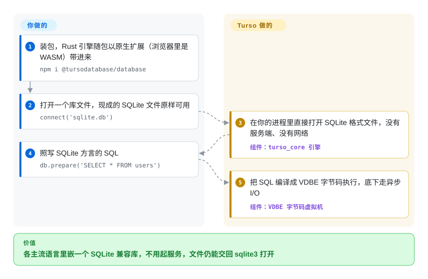

# Turso Database

应用的数据放在一个 SQLite 文件里：两个连接同时写，后一个就报 `database is locked`；每条查询都卡住当前线程；想改引擎只能去 fork 一大坨 C 代码。Turso 用 Rust 从头重写了 SQLite，打开的是同一种文件、说的是同一种 SQL，另外加上异步 I/O、可选的多写者模式和向量检索——但它还没到 1.0。

## 何时使用

你在用 TypeScript、Rust 或 Python 做本地优先应用、agent 运行时或边缘服务，早就习惯了“数据库就是进程旁边的一个文件”这套 SQLite 用法。有两件事一直在疼：几个连接一起写，就会冒出 `SQLITE_BUSY: database is locked`，因为 SQLite 同一时刻只允许一个写者；你的异步运行时又得把每条查询丢进线程池，因为 SQLite 的 I/O 是阻塞的。你还想把向量嵌入和业务行放在一起，而不是再起一个向量服务。这时你会想到 Turso：`npm i @tursodatabase/database`，指向现有的 `.db` 文件，SQL 不用改，换来原生异步 API、`BEGIN CONCURRENT` 事务（在 MVCC 日志模式下做行级冲突检测——MVCC 就是每个写者改自己的那份行版本，提交时才检查有没有撞车）、内置向量函数，以及通过 WebAssembly 在浏览器里跑同一个引擎。

跟替代品比，决定取舍的是这两点：相对 **SQLite**，你用二十多年验证过的可靠性和完整功能面，换一个内存安全、原生异步、还在快速扩展的引擎；相对 **libSQL**（Turso 公司早先基于 SQLite C 代码的分叉），你放弃更长的生产记录和大得多的装机量，换到这家公司现在真正投入开发力量的代码库。只有当这些新能力值得你去当一个 1.0 之前数据库引擎的早期用户时才选它——别把它当成“更可靠的 SQLite”直接替换。

## 怎么用起来

Turso 和 SQLite 一样是住在你进程里的库，没有服务端要跑。你通过某个语言绑定调用它（JS 走原生扩展或 WASM，Python，Go 不需要 CGO，Java/JDBC，.NET，Rust），Rust 内核解析你的 SQL，编译成一台小虚拟机 VDBE 的字节码（SQLite 本身就是这么设计的），再对着 SQLite 磁盘格式的文件页去执行。项目替你做的：存储引擎、预写日志（改动先落进一个旁路文件，之后再合并回主文件）、事务、异步 I/O（Linux 上用 io_uring），以及向量函数、CDC（可订阅的变更流），还有要开开关才能用的全文检索、加密和增量视图。留给你的：判断哪些实验开关敢放真数据、自己做备份（项目 FAQ 明确要求 1.0 之前这么做）、保证一个库文件只被一个进程打开。它还有第二个“前端”，把 Postgres 方言和线协议也编译到同一台虚拟机上，但那条路是实验性的；下面这张卡走的是 SQLite 这条主路。

<!-- flow-steps:begin (generated from flows/turso.json by tools/flow_card.py — do not edit) -->

流程文字版

1. **你**：装包，Rust 引擎随包以原生扩展（浏览器里是 WASM）带进来 — `npm i @tursodatabase/database`
2. **你**：打开一个库文件，现成的 SQLite 文件原样可用 — `connect('sqlite.db')`
3. **Turso Database**：在你的进程里直接打开 SQLite 格式文件，没有服务端、没有网络 — 组件：`turso_core 引擎`
4. **你**：照写 SQLite 方言的 SQL — `db.prepare('SELECT * FROM users')`
5. **Turso Database**：把 SQL 编译成 VDBE 字节码执行，底下走异步 I/O — 组件：`VDBE 字节码虚拟机`

**价值**：各主流语言里嵌一个 SQLite 兼容库，不用起服务，文件仍能交回 sqlite3 打开

<!-- flow-steps:end -->

## 何时不用

- **数据要紧，而且现在就要被验证过的可靠性。** 用 **SQLite** 本身。Turso 还在 v0.8.x，FAQ 自己说没到 1.0、请另做备份；2026-09-30 搜索到 35 个提到 corruption 的未关闭 issue（例如 `ALTER COLUMN` 重写了表却没更新二级索引，#7077）。SQLite 的测试纪律和二十多年的记录，正是一个年轻重写版暂时给不了的。
- **多个进程共用一个库文件**（gunicorn/uWSGI 多 worker、cron 任务加 Web 应用、命令行工具去戳应用的库）。用 WAL 模式的 **SQLite**。Turso 手册写明“No multi-process access”；`.tshm` 多进程 WAL 要开 `--experimental-multiprocess-wal`，COMPAT.md 也声明不支持 SQLite 与 Turso 混合多进程访问。
- **你依赖 SQLite 的完整功能面。** 用 **SQLite** 或 **libSQL**。按 2026-09-30 的 COMPAT.md：不支持 `WITH RECURSIVE`；窗口函数缺 `lag`/`lead`/`ntile` 和自定义帧；`load_extension` 只能加载 Turso 原生扩展，加载不了 SQLite 的 `.so`/`.dll`；视图上的触发器、自定义排序规则都没有；回滚日志模式（`delete`、`truncate` 等）直接拒绝；文本必须是合法 UTF-8（SQLite 会原样保留的非法字节，在 Turso 里会变成 U+FFFD）。
- **你选它主要是冲着多写者并发去的。** `BEGIN CONCURRENT` 依赖 MVCC 日志模式，而手册 Journal Mode 一节标注它“not production ready”（另一节又说是“supported”），COMPAT.md 还记录了一个窗口：已经报告成功的写入可能被静默回滚。生产上要多写者，用 **PostgreSQL**（或者 SQLite 加单写者队列）。
- **你要一套已经久经考验的托管复制／云端同步。** 用 **libSQL** 的嵌入式副本：截至 2026-09-28 的一个月里，`@libsql/client` 在 npm 下载约 1140 万次，`@tursodatabase/database` 约 28.4 万次。Turso 的 `@tursodatabase/sync` 面向托管的 Turso Cloud；能自己跑的 `tursodb --sync-server` 在文档里写明没有鉴权、没有多租户（只适合本地／开发）；同步引擎还有一个 2026-08 报告的未关闭死锁（#8369）。
- **你要的是真正的 Postgres。** Postgres 前端是实验性的，它自己的兼容文档警告：有些子句能解析、能运行，但语义被静默丢掉。用 **PostgreSQL**，要嵌入式／WASM 的 Postgres 就用 **PGlite**。
- **负载是分析型的**（对几百万行做扫描和聚合、读 Parquet/CSV）。用 [DuckDB](duckdb.zh.md)：Turso 和 SQLite 一样是行存 OLTP 引擎，不是列存。

## 横向对比

| 替代品 | 是否收录 | 我们的评价 | 取舍 |
|---|---|---|---|
| SQLite | 未收录 | 生产数据看重可靠性和完整的 SQL／C 扩展能力时，选 SQLite；只有明确需要 Turso 的异步 API、MVCC 实验、向量函数或一个能自己改的 Rust 代码库时，才选 Turso。 | SQLite 有二十多年的打磨、多进程 WAL 和全部扩展，但同一时刻只有一个写者、I/O 是阻塞的 C 实现；Turso 换来内存安全和异步，代价是 1.0 之前的功能缺口。是真实仓库（官方 Git 镜像 `sqlite/sqlite`），本批标签页收录未添加。 |
| libSQL（`tursodatabase/libsql`） | 未收录 | 想要 Turso Cloud 嵌入式副本，或者今天就要一个还能加载 C 扩展的 SQLite 分叉，选 libSQL；从零开始、想站在同一家厂商口中的“未来方向”上，选 Turso Database。 | libSQL 是分叉（保留 SQLite 的 C 内核，生产历史更长，npm 装机量大得多），但 README 说开发重心已经转到重写版；Turso 更新、迭代更快。是真实仓库，本批标签页收录未添加。 |
| [DuckDB](duckdb.zh.md) | 已收录 | 对大表或文件做分析查询，选 DuckDB；存事务型应用状态、大量小读小写，选 Turso。 | DuckDB 是列存、向量化执行，擅长扫描和聚合，高频单行写入较弱；Turso 是按 SQLite 路子调校的行存 OLTP 引擎，没有 OLAP 能力。 |
| PGlite（`electric-sql/pglite`） | 未收录 | 应用需要在进程内或浏览器里嵌入真正的 Postgres 语义，选 PGlite；手上已经是 SQLite 方言和文件格式，选 Turso。 | PGlite 是把真正的 Postgres 编译成 WASM（Apache-2.0），更重但语义忠实；Turso 的 Postgres 前端是翻译到类 SQLite 引擎上的实验层。是真实仓库，本批标签页收录未添加。 |

## 技术栈

- **语言：** Rust（Cargo workspace：`core`、`cli`、`sqlite/parser`、`postgres/*`、`sync/engine`、`bindings/*`、`serverless/*`，外加模拟器和模糊测试）。
- **执行模型：** 与 SQLite 一样把 SQL 编译成 VDBE 字节码在虚拟机上执行；磁盘文件格式兼容 SQLite 3（`sqlite_version()` 和差分测试对齐 SQLite 3.50.4）。
- **存储与并发：** 默认 WAL，另有 MVCC 日志模式支撑 `BEGIN CONCURRENT`；Linux 上用 `io_uring` 做异步 I/O。
- **附加能力：** 向量类型与距离函数；基于 tantivy 的全文检索（实验）；基于 DBSP 的增量视图（实验）；静态加密（实验）；CDC。
- **Postgres 前端（实验）：** 用 `pg_query`（libpg_query）解析后翻译成 Turso 的 AST，基于 `pgwire` 的线协议服务，以及 `tursopg` 交互终端。
- **绑定：** JavaScript（napi-rs 原生扩展 + WASM）、Python（`pyturso`）、Go（purego，无需 CGO）、Java/JDBC、.NET、Rust（`turso` crate）、C API；命令行 `tursodb` 内置 MCP 服务（`--mcp`）。
- **测试：** 确定性模拟测试、Antithesis、对照 SQLite 的差分测试，SQLite TCL 测试套件在逐步跑通。

## 依赖

- **运行时：** 除了你所用语言的包之外什么都不需要——引擎以预编译原生库（或 WASM）随包发布，没有服务进程。
- **平台：** 按 JS 绑定 README，支持 Linux（x86/arm64）、macOS、Windows 和浏览器；`io_uring` 异步 I/O 只在 Linux 上有。
- **可选托管服务：** `@tursodatabase/sync` 和 serverless 驱动连的是 Turso Cloud（`https://<db>.turso.io` 加 auth token）；替代做法是自己跑 `tursodb --sync-server`，文档定位是本地／开发用途。
- **从源码构建：** Rust 工具链（由 `rust-toolchain.toml` 固定版本）；JS 构建需要 Node 和 Yarn workspaces。

## 运维难度

**嵌进去很容易，负责任地用起来是中等。** 接入只是装一个包、给一个文件路径——没有守护进程、端口和账号。真正的功夫在纪律上：锁死精确版本（0.x 的小版本大约两个月一发，changelog 很长）；按 FAQ 要求另做备份；逐个审查你打开的 `--experimental-*` 开关和 MVCC 模式（好几个都标着“not production ready”）；一个库文件只让一个进程打开；每次升级都重跑你自己的测试，因为兼容性缺口还在陆续补。要是自己跑同步服务，还多了一个没有鉴权、必须隔离好的网络服务。

## 健康度与可持续性

- **维护（截至 2026-09-30）：** 非常活跃——2026-09-28 发 v0.8.0、2026-09-29 发 v0.8.1，此前有 14 个 v0.8.0 预发布；从 0.1.1（2025-06-30）到 0.8.0，小版本大约每两个月一个；2026-09-01 以来 `main` 上约 961 个提交。
- **治理与巴士系数：** 归 `tursodatabase` 组织所有（即运营 Turso Cloud 的 Turso 公司），路线图由它决定。就项目年龄而言贡献者面很宽：头号贡献者 `penberg`（4.8k 提交）之后还有五位各有 1k–3.4k 提交。前十名提交者里有一个 `claude` 账号，说明 AI 辅助开发是其工作流的一部分。
- **背书与寿命：** 仓库创建于 2023-08-26（约 3 年；最初叫 “Limbo”，旧地址 `penberg/limbo` 和 `tursodatabase/limbo` 都会跳转到这里）。Lindy 先验偏弱：年轻，但非常活跃。厂商已经换过一次战略——README 说这个重写版取代其 libSQL 分叉成为“我们的既定方向”——这是双刃剑：力量集中在这里，但它也证明了自己会把一个项目降级。
- **采用度：** 约 2.45 万 star、1.4k fork；`@tursodatabase/database` 每月约 28.4 万次 npm 下载，`pyturso` 每月约 4.1 万次 PyPI 下载，`turso` crate 在 crates.io 累计约 100 万次下载（截至 2026-09-28／30）。健康度评分器取的注册表信号是 `turso_macros` crate，按它的读数每月 1,035,516 次下载——但 2026-09-30 crates.io 显示这个内部 crate 的*累计*下载也只有约 1.04M，所以该数字只能当上限看。README 点名的生产用户：Turso Cloud、Kin、Spice.ai。
- **风险信号：** 1.0 之前，仍有未关闭的数据损坏和 panic 类 issue；大量功能挂在实验开关后面；同步方案依赖厂商的托管服务。MIT 许可，贡献按同一许可进入，CONTRIBUTING.md 里没有找到 CLA——看不到重新授权的机制。

## 存疑（未验证）

- [未验证] “已在多家机构生产环境运行”（Turso Cloud、Kin、Spice.ai）是项目 README 的自述；这些部署的规模和关键程度无法从公开来源核实。
- [未验证] 35 个匹配 “corruption” 的未关闭 issue 是 2026-09-30 用 GitHub 搜索数出来的；其中一部分只是测试或差分测试里的不一致，并非用户现场报告——没有逐条分级。
- [推断] 文档对 MVCC／`BEGIN CONCURRENT` 能否上生产说法矛盾（README 列为功能，手册 MVCC 小节称“supported”，Journal Mode 一节写“not production ready”）；本页按更保守的读法，视为尚不能上生产。
- [推断] 手册的 Limitations 列表（“no savepoints, no triggers, no views, no vacuum”）与 COMPAT.md 矛盾：后者把 savepoint 和触发器标为已支持，视图和 vacuum 标为部分支持／需开关；本页以更细、看起来更新的 COMPAT.md 为准。
- [未验证] `@tursodatabase/sync` 能否指向自建的 libSQL `sqld` 而不是 Turso Cloud，没有实测；文档里只出现了 Turso Cloud 地址和内置的开发用同步服务。
- [未验证] 健康度评分器给 `turso_macros` 的 `downloads_last_month`（1035516）几乎等于该 crate 在 crates.io 的累计下载（2026-09-30 为 1041882，近 90 天 585377），所以评分器的月度采用度读数很可能偏高；采用度档位没有手工改动。
- [未验证] “2026-09-01 以来约 961 个提交”取自 GitHub commits API 的分页计数，可能包含合并提交或机器人提交。
- [推断] SQLite “二十多年”的记录属于常识（SQLite 始于 2000 年），本页没有重新核实。
