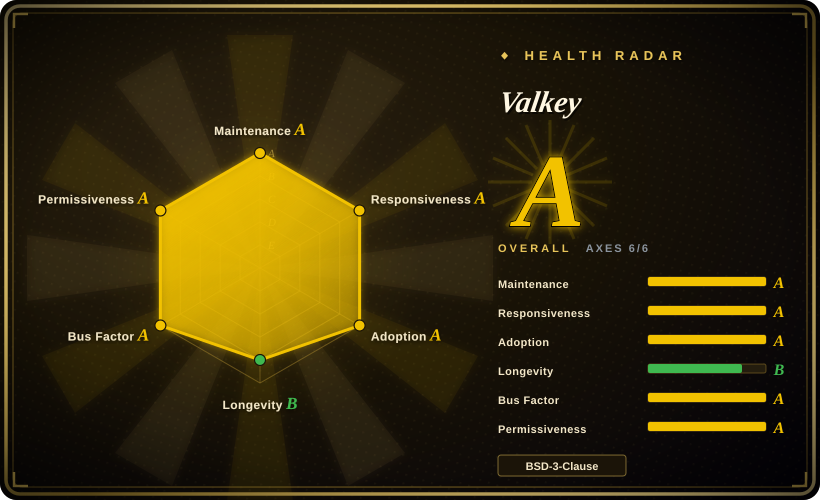
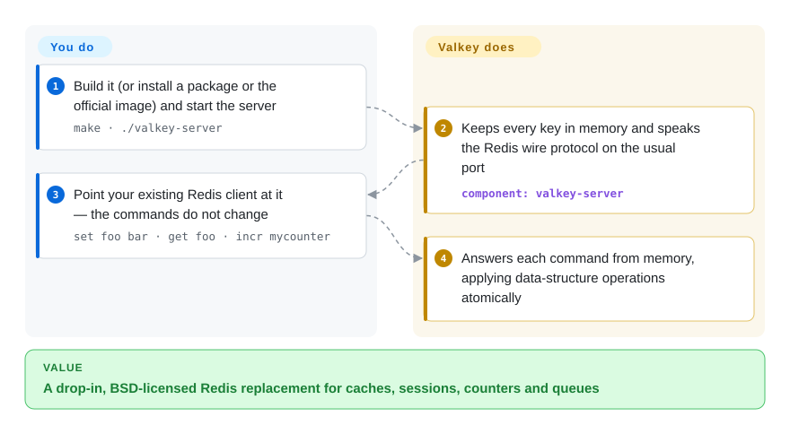

# Valkey

Your app leans on Redis for caching, sessions and rate limits, but since Redis 7.4 new releases are no longer under the BSD license your legal team signed off on, and you cannot rewrite every `GET`/`SET` call. Valkey is the community fork of the last BSD-licensed Redis: same commands, same wire protocol, same `redis-cli` habits, governed by a multi-vendor committee under the Linux Foundation.

## When to use

You run the backend for a web product, and an in-memory store sits in the hot path: page and query caches, session tokens, rate-limit counters, a leaderboard, a lightweight job queue. It has been Redis for years. Then Redis moved to source-available licensing (RSALv2/SSPLv1 from 7.4; Redis 8 added AGPLv3 as a third option), and now the license review, your cloud provider's offering and your distro packages are all pulling in different directions.

You reach for Valkey because it is the drop-in path: a fork of Redis 7.2.4 that keeps the BSD-3-Clause license, the RESP protocol and the command set, so existing clients and `redis-cli` scripts keep working, and `make install` even creates `redis-server`/`redis-cli` symlinks. Pick it over Redis when a permissive license and vendor-neutral governance matter more than Redis 8's newest built-in features; over Dragonfly when you want BSD rather than BSL licensing and the upstream codebase you already know; over disk-backed stores such as PikiwiDB when the dataset fits in RAM and latency is the point.

## How it works

Valkey is a single server process that keeps your whole dataset in memory as data structures — strings, hashes, lists, sets, sorted sets, streams — and answers commands over the Redis wire protocol, so any Redis client library talks to it unchanged. Commands are executed one at a time against memory, which is what makes each one atomic and fast; extra threads handle network I/O. What it does for you: the in-memory structures and expiry, optional persistence to disk (point-in-time snapshots and an append-only log of writes), primary–replica replication, Sentinel for automatic failover, and Cluster mode for sharding keys across nodes. Extra capabilities such as JSON, Bloom filters and search come as separate modules from the same project. What stays yours: sizing memory for the whole dataset, choosing persistence and eviction policies, and running replication or cluster topology yourself if you self-host.

<!-- flow-steps:begin (generated from flows/valkey.json by tools/flow_card.py — do not edit) -->

Text version of the flow

1. **You**: Build it (or install a package or the official image) and start the server — `make · ./valkey-server`
2. **Valkey**: Keeps every key in memory and speaks the Redis wire protocol on the usual port — component: `valkey-server`
3. **You**: Point your existing Redis client at it — the commands do not change — `set foo bar · get foo · incr mycounter`
4. **Valkey**: Answers each command from memory, applying data-structure operations atomically

**Value**: A drop-in, BSD-licensed Redis replacement for caches, sessions, counters and queues

<!-- flow-steps:end -->

## When NOT to use

- **The dataset is much larger than the RAM you can afford.** Everything lives in memory. Use [PikiwiDB](pikiwidb.md) or Apache Kvrocks, which speak the Redis protocol but keep data on disk in RocksDB, trading some latency for capacity.
- **You need Redis 8's newest built-ins (vector sets, the built-in query engine) and can accept its licenses.** Valkey diverged at 7.2.4 and implements newer features on its own schedule, some only as separate modules. Use Redis 8+ under AGPLv3 (or its other licenses) if those exact features matter more than BSD licensing.
- **It would be your primary system of record with relational queries.** Persistence exists, but the model is key-value in RAM with no joins or secondary indexes in core. Use PostgreSQL (for example via [Supabase](supabase.md)) as the source of truth and keep Valkey as the cache in front.
- **You need native Windows servers.** The README lists Linux, macOS and the BSDs; Solaris derivatives are best effort, and Windows is not mentioned. Use WSL or containers, or Microsoft's Garnet (a .NET Redis-protocol server).
- **You want a managed cache and have no one to operate replication and failover.** Self-hosting means running Sentinel or Cluster and handling memory, persistence and upgrades. Use a cloud provider's managed Valkey or Redis service (not a repo) instead.

## Comparison

| Alternative | In index | Our verdict | Tradeoff |
|---|---|---|---|
| Redis | 未收录 | Pick Redis 8+ when you need its newest built-in features or a Redis Ltd. support contract and can accept RSALv2/SSPLv1/AGPLv3; pick Valkey when BSD licensing and multi-vendor governance decide it. | Redis moves first on new features under a single company's roadmap and copyleft/source-available licenses; Valkey keeps the permissive license and a TSC capped at one-third per company, but lags on features added after the fork. |
| [PikiwiDB](pikiwidb.md) | ✅ | Pick PikiwiDB when the dataset is hundreds of GB and RAM cost is the problem; pick Valkey when the data fits in memory and low, predictable latency matters. | PikiwiDB stores everything on disk via RocksDB, so capacity is cheap but p99 latency depends on SSD and compaction; Valkey is memory-bound but faster and more fully Redis-compatible. |
| Dragonfly | 未收录 | Pick Dragonfly when one large multi-core machine must replace a Redis cluster and its BSL 1.1 license is acceptable; pick Valkey for a permissive license and the original codebase's semantics. | Dragonfly's multi-threaded design scales vertically without sharding but is a from-scratch reimplementation under a source-available license; Valkey stays BSD and scales with replicas and Cluster. |
| Apache Kvrocks | 未收录 | Pick Kvrocks when you want a disk-backed, Redis-protocol store under Apache Software Foundation governance; pick Valkey when everything should stay in memory. | Kvrocks trades memory for RocksDB on disk (bigger data, higher latency); Valkey keeps the in-memory latency profile and the larger client ecosystem. |
| Memcached | 未收录 | Pick Memcached for a pure, multi-threaded string cache with nothing else to manage; pick Valkey when you also need data structures, persistence or replication. | Memcached is simpler and has no persistence or replication to tune; Valkey covers caches plus counters, queues, sorted sets and failover in one service. |

## Tech stack

- **Language:** C, built with `make` (CMake also present); bundled dependencies in `deps/` include jemalloc, Lua and linenoise.
- **Protocol:** Redis serialization protocol (RESP); compatible with Redis clients and tooling.
- **Engine features:** in-memory data structures, Lua scripting (can be compiled out), RDB snapshots and AOF persistence, replication, Sentinel, Cluster, modules API; optional TLS (OpenSSL) and experimental RDMA builds.
- **Ecosystem modules:** `valkey-json`, `valkey-bloom` and `valkey-search` live in separate repos under `valkey-io`.

## Dependencies

- **Runtime:** none beyond the binary on Linux, macOS or *BSD; OpenSSL if built with TLS; systemd libraries only for systemd integration.
- **Hardware:** enough RAM for the full dataset plus headroom for snapshots and replication buffers.
- **High availability:** additional Valkey processes as replicas, plus Sentinel or Cluster mode for failover/sharding.
- **Distribution:** official `valkey/valkey` container image and distro packages, or build from source.

## Ops difficulty

**Low for a single cache node, medium for HA.** One process and one config file; if you already run Redis, the operational knowledge carries over (same config style, same CLI commands, compatibility symlinks). The work grows with availability requirements: Sentinel or Cluster topology, memory limits and eviction policy, persistence trade-offs (snapshots vs append-only log), and upgrades across four maintained release lines (8.0, 8.1, 9.0, 9.1 as of 2026-10). Migration from Redis 7.2-era data is the easy path; moving off Redis 7.4+/8 features needs testing first.

## Health & viability

- **Maintenance (as of 2026-10-08):** very active. 9.1.2 shipped 2026-09-01 with coordinated patch releases on the 9.0, 8.1 and 8.0 lines; 9.2.0-rc1 followed on 2026-09-16.
- **Responsiveness:** median first response on issues about 9.4 hours across 36 qualifying issues in the scorer's window — fast for a database server.
- **Governance / bus factor:** Linux Foundation project run by a Technical Steering Committee where no single organisation may hold more than one-third of seats; current maintainers come from Amazon, Google, Oracle, Alibaba, Tencent, Apple, Ericsson and Percona. 107 active maintainers in the last 12 months, with the top-3 share around 33.6% — among the best bus-factor profiles in this category.
- **Backing & longevity:** the Valkey repo itself was created in 2024-03 (930 days old), so its own Lindy record is short, which is why longevity grades B. The codebase, however, carries Redis's 15-year history, and the multi-vendor backing makes abandonment unlikely.
- **Adoption:** ~27.4k stars; the `valkey/valkey` image has ~325M Docker Hub pulls, and the maintainers' employers include major cloud providers.
- **Risk flags:** BSD-3-Clause, created specifically to avoid a relicense. The main risk is feature drift from Redis 8+, which can make "drop-in" less true for applications that adopt Redis-only commands.

## Caveats (unverified)

- [未验证] Which Redis 7.4/8.x commands Valkey does or does not implement was not checked command by command; compatibility is reliable for the Redis 7.2 command set it forked from.
- [推断] That major cloud providers offer managed Valkey is inferred from maintainer affiliations and general knowledge, not checked against each provider's catalogue for this page.
- [推断] Characterisations of Dragonfly (BSL 1.1, multi-threaded), Apache Kvrocks, Garnet and Memcached come from general knowledge, not re-read for this page.
- [推断] "Each command is atomic because commands execute one at a time" follows Redis's documented execution model, which Valkey inherited; this page only confirmed that `valkey.conf` has an `io-threads` setting and did not re-read Valkey's own threading internals.
- [未验证] Redis's "RSALv2/SSPLv1 from 7.4" timing is general knowledge; the Redis LICENSE file read on 2026-10-08 confirms only the Redis 8 tri-license (RSALv2/SSPLv1/AGPLv3) and that 7.2 and earlier stay BSD.
