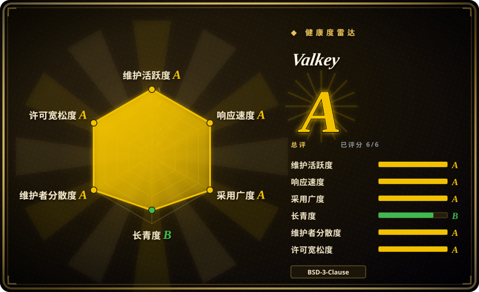
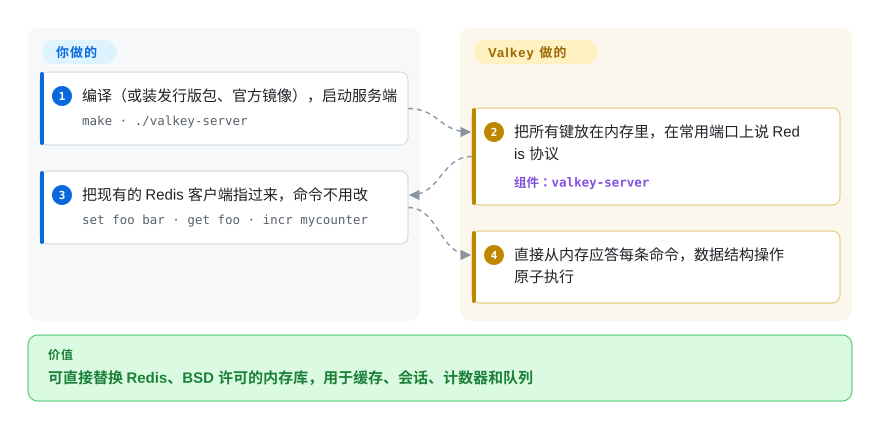

# Valkey

你的应用靠 Redis 做缓存、会话和限流，可从 Redis 7.4 起，新版本不再沿用法务当初批准的 BSD 许可证，而你不可能把每一处 `GET`/`SET` 调用都重写。Valkey 是最后一个 BSD 版 Redis 的社区分叉：命令一样、线协议一样、`redis-cli` 的用法也一样，由 Linux 基金会下的多厂商委员会治理。

## 何时使用

你负责一个 Web 产品的后端，热路径上有一个内存库：页面和查询缓存、会话令牌、限流计数器、排行榜、轻量任务队列。多年来它一直是 Redis。后来 Redis 改成了源码可见许可证（从 7.4 起是 RSALv2/SSPLv1，Redis 8 又加了 AGPLv3 作为第三个选项），于是许可证审查、云厂商提供的服务和发行版软件包开始各走各的路。

这时想到 Valkey，是因为它是“直接替换”的那条路：它从 Redis 7.2.4 分叉，保留 BSD-3-Clause 许可证、RESP 协议和命令集，现有客户端和 `redis-cli` 脚本照常工作，`make install` 甚至会建好 `redis-server`/`redis-cli` 软链接。宽松许可证和厂商中立的治理比 Redis 8 最新的内置功能更重要时，选它而不是 Redis；想要 BSD 而不是 BSL 许可证、并沿用你熟悉的上游代码时，选它而不是 Dragonfly；数据装得进内存、延迟才是重点时，选它而不是 PikiwiDB 这类落盘存储。

## 怎么用起来

Valkey 是一个单独的服务进程，把整个数据集以数据结构的形式放在内存里——字符串、哈希、列表、集合、有序集合、流——并通过 Redis 线协议应答命令，所以任何 Redis 客户端库都能原样连上。命令逐条在内存里执行，这正是每条命令既原子又快的原因；网络读写可以交给额外的 I/O 线程。它替你做的：内存数据结构和过期、可选的落盘持久化（时间点快照，以及记录每次写入的追加日志）、主从复制、负责自动故障切换的 Sentinel，以及把键分片到多个节点的 Cluster 模式。JSON、布隆过滤器、搜索等额外能力由同一项目的独立模块提供。留给你的：按整个数据集估算内存，选择持久化和淘汰策略，自托管时自己运行复制或集群拓扑。

<!-- flow-steps:begin (generated from flows/valkey.json by tools/flow_card.py — do not edit) -->

流程文字版

1. **你**：编译（或装发行版包、官方镜像），启动服务端 — `make · ./valkey-server`
2. **Valkey**：把所有键放在内存里，在常用端口上说 Redis 协议 — 组件：`valkey-server`
3. **你**：把现有的 Redis 客户端指过来，命令不用改 — `set foo bar · get foo · incr mycounter`
4. **Valkey**：直接从内存应答每条命令，数据结构操作原子执行

**价值**：可直接替换 Redis、BSD 许可的内存库，用于缓存、会话、计数器和队列

<!-- flow-steps:end -->

## 何时不用

- **数据集远大于你负担得起的内存。** 所有数据都在内存里。改用 [PikiwiDB](pikiwidb.zh.md) 或 Apache Kvrocks，它们说 Redis 协议，但把数据放在 RocksDB 磁盘上，用一些延迟换容量。
- **需要 Redis 8 最新的内置功能（vector sets、内置查询引擎），并且能接受它的许可证。** Valkey 在 7.2.4 分叉，较新的功能按自己的节奏实现，有些只以独立模块提供。如果这些功能比 BSD 许可证更重要，用 AGPLv3（或其他许可证）下的 Redis 8+。
- **它会成为你带关系查询的主数据库。** 持久化是有的，但模型是内存里的键值，核心里没有 join，也没有二级索引。用 PostgreSQL（比如通过 [Supabase](supabase.zh.md)）做事实来源，Valkey 只做前面的缓存。
- **需要原生 Windows 服务器。** README 列出的是 Linux、macOS 和各 BSD；Solaris 衍生系统只是尽力支持，Windows 没有提及。用 WSL 或容器，或者微软的 Garnet（一个 .NET 实现的 Redis 协议服务器）。
- **想要托管缓存，又没人运维复制和故障切换。** 自托管意味着要跑 Sentinel 或 Cluster，还要管内存、持久化和升级。改用云厂商托管的 Valkey 或 Redis 服务（非仓库）。

## 横向对比

| 替代品 | 是否收录 | 我们的评价 | 取舍 |
|---|---|---|---|
| Redis | 未收录 | 需要 Redis 8+ 最新的内置功能或 Redis Ltd. 的支持合同、并能接受 RSALv2/SSPLv1/AGPLv3 时选 Redis；BSD 许可证和多厂商治理是决定因素时选 Valkey。 | Redis 在单一公司的路线图和 copyleft/源码可见许可证下率先推出新功能；Valkey 保留宽松许可证，TSC 中任一公司席位不超过三分之一，但分叉后新增的功能会落后。 |
| [PikiwiDB](pikiwidb.zh.md) | ✅ | 数据集有几百 GB、内存成本是问题时选 PikiwiDB；数据装得进内存、看重低且稳定的延迟时选 Valkey。 | PikiwiDB 通过 RocksDB 把所有数据放在磁盘上，容量便宜，但 p99 延迟取决于 SSD 和 compaction；Valkey 受内存限制，但更快、Redis 兼容更完整。 |
| Dragonfly | 未收录 | 要用一台多核大机器替掉一个 Redis 集群、并且能接受 BSL 1.1 许可证时选 Dragonfly；想要宽松许可证和原代码库的语义时选 Valkey。 | Dragonfly 的多线程设计不分片也能纵向扩展，但它是源码可见许可证下的从零重写；Valkey 保持 BSD，靠副本和 Cluster 扩展。 |
| Apache Kvrocks | 未收录 | 想要落盘、兼容 Redis 协议、由 Apache 软件基金会治理的存储时选 Kvrocks；所有数据都该留在内存里时选 Valkey。 | Kvrocks 用 RocksDB 磁盘换内存（数据更大、延迟更高）；Valkey 保持内存级延迟和更大的客户端生态。 |
| Memcached | 未收录 | 只要一个纯粹的多线程字符串缓存、别的什么都不想管时选 Memcached；还需要数据结构、持久化或复制时选 Valkey。 | Memcached 更简单，没有持久化和复制要调；Valkey 一个服务就覆盖缓存加计数器、队列、有序集合和故障切换。 |

## 技术栈

- **语言：** C，用 `make` 构建（也有 CMake）；`deps/` 里捆绑的依赖包括 jemalloc、Lua 和 linenoise。
- **协议：** Redis 序列化协议（RESP）；兼容 Redis 客户端和工具。
- **引擎功能：** 内存数据结构、Lua 脚本（可编译时去掉）、RDB 快照和 AOF 持久化、复制、Sentinel、Cluster、模块 API；可选 TLS（OpenSSL）和实验性的 RDMA 构建。
- **生态模块：** `valkey-json`、`valkey-bloom`、`valkey-search` 在 `valkey-io` 下的独立仓库里。

## 依赖

- **运行时：** 在 Linux、macOS 或各 BSD 上只需要二进制；带 TLS 构建时需要 OpenSSL；只有集成 systemd 时才需要 systemd 库。
- **硬件：** 足够装下整个数据集的内存，外加快照和复制缓冲区的余量。
- **高可用：** 额外的 Valkey 进程作为副本，加上 Sentinel 或 Cluster 模式负责故障切换和分片。
- **分发：** 官方 `valkey/valkey` 容器镜像和发行版软件包，或者从源码构建。

## 运维难度

**单个缓存节点低，高可用中等。** 一个进程、一个配置文件；如果你已经在跑 Redis，运维经验可以直接沿用（配置风格相同、CLI 命令相同、有兼容软链接）。工作量随可用性要求增加：Sentinel 或 Cluster 拓扑、内存上限和淘汰策略、持久化取舍（快照还是追加日志），以及在四条维护中的发布线（截至 2026-10 是 8.0、8.1、9.0、9.1）之间升级。从 Redis 7.2 时代的数据迁过来是容易的路；如果已经用了 Redis 7.4+/8 的功能，迁走前要先测试。

## 健康度与可持续性

- **维护（截至 2026-10-08）：** 非常活跃。9.1.2 于 2026-09-01 发布，同时在 9.0、8.1、8.0 线上协同发布补丁；9.2.0-rc1 随后于 2026-09-16 发布。
- **响应速度：** 打分器窗口内 36 个符合条件的 issue，首次响应中位数约 9.4 小时——对数据库服务端来说很快。
- **治理/巴士因子：** Linux 基金会项目，由技术指导委员会（TSC）管理，任何单一组织的席位不得超过三分之一；现任维护者来自 Amazon、Google、Oracle、阿里巴巴、腾讯、Apple、Ericsson 和 Percona。过去 12 个月有 107 名活跃维护者，前三名占比约 33.6%——是这个类目里巴士因子最好的之一。
- **背书与长期性：** Valkey 仓库本身建于 2024-03（已创建 930 天），自身的 Lindy 记录很短，所以长青度是 B。但代码继承了 Redis 15 年的历史，多厂商背书也让被弃置的可能性很低。
- **采用度：** 约 2.74 万 star；`valkey/valkey` 镜像在 Docker Hub 上约 3.25 亿次拉取，维护者所在公司包括几家主要云厂商。
- **风险信号：** BSD-3-Clause，本就是为了躲开改许可证而创建的。主要风险是与 Redis 8+ 的功能分化：应用一旦用上 Redis 独有的命令，“直接替换”就没那么成立了。

## 存疑（未验证）

- [未验证] 没有逐条核对 Valkey 实现了哪些 Redis 7.4/8.x 命令；对它分叉时的 Redis 7.2 命令集，兼容性是可靠的。
- [推断] “主要云厂商提供托管 Valkey”是根据维护者所属公司和一般了解推断的，本页没有逐家核对云厂商的产品目录。
- [推断] 对 Dragonfly（BSL 1.1、多线程）、Apache Kvrocks、Garnet、Memcached 的描述来自一般了解，本页没有重新阅读它们的资料。
- [推断] “命令逐条执行所以每条都是原子的”沿用 Redis 文档中的执行模型，Valkey 继承了这一模型；本页只确认了 `valkey.conf` 里有 `io-threads` 配置项，没有重读 Valkey 自己的线程实现。
- [未验证] Redis “从 7.4 起改为 RSALv2/SSPLv1”的时间点来自一般了解；2026-10-08 读到的 Redis LICENSE 文件只确认了 Redis 8 的三选一许可证（RSALv2/SSPLv1/AGPLv3），以及 7.2 及更早版本仍是 BSD。
