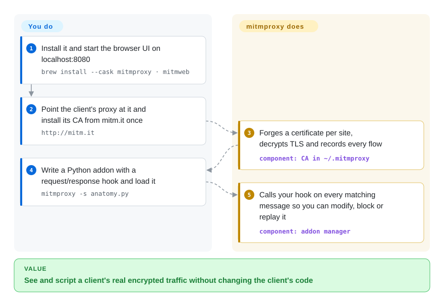

# mitmproxy

You can't see what an app really sends over HTTPS — the server answers `400` and neither side's logs say why. mitmproxy sits in the middle as a proxy the client has been told to trust, so every request and response becomes readable, editable, and scriptable in plain Python.

## When to use

You're a mobile or backend developer (or a security tester) and a client you don't fully control — an iOS build, a vendor SDK, a CLI that calls a cloud API — fails against the real server. The app shows "Something went wrong", the server log shows `POST /v2/session 400` with no body, and you need to see the exact headers and JSON that left the device. You install mitmproxy, point the device's proxy at your laptop, install its CA once from `mitm.it`, and every flow shows up decrypted in `mitmweb` (a browser UI) or the `mitmproxy` console UI, where you can pause a request, edit it, and resend it.

You pick it over whistle or Charles when the next step is **code, not clicks**: a ten-line Python addon (`mitmproxy -s addon.py`) can rewrite a header on every request, stub one endpoint, or dump selected flows to a file, and `mitmdump` runs the same addon headless in CI or a test harness. It also covers capture setups a desktop GUI proxy can't — local capture of one process by name, WireGuard mode for a phone, reverse-proxy mode in front of a server you own — and it is an MIT-licensed, 16-year-old project rather than a paid app.

## How it works

mitmproxy is an ordinary HTTP proxy (listening on `localhost:8080` by default) that can also break open TLS. On first start it creates its own certificate authority in `~/.mitmproxy`; once you install that CA certificate on the client, mitmproxy forges a certificate for each site on the fly, so the client thinks it is talking to the real server while mitmproxy reads the plaintext and opens its own TLS connection upstream. **It does the interception, decryption, protocol handling (HTTP/1, HTTP/2, WebSocket, partly HTTP/3 and DNS) and flow recording for you** — you choose a front end (`mitmproxy` console, `mitmweb` browser UI, or headless `mitmdump`), route the client's traffic to it, trust the CA, and, if you want automation, write an *addon*: a Python class whose methods such as `request(flow)` and `response(flow)` are called for every matching message. Think of it as a customs desk: every parcel is opened, logged and optionally repacked before it continues — and you write the inspector's rules in Python.

<!-- flow-steps:begin (generated from flows/mitmproxy.json by tools/flow_card.py — do not edit) -->

Text version of the flow

1. **You**: Install it and start the browser UI on localhost:8080 — `brew install --cask mitmproxy · mitmweb`
2. **You**: Point the client's proxy at it and install its CA from mitm.it once — `http://mitm.it`
3. **mitmproxy**: Forges a certificate per site, decrypts TLS and records every flow — component: `CA in ~/.mitmproxy`
4. **You**: Write a Python addon with a request/response hook and load it — `mitmproxy -s anatomy.py`
5. **mitmproxy**: Calls your hook on every matching message so you can modify, block or replay it — component: `addon manager`

**Value**: See and script a client's real encrypted traffic without changing the client's code

<!-- flow-steps:end -->

## When NOT to use

- **The target app pins its certificate.** Apps with certificate pinning reject mitmproxy's forged certificate no matter which CA you install; mitmproxy's own docs send you to runtime unpinning tools (Frida-based objection, android-unpinner — not indexed) to patch the app first. If you can't modify the app, mitmproxy will only show you failed TLS handshakes — use `ignore_hosts` to pass those hosts through and debug elsewhere.
- **You want rule-based mocking from a web UI without writing Python.** For "map this URL to a local file / return this JSON" edited in a browser and shared as a rules file, [whistle](whistle.md) is the lower-friction tool; mitmproxy's power is in addons, and its UI-only rewriting is thinner.
- **You need an active web-application security scanner.** mitmproxy intercepts and replays; it does not crawl, fuzz, or run vulnerability checks. Use OWASP ZAP (not indexed, Apache-2.0) or Burp Suite (not a repo) for scanning, and keep mitmproxy for scripted interception.
- **You need a production gateway or a load-bearing reverse proxy.** Reverse mode exists for debugging, not for fronting live traffic with auth, rate limiting and HA — use [Kong](../api-gateway/kong.md) or nginx/Envoy instead.
- **Your test depends on replaying WebSocket, HTTP/3 or DNS flows.** The docs list replay as not yet possible for WebSocket and DNS and as broken for HTTP/3 client replay; record those at the client instead, or use Wireshark (not indexed) with a TLS key log for passive analysis.
- **Policy forbids installing a trusted root CA on the device.** Decrypting HTTPS from a client always means trusting mitmproxy's CA there (a leaked `mitmproxy-ca.pem` lets anyone impersonate any site to that device). If you control the server, run mitmproxy in reverse mode with your own certificate instead; if you control neither end, mitmproxy can't help.

## Comparison

| Alternative | In index | Our verdict | Tradeoff |
|---|---|---|---|
| [whistle](whistle.md) | ✅ | For a front-end or mobile developer who wants to mock and redirect traffic from a web UI with rule lines, pick whistle; pick mitmproxy when the rewrite logic needs real code or must run headless. | whistle's line-based rules are faster to write and share, but its extension story is Node plugins rather than a per-flow Python hook, and it is effectively one maintainer. |
| [AnyProxy](anyproxy.md) | ✅ | Only consider AnyProxy if you already have its JS rule files; for new scripted interception pick mitmproxy, because AnyProxy's master branch has been frozen since 2020. | AnyProxy lets you script in JavaScript, but you inherit an unmaintained MITM stack; mitmproxy costs Python but is actively released. |
| OWASP ZAP | not indexed | For security testing that needs crawling, active scanning and reports, pick ZAP; for precise, scripted interception of one client's traffic, pick mitmproxy. | ZAP brings a scanner and attack tooling on a heavier Java desktop app; mitmproxy is lighter and more scriptable but finds no vulnerabilities by itself. |
| Burp Suite | not a repo | When a pentest team standardizes on a commercial suite with Intruder/Scanner and vendor support, use Burp; when you need an open-source, CI-friendly proxy you can script freely, pick mitmproxy. | Burp's paid tiers add automation and support at a license cost; the free Community edition is GUI-centric and closed-source. |
| Charles | not a repo | If you want a polished native GUI with throttling and breakpoints and don't plan to script, Charles is fine; pick mitmproxy once you need automation or a free tool. | Charles is a paid closed app with a gentle learning curve; mitmproxy is free and scriptable but its console UI has a steeper start. |

## Tech stack

- **Language:** Python (requires Python ≥ 3.12 per `pyproject.toml`), async I/O throughout; a TypeScript/React-style web front end for `mitmweb` served by Tornado (GitHub languages: Python ~2.8 MB, TypeScript ~0.5 MB, 2026-10).
- **Protocol stack:** its own HTTP/1 implementation on `h11`, HTTP/2 on `h2`/hyper-h2, HTTP/3 and QUIC on `aioquic`, WebSocket on `wsproto`, a custom DNS implementation; TLS via `cryptography` + `pyOpenSSL`.
- **Native component:** `mitmproxy_rs` (a separate Rust repo, pinned `>=0.12.6,<0.13`) powers OS-level capture — local capture mode and WireGuard mode.
- **UIs:** `mitmproxy` (console UI on `urwid`), `mitmweb` (browser UI), `mitmdump` (non-interactive, "tcpdump for HTTP").
- **Extension API:** Python addons with event hooks (`request`, `response`, `websocket_message`, `dns_request`, …), custom options and commands; ~30 example addons ship in `examples/addons/`.

## Dependencies

- **No services to run** — no database, no broker. State is the flows in memory (optionally saved to a flow file) and the CA files in `~/.mitmproxy` (`mitmproxy-ca.pem` holds the private key).
- **Install path decides the runtime:** the macOS Homebrew cask, Linux standalone binaries, Windows installer and the official Docker image bundle their own Python and OpenSSL; installing from PyPI (`uv tool install mitmproxy`) needs Python ≥ 3.12 and is the path to take when your addons import extra packages.
- **Client-side setup** is the real dependency: each client must route through the proxy (system proxy, env vars, or a capture mode) and trust the CA for HTTPS.

## Ops difficulty

**Low for one developer, medium for devices and transparent setups.** On a laptop it is one install and one command; the CA is installed once per client by browsing to `mitm.it`. It gets harder when the traffic doesn't honor a proxy setting: transparent mode needs OS routing/firewall rules, WireGuard mode needs a WireGuard client on the device, and recent Android versions require the CA in the system store for most apps (the docs carry a dedicated HOWTO for the emulator). The binary packages freeze their dependencies at release and the project says it does not re-release just for dependency bumps, so keep up with releases (or install from PyPI) if you run it long-term. mitmproxy does not phone home or check for updates on its own.

## Health & viability

- **Maintenance (2026-10).** Commits land weekly (last default-branch commit 2026-10-05); latest release v12.2.3 on 2026-05-12, after v12.2.2 (2026-04) and v12.2.0 (2025-10) — a release every one to three months. Radar: maintenance A, responsiveness A (median first response ~18.5 h).
- **Governance / bus factor.** Owned by the `mitmproxy` GitHub organization, with ~33 contributors active in the last 12 months — but one maintainer (Maximilian Hils, listed as maintainer in `pyproject.toml`) accounts for ~45% of recent commits, which is why governance grades B rather than A.
- **Age & Lindy.** Created 2010-02 (~16.6 years) and still releasing — a strong Lindy signal for a tool whose job (intercepting HTTP) is not going away.
- **Adoption.** ~45.3k stars, ~4.8k forks; PyPI `mitmproxy` 3,516,981 downloads last month and 639 dependent repositories (health raw, 2026-10).
- **Risk flags.** MIT license, no relicense history found. The real risks are operational: a leaked CA private key, frozen dependencies in old binary packages, and protocol gaps (HTTP/3, DoH) listed as known limitations.

## Caveats (unverified)

- [未验证] Star, fork, download and dependent counts are GitHub/PyPI snapshots from 2026-10-08 and drift.
- [推断] "Recent Android versions require the CA in the system store for most apps" — inferred from the docs' Android-emulator system-CA HOWTO and general Android behavior, not tested here.
- [推断] The ~45% top-contributor share comes from the health scorer's 12-month commit window; it does not measure review or release authority.
- [未验证] OWASP ZAP, Burp Suite and Charles capabilities in the Comparison are summarized from their public positioning, not re-tested against current versions.
- [未验证] HTTP/3 and WebSocket/DNS replay limitations are as listed on the mitmproxy "Protocols" docs page on 2026-10-08; they may be lifted in later releases.
