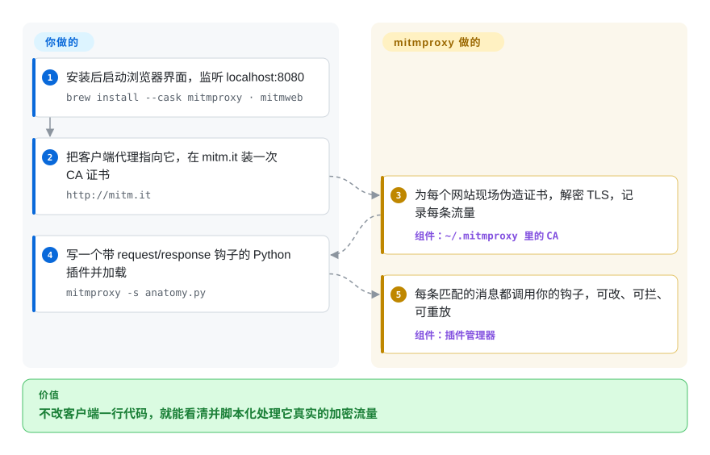

# mitmproxy

App 走 HTTPS 发了什么你根本看不见：服务器回一个 `400`，两边日志都说不清为什么。mitmproxy 以代理身份插在中间，客户端被设置成信任它，于是每个请求和响应都能看、能改，还能用普通 Python 写脚本处理。

## 何时使用

你是移动端或后端开发（也可能是安全测试人员），手上有一个你没法完全掌控的客户端——一个 iOS 包、一个厂商 SDK、一个调云 API 的命令行工具——它对着真实服务器出错了。App 只提示“出了点问题”，服务器日志只有一行 `POST /v2/session 400`、没有请求体，你需要看到设备上到底发出了哪些请求头和 JSON。你装上 mitmproxy，把设备代理指向自己的电脑，在 `mitm.it` 上装一次它的 CA 证书，之后每个流量都会解密后出现在 `mitmweb`（浏览器界面）或 `mitmproxy` 终端界面里，你可以拦住某个请求、改掉、再重发。

当下一步是**写代码而不是点按钮**时，你会选它而不是 whistle 或 Charles：十行 Python 插件（`mitmproxy -s addon.py`）就能给每个请求改一个头、给某个接口打桩，或把挑出来的流量存成文件；`mitmdump` 能在 CI 或测试脚手架里无界面地跑同一个插件。它还覆盖桌面 GUI 代理做不到的抓包方式——按进程名只抓一个本机程序、用 WireGuard 模式抓手机、在你自己的服务器前面以反向代理模式抓——而且它是 MIT 许可、已有 16 年的开源项目，不是付费软件。

## 怎么用起来

mitmproxy 本质上是一个普通的 HTTP 代理（默认监听 `localhost:8080`），只是它还能拆开 TLS 加密。第一次启动时，它会在 `~/.mitmproxy` 里生成一套自己的证书颁发机构（CA，即给网站签发证书的“发证方”）；你在客户端装上这张 CA 证书后，mitmproxy 就能为每个网站现场伪造一张证书，让客户端以为自己在和真服务器说话，而它读到明文后再自己向上游建立 TLS 连接。**拦截、解密、协议处理（HTTP/1、HTTP/2、WebSocket，部分支持 HTTP/3 和 DNS）以及流量记录都由它替你做**；你要做的是选一个前端（`mitmproxy` 终端界面、`mitmweb` 浏览器界面或无界面的 `mitmdump`），把客户端流量导过来，信任它的 CA，如果想自动化，再写一个插件（addon）：一个 Python 类，里面的 `request(flow)`、`response(flow)` 等方法会在每条匹配的消息上被调用。可以把它想成海关查验台：每个包裹都被拆开、登记、必要时重新打包再放行——而查验规则由你用 Python 写。

<!-- flow-steps:begin (generated from flows/mitmproxy.json by tools/flow_card.py — do not edit) -->

流程文字版

1. **你**：安装后启动浏览器界面，监听 localhost:8080 — `brew install --cask mitmproxy · mitmweb`
2. **你**：把客户端代理指向它，在 mitm.it 装一次 CA 证书 — `http://mitm.it`
3. **mitmproxy**：为每个网站现场伪造证书，解密 TLS，记录每条流量 — 组件：`~/.mitmproxy 里的 CA`
4. **你**：写一个带 request/response 钩子的 Python 插件并加载 — `mitmproxy -s anatomy.py`
5. **mitmproxy**：每条匹配的消息都调用你的钩子，可改、可拦、可重放 — 组件：`插件管理器`

**价值**：不改客户端一行代码，就能看清并脚本化处理它真实的加密流量

<!-- flow-steps:end -->

## 何时不用

- **目标 App 做了证书固定（certificate pinning）。** 做了证书固定的 App 会拒绝 mitmproxy 伪造的证书，你装哪个 CA 都没用；mitmproxy 自己的文档建议先用运行时去固定工具（基于 Frida 的 objection、android-unpinner，均未收录）改造 App。改不了 App，mitmproxy 就只能看到失败的 TLS 握手——这时用 `ignore_hosts` 放行这些主机，换别的办法排查。
- **你想在网页界面里写规则打桩，不想写 Python。** 如果需求是“把这个 URL 映射到本地文件 / 返回这段 JSON”，在浏览器里改、用规则文件和同事共享，[whistle](whistle.zh.md) 门槛更低；mitmproxy 的强项在插件，纯界面改写能力相对单薄。
- **你需要主动扫描的 Web 安全扫描器。** mitmproxy 只负责拦截和重放，不会爬站、模糊测试或跑漏洞检查。扫描用 OWASP ZAP（未收录，Apache-2.0）或 Burp Suite（非仓库），mitmproxy 留给脚本化拦截。
- **你需要生产网关或承载真实流量的反向代理。** 反向代理模式是给调试用的，不提供鉴权、限流、高可用——这类场景用 [Kong](../api-gateway/kong.zh.md) 或 nginx、Envoy。
- **你的测试依赖重放 WebSocket、HTTP/3 或 DNS 流量。** 文档写明 WebSocket 和 DNS 暂不支持重放，HTTP/3 的客户端重放目前是坏的；这类流量请在客户端侧录制，或用 Wireshark（未收录）配合 TLS 密钥日志做被动分析。
- **安全策略不允许在设备上安装受信任的根证书。** 要解密客户端的 HTTPS，就必须在该设备上信任 mitmproxy 的 CA（`mitmproxy-ca.pem` 一旦泄露，任何人都能对这台设备冒充任何网站）。如果服务器是你的，改用反向代理模式并配上你自己的证书；两端都不归你管，mitmproxy 帮不上忙。

## 横向对比

| 替代品 | 是否收录 | 我们的评价 | 取舍 |
|---|---|---|---|
| [whistle](whistle.zh.md) | ✅ | 前端或移动端开发想在网页界面里用规则行打桩、改写转发，选 whistle；改写逻辑需要真正写代码或必须无界面运行时，选 mitmproxy。 | whistle 的单行规则写起来、分享起来都更快，但扩展靠 Node 插件而不是逐条流量的 Python 钩子，而且基本是单人维护。 |
| [AnyProxy](anyproxy.zh.md) | ✅ | 只有手上已有 AnyProxy 的 JS 规则文件才考虑它；新的脚本化拦截选 mitmproxy，因为 AnyProxy 的 master 分支自 2020 年起就没再动。 | AnyProxy 可以用 JavaScript 写脚本，但你继承的是一套没人维护的中间人代理栈；mitmproxy 要写 Python，但一直在发版。 |
| OWASP ZAP | 未收录 | 安全测试需要爬站、主动扫描和出报告，选 ZAP；要精确地脚本化拦截某个客户端的流量，选 mitmproxy。 | ZAP 自带扫描器和攻击工具，代价是较重的 Java 桌面应用；mitmproxy 更轻、更好写脚本，但自己不会找漏洞。 |
| Burp Suite | 非仓库 | 渗透团队统一用带 Intruder、Scanner 和厂商支持的商业套件时，用 Burp；需要可随意写脚本、能进 CI 的开源代理时，选 mitmproxy。 | Burp 付费版用授权费换来自动化和支持；免费的 Community 版以图形界面为主且闭源。 |
| Charles | 非仓库 | 想要带限速、断点的成熟原生界面、也不打算写脚本，用 Charles 没问题；一旦需要自动化或免费工具，选 mitmproxy。 | Charles 是付费闭源软件，上手平缓；mitmproxy 免费可编程，但终端界面起步更陡。 |

## 技术栈

- **语言：** Python（`pyproject.toml` 要求 Python ≥ 3.12），全程异步 I/O；`mitmweb` 的网页前端用 TypeScript 编写，由 Tornado 提供服务（GitHub 语言统计：Python 约 2.8 MB，TypeScript 约 0.5 MB，2026-10）。
- **协议栈：** 基于 `h11` 的自研 HTTP/1 实现，HTTP/2 基于 `h2`（hyper-h2），HTTP/3 和 QUIC 基于 `aioquic`，WebSocket 基于 `wsproto`，DNS 为自研实现；TLS 依赖 `cryptography` 和 `pyOpenSSL`。
- **原生组件：** `mitmproxy_rs`（独立的 Rust 仓库，版本锁在 `>=0.12.6,<0.13`）负责操作系统层面的抓包——本机抓包模式和 WireGuard 模式。
- **界面：** `mitmproxy`（基于 `urwid` 的终端界面）、`mitmweb`（浏览器界面）、`mitmdump`（无交互，“HTTP 版 tcpdump”）。
- **扩展接口：** 带事件钩子的 Python 插件（`request`、`response`、`websocket_message`、`dns_request` 等），可自定义选项和命令；`examples/addons/` 里附带约 30 个示例插件。

## 依赖

- **不需要跑任何服务**——没有数据库，没有消息队列。状态只有内存里的流量（可另存为流量文件）和 `~/.mitmproxy` 里的 CA 文件（`mitmproxy-ca.pem` 含私钥）。
- **安装方式决定运行时：** macOS 的 Homebrew cask、Linux 独立二进制、Windows 安装包和官方 Docker 镜像都自带 Python 和 OpenSSL；从 PyPI 安装（`uv tool install mitmproxy`）需要 Python ≥ 3.12，插件要引入额外 Python 包时应走这条路。
- **客户端配置才是真正的依赖：** 每个客户端都要把流量导到代理（系统代理、环境变量或某种抓包模式），并信任 CA 才能解密 HTTPS。

## 运维难度

**单个开发者用：低；抓设备流量或做透明代理：中。** 在笔记本上就是一次安装加一条命令；每个客户端浏览 `mitm.it` 装一次 CA 即可。流量不认代理设置时就麻烦了：透明模式要配操作系统路由和防火墙规则，WireGuard 模式要在设备上装 WireGuard 客户端，较新的 Android 版本大多数 App 要求 CA 装进系统证书库（文档里专门有一篇针对模拟器的 HOWTO）。二进制包在发版时冻结依赖，项目明说不会只为依赖升级而重新发版，所以长期使用要跟上新版本（或从 PyPI 安装）。mitmproxy 不会联网回报，也不会自己检查更新。

## 健康度与可持续性

- **维护（2026-10）。** 每周都有提交（默认分支最近一次提交 2026-10-05）；最新版本 v12.2.3 发布于 2026-05-12，此前有 v12.2.2（2026-04）和 v12.2.0（2025-10）——约一到三个月一版。雷达：维护 A，响应 A（首次响应中位数约 18.5 小时）。
- **治理与巴士系数。** 归属 `mitmproxy` GitHub 组织，近 12 个月约 33 名活跃贡献者——但一位维护者（Maximilian Hils，`pyproject.toml` 里登记的 maintainer）贡献了近期约 45% 的提交，所以治理轴是 B 而不是 A。
- **年龄与 Lindy。** 2010-02 创建（约 16.6 年）且仍在发版——对于一个职责（拦截 HTTP）不会消失的工具，这是很强的 Lindy 信号。
- **采用度。** 约 4.53 万星、约 4.8k fork；PyPI 上 `mitmproxy` 上月下载 3,516,981 次，639 个依赖仓库（健康度原始数据，2026-10）。
- **风险信号。** MIT 许可，未发现改许可历史。真正的风险在使用层面：CA 私钥泄露、旧二进制包里冻结的依赖，以及文档列出的协议缺口（HTTP/3、DoH）。

## 存疑（未验证）

- [未验证] 星数、fork 数、下载量和依赖仓库数是 2026-10-08 的 GitHub / PyPI 快照，会漂移。
- [推断] “较新 Android 版本大多数 App 要求 CA 装进系统证书库”是根据文档里的 Android 模拟器系统 CA 教程和 Android 的一般行为推断的，本次没有实测。
- [推断] 约 45% 的头号贡献者占比来自健康度评分器的 12 个月提交窗口，不代表评审或发版权限的分布。
- [未验证] 横向对比里 OWASP ZAP、Burp Suite、Charles 的能力是根据它们的公开定位概括的，没有针对当前版本重新测试。
- [未验证] HTTP/3 以及 WebSocket、DNS 重放的限制以 2026-10-08 mitmproxy 文档“Protocols”页为准，后续版本可能解除。
