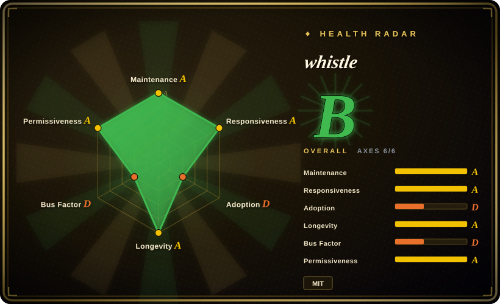
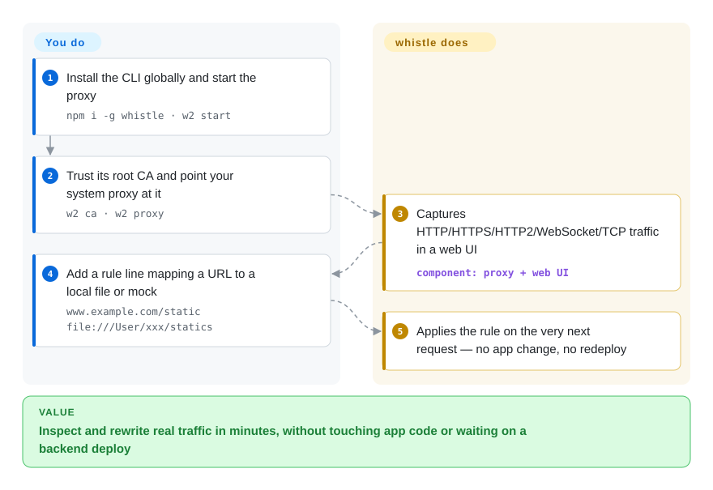

# whistle

A cross-platform HTTP/HTTPS/HTTP2/WebSocket/TCP debugging proxy: you point traffic at it, write rule lines in a web UI, and capture, inspect, rewrite, redirect, and mock requests on the fly — Fiddler/Charles-like, but browser-based and config-driven.

## When to use

You're a web or mobile developer staring at a bug that only happens against the *real* backend — an API returns a field your app chokes on, a CDN serves a stale bundle, or a flow only breaks on a teammate's staging host. You don't want to wait on a backend deploy to test a fix, and you don't want to hard-code mock data into the app. You install whistle (`npm i -g whistle`), start it, point your browser or phone's proxy at it, install its root cert once so HTTPS is decryptable, and now every request flows through a web UI where you can read full request/response pairs. You write a few rule lines — `www.example.com/api/user resBody://{mock.json}` to mock a response, `example.com 127.0.0.1:8080` to redirect a host to local, `example.com/app.js file:///path/app.js` to swap a script for a local file — and the change takes effect on the next request, no redeploy.

It shines when you need to inspect *and* rewrite at once: reproduce a production-only bug by mocking the exact bad payload, debug a mobile app by routing the device through whistle on your laptop, or front-end-test against a backend that isn't ready yet by mocking its endpoints. The rule syntax lives in a file you can version and share, so a whole team can reproduce the same interception setup.

## How it works

whistle runs as a local Node.js process that is simultaneously your proxy and the web UI hosting it (`w2 start` brings it up; `w2 stop`/`w2 restart`/`w2 status` manage it). Once a client's system proxy points at it (`w2 proxy`, or per-app proxy settings), every request that flows through is captured — headers, bodies, sockets — and shows up live in the Network panel. To read HTTPS you install its self-generated root CA once per client device (`w2 ca`, or one click in the UI), which lets whistle decrypt, match and rewrite the traffic in transit; the same CA is the security tradeoff you accept (see When NOT). Matching happens on plain rule lines — `www.example.com/static file:///User/xxx/statics` maps a URL prefix to local files, and operators like `resBody://` (mock a response), `host` (DNS-rewrite), `reqHeaders://`/`statusCode` (tweak request/response) compose onto the same pattern. What stays yours: trusting the CA per device, pointing each client's proxy at the process, and authoring the rule lines.

<!-- flow-steps:begin (generated from flows/whistle.json by tools/flow_card.py — do not edit) -->

Text version of the flow

1. **You**: Install the CLI globally and start the proxy — `npm i -g whistle · w2 start`
2. **You**: Trust its root CA and point your system proxy at it — `w2 ca · w2 proxy`
3. **whistle**: Captures HTTP/HTTPS/HTTP2/WebSocket/TCP traffic in a web UI — component: `proxy + web UI`
4. **You**: Add a rule line mapping a URL to a local file or mock — `www.example.com/static file:///User/xxx/statics`
5. **whistle**: Applies the rule on the very next request — no app change, no redeploy

**Value**: Inspect and rewrite real traffic in minutes, without touching app code or waiting on a backend deploy

<!-- flow-steps:end -->

## When NOT to use

- **You need a production gateway / reverse proxy.** whistle is a dev-time debugging proxy, not an edge or API gateway — no clustering, rate-limiting story, auth plugins, or production SLAs. For that use [Kong](../api-gateway/kong.md) (or nginx/Envoy).
- **You want a scraping IP rotation pool.** It interposes on *your* traffic to inspect/rewrite it; it does not source or rotate anonymous upstream proxies. For crawler IP pools see [proxy_pool](../proxy-pool/proxy-pool.md).
- **HTTPS interception is a hard no in your environment.** Decrypting HTTPS requires installing and trusting whistle's root CA on the client — a real attack-surface and policy risk (a trusted MITM cert). On locked-down / corporate / production devices that's often disallowed, and a leaked CA key is dangerous.
- **You need a vendor-backed, multi-maintainer tool with SLAs.** It's effectively a single-maintainer personal repo (owner is a GitHub User, not an org) — a bus-factor risk for anything you can't afford to have stall.
- **You can't read Chinese docs comfortably and want zero friction.** Documentation and much of the community discussion are heavily Chinese; English coverage exists but is thinner. [未验证]
- **You'd rather have a polished native GUI.** If you want a packaged desktop app, Charles or Proxyman fit that mold; if you want a scriptable CLI/Python proxy, mitmproxy is the better tool than a web-UI + rule-file model.

## Comparison

| Alternative | In index | Our verdict | Tradeoff |
|---|---|---|---|
| Charles | 未收录 | Choose Charles when you need a polished paid native desktop proxy. | Paid native desktop proxy; mature, polished GUI for capture/rewrite/throttle, but commercial license and not config-file-driven like whistle's rule syntax. |
| Fiddler | 未收录 | Choose Fiddler when Windows-first debugging proxy heritage and .NET scripting matter. | Long-standing Windows-first debugging proxy (Fiddler Classic / Everywhere); rich .NET ecosystem and FiddlerScript, but heavier and partly commercial/closed. |
| [mitmproxy](mitmproxy.md) | ✅ | Choose mitmproxy when programmable Python interception is the priority. | Open-source (MIT-ish) Python proxy with a strong scripting/addon API and CLI/TUI; better for programmable interception, less of a point-and-click rule UI. |
| [anyproxy](anyproxy.md) | ✅ | Choose AnyProxy when you prefer Alibaba's Node.js proxy and JS rule files. | Alibaba's Node.js HTTP/HTTPS proxy with JS rule files; closer in spirit to whistle but smaller community and you write rules in JS rather than whistle's line syntax. |
| Proxyman | 未收录 | Choose Proxyman when a modern native GUI matters more than npm/web-UI operation. | Modern native macOS/cross-platform debugging proxy with a slick GUI; freemium/commercial, app-based rather than a web-UI + npm tool. |

## Tech stack

- **Language/runtime:** JavaScript on Node.js — installed and run as an npm CLI (`whistle` / `w2`); Homebrew (`brew install whistle`) and a packaged desktop client ([whistle-client](https://github.com/avwo/whistle-client)) are documented install paths (README, 2026-09).
- **Architecture:** a local proxy server plus a web UI; traffic is matched against rule lines (a custom whistle rule DSL: pattern → operator like `file://`, `resBody://`, `host`, `req`/`res` modifiers, `weinre`/inspect, etc.).
- **Protocols:** HTTP, HTTPS (via an installable root CA for decryption), HTTP/2, WebSocket, and TCP capture/modify; HTTP/HTTPS/SOCKS/reverse-proxy modes (README, 2026-09).
- **Built-in tools:** Weinre (remote DOM inspection), Console, Composer (request replay/edit) ship in the UI (README, 2026-09).
- **Extensibility:** a plugin system (whistle plugins published as `whistle.<name>` npm packages) extends matching and UI features — plugin support is a documented README feature; individual plugins' maturity is another matter.

## Dependencies

- **Node.js** is the one hard runtime dependency — `package.json` declares `engines.node: ">= 14.0.0"` as of v2.10.10 (verified 2026-09-28).
- **A root CA install** on each client that should have HTTPS decrypted — a setup/operational dependency, not a service.
- No database or external service to stand up; state and rules live locally.

## Ops difficulty

**Low.** It's a single `npm i -g whistle` (or `brew install whistle`, or the packaged desktop client) then `w2 start`; the web UI runs locally and rules are edited there or in a rule file. The only real friction is HTTPS: generating and installing the root cert on every client/device you want to decrypt, and re-doing it per device/OS (`w2 ca` automates the local machine). Running it as a shared/team instance, or proxying mobile devices, adds a bit of network setup (everyone points their proxy at the host, trusts the cert), but there's no clustering, datastore, or scaling concern because it's a dev tool, not infrastructure.

## Health & viability

- **Responsiveness**: radar grades it A (median first response ~6.8h over the scored window) — the maintainer answers fast.
- **Maintenance (2026-09).** Last default-branch commit 2026-09-21; latest tag v2.10.10 — **actively shipping**, roughly monthly commits through the summer. Not archived.
- **Governance / bus factor.** The repo owner is a **single GitHub User (avwo), not an organization** — effectively one maintainer. That's a real **bus-factor flag**: roadmap and continuity hinge on one person, even though the project is long-lived. [推断]
- **Age & Lindy verdict.** Created 2015-03 (~11 years) and **still active** ⇒ a **strong Lindy** signal for its niche — a debugging proxy that has survived and stayed maintained for a decade is a safer bet than a young one, the single-maintainer caveat notwithstanding. [推断]
- **Adoption.** ~15.7k stars, ~1.18k forks, only 82 open issues for a tool this old (GitHub API 2026-09-28); well-known in the Chinese front-end community and widely used as a Fiddler/Charles alternative there. Star counts are indicative, not proof of current health.
- **Risk flags.** MIT-licensed with no relicense history found; the dominant risks are the single-maintainer bus factor and the inherent HTTPS-MITM trust model, not licensing. [推断]

## Caveats (unverified)

- [未验证] ~15.7k stars and v2.10.10 as of 2026-09-28 — star counts and version numbers are date-sensitive and drift; treat as indicative only.
- [未验证] "Heavily Chinese documentation" is an inference from the project's origin and community; the site ships an English docs tree (`/en/` on wproxy.org) but its completeness vs the Chinese one wasn't exhaustively audited.
- [未验证] The plugin ecosystem (`whistle.<name>` packages) and the full rule-operator set are described from the project's framing; specific plugins' maturity wasn't individually verified.
- [推断] "Single maintainer" is inferred from the owner being a GitHub User account; the real contributor distribution wasn't measured contributor-by-contributor.
