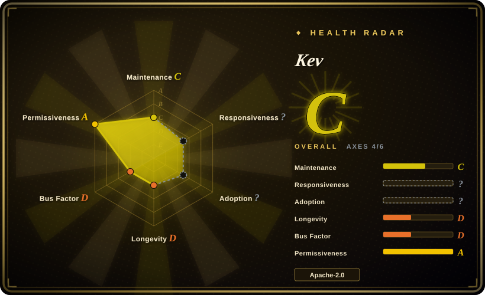
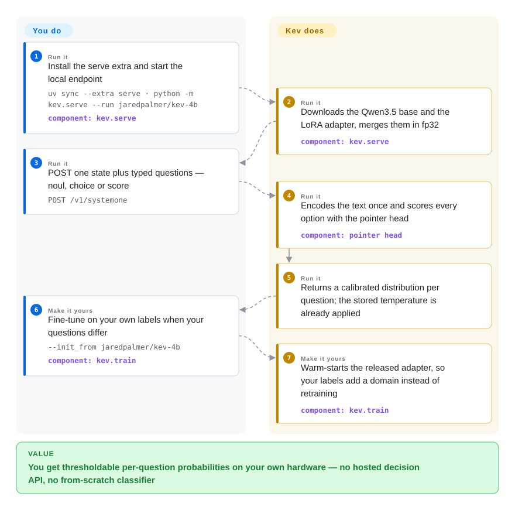

# Kev

A family of 0.8B–9B *decision models* — a LoRA adapter plus a pointer head on Qwen3.5 bases — that read one piece of text and answer typed questions about it (yes/no, pick-one-of-N, rate-on-a-scale), returning a probability distribution per question instead of generated text. It ships as a self-hostable service over a TypeSafe-compatible `/v1/systemone` API, with the training code, frozen eval suites and a fine-tune path included.

## When to use

You are putting a triage layer in front of a queue — routing support tickets to the right team, flagging what needs a human now, scoring how angry a customer is — and turning a chat model into "answer with one of these five labels and a confidence" has stopped being enough. What you need is a *number* per question you can threshold against an error budget, the same answer whether the question is asked alone or with four others, and customer text that never leaves your network. You also have a few hundred labelled tickets and no appetite for hand-writing a prompt per category.

Reach for Kev when you want the self-hosted counterpart of a hosted decision model or decision API: one repo carries a small Jev-style model family plus real training and evaluation code, so you can serve the released weights locally or fine-tune from a released checkpoint when your categories differ. It beats "prompt a general LLM for JSON" when the same decision repeats at volume and you want calibrated probabilities rather than the confidence of a sampled token; it beats training a bespoke classifier when your questions are typed and varied — one request answers yes/no, choice and rating questions at once. The deciding tradeoff is that you operate the weights yourself (0.8B–9B) and get materially weaker world knowledge than a hosted frontier model or Jev; what you buy for it is local execution, per-question probabilities, and a fine-tune that keeps what the released model already knows.

## How it works

Kev never writes a sentence. Each checkpoint is a rank-16 LoRA adapter plus a small pointer head on a Qwen3.5 base, trained with cross-entropy to pick the right option. The server encodes your text (the *state*) once, renders each question in the request as its own row — able to see the state and itself, never the other questions — and the pointer head scores every option's closing token against the question's final token, turning those scores into a probability distribution. On Qwen3.5's hybrid Gated-DeltaNet bases those rows are separate passes continued from a shared state prefix, so question isolation is exact and the state is computed once and reused from cache. Every checkpoint carries a temperature fitted on its own in-distribution development rows and applies it at load, so the probabilities are usable as served without any answer changing (`KEV_TEMPERATURE=1.0` gives the raw logits). Your part is installation, one request (state plus typed questions), and — when your domain differs — a `kev.train` run started from the released adapter; theirs is the merge, the encoding, the option scoring and the calibration.

<!-- flow-steps:begin (generated from flows/kev.json by tools/flow_card.py — do not edit) -->

Text version of the flow

1. **You** (Run it): Install the serve extra and start the local endpoint — `uv sync --extra serve · python -m kev.serve --run jaredpalmer/kev-4b` — component: `kev.serve`
2. **Kev** (Run it): Downloads the Qwen3.5 base and the LoRA adapter, merges them in fp32 — component: `kev.serve`
3. **You** (Run it): POST one state plus typed questions — noul, choice or score — `POST /v1/systemone`
4. **Kev** (Run it): Encodes the text once and scores every option with the pointer head — component: `pointer head`
5. **Kev** (Run it): Returns a calibrated distribution per question; the stored temperature is already applied
6. **You** (Make it yours): Fine-tune on your own labels when your questions differ — `--init_from jaredpalmer/kev-4b` — component: `kev.train`
7. **Kev** (Make it yours): Warm-starts the released adapter, so your labels add a domain instead of retraining — component: `kev.train`

**Value**: You get thresholdable per-question probabilities on your own hardware — no hosted decision API, no from-scratch classifier

<!-- flow-steps:end -->

## When NOT to use

- **The decision turns on world knowledge.** Training adds a policy, not facts: on the date-arithmetic questions the untrained Qwen3.5-9B base scores 0.82 while the first Kev-9B dropped to 0.72, and knowledge stays at the base — MMLU ~0.74 vs Jev's ~0.90, MMLU-Pro ~0.52 vs 0.84, with a Kev trained on a 35B mixture-of-experts base moving neither. If your questions need encyclopedic knowledge rather than a rule applied to the text in front of you, use a hosted frontier chat API or Jev instead.
- **You want zero operations and per-call pricing.** The hosted decision API (TypeSafe System One) and Jev exist precisely so nobody runs weights; choose one of them when a network round trip and data egress are acceptable, and choose Kev only when the probabilities have to be produced on your own hardware or fine-tuned on your own labels.
- **You need free-form output or tool calls.** Kev answers only the questions you typed — it cannot summarise, draft, or emit a function call. Use a current model with native tool calling served on [vLLM](../llm-inference/serving-engines/vllm.md) or [SGLang](../llm-inference/serving-engines/sglang.md); [Functionary](../function-calling/functionary.md) is the indexed historical reference for that pattern, deprecated and not to ship.
- **You must run on a CPU, a phone, or in single-digit megabytes.** The small end here is 0.8B and the 4B/9B want a GPU or a 32 GB Mac. For an on-device footprint use [Needle](../on-device-ml/needle.md).
- **You need a multi-tenant, authenticated, concurrent endpoint.** The bundled server binds `127.0.0.1`, has no authentication, handles one request at a time and does not batch requests from different callers. Put a serving engine in front or use a hosted API if that is the requirement.
- **Your inputs are long, or the answer requires date subtraction.** Training covered at most 384 state tokens (1,024 for state plus one question); serving allows 8,192, a range training never saw. Date arithmetic is the known weak spot — `KEV_DATE_FACTS=1` prepends stated day counts and recovers it, otherwise use a larger model.
- **You need order-independent or bit-stable answers.** Changing option order can change an answer, and question isolation does not prevent it; if your pipeline needs determinism, test permutations first or pick a different mechanism.
- **You need production stability today.** The repo is five days old, pre-1.0 on its own metadata, single-maintainer and without `CONTRIBUTING`/governance files `[推断]`; pin a checkpoint, vendor it, or wait — see the health section.

## Comparison

| Alternative | In index | Our verdict | Tradeoff |
|---|---|---|---|
| Jev (hosted) | 未收录 | Choose Jev when new-source accuracy and the share of decisions you can automate at a 5% error budget matter more than control — its 0.857 new-source development accuracy and 0.70 coverage beat the best Kev family numbers (Kev-9B 0.822 / 0.45–0.57); choose Kev when the probabilities must come from your own hardware and improve on your labels. | Jev is a hosted service with far less to operate and better out-of-domain accuracy, priced per call and reading your data; Kev is a checkpoint you own, with the base model's knowledge ceiling baked in. The comparison is also not controlled `[未验证]` — Jev's training data is unknown, as the project's own README concedes. |
| TypeSafe System One (hosted API) | 未收录 | Choose System One when you want exactly this request/response contract as a managed service; choose Kev when you want the contract without the dependency — Kev reimplements `/v1/systemone`, so TypeSafe's own Python SDK points at your local server. | Same API shape and SDK, opposite operating model: hosted convenience and no GPU versus a local process with no auth, no batching and your own upgrade treadmill. |
| [SGLang](../llm-inference/serving-engines/sglang.md) + any instruct LLM | ✅ | Choose SGLang with constrained/structured generation when the same server must also generate, call tools or answer free-form questions; choose Kev when the whole job is repeated typed decisions and you would rather train the behaviour than prompt it. | A general engine buys you one serving path for everything and pays for it in prompt engineering, per-decision cost and uncalibrated token probabilities; Kev gives one forward pass and stored calibration, but only for the question types it supports. |
| [Needle](../on-device-ml/needle.md) | ✅ | Choose Needle when the classifier must run on-device in tens of megabytes with grammar-constrained decoding; choose Kev when you need a full distribution over many options and can afford 0.8B–9B on a GPU or a 32 GB Mac. | Three orders of magnitude of footprint apart: Needle is a 2-bit on-device model with a confidence score, Kev is a LoRA adapter on a full-sized base with per-option probabilities and a fine-tuning recipe. |
| Hosted frontier chat API (OpenAI / Anthropic / Gemini) | 未收录 | Choose a frontier API when the decision needs knowledge or nuanced judgement and a few cents per call is fine; choose Kev when the decisions are policy-shaped, repeat at volume, and per-call cost, latency or egress are the binding constraints. | Frontier APIs bring world knowledge, tool use and no ops at per-call cost and data egress; Kev brings local execution and probabilities you can threshold at the price of a knowledge ceiling and running the model yourself. |

## Tech stack

- **Language/runtime:** Python ≥ 3.12, packaged with `uv` (`pyproject.toml` + `uv.lock`); `torch >= 2.6, < 2.9`, `transformers >= 5.17, < 6` (the `qwen3_5` architecture), `peft >= 0.21`, `accelerate`, `datasets`, `numpy`, `pydantic`, `scikit-learn`.
- **Models:** LoRA (rank 16, α 32) adapters plus a from-scratch pointer head over `Qwen/Qwen3.5-0.8B|4B|9B-Base`; the previous generation used Qwen3 bases (`kev-0.6b`/`kev-4b@qwen3`/`kev-8b`) and a Qwen2.5-0.5B prototype, all still published. Weights live on Hugging Face (`jaredpalmer/kev-*`), not in the repo.
- **Serving:** FastAPI + uvicorn (`fastapi`, `uvicorn`, `typesafe-sdk` in the `serve` extra) exposing `POST /v1/systemone`, `GET /v1/models` and `/v1/systemone/permute|separate`; `kev/api.py` holds the TypeSafe request/response models; an optional Next.js playground and a Gradio HF Space demo sit alongside.
- **Training/eval:** `kev.train` (LoRA fine-tune with custom block-causal masks), `kev.benchmark`, `kev.experiment`, `kev.compare`, frozen JSONL suites under `evals/` with per-file SHA-256 manifests (large partitions mirrored to the HF dataset `jaredpalmer/kev-suites`), and a Modal app (`H100`) for multi-trial studies.
- **CI:** GitHub Actions (`ci.yml`) runs the weight-free unit/research tests and the playground type checks.

## Dependencies

- **Python 3.12+ and `uv`**; PyTorch built for CUDA or Apple MPS. CUDA wants `flash-linear-attention` + `triton >= 3.7.1` for the Qwen3.5 DeltaNet layers (the Modal image installs them); MPS runs reference kernels instead.
- **Model weights** — base model plus adapter — downloaded from the Hugging Face Hub on first run (or from the GitHub release tarballs with SHA-256 checksums). No weights ship in the repo.
- **Hardware:** serving Kev-4B in bf16 needs roughly 9 GB of GPU memory; the 4B and 9B fit a 32 GB Mac. Training anything beyond the smoke run wants a CUDA GPU — the published recipes were trained on one H100, the 4B in ~1 hour.
- **No database, no managed service:** one Python process holding the model. Node 20.9+ is needed only for the optional playground.
- **Network at first run** for the Hub download and, when training, for the dataset mirrors.

## Ops difficulty

**Low to serve, medium to train.** Serving is `uv sync --extra serve` plus one process; there is no database, no queue and no cluster, and the server prints a local endpoint that any TypeSafe-compatible client can hit (`TypeSafeClient(api_key="local", base_url="http://127.0.0.1:8009", model="kev-latest")`). The day-2 caveats are what keep it from being trivial: the endpoint is unauthenticated and loopback-only by design, so exposing it is your job; it serves one request at a time and caches repeated state text rather than batching callers; and the Qwen3.5 DeltaNet kernels have no fast MPS path, so Mac latency is ~4x the previous generation. Training is a real job — Modal or an H100, frozen suites, and the instruction to re-run the calibration script after any new checkpoint before publishing. Because the project is days old and pre-1.0, pinning a checkpoint and re-reading the API on upgrade is the sane default.

## Health & viability

- **Maintenance — very active, over a very short window (verified 2026-09-21).** Created 2026-09-17 with 181 commits and a push on 2026-09-21; two releases in that window (`v0.1.0` on 2026-09-17, `kev-family` on 2026-09-20). The cadence is real but unproven: five days is not a maintenance record.
- **Governance / bus factor — one person.** `owner.type` is `User` (Jared Palmer, of Formik/Razzle/TSDX), the contributors API returns four logins including one bot (`ImgBotApp`), and there is no `CONTRIBUTING`, `GOVERNANCE`, `CODEOWNERS` or `SECURITY.md` anywhere in the tree. The health scorer measured the top contributor holding 98.3% of the trailing-window commits (top three: 99.4%), so the roadmap is whatever the author does next `[推断]`.
- **Backing & longevity — no foundation, no vendor.** Nothing indicates funding, a company behind it or a governance body, and the repo's own acknowledgements point at the hosted competitor it reconstructs (Jev) and TypeSafe's API design. On the Lindy prior this is the failure case: young *and* single-maintainer, so expected remaining life is a guess, not a prior.
- **Adoption — attention outruns use.** ~2.0k stars and 102 forks in five days, while the published Hugging Face checkpoints show 72–846 downloads each and the mirror dataset is the only other artifact (both measured 2026-09-21). Stars here are a hype signal, not vetting `[推断]`; the credible adoption evidence is the benchmark reuse — two external test sets (SemIf's 144 authored decisions, scienthoon's 900 tickets) are vendored under `evals/external/`.
- **Risk flags — pre-1.0, license-clean, dataset-licence-unclear.** Apache-2.0 for the code and for the Qwen bases (the training datasets carry their own licences, so a commercial derivative needs its own check `[未验证]`); `Development Status :: 3 - Alpha`; a brand-new API surface; and an accuracy story published only by its author.

## Caveats (unverified)

- `[未验证]` All accuracy, Brier, calibration and coverage numbers (Kev-9B 0.852 / Kev-4B 0.837 / Kev-0.8B 0.684 on the locked new-source test; Jev 0.857 development, 0.70 coverage at a 5% error budget) are author-published in the README and model cards. I found no independent replication, and the repo's own locked-test protocol is not something an outside reader can re-run without the weights and suites.
- `[未验证]` The Jev comparison is not controlled, by the project's own admission: Jev's training data is unknown, Jev has not been run on the same locked test, and numbers for it come from the author's gateway harness.
- `[未验证]` The claim that the models are "TypeSafe-compatible" rests on the repo's own conformance tests plus TypeSafe's public docs; I did not run the official SDK against a Kev server.
- `[未验证]` Serving-performance figures (0.33 s / 0.78 s / ~2 s median for 0.8B/4B/9B in bf16 on an M5; tens of milliseconds on an H100) are author-reported hardware measurements, not reproducible from the page.
- `[未验证]` Hugging Face download counts (72–846 per model, 2026-09-21) are a snapshot that includes automated pulls; they bound adoption poorly in both directions.
- `[未验证]` Whether the ten training datasets' licences permit commercial use of the resulting weights was not checked; the model cards state only that datasets have their own licences.
- `[推断]` That ~2.0k stars in five days is attention rather than adoption is an inference from the star/download mismatch, not a measurement.
- `[推断]` The absence of governance files at the root is read as "no formal process"; the repo may govern itself elsewhere (the author's other projects, private channels) in a way the files do not show.
- `[未验证]` The date-arithmetic and "unknowable item" behaviours (and the 0.00 confident-answer rate on removed-evidence items) are read from the model cards and README without running the evaluation myself.
