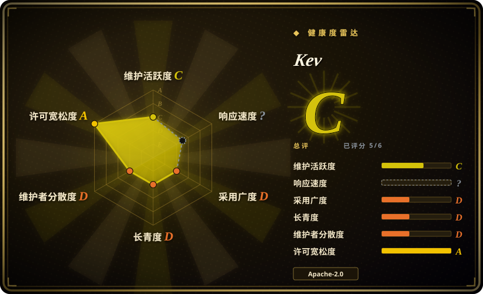
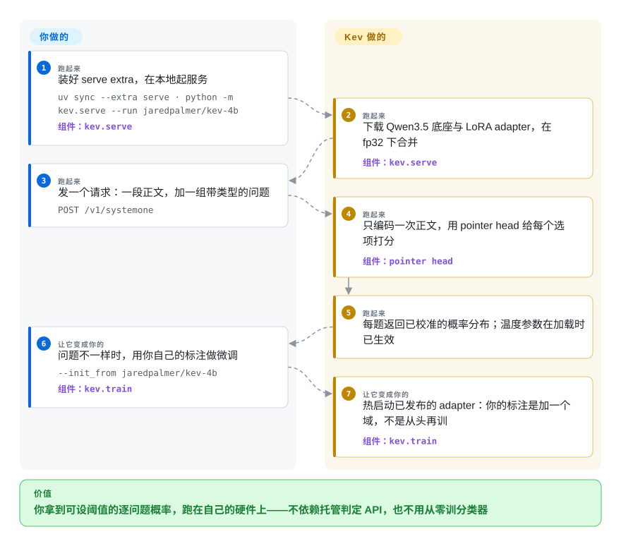

# Kev

0.8B–9B 的决策模型家族——Qwen3.5 底座上加一个 LoRA adapter 与一个 pointer head——读一段文本，回答关于它的带类型问题（是/否、N 选一、按档打分），返回每个问题的概率分布，而不是生成文本。它以自托管服务的形式提供，接口兼容 TypeSafe 的 `/v1/systemone`，并附带训练代码、冻结评测集与微调路径。

## 何时使用

你正在给一个队列加分流层——把客服工单路由到正确的团队、标出必须现在转人工的、给客户怒气打分——而把聊天模型调教成「从这五个标签里选一个并给出置信度」已经不够用了。你真正需要的是每个问题一个可对着错误预算设阈值的**数**，是同一个问题单独问和跟另外四个一起问得到同一个答案，是客户文本一步都不离开你的网络。你手上还有几百条标注好的工单，也不想为每个类目手写 prompt。

要自托管版「判定模型／判定 API」时就选 Kev：这一个仓库同时给出小型的 Jev 类模型家族和真实的训练、评测代码，所以你能直接跑发布权重，也能在自己的类目不同时从已发布 checkpoint 做微调。当同一个判定要反复做、且你需要的是校准过的概率而不是某个采样 token 的置信度时，它优于「让通用 LLM 输出 JSON」；当你的问题类型多样时，它优于训练一个专用分类器——一个请求里同时回答是/否、多选和评分三类问题。决定性取舍是权重（0.8B–9B）由你自己运维，且世界知识明显弱于托管前沿模型或 Jev；换来的是本地执行、逐问题概率，以及一条「保留已发布模型已有能力」的微调路径。

## 怎么用起来

Kev 不写句子。每个 checkpoint 是 rank 16 的 LoRA adapter 加一个 Qwen3.5 底座上的小 pointer head，用交叉熵训练成「选出正确选项」。服务端把你的文本（*state*）编码一次，然后把请求里每个问题渲染成自己的一行——它能看到 state、能看到自己，永远看不到别的问题——再由 pointer head 把每个选项的收尾 token 与问题的末 token 打分，转成概率分布。在 Qwen3.5 这种 Gated DeltaNet 混合底座上，这些行就是从共享 state 前缀继续下去的独立前向，所以问题隔离是精确的，state 也只算一次并进缓存复用。每个 checkpoint 自带一个在自身分布内开发集上拟合好的温度，加载时即生效，因此概率开箱可用且不改变任何答案（`KEV_TEMPERATURE=1.0` 给出原始 logits）。你要做的是安装、发一个请求（state 加带类型的问题），以及在自己领域不同时用 `kev.train` 从已发布 adapter 起步跑一次微调；合并权重、编码、给选项打分和校准都归它。

<!-- flow-steps:begin (generated from flows/kev.json by tools/flow_card.py — do not edit) -->

流程文字版

1. **你**（跑起来）：装好 serve extra，在本地起服务 — `uv sync --extra serve · python -m kev.serve --run jaredpalmer/kev-4b` — 组件：`kev.serve`
2. **Kev**（跑起来）：下载 Qwen3.5 底座与 LoRA adapter，在 fp32 下合并 — 组件：`kev.serve`
3. **你**（跑起来）：发一个请求：一段正文，加一组带类型的问题 — `POST /v1/systemone`
4. **Kev**（跑起来）：只编码一次正文，用 pointer head 给每个选项打分 — 组件：`pointer head`
5. **Kev**（跑起来）：每题返回已校准的概率分布；温度参数在加载时已生效
6. **你**（让它变成你的）：问题不一样时，用你自己的标注做微调 — `--init_from jaredpalmer/kev-4b` — 组件：`kev.train`
7. **Kev**（让它变成你的）：热启动已发布的 adapter：你的标注是加一个域，不是从头再训 — 组件：`kev.train`

**价值**：你拿到可设阈值的逐问题概率，跑在自己的硬件上——不依赖托管判定 API，也不用从零训分类器

<!-- flow-steps:end -->

## 何时不用

- **这个判定取决于世界知识。** 训练加的是策略，不是事实：在日期算术题上未训练的 Qwen3.5-9B 底座能拿 0.82，而第一版 Kev-9B 掉到 0.72；知识面由底座决定——MMLU 约 0.74 对 Jev 约 0.90，MMLU-Pro 约 0.52 对 0.84，换到 35B 混合专家底座重训也没有改善。如果你的问题需要百科式知识，而不是把一条规则套到眼前的文本上，就改用托管前沿聊天 API 或 Jev。
- **你要的是零运维与按次计费。** 托管判定 API（TypeSafe System One）与 Jev 存在的意义就是没人需要自己跑权重；一次网络往返和数据出网可以接受时就选它们，只有当概率必须产在你自己的机器上、或必须用自己的标注微调时才选 Kev。
- **你需要自由生成或工具调用。** Kev 只回答你打出来的问题，不会摘要、不会起草、也不会发出函数调用。用当前带原生工具调用的模型跑在 [vLLM](../llm-inference/serving-engines/vllm.zh.md) 或 [SGLang](../llm-inference/serving-engines/sglang.zh.md) 上；[Functionary](../function-calling/functionary.zh.md) 是该模式在索引里的历史参考，已废弃、不要上线。
- **你必须在 CPU、手机或个位数 MB 内跑。** 这里最小的一端是 0.8B，4B/9B 要 GPU 或 32GB 的 Mac。要端侧足迹就用 [Needle](../on-device-ml/needle.zh.md)。
- **你需要多租户、带认证、可并发的端点。** 自带服务绑定 `127.0.0.1`、没有认证、一次处理一个请求，也不会把不同调用方的请求合批。这是硬需求就前置一个服务引擎，或者直接用托管 API。
- **你的输入很长，或者答案要靠日期相减。** 训练只覆盖最多 384 个 state token（state 加一个问题共 1024）；服务端允许 8192，而这一段训练从未见过。日期算术是已知短板——`KEV_DATE_FACTS=1` 会把「相隔多少天」写进输入并把它救回来，否则请换更大的模型。
- **你需要与选项顺序无关、或逐位稳定的答案。** 调换选项顺序可能改变答案，而问题隔离并不能阻止这一点；流水线要求确定性的话，先测排列，或者换一种机制。
- **你现在就需要生产级稳定性。** 仓库只有五天、元数据自标 pre-1.0、单人维护、根目录没有 `CONTRIBUTING` 与治理文件 `[推断]`；请固定某个 checkpoint、把权重 vendor 下来，或者再等等——见健康度一节。

## 横向对比

| 替代品 | 是否收录 | 我们的评价 | 取舍 |
|---|---|---|---|
| Jev（托管） | 未收录 | 当新来源准确率与「5% 错误预算下可自动化的判定占比」比可控性更重要时选 Jev——它新来源开发集 0.857、覆盖率 0.70，优于 Kev 家族最好成绩（Kev-9B 0.822 / 0.45–0.57）；当概率必须产在自己的机器上、并要按你的标注持续变好时选 Kev。 | Jev 是几乎不用运维、域外更准的托管服务，代价是按次计费且会读到你的数据；Kev 是你自己持有的 checkpoint，但底座的知识上限也一并被打包进来。这一对比同样不构成受控实验 `[未验证]`——Jev 的训练数据未知，项目 README 自己也承认这一点。 |
| TypeSafe System One（托管 API） | 未收录 | 想把这套请求／响应契约直接当托管服务用时选 System One；想要契约但不要依赖时选 Kev——Kev 重实现了 `/v1/systemone`，TypeSafe 官方 Python SDK 可以直接指向你的本地服务。 | 同一套 API 形状与同一个 SDK，运维模型相反：托管侧是方便、不用 GPU；本地侧是一个无认证、不批处理、升级节奏自负的进程。 |
| [SGLang](../llm-inference/serving-engines/sglang.zh.md) 加任意指令模型 | ✅ | 当同一台服务还要生成、调工具、答开放问题时选 SGLang 加受约束／结构化生成；当全部工作就是反复做带类型的判定、你宁愿训练行为而不是调 prompt 时选 Kev。 | 通用引擎用一条服务链路换来了「什么都能干」，代价是 prompt 工程、单次判定成本与未校准的 token 概率；Kev 换来一次前向与存好的校准，但只支持它本身的问题类型。 |
| [Needle](../on-device-ml/needle.zh.md) | ✅ | 当分类器必须跑在端侧、只有几十 MB、且用语法约束解码时选 Needle；当你需要多选项上的完整分布、并且负担得起 GPU 或 32GB Mac 上的 0.8B–9B 时选 Kev。 | 两者足迹差三个数量级：Needle 是 2-bit 端侧模型加一个置信度，Kev 是完整底座上的 LoRA adapter，给的是逐选项概率和一套微调配方。 |
| 托管前沿聊天 API（OpenAI / Anthropic / Gemini） | 未收录 | 当判定需要知识或细腻判断、每次几分钱可接受时选前沿 API；当判定是策略形状、量大，且单次成本、延迟或数据出网是硬约束时选 Kev。 | 前沿 API 带来世界知识、工具调用与零运维，代价是按次计费和数据出网；Kev 带来本地执行与可设阈值的概率，代价是知识天花板与自己跑模型。 |

## 技术栈

- **语言与运行时：** Python ≥ 3.12，用 `uv` 打包（`pyproject.toml` + `uv.lock`）；`torch >= 2.6, < 2.9`、`transformers >= 5.17, < 6`（`qwen3_5` 架构）、`peft >= 0.21`、`accelerate`、`datasets`、`numpy`、`pydantic`、`scikit-learn`。
- **模型：** `Qwen/Qwen3.5-0.8B|4B|9B-Base` 上的 LoRA（rank 16、α 32）adapter 加从零训练的 pointer head；上一代用 Qwen3 底座（`kev-0.6b`／`kev-4b@qwen3`／`kev-8b`），另有一个 Qwen2.5-0.5B 原型，都仍在发布。权重放在 Hugging Face（`jaredpalmer/kev-*`），不在仓库里。
- **服务：** FastAPI + uvicorn（`serve` extra 里的 `fastapi`、`uvicorn`、`typesafe-sdk`），暴露 `POST /v1/systemone`、`GET /v1/models` 与 `/v1/systemone/permute|separate`；`kev/api.py` 放 TypeSafe 的请求／响应模型；旁边还有一个可选的 Next.js playground 和一个 Gradio HF Space 演示。
- **训练与评测：** `kev.train`（带自定义 block-causal mask 的 LoRA 微调）、`kev.benchmark`、`kev.experiment`、`kev.compare`，`evals/` 下是带逐文件 SHA-256 manifest 的冻结 JSONL 套件（大分片镜像到 HF 数据集 `jaredpalmer/kev-suites`），多 trial 研究走一个 Modal 应用（H100）。
- **CI：** GitHub Actions（`ci.yml`）跑不需要权重的单元／研究测试与 playground 类型检查。

## 依赖

- **Python 3.12+ 与 `uv`**；PyTorch 需按 CUDA 或 Apple MPS 构建。CUDA 上跑 Qwen3.5 的 DeltaNet 层要有 `flash-linear-attention` + `triton >= 3.7.1`（Modal 镜像里已装）；MPS 走参考实现。
- **模型权重**——底座加 adapter——首次运行时从 Hugging Face Hub 下载（也可用 GitHub release 的 tarball，带 SHA-256 校验）。仓库里不含权重。
- **硬件：** Kev-4B 以 bf16 服务约需 9GB 显存；4B 与 9B 能装进 32GB 的 Mac。除 smoke 外的训练要 CUDA GPU——公开配方是在单张 H100 上训的，4B 约一小时。
- **没有数据库、没有托管服务：** 就是一个握着模型的 Python 进程。只有可选的 playground 需要 Node 20.9+。
- **首次运行需要联网**下载 Hub 权重；训练时还要能访问数据集镜像。

## 运维难度

**服务端低，训练侧中等。** 服务就是 `uv sync --extra serve` 加一个进程；没有数据库、没有队列、没有集群，起来后会给出一个本地端点，任何 TypeSafe 兼容客户端都能打（`TypeSafeClient(api_key="local", base_url="http://127.0.0.1:8009", model="kev-latest")`）。让它算不上「无脑」的是第 2 天的事：端点按设计无认证且只绑回环，对外暴露是你自己的责任；一次只服务一个请求，重复的 state 文本走缓存而不是给不同调用方合批；Qwen3.5 的 DeltaNet 核在 MPS 上没有快路径，Mac 延迟约是上一代的四倍。训练是一件正经活——Modal 或 H100、冻结套件，并且规则要求任何新 checkpoint 发布前都要重跑校准脚本。鉴于项目只有几天大且 pre-1.0，合理默认是固定某个 checkpoint，并在升级时重读 API。

## 健康度与可持续性

- **维护——极活跃，但窗口极短（2026-09-21 核实）。** 2026-09-17 创建，到 2026-09-21 已有 181 次提交且当天仍有推送，窗口内两个 release（`v0.1.0` 于 2026-09-17、`kev-family` 于 2026-09-20）。节奏是真的，但没被验证过：五天不构成维护记录。
- **治理与 bus factor——一个人。** `owner.type` 是 `User`（Jared Palmer，Formik／Razzle／TSDX 作者），contributors API 返回四个登录名（其中一个是机器人 `ImgBotApp`），整棵树里没有 `CONTRIBUTING`、`GOVERNANCE`、`CODEOWNERS` 或 `SECURITY.md`。健康度脚本测出第一贡献者占窗口内提交的 98.3%（前三合计 99.4%），因此路线图就是作者下一步做什么 `[推断]`。
- **背书与长寿——没有基金会、没有厂商。** 没有迹象显示有资金、公司或治理机构，仓库自己的致谢指向它复刻的托管竞品（Jev）与 TypeSafe 的 API 设计。按 Lindy 先验，这属于失败形态：又年轻又是单人维护，因此剩余寿命是猜的，而不是先验。
- **采用度——关注度跑在使用前面。** 五天内约 2.0k stars、102 forks，但已发布的 Hugging Face checkpoint 每个只有 72–846 次下载，另外只有那个镜像数据集（均于 2026-09-21 查询）。这里的 star 是热度信号而非把关 `[推断]`；可信的采用证据是基准复用——两个外部测试集（SemIf 的 144 条人工判定、scienthoon 的 900 张工单）被 vendor 在 `evals/external/` 下。
- **风险标记——pre-1.0、许可干净、数据集许可未明。** 代码与 Qwen 底座都是 Apache-2.0（训练数据集各有自己的许可，商业衍生需要自行核查 `[未验证]`）；元数据自标 `Development Status :: 3 - Alpha`；API 表面全新；准确率故事只有作者一方发布。

## 存疑（未验证）

- `[未验证]` 全部准确率、Brier、校准与覆盖率数字（Kev-9B 0.852／Kev-4B 0.837／Kev-0.8B 0.684 为锁定新来源测试集；Jev 0.857 开发集、5% 错误预算下覆盖 0.70）都来自 README 与模型卡的作者自述。我没有找到任何独立复现，而仓库自己的锁定测试协议在没有权重与套件的情况下外部读者也跑不了。
- `[未验证]` 与 Jev 的对比不构成受控实验，这是项目自己承认的：Jev 的训练数据未知、也没跑过同一个锁定测试，Jev 的数字来自作者的网关评测脚本。
- `[未验证]` 「TypeSafe 兼容」这一说法依赖仓库自带的符合性测试与 TypeSafe 公开文档；我没有真的用官方 SDK 打过一个 Kev 服务。
- `[未验证]` 服务性能数字（M5 上 bf16 中位数 0.8B／4B／9B 分别为 0.33 秒／0.78 秒／约 2 秒；H100 上数十毫秒）是作者在其硬件上的实测，本页无法复现。
- `[未验证]` Hugging Face 下载量（每个模型 72–846，2026-09-21）是含自动拉取的快照，用它判断采用度两个方向都会失真。
- `[未验证]` 十个训练数据集的许可是否允许商业使用其衍生权重，我没有核查；模型卡只说明数据集各有自己的许可。
- `[推断]` 「五天内约 2.0k stars 是关注度而非采用」是从 star 与下载量的落差推出来的，不是实测。
- `[推断]` 根目录缺治理文件被读作「没有正式流程」；仓库也可能在别处（作者的其他项目、私下渠道）做治理，文件看不出来。
- `[未验证]` 日期算术与「不可知条目」的行为（以及移除决定性证据的条目上 0.00 的高置信作答率）读自模型卡与 README，我没有自己跑评测。
