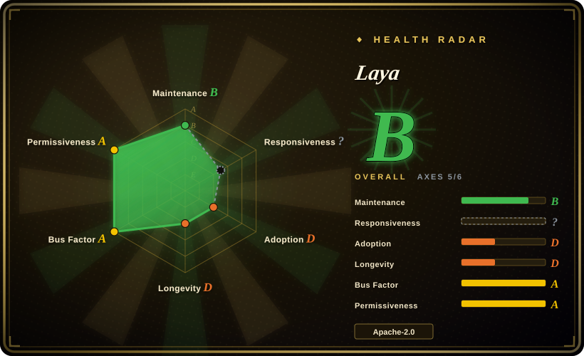
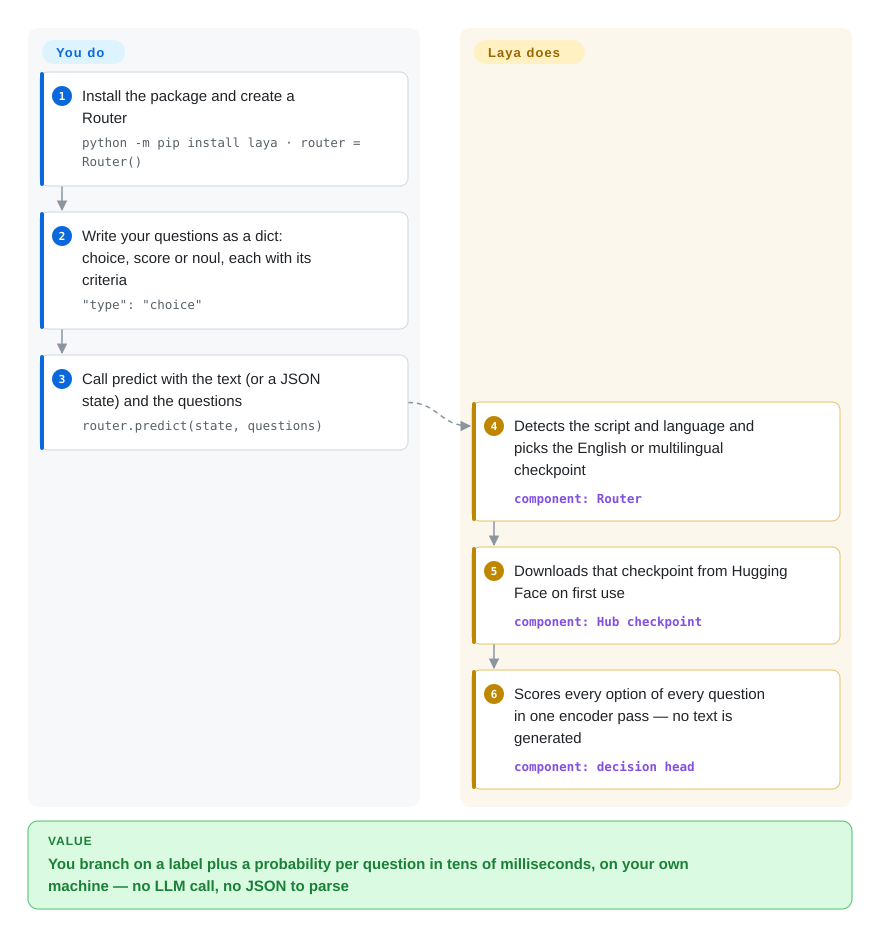

# Laya

Every time your pipeline needs to know "which team gets this ticket, is it urgent, is the customer threatening to leave", you pay for an LLM call and then parse whatever JSON came back. Laya answers those typed questions with a small encoder model — the kind that reads text rather than writes it — in one pass on your own machine, returning a label and a probability per question.

## When to use

You run a support desk, a moderation queue or an agent pipeline, and the same handful of decisions repeat thousands of times a day: route this email to `billing` / `technical` / `other`, rate urgency on a three-step scale, answer "does the user threaten to cancel?" with a yes/no. Today each one is a chat-model call whose reply sometimes arrives as `{"department": "Billing dept."}` instead of one of your labels, costs a few hundred milliseconds, and ships the customer's text to a vendor. You want a Python call that returns `billing` plus a probability you can threshold, runs on a laptop CPU or one GPU, and does not care whether the ticket is in Hindi or Spanish.

Reach for Laya when the decisions are **policy-shaped and repetitive, latency or data egress matters, and you are willing to fine-tune**. Against the other self-hosted decision models in this category it is the small, fast end: 322M–421M-parameter encoders (tens of milliseconds per question on a T4, per the author) with a built-in language router, instead of Kev's 0.8B–9B LoRA adapters on a chat base or Simple Jev's reuse of a full chat model. Against a hosted decision API such as Jev the trade is sharp and the repo says so itself: the shipped checkpoints are near chance on its own typed-decisions benchmark zero-shot and only reach 0.766 after fine-tuning on that benchmark's training split, and independent evaluations filed as issues put the English checkpoint 14–22 points behind Jev. You pick Laya for speed, local execution and an Apache-2.0 base to specialise — not for out-of-the-box accuracy.

## How it works

Laya never writes a sentence. You hand it a *state* (any text, or a JSON object it serialises) and a dictionary of typed questions: `choice` (pick one of several labels, each with a one-line description), `score` (pick a level on an ordered scale) or `noul` (yes/no, returned as the probability of yes). Each checkpoint is a bidirectional encoder — ModernBERT-large for English, mmBERT-base for 100+ languages — plus a decision head trained with reinforcement learning against proper scoring rules (rewards that punish confident wrong answers); the text and all the options are packed into one input, read once, and every option gets a probability, like a multiple-choice exam graded in one glance rather than an essay you have to mark. The `Router` in front looks at the script and language of the input in well under a millisecond and sends it to the English or multilingual checkpoint, downloading it from Hugging Face the first time. What you do is write the questions (and their labels well — the README documents labels the model can latch onto instead of the text), choose thresholds, and fine-tune on your own decisions when accuracy matters; what Laya does is the routing, the single forward pass, temperature-scaled probabilities, and the surrounding surfaces (CLI, a Jev-compatible HTTP server, an MCP server, LangChain/LlamaIndex/CrewAI adapters, ONNX export, a TypeScript port).

<!-- flow-steps:begin (generated from flows/laya.json by tools/flow_card.py — do not edit) -->

Text version of the flow

1. **You**: Install the package and create a Router — `python -m pip install laya · router = Router()`
2. **You**: Write your questions as a dict: choice, score or noul, each with its criteria — `"type": "choice"`
3. **You**: Call predict with the text (or a JSON state) and the questions — `router.predict(state, questions)`
4. **Laya**: Detects the script and language and picks the English or multilingual checkpoint — component: `Router`
5. **Laya**: Downloads that checkpoint from Hugging Face on first use — component: `Hub checkpoint`
6. **Laya**: Scores every option of every question in one encoder pass — no text is generated — component: `decision head`

**Value**: You branch on a label plus a probability per question in tens of milliseconds, on your own machine — no LLM call, no JSON to parse

<!-- flow-steps:end -->

## When NOT to use

- **You need good accuracy with no training.** The README's own "Honest limits" say the base checkpoints score 0.362 / 0.352 on its typed-decisions benchmark, below the 0.461 majority-class baseline, and "Laya is a fast base to specialise, not a zero-shot decision engine". Independent reruns agree: 0.686 vs Jev's 0.907 over nine suites (issue #555, English checkpoint, v0.3.11) and 0.780 vs 0.919 on 741 outcome-graded federal solicitations (issue #450, reproduced on v0.3.20). If you cannot fine-tune, use the hosted Jev / TypeSafe System One API, or a frontier chat model with structured output.
- **Your label set is large.** All options share a fixed token budget (192 tokens on `laya`, 256 on the others), so a 77-label question gets 3–4 tokens per label and Banking77 falls to 0.425 vs Jev's 0.870. Raising `head_max_len` or `predict_shortlist` helps; for 50+ labels out of the box, prefer Jev, or train a small classifier per label set with SetFit.
- **Negation, ordinal scores or yes/no on the English checkpoint carry the decision.** Documented failures: negated cancellation requests picked `cancel_account` (#377), `noul` on `laya` can follow its `true:`/`false:` labels instead of the text and answer a confident "no" to clearly positive input (#156), `score` is the weakest primitive (SST-5 0.372), and `laya-multilingual` rarely picks the first score level (#131). Where a wrong "no" is expensive, use [Kev](kev.md) or a chat model, or validate every question on your own data.
- **You want the probabilities to mean what they say without work.** Both checkpoints ship over-confident; `laya-multilingual` ships with no fitted temperatures, and the English checkpoint scored Khmer at 0.000 accuracy with 95.2% confidence. If you cannot hold out data to fit temperatures, gate on a service that publishes calibrated numbers (Jev) rather than on Laya's raw confidence.
- **Chinese (and other weak-language) business text is the main input.** The maintainer calls Chinese on `laya-multilingual` "a known weak spot" (#479); across 51 languages only 45 are rated usable even with routing. For Chinese-first decisions, fine-tune first (community fine-tunes exist) or use a Chinese-capable chat model.
- **You need generation, extraction or tool calls.** Laya only answers the questions you typed. Use a model served on [vLLM](../llm-inference/serving-engines/vllm.md) or [SGLang](../llm-inference/serving-engines/sglang.md) with structured output instead.
- **You need a stable dependency today.** Ten days old, 29 releases in that window, a single author owning the roadmap; pin a version and a checkpoint revision (`LAYA_REVISION`) or wait — see Health.

## Comparison

| Alternative | In index | Our verdict | Tradeoff |
|---|---|---|---|
| [Kev](kev.md) | ✅ | Choose Kev when the decision needs a chat model's world knowledge and you can afford a 0.8B–9B model on a GPU; choose Laya when latency and footprint dominate and you will fine-tune — its 322M–421M encoders answer in tens of milliseconds and run on CPU. | Kev inherits a Qwen3.5 base's knowledge and ships a stored calibration temperature, paid for with a bigger model and one-request-at-a-time serving; Laya is far lighter and routes 100+ languages, but its base checkpoints are near chance zero-shot on its own benchmark. |
| [Simple Jev](simple-jev.md) | ✅ | Choose Simple Jev when you already serve an open chat model and want the typed-decision contract without adopting a new checkpoint; choose Laya when you want a purpose-trained decision model with published benchmarks and a fine-tuning notebook rather than a serving shim. | Simple Jev inherits whatever judgement your chat model has, with no training and no accuracy claims; Laya trades that generality for a small trained head, a router, and many more integration surfaces. |
| Jev · TypeSafe System One (hosted) | not a repo | Choose the hosted API when accuracy on first try and wide label sets (up to 255 options) matter more than cost and egress — independent issue-thread evals put it 14–22 points ahead of the English checkpoint; choose Laya when text must stay local, per-call cost must be zero, or you will fine-tune your own head. | Hosted, closed weights and per-token pricing versus a self-hosted Apache-2.0 base; Laya's `laya-serve` speaks the same `POST /v1/systemone` protocol, so a client can be pointed at either. Not a repository, so it is not indexed. |
| SetFit (huggingface/setfit) | not indexed | Choose SetFit when you have a fixed label set and a few dozen labelled examples per class and want a plain sentence-transformer classifier you fully own; choose Laya when the questions vary per request (new labels, yes/no and scores in one call) and you want to change them without retraining. Not added in this tab-intake batch. | SetFit is a Hugging Face few-shot training library whose output is a classifier for one label set; Laya takes arbitrary typed questions at inference time but needs its own fine-tune to be accurate. |
| GLiClass (knowledgator/GLiClass) | not indexed | Choose GLiClass when you only need zero-shot multi-label text classification from a small encoder; choose Laya when you also need `score` and yes/no questions, calibrated per-question probabilities, a language router and a Jev-compatible server. Not added in this tab-intake batch. | GLiClass is a narrower classification library with its own model family; Laya bundles three typed primitives and many serving surfaces, at the cost of a far younger codebase with its accuracy caveats documented in-repo. |

## Tech stack

- **Language/runtime:** Python ≥ 3.10 (3.10–3.13 classifiers); core dependencies `torch>=2.0`, `transformers>=4.48`, `safetensors`, `huggingface_hub`, `numpy` (the README notes that current `transformers` 5.x / `torch` 2.14 set the 3.10 floor).
- **Models:** three checkpoints on Hugging Face — `convaiinnovations/laya` (ModernBERT-large, 421M, 512 tokens), `laya-multilingual` (mmBERT-base, 322M, 1,024 tokens, up to 8,192 with `max_len=8192`), `laya-typed-decisions` (ModernBERT-large, fine-tuned). Weights are not in the repo.
- **Surfaces:** `laya` CLI, `laya-serve` (FastAPI + uvicorn, Jev-compatible `POST /v1/systemone`), `laya-mcp-server` (MCP stdio), `laya-evals`; extras for LangChain/LangGraph, LlamaIndex, CrewAI, ONNX Runtime (`ONNXAgent`, INT8 export), a TileLang GPU fast path, and pydantic schema-driven decisions; `laya-ts` is a TypeScript/Node/browser port published to npm.
- **Packaging/infra:** setuptools; Dockerfile and compose files (CPU/CUDA/Spark), a Nix flake with a NixOS `services.laya-serve` module; GitHub Actions for CI, docs, evals, security scanning and releases.
- **Training:** a Kaggle 2×T4 fine-tuning notebook (RLCD — proper-scoring-rule rewards with a GRPO-style policy gradient — plus per-type temperature fitting).

## Dependencies

- **Python 3.10+ and PyTorch** (CPU, CUDA, Apple MPS or Intel XPU; pick the build before installing Laya).
- **Hugging Face Hub access on first use** to download a checkpoint (~322M–421M parameters each); routing alone needs no download. Air-gapped use means pre-fetching weights and pointing at a local directory.
- **Hardware:** runs on CPU; the author's numbers are on a T4 / RTX 4070. Preloading all three checkpoints holds three models in memory (`LAYA_MAX_LOADED` caps resident checkpoints, default 2).
- **Optional:** FastAPI/uvicorn for the server, `mcp` for the MCP server, the framework extras, ONNX Runtime, TileLang. Fine-tuning wants a GPU (the notebook takes ~4–5 h on 2×T4).
- **No database or external service** beyond the Hub download.

## Ops difficulty

**Low to run, medium to make accurate.** As a library it is `pip install laya` and one function call; as a service it is `laya-serve` with environment-variable configuration, a concurrency cap (`LAYA_MAX_CONCURRENT`, 503 with `Retry-After` when full), a `/health` endpoint and optional bearer auth. Two defaults need attention: `laya-serve` binds `0.0.0.0:8000` and `LAYA_API_KEY` is unset unless you set it, so a fresh deployment is an open endpoint on every interface. The real work is day 2: fitting temperatures on held-out data (the multilingual checkpoint ships with none), validating every question's labels against the documented failure modes, deciding whether to fine-tune, and pinning versions through a release cadence of several releases per day.

## Health & viability

- **Maintenance — extremely active over a very short window (verified 2026-09-28).** Created 2026-09-18; ~712 commits and 29 PyPI releases (v0.3.21 on 2026-09-27) in ten days. That is momentum, not a maintenance record, and it also means the API and defaults are still moving.
- **Governance / bus factor — one author with a real contributor crowd.** `owner.type` is `User` (Nandakishor M, who describes himself as CEO of Convai Innovations; the README credits Convai Innovations). The top contributor has 269 commits, the next 117, and ten-plus others have landed work; there is a `CONTRIBUTING.md` and code of conduct but no `SECURITY.md`, `CODEOWNERS` or governance file. The maintainer answers issues in hours and closes many, and states that comparisons with other products stay out of the repo docs.
- **Backing & longevity — a small company's side of a race.** No foundation; a small vendor with a donation link. On the Lindy prior this is the risky case: ten days old, so there is no age to lean on, and its reason to exist is tracking a hosted competitor (Jev) whose roadmap it does not control.
- **Adoption — loud attention, some real use.** ~27.3k stars and 2.4k forks in ten days, 4.2k likes on the Hugging Face model, and ~150k PyPI downloads in the week to 2026-09-28 (pypistats; includes CI and mirrors). Stars at that speed are a hype signal, not vetting `[推断]`. Stronger evidence of use: independent benchmarks filed with reproducible harnesses, community ports (Apple MLX, Huawei Ascend, a PHP client) and a Chinese fine-tune.
- **Risk flags — honest docs, weak defaults.** Apache-2.0 for code and weights, no relicense history. The accuracy gap to Jev is documented in-repo, which is a good sign about the author and a warning about the product; the `security.yml` dependency-CVE job was reported failing on `main` for advisories in optional extras (#645, open).

## Caveats (unverified)

- `[未验证]` Speed figures (32.8 ms / 39.5 ms per question, 7.2 ms/question batched on a T4) are author-measured; an independent single-row run on a laptop RTX 2000 Ada measured p50 ~290 ms (#450). I did not run either.
- `[未验证]` The Laya-vs-Jev table in the README (0.766 vs 0.727 on typed-decisions, ECE 0.081 vs 0.246) mixes Laya numbers measured in-repo with Jev numbers taken from third-party publications; sample sizes and prompts differ by the README's own admission.
- `[未验证]` The independent evaluations (#555: 0.686 vs 0.907; #450: 0.780 vs 0.919) ran the English checkpoint without the Router or a fine-tune, on older versions (0.3.11 and 0.3.3/0.3.20); results with routing, `answer_confidence` gating and fine-tuning could differ.
- `[未验证]` "100+ languages" is the claim; the published 51-language MASSIVE sweep rates 45 usable with routing, and the rest are not benchmarked.
- `[未验证]` Whether the base RLCD pre-training code (as opposed to the fine-tuning notebook) is in the repository was not confirmed; I found only the notebook and evaluation scripts.
- `[推断]` Reading ~27.3k stars in ten days as attention rather than adoption is an inference from growth speed; the stargazer timeline could not be retrieved (the stargazers API returned 404 from this environment for every repo tried, so the growth curve is unchecked).
- `[未验证]` PyPI download counts (pypistats, 2026-09-28) include automated installs; the Hugging Face API reported 0 downloads for the models, so model-pull volume is unknown.
- `[推断]` The claim that the project exists largely to track Jev comes from its positioning (Jev-compatible server, Jev comparison charts, the author's dev.to article title); the maintainer's stated scope in `CONTRIBUTING.md` is "a fast, local, on-device decision engine".
