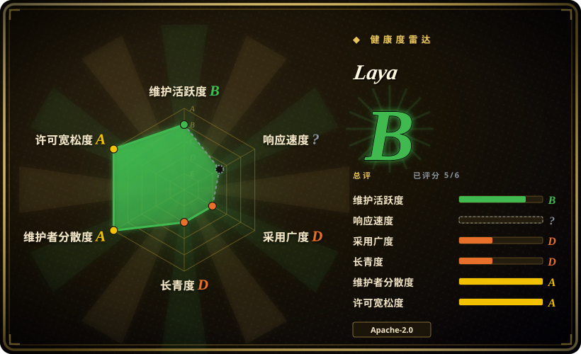
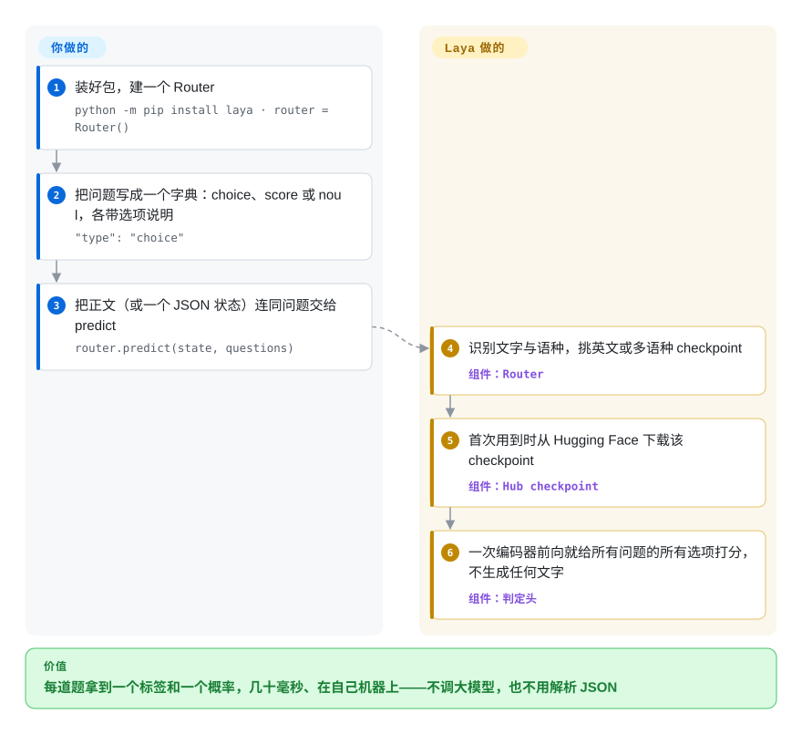

# Laya

流水线里每遇到一次“这张工单归哪个组、急不急、客户是不是要退订”，你都得调一次大模型，再去解析它吐回来的 JSON。Laya 用一个只读不写的小编码器模型，在你自己的机器上一次读完就回答这些带类型的问题：每道题给一个标签和一个概率。

## 何时使用

你在管客服台、审核队列或者一条 agent 流水线，同样几个判定每天重复几千次：这封邮件归 `billing`、`technical` 还是 `other`，紧急程度打三档，“用户有没有威胁要退订”答是或否。现在每一次都是一次聊天模型调用：回复偶尔变成 `{"department": "Billing dept."}` 这种不在你标签表里的东西，每次几百毫秒，客户原文还要发给第三方。你想要的是一个 Python 调用，返回 `billing` 加一个能设阈值的概率，笔记本 CPU 或一张 GPU 就能跑，工单是印地语还是西班牙语都无所谓。

当判定**规则化、高度重复，延迟或数据出境是硬约束，而且你愿意微调**时，想到 Laya。和本分类里其他自托管判定模型相比，它是又小又快的那一端：322M–421M 参数的编码器（作者在 T4 上测得每题几十毫秒），自带语种路由；Kev 是挂在聊天底座上的 0.8B–9B LoRA，Simple Jev 则直接复用一个完整聊天模型。和 Jev 这类托管判定 API 相比，取舍很尖锐，仓库自己也写明了：发布的 checkpoint 在它自己的 typed-decisions 基准上零样本接近随机，要在该基准的训练集上微调后才到 0.766；以 issue 形式提交的独立评测显示英文 checkpoint 落后 Jev 14–22 个点。选 Laya 是为了速度、本地运行和一个可以拿去专门化的 Apache-2.0 底座，不是为了开箱准确率。

## 怎么用起来

Laya 从不写句子。你交给它一个“状态”（任意文本，或者它会自动序列化的 JSON 对象），再加一个带类型的问题字典：`choice`（从几个标签里选一个，每个标签配一句说明）、`score`（在有序刻度上选一档）、`noul`（是或否，返回“是”的概率）。每个 checkpoint 是一个双向编码器——英文用 ModernBERT-large，100 多种语言用 mmBERT-base——外加一个判定头，用强化学习对着“严格适当评分规则”训练（这类奖励专门惩罚自信的错答）；正文和所有选项被拼进同一个输入，读一遍，每个选项都得到一个概率。好比一张选择题卷子一眼判完，而不是批改一篇作文。前面的 `Router` 用远不到一毫秒看输入的文字和语种，把它送去英文或多语种 checkpoint，第一次用到时从 Hugging Face 下载。你要做的是写问题（并把标签写好——README 记录了模型会盯着标签本身而不是正文的情况）、定阈值，在准确率要紧时用自己的判定数据微调；Laya 做的是路由、单次前向、温度缩放后的概率，以及外围的一整套入口（命令行、兼容 Jev 的 HTTP 服务、MCP 服务、LangChain／LlamaIndex／CrewAI 适配、ONNX 导出、TypeScript 移植版）。

<!-- flow-steps:begin (generated from flows/laya.json by tools/flow_card.py — do not edit) -->

流程文字版

1. **你**：装好包，建一个 Router — `python -m pip install laya · router = Router()`
2. **你**：把问题写成一个字典：choice、score 或 noul，各带选项说明 — `"type": "choice"`
3. **你**：把正文（或一个 JSON 状态）连同问题交给 predict — `router.predict(state, questions)`
4. **Laya**：识别文字与语种，挑英文或多语种 checkpoint — 组件：`Router`
5. **Laya**：首次用到时从 Hugging Face 下载该 checkpoint — 组件：`Hub checkpoint`
6. **Laya**：一次编码器前向就给所有问题的所有选项打分，不生成任何文字 — 组件：`判定头`

**价值**：每道题拿到一个标签和一个概率，几十毫秒、在自己机器上——不调大模型，也不用解析 JSON

<!-- flow-steps:end -->

## 何时不用

- **你要不训练就有好准确率。** README 自己的“Honest limits”写着：基础 checkpoint 在 typed-decisions 基准上只有 0.362／0.352，低于 0.461 的多数类基线，并直说它是“可专门化的快速底座，不是零样本判定引擎”。独立复测结论一致：九个套件上 0.686 对 Jev 的 0.907（issue #555，英文 checkpoint，v0.3.11），741 条按真实成交结果打分的美国联邦采购公告上 0.780 对 0.919（issue #450，在 v0.3.20 上复现）。没法微调就用托管的 Jev／TypeSafe System One，或者带结构化输出的前沿聊天模型。
- **你的标签很多。** 所有选项共享一个固定 token 预算（`laya` 192，其余 256），77 个标签的题每个标签只分到 3–4 个 token，Banking77 掉到 0.425，Jev 是 0.870。调大 `head_max_len` 或用 `predict_shortlist` 能缓解；要开箱支持 50 个以上标签，选 Jev，或者针对固定标签集用 SetFit 训一个小分类器。
- **否定句、打分题或英文 checkpoint 上的是非题决定结果。** 已记录的失败：否定的退订请求被判成 `cancel_account`（#377）；`laya` 上的 `noul` 会跟着 `true:`／`false:` 标签走而不看正文，对明显正面的输入自信地答“否”（#156）；`score` 是最弱的题型（SST-5 0.372）；`laya-multilingual` 几乎不选第一档分数（#131）。错判一次“否”代价很高时，用 [Kev](kev.zh.md) 或聊天模型，或者每道题都在自己数据上验证。
- **你希望概率不用额外工作就可信。** 两个 checkpoint 出厂都过度自信；`laya-multilingual` 根本没带拟合好的温度，英文 checkpoint 在高棉语上准确率 0.000 却有 95.2% 的置信度。拿不出留出数据来拟合温度，就别用 Laya 的原始置信度设闸门，改用公布了校准指标的服务（Jev）。
- **主要输入是中文（或其他弱势语种）的业务文本。** 维护者自己说中文是 `laya-multilingual` 的“已知弱项”（#479）；51 种语言里即便有路由也只评定 45 种可用。中文为主的判定，先微调（社区已有中文微调）或改用中文能力强的聊天模型。
- **你需要生成、抽取或工具调用。** Laya 只回答你写好的问题。改用 [vLLM](../llm-inference/serving-engines/vllm.zh.md) 或 [SGLang](../llm-inference/serving-engines/sglang.zh.md) 上带结构化输出的模型。
- **你今天就要一个稳定的依赖。** 项目十天大，这期间发了 29 个版本，路线图由一位作者掌握；锁定版本和 checkpoint 修订（`LAYA_REVISION`），或者再等等——见健康度一节。

## 横向对比

| 替代品 | 是否收录 | 我们的评价 | 取舍 |
|---|---|---|---|
| [Kev](kev.zh.md) | ✅ | 判定需要聊天模型的世界知识、又养得起 GPU 上的 0.8B–9B 模型时选 Kev；延迟和体量是首要约束、并且你会微调时选 Laya——它 322M–421M 的编码器几十毫秒出结果，CPU 也能跑。 | Kev 继承 Qwen3.5 底座的知识，还自带校准温度，代价是模型更大、服务一次只处理一个请求；Laya 轻得多，能路由 100 多种语言，但基础 checkpoint 在自家基准上零样本接近随机。 |
| [Simple Jev](simple-jev.zh.md) | ✅ | 你已经在服务一个开源聊天模型、只想要带类型判定接口而不引入新 checkpoint 时选 Simple Jev；想要一个专门训练过、有公开基准和微调 notebook 的判定模型，而不是一层服务外壳时选 Laya。 | Simple Jev 的判断力就是你那个聊天模型的判断力，不训练、也不给准确率；Laya 用通用性换来一个小而专的判定头、一个路由器和多得多的集成入口。 |
| Jev · TypeSafe System One（托管） | 非仓库 | 首次就要准、标签集很大（最多 255 个选项）比成本和数据出境更重要时选托管 API——issue 里的独立评测显示它领先英文 checkpoint 14–22 个点；文本必须留在本地、每次调用成本必须为零，或者你要微调自己的判定头时选 Laya。 | 托管、闭源权重、按 token 计费，对比自托管的 Apache-2.0 底座；Laya 的 `laya-serve` 说同一套 `POST /v1/systemone` 协议，客户端可以在两者间切换。它不是仓库，所以不收录。 |
| SetFit（huggingface/setfit） | 未收录 | 标签集固定、每类有几十条标注、想要一个完全归你所有的普通句向量分类器时选 SetFit；每次请求的问题都在变（新标签、是非题和打分题一次问完）、又不想为此重新训练时选 Laya。本批次按标签页收录，未新增此页。 | SetFit 是 Hugging Face 的少样本训练库，产出的是针对一套标签的分类器；Laya 在推理时接受任意带类型问题，但自己也要微调才准。 |
| GLiClass（knowledgator/GLiClass） | 未收录 | 只需要一个小编码器做零样本多标签文本分类时选 GLiClass；还需要打分题和是非题、逐题校准概率、语种路由和兼容 Jev 的服务时选 Laya。本批次按标签页收录，未新增此页。 | GLiClass 是更窄的分类库，有自己的模型家族；Laya 打包了三种题型和大量服务入口，代价是代码库年轻得多，准确率上的坑都写在仓库里。 |

## 技术栈

- **语言／运行时：** Python ≥ 3.10（分类器标注 3.10–3.13）；核心依赖 `torch>=2.0`、`transformers>=4.48`、`safetensors`、`huggingface_hub`、`numpy`（README 说明当前 `transformers` 5.x／`torch` 2.14 把下限定在 3.10）。
- **模型：** Hugging Face 上三个 checkpoint——`convaiinnovations/laya`（ModernBERT-large，421M，512 token）、`laya-multilingual`（mmBERT-base，322M，1,024 token，传 `max_len=8192` 可到 8,192）、`laya-typed-decisions`（ModernBERT-large，微调版）。权重不在仓库里。
- **入口：** `laya` 命令行、`laya-serve`（FastAPI + uvicorn，兼容 Jev 的 `POST /v1/systemone`）、`laya-mcp-server`（MCP stdio）、`laya-evals`；可选扩展有 LangChain／LangGraph、LlamaIndex、CrewAI、ONNX Runtime（`ONNXAgent`，可导出 INT8）、TileLang GPU 快速路径、基于 pydantic 的 schema 判定；`laya-ts` 是发布到 npm 的 TypeScript／Node／浏览器移植版。
- **打包／基础设施：** setuptools；Dockerfile 与多套 compose（CPU／CUDA／Spark），一个 Nix flake 附带 NixOS 的 `services.laya-serve` 模块；GitHub Actions 负责 CI、文档、评测、安全扫描与发布。
- **训练：** 一个 Kaggle 2×T4 的微调 notebook（RLCD——适当评分规则奖励加 GRPO 式策略梯度——外加按题型拟合温度）。

## 依赖

- **Python 3.10+ 与 PyTorch**（CPU、CUDA、Apple MPS 或 Intel XPU；装 Laya 之前先选好对应构建）。
- **首次使用需要访问 Hugging Face Hub** 下载 checkpoint（每个约 322M–421M 参数）；只做路由不需要下载。离线环境要预先拉好权重并指向本地目录。
- **硬件：** CPU 能跑；作者的数据来自 T4／RTX 4070。三个 checkpoint 全部预加载就要在内存里放三个模型（`LAYA_MAX_LOADED` 限制常驻数量，默认 2）。
- **可选：** 服务端要 FastAPI／uvicorn，MCP 服务要 `mcp`，还有各框架扩展、ONNX Runtime、TileLang。微调需要 GPU（notebook 在 2×T4 上约 4–5 小时）。
- **除 Hub 下载外不依赖数据库或外部服务。**

## 运维难度

**跑起来容易，调准要花功夫。** 当库用就是 `pip install laya` 加一次函数调用；当服务用就是 `laya-serve`，靠环境变量配置，有并发上限（`LAYA_MAX_CONCURRENT`，满了返回带 `Retry-After` 的 503）、`/health` 端点和可选的 bearer 鉴权。两个默认值要当心：`laya-serve` 绑定 `0.0.0.0:8000`，`LAYA_API_KEY` 不设就不鉴权，新部署出来就是一个所有网卡上都开着的端点。真正的活在上线之后：用留出数据拟合温度（多语种 checkpoint 出厂没有），对照已记录的失败模式逐题验证标签，决定要不要微调，并在一天好几个版本的节奏里锁定版本。

## 健康度与可持续性

- **维护——短时间内极其活跃（2026-09-28 核实）。** 2026-09-18 创建；十天里约 712 次提交、29 个 PyPI 版本（v0.3.21 发于 2026-09-27）。这是势头，不是维护记录，也意味着 API 和默认值还在变。
- **治理／巴士因子——一位作者，加一群真实贡献者。** `owner.type` 是 `User`（Nandakishor M，自述为 Convai Innovations 的 CEO；README 署名 Convai Innovations）。第一贡献者 269 次提交，第二 117 次，另有十多人合入过代码；有 `CONTRIBUTING.md` 和行为准则，但没有 `SECURITY.md`、`CODEOWNERS` 或治理文件。维护者几小时内回复 issue、关得也多，并表示与其他产品的对比不写进仓库文档。
- **背景与寿命——一家小公司在追一场竞赛。** 没有基金会，一家小公司加一个打赏链接。按 Lindy 先验这是高风险的情形：十天大，没有年龄可以依靠，而它存在的理由是追赶一个路线图不由它控制的托管竞品（Jev）。
- **采用——关注很响，也有真实使用。** 十天约 27.3k star、2.4k fork，Hugging Face 模型 4.2k 个赞，截至 2026-09-28 的一周 PyPI 下载约 15 万（pypistats，含 CI 和镜像）。这么快的 star 是热度信号，不是背书 `[推断]`。更有分量的使用证据：带可复现脚本的独立评测、社区移植（Apple MLX、华为昇腾、PHP 客户端）和一个中文微调。
- **风险——文档诚实，默认值偏弱。** 代码与权重都是 Apache-2.0，没有改许可证的历史。与 Jev 的差距写在仓库里，这说明作者坦诚，也是对产品的警告；有人报告 `main` 上 `security.yml` 的依赖 CVE 任务因可选扩展里的漏洞而失败（#645，未关闭）。

## 存疑（未验证）

- `[未验证]` 速度数据（T4 上每题 32.8 ms／39.5 ms，批量 7.2 ms／题）是作者自测；一次独立的单条测量在笔记本 RTX 2000 Ada 上 p50 约 290 ms（#450）。两者我都没有复跑。
- `[未验证]` README 里 Laya 对 Jev 的表（typed-decisions 0.766 对 0.727，ECE 0.081 对 0.246）把仓库内实测的 Laya 数据和第三方公布的 Jev 数据放在一起；按 README 自己的说法，样本量和提示词并不相同。
- `[未验证]` 两份独立评测（#555：0.686 对 0.907；#450：0.780 对 0.919）用的是英文 checkpoint，没开 Router、没微调，版本也较旧（0.3.11 和 0.3.3／0.3.20）；开启路由、按 `answer_confidence` 设闸门并微调后结果可能不同。
- `[未验证]` “100 多种语言”是宣称；公开的 51 语种 MASSIVE 扫描在路由下评定 45 种可用，其余没有基准。
- `[未验证]` 基础 RLCD 预训练代码（区别于微调 notebook）是否在仓库里没有确认；我只找到了 notebook 和评测脚本。
- `[推断]` 把十天约 27.3k star 解读为关注而非采用，是根据增长速度的推断；star 时间线没能取到（本环境下 stargazers API 对尝试过的每个仓库都返回 404，增长曲线未核对）。
- `[未验证]` PyPI 下载数（pypistats，2026-09-28）包含自动安装；Hugging Face API 对这些模型报的下载数是 0，所以模型拉取量未知。
- `[推断]` “项目主要是在追 Jev”来自它的定位（兼容 Jev 的服务、与 Jev 的对比图、作者 dev.to 文章的标题）；维护者在 `CONTRIBUTING.md` 里写的范围是“快速、本地、端侧的判定引擎”。
