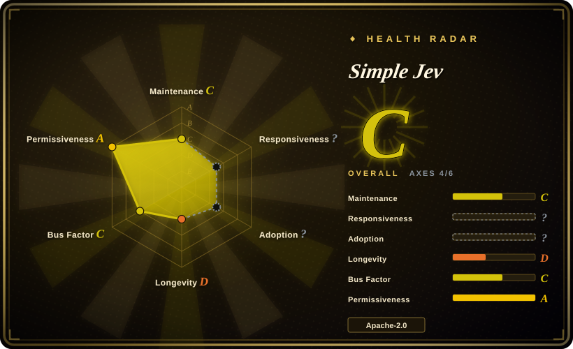
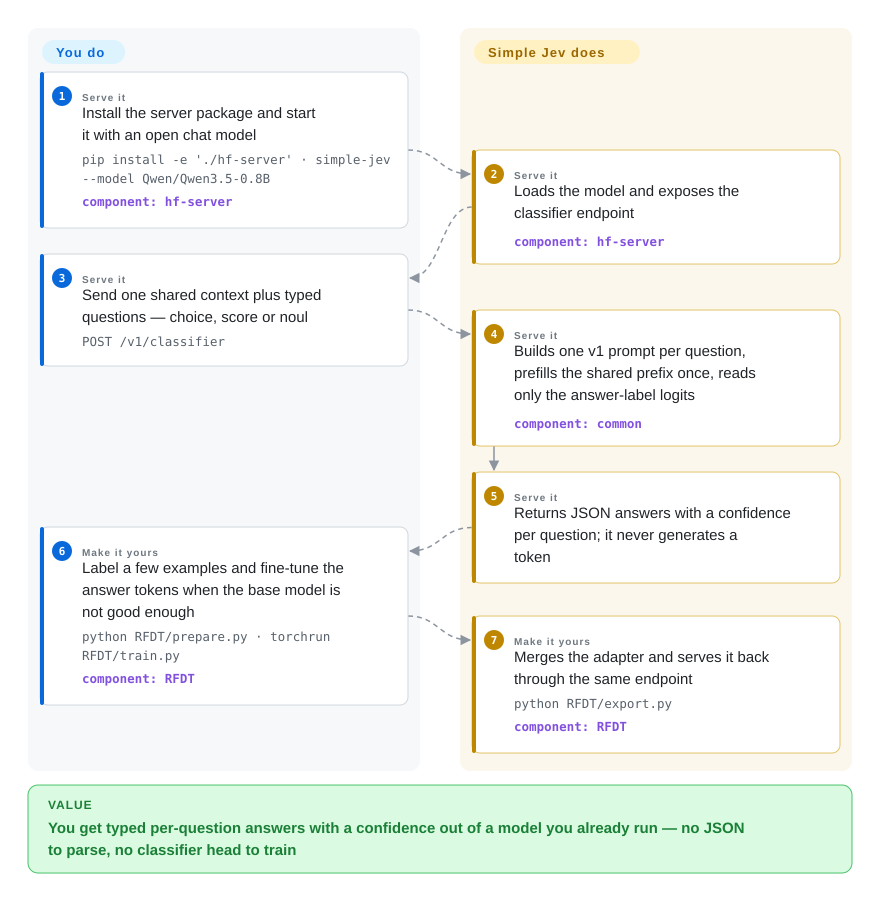

# Simple Jev

A single-file FastAPI + Transformers server that turns any compatible open chat model into a Jev-style `POST /v1/classifier` endpoint: send one shared context plus typed questions, get back JSON choices, rubric scores and truth judgments built from the model's next-token label probabilities — the server never generates a token.

## When to use

You are putting a triage layer in front of a queue — support tickets that need routing, documents that need a yes/no or a rubric score, a moderation step that has to hand ordinary application code a number instead of a paragraph. Prompting a general chat model for JSON has stopped being enough: you pay for generated tokens you throw away, you parse and repair the output, and the "confidence" you get is the probability of a sampled token rather than a distribution over your labels. You also already serve an open chat model — a Qwen or Gemma on your own GPU box, one of Featherless's models, or a small Qwen on a CPU — and training a decision model of your own is out of scope.

Simple Jev is the *shape* of the Jev decision API without the decision model. Point it at any compatible open chat model and it exposes `POST /v1/classifier` (alias `/v1/systemone`), where one request carries a shared context and 1–256 typed questions — `choice` among 2–50 candidates, `score` on an ordered 2–50 level rubric, `noul` for a bounded truth/support judgment. The response holds the answers plus a per-question distribution read straight off the model's next-token logits, with no decode step and `usage.output_tokens` of zero. Choose it over [Kev](kev.md) when the model is already in your stack and training is off the table; choose it over [vLLM](../llm-inference/serving-engines/vllm.md) or [SGLang](../llm-inference/serving-engines/sglang.md) constrained decoding when you want a typed decision contract rather than a generation endpoint wrapped in a grammar; choose it over the hosted TypeSafe services when the text must not leave your network. The deciding tradeoff: the interface and the prefill-only economics cost you nothing, but you inherit the base model's judgement and uncalibrated confidence — this repo publishes no accuracy numbers of its own.

## How it works

There is no classifier head and no generation loop: what ships is a contract plus a server that changes how an existing model is called. `common/prompt_builder.py` turns your request into one chat prompt per question — a shared system prefix, the context once, then the question — and the server applies the model's own chat template and tokenizes. Because every question's prompt begins with the same tokens, the server prefills that common prefix once with `use_cache=True`, then continues a copy of the KV cache per question up to that question's answer boundary; the only model output it reads is the next-token probability over the permitted answer labels (candidate letters, rubric indices, the digits 1–9 for `noul`). `common/response_scoring.py` converts those logits into a chosen candidate, an expected zero-based rubric index or a bounded rating in [0.01, 0.99], each with a confidence and a distribution, and the HTTP layer returns JSON. Your part is picking a model, starting the process and sending requests; theirs is prompt construction, prefix caching, label-tokenization checks and scoring. When the base model is not good enough, the bundled RFDT scripts retrain the answer-token logits on your own labels and merge the result into a model the same server can serve.

<!-- flow-steps:begin (generated from flows/simple-jev.json by tools/flow_card.py — do not edit) -->

Text version of the flow

1. **You** (Serve it): Install the server package and start it with an open chat model — `pip install -e './hf-server' · simple-jev --model Qwen/Qwen3.5-0.8B` — component: `hf-server`
2. **Simple Jev** (Serve it): Loads the model and exposes the classifier endpoint — component: `hf-server`
3. **You** (Serve it): Send one shared context plus typed questions — choice, score or noul — `POST /v1/classifier`
4. **Simple Jev** (Serve it): Builds one v1 prompt per question, prefills the shared prefix once, reads only the answer-label logits — component: `common`
5. **Simple Jev** (Serve it): Returns JSON answers with a confidence per question; it never generates a token
6. **You** (Make it yours): Label a few examples and fine-tune the answer tokens when the base model is not good enough — `python RFDT/prepare.py · torchrun RFDT/train.py` — component: `RFDT`
7. **Simple Jev** (Make it yours): Merges the adapter and serves it back through the same endpoint — `python RFDT/export.py` — component: `RFDT`

**Value**: You get typed per-question answers with a confidence out of a model you already run — no JSON to parse, no classifier head to train

<!-- flow-steps:end -->

## When NOT to use

- **You need accuracy or calibration you can defend.** The repo ships an evaluation harness plus a SemIf-derived 144-row fixture and a 102-row TypeSafe subset builder, but states plainly that no model evaluations have been run for it, and that scores and confidence are not calibrated. If you must square a published accuracy/coverage number against an error budget, use [Kev](kev.md) or a hosted decision API instead — here the quality is whatever the base model happens to give you, and you have to measure it yourself.
- **The decisions turn on world knowledge or nuance.** Simple Jev adds nothing to the model; a 0.8B base still answers like a 0.8B base. Fine for "apply this policy to this text", wrong for encyclopedic questions — use a frontier chat API or a much larger base, and follow the repo's own advice to evaluate answer quality on your own task separately from validating its pipeline.
- **You need generated text, tool calls or multimodal input.** The server is text only: images, audio, video and tool calls are rejected, and completion settings such as `temperature`, `max_tokens` and `stream` are ignored. Use [vLLM](../llm-inference/serving-engines/vllm.md), [SGLang](../llm-inference/serving-engines/sglang.md) or [Text Generation Inference](../llm-inference/serving-engines/text-generation-inference.md) when the same endpoint must also summarise, draft or call tools.
- **You need cross-caller throughput, auth or multi-tenancy.** Requests execute serially against the loaded model, parallelism is only within one request, the prefix cache does not persist between requests, and a full admission queue returns 429. The request's `model` must exactly match the one process's `--model`, so a second model means a second server; there is no authentication on the bundled endpoint. Reach for a real serving engine when those are your requirements.
- **You want zero operations.** The public Featherless demo API (no key, ~2k-token context, ~2 RPS) and the hosted TypeSafe System One exist exactly so nobody runs weights. Self-hosting here means Python 3.12+, a hardware-specific PyTorch build, the weights and the GPU/CPU budget.
- **Your model does not fit the contract.** It needs a chat template, a KV cache that Transformers can copy and `reorder_cache`, and answer labels that each extend the rendered prompt by exactly one distinct token; the server checks label tokenization and the READMEs say compatibility with every open model is not guaranteed. Test your model before betting on it.
- **The footprint has to be small.** Even the CPU route is a full PyTorch model in memory; for a tens-of-megabytes on-device extractor use [Needle](../on-device-ml/needle.md).
- **You need production stability today.** Four days old, version 0.1.0, no tagged release, no CI over the Python test suites, and a single-vendor roadmap — pinning and vendoring a commit is the honest default for now.

## Comparison

| Alternative | In index | Our verdict | Tradeoff |
|---|---|---|---|
| [Kev](kev.md) | ✅ | Choose Kev when you want a *trained* decision model with the author's accuracy, Brier and coverage numbers to budget against; choose Simple Jev when the model is already in your stack, training is off the table, and you would rather have the Jev request contract than a new checkpoint — Simple Jev carries no training step and no accuracy claims of its own. | Kev buys calibration-by-construction and a releasing checkpoint at the cost of adopting a specific 0.8B–9B family you must serve and update; Simple Jev reuses any compatible model you already run and inherits that model's judgement and uncalibrated confidence. |
| [vLLM](../llm-inference/serving-engines/vllm.md) | ✅ | Choose vLLM when one endpoint must serve many callers, stream tokens and answer free-form questions; choose Simple Jev when the entire job is repeated typed decisions and you want no decode step and a typed JSON contract instead of a grammar-wrapped completion. | vLLM gives you paged KV cache, continuous batching, an OpenAI-compatible surface and one serving path for everything, paid for with per-decision prompt engineering and output parsing; Simple Jev gives a narrow typed endpoint and zero output tokens, but only for `choice`/`score`/`noul` on one model per process. |
| [SGLang](../llm-inference/serving-engines/sglang.md) | ✅ | Choose SGLang when you want constrained/structured *generation* as part of a larger agent workload with RadixAttention prefix reuse; choose Simple Jev when the output is a label and a distribution rather than text, and a 20-line request schema beats a decoding grammar. | SGLang's structured-generation kernels and prefix caching generalise to tools and JSON-mode; Simple Jev is the specialised case — cheaper per decision and harder to misuse, but it cannot say anything you did not ask for. |
| TypeSafe System One · Jev (hosted) | 未收录 | Choose the hosted service when a network round trip is acceptable and you want no weights, no GPU and per-call pricing; choose Simple Jev when the text must stay on your hardware or you want to benchmark the same request contract against your own models. | Same request/response shape and the same scoring vocabulary (`choice` / `score` / `noul`), opposite operating model: managed inference versus a local process with no auth, no cross-request cache and your own upgrade treadmill. Neither is a repository, so neither is indexed. |
| [Needle](../on-device-ml/needle.md) | ✅ | Choose Needle when the classifier must run on-device in tens of megabytes with grammar-constrained decoding and a confidence score; choose Simple Jev when the decisions want a full open model's judgement and the hardware budget is a GPU or a server CPU. | Three orders of magnitude of footprint apart: Needle is a 2-bit on-device model with its own tool-call/extraction grammar, Simple Jev is a serving layer over whatever HF model you point it at — more capability, far more machine. |

## Tech stack

- **Language/runtime:** Python ≥ 3.12. One installable package, `hf-server` (distribution name `simple-jev`), exposing both the console script `simple-jev` and `python -m hf_server`.
- **HTTP layer:** FastAPI + uvicorn, Pydantic v2 request/response models, NumPy. `common/request_schema.py` owns `ClassifierRequest` and question/option validation; unknown top-level fields are ignored, unknown question/option fields are rejected (422).
- **Model layer:** PyTorch ≥ 2.6, `transformers >= 5.16.1, < 6`, `accelerate >= 1`. The reference backend is a single-file Transformers implementation; an optional `laya` backend (`laya==0.3.4`, `USE_TF=0`) serves `convaiinnovations/laya` checkpoints through the same endpoint using that SDK's own encoder format.
- **Shared contract:** `common/` is plain Python (no package build) with `prompt_builder.py`, `response_scoring.py` and `PROMPT_STRUCTURE_V1.md` — a language-independent v1 spec so a TypeScript or other implementation can produce identical classifier text and label mappings. `prepare_prompt(request, version="v1")` is the integration boundary; template versions are fixed rather than per-request switches.
- **Training:** `RFDT/` (prepare → teacher labeling → train → export) reuses the server's `PromptCompiler`, trains selected answer-token logits with cross-entropy/KL, supports full-weight or LoRA via PEFT and `torchrun` data-parallel training, and merges adapters back into a servable model.
- **Demo/site:** `demos/jevpilot/` (a three.js driving simulator that calls the endpoint as a planner, Node/Vite + `node:test`) and `website/` (static site deployed to Cloudflare Pages). A third-party origin (`demos/jevpilot/UPSTREAM_COMMIT`) is vendored for the demo.

## Dependencies

- **Python 3.12+** and a hardware-appropriate PyTorch build installed *before* the server package (CPU, CUDA or ROCm; the README's validation run notes direct MPS loading of Qwen crashed on macOS). `pip install -e './hf-server'`; add `[test]` for pytest/pytest-asyncio/httpx.
- **Model weights** — any compatible Hugging Face chat model, downloaded on first run or passed as a local directory. Nothing but two logos and demo assets ship in the repo.
- **Hardware:** the documented CPU example is Qwen3.5-0.8B in float32; the documented GPU example is Gemma 4 26B-A4B in bf16 on CUDA, and the README warns that sparse expert activation does not shrink the memory needed for full weights, KV cache and buffers.
- **Fine-tuning (RFDT):** PEFT for LoRA, `torchrun` for multi-GPU (the documented example is 4× NVIDIA), and — for teacher labeling of unlabeled records — an OpenAI-compatible `/chat/completions` endpoint plus an API key in an environment variable. The scripts do not provision GPUs.
- **No database, queue or cluster:** one process holding one model. The optional Laya path needs its own SDK and `USE_TF=0`.

## Ops difficulty

**Low to serve, medium to train — with a pre-1.0 edge.** Serving is one `pip install` plus one command; the server gives you `/health`, generated `/docs`, readable 422 validation errors and 429 when its queue is full, and there is no database or scheduler to run. The day-2 caveats are the unauthenticated endpoint, serial request execution, a per-request-only prefix cache, and the one-model-per-process rule (the request's `model` must match `--model` exactly), so any real traffic needs a serving engine or gateway in front — and a reverse proxy is also where you would add the auth that does not exist here. Memory is the other lever: an oversized model fails at load, and `--max-model-len` / `--max-batch-size` / `--max-batch-tokens` are your only knobs. Because nothing runs the Python test suites in CI, `python -m pytest -c hf-server/pyproject.toml common/tests hf-server/tests -q` is on you before an upgrade. Training with RFDT is a real job: group-aware splits, a teacher endpoint or your own labels, GPU memory for full prompt forwards (vocabulary logits are materialized at all positions), and an export that must use the exact base model and revision that was trained.

## Health & viability

- **Maintenance — very active, over a four-day window (verified 2026-09-22).** Created 2026-09-18, 22 commits, last push 2026-09-21T06:25:47Z. There are no GitHub releases and no tags, so "v0.1.0" exists only in `hf-server/pyproject.toml`; the cadence is real but there is no maintenance record to read yet.
- **Governance / bus factor — vendor-owned, one person doing the work.** The repo belongs to the `featherless-ai` GitHub Organization (Featherless AI sells hosted open-model inference), but the GitHub contributors API returns exactly two logins (PicoCreator 19 commits, IsaacGemal 2) for the 22 total — the effective bus factor is one. There is no `CONTRIBUTING`, `SECURITY`, `CODEOWNERS`, `GOVERNANCE` or `CHANGELOG` in the tree, and no stated contribution process `[推断]`.
- **Backing & longevity — a company, with a company's incentives.** Unlike a single-maintainer project, there is a real vendor behind it, and the repo doubles as the front door to its hosted platform: the README points at a free public demo API and at paid Featherless plans, and says hosted fine-tuned-model serving is "part of that upcoming rollout". Apache-2.0 means you keep the fork if priorities change; whether the self-hosted server stays first-class is a bet on the vendor's roadmap `[推断]`. On the Lindy prior this is the young-and-unproven case — four days is not a prior, it is a hope.
- **Adoption — attention, plus a live public surface.** 456 stars and 50 forks in four days (2026-09-22), and a genuinely usable no-auth demo API that I verified returns six served classifier models with HTTP 200 without credentials (2026-09-22: `Qwen3.6-35B-A3B-classifier`, `Qwen3.8-27B-classifier`, `gemma-4-26B-A4B-classifier`, three `RWKV-*-classifier`). The stronger evidence of reuse is methodological: `eval/` is an endpoint-agnostic runner pinned to a third-party fixture (TheoLeeCJ/SemIf) and is written to also point at a TypeSafe System One URL, so the project is building itself a *shared* benchmark rather than only self-reporting.
- **Risk flags — pre-1.0, no CI for the Python packages, no calibration claim.** The only workflow is `.github/workflows/deploy-website.yml` (website build + `node --test` demo checks) — `common/tests`, `hf-server/tests`, `RFDT/tests` and `eval` are not in CI, verified from the workflow file. The README carries experimental features explicitly flagged as such (`--rope-factor` linear interpolation, the Laya 2× RoPE mode) and states that scores and confidence are not calibrated. External evaluation data is partly not redistributable: the SemIf files are vendored under MIT with a pinned revision, while the TypeSafe case files must be fetched by the user because their terms are not supplied.

## Caveats (unverified)

- `[未验证]` **There are no accuracy, calibration or coverage numbers for this project anywhere.** `eval/README.md` states that no model evaluations have been run for it; the evaluation harness and fixtures exist but the results do not. Any quality claim for a given base model must be measured by you.
- `[未验证]` "Turn any open model into a classifier" is bounded by the project's own compatibility list — a chat template, a copyable/`reorder_cache`-capable Transformers cache, and answer labels that each add exactly one distinct token. I did not run the server against any model, so I cannot say how wide that set really is.
- `[未验证]` The statement that scores and confidence are **not** calibrated probabilities is the project's own; I did not measure calibration, and the RFDT path is also explicit that score/Noul MAE and calibration metrics are not yet implemented.
- `[未验证]` The recorded integration validation (50 common/server tests, 52 with the Laya extension; Qwen3.5-0.8B and `convaiinnovations/laya` returning HTTP 200 on CPU; the small Qwen answering the example Noul question *incorrectly*) is the author's macOS run on 2026-09-20 and was not reproduced here.
- `[未验证]` The public demo API's limits (no key, ~2k-token context, ~2 RPS) are README claims. I verified only that `GET /v1/models` returns HTTP 200 with six model IDs and no credentials (2026-09-22); I did not exercise `/v1/classifier` against it.
- `[推断]` Reading the free demo API plus the announced hosted fine-tuned-model serving as an open-core funnel is an inference from the README's own wording, not a documented strategy.
- `[推断]` That vendor ownership improves longevity here is a prior, not evidence: the project is four days old and has no release to point at.
- `[未验证]` Star/fork/issue counts (456 / 50 / 1, 2026-09-22) are a snapshot taken four days after creation; they bound adoption poorly in both directions.
- `[未验证]` The SemIf-derived baseline is described upstream as synthetic and model-reviewed rather than human-adjudicated, and the TypeSafe subset covers 20 of its 711 cases — so even once run, these fixtures are a baseline rather than a verdict.
- `[未验证]` Whether the Laya backend, the experimental RoPE interpolation, or the RFDT multi-GPU path hold up on other hardware was not checked; the RFDT README itself notes multi-GPU and model-family compatibility "should be checked on the intended hardware".
