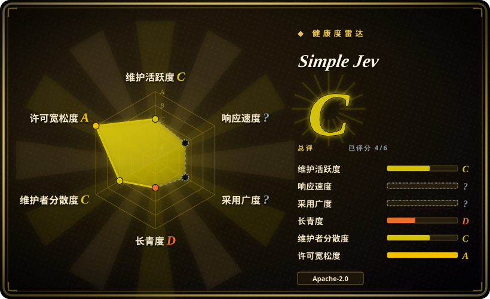
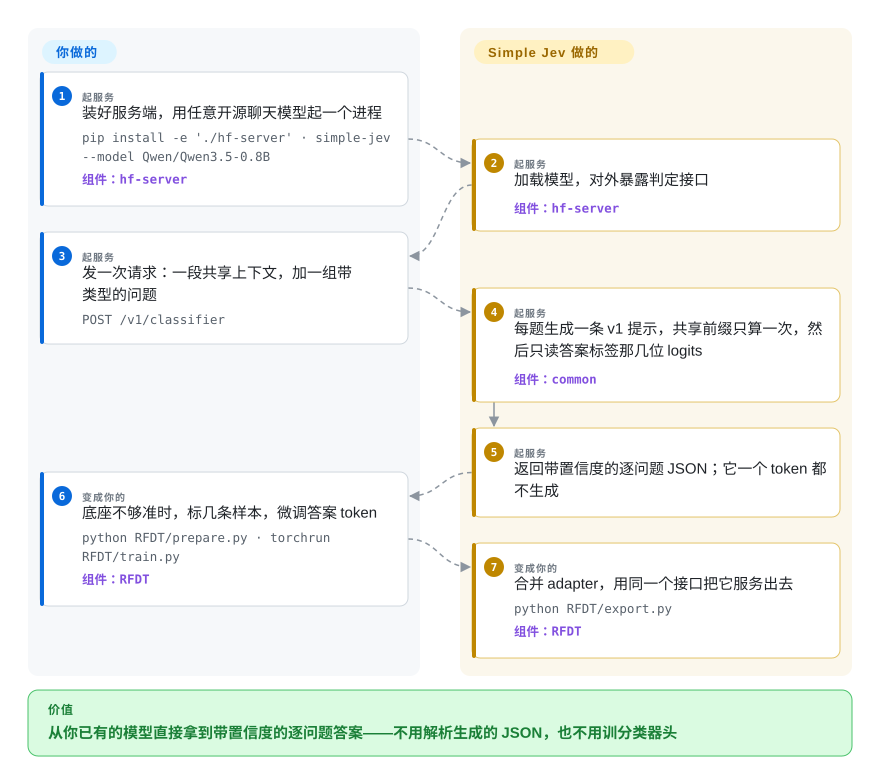

# Simple Jev

一个单文件的 FastAPI + Transformers 服务：把任意兼容的开源聊天模型变成 Jev 风格的 `POST /v1/classifier` 接口——发一段共享上下文加一组带类型的问题，返回由模型下一 token 标签概率算出的 JSON 选择、评分与真值判断；这个服务一个 token 都不生成。

## 何时使用

你正在给一条队列前面加一层分诊——工单要路由到正确的团队、文档要判是/否或打一个量表分、审核环节必须把数字而不是一段话交给普通业务代码。让通用聊天模型直接吐 JSON 已经开始不够用：你为用不上的生成 token 付费，还要解析并修补输出，而拿到的那点“置信度”只是某个采样 token 的概率，不是你标签上的分布。你手上本来就有开源聊天模型——自建 GPU 上的 Qwen 或 Gemma、Featherless 的模型、或者 CPU 上跑的小 Qwen——而自己训一个判定模型不在计划内。

Simple Jev 是 Jev 判定 API 的**形状**，但不带判定模型。把它指向任意兼容的开源聊天模型，它就暴露 `POST /v1/classifier`（别名 `/v1/systemone`）：一次请求带一段共享上下文和 1–256 个带类型的问题——`choice` 在 2–50 个候选里选、`score` 打 2–50 级有序量表、`noul` 给一个有界真值/支持度判断。响应给出你要的答案，外加逐问题的概率分布，直接读模型下一 token 的 logits，没有解码步骤，`usage.output_tokens` 为零。模型已经在你栈里、且不打算训练时选它而不是 [Kev](kev.zh.md)；想要一份带类型的判定契约、而不是套着语法的生成接口时选它而不是 [vLLM](../llm-inference/serving-engines/vllm.zh.md) 或 [SGLang](../llm-inference/serving-engines/sglang.zh.md) 的约束解码；文本不许出内网时选它而不是托管版 TypeSafe 服务。决定性的取舍是：接口和“只做 prefill”的成本优势是白拿的，但你同时继承底座模型的判断力和未校准的置信度——这个仓库自己没有任何准确率数字。

## 怎么用起来

这里没有分类头，也没有生成循环：交付的是一份契约加一个服务，它改变的是“已有模型怎么被调用”。`common/prompt_builder.py` 把你的请求变成每个问题一条聊天提示——共享的系统前缀、只放一次的上下文、然后是问题——服务端套用模型自己的 chat template 并分词。因为每个问题的提示开头都是同一串 token，服务端先用 `use_cache=True` 把这段公共前缀算一次，再为每个问题复制一份 KV 缓存继续算到该问题的答案边界；它读的唯一模型输出，就是允许答案标签上的下一 token 概率（候选字母、量表序号、`noul` 用的 1–9 数字）。`common/response_scoring.py` 把这些 logits 变成选中候选、期望的零基量表序号、或落在 [0.01, 0.99] 的有界评分，各带一个置信度和一个分布，HTTP 层再组装成 JSON。你要做的是选模型、起进程、发请求；它负责提示构造、前缀缓存、标签分词检查和打分。底座不够准时，随仓库附带的 RFDT 脚本用你自己的标注重训答案 token，并合并回一个同一个服务能直接跑的模型。

<!-- flow-steps:begin (generated from flows/simple-jev.json by tools/flow_card.py — do not edit) -->

流程文字版

1. **你**（起服务）：装好服务端，用任意开源聊天模型起一个进程 — `pip install -e './hf-server' · simple-jev --model Qwen/Qwen3.5-0.8B` — 组件：`hf-server`
2. **Simple Jev**（起服务）：加载模型，对外暴露判定接口 — 组件：`hf-server`
3. **你**（起服务）：发一次请求：一段共享上下文，加一组带类型的问题 — `POST /v1/classifier`
4. **Simple Jev**（起服务）：每题生成一条 v1 提示，共享前缀只算一次，然后只读答案标签那几位 logits — 组件：`common`
5. **Simple Jev**（起服务）：返回带置信度的逐问题 JSON；它一个 token 都不生成
6. **你**（变成你的）：底座不够准时，标几条样本，微调答案 token — `python RFDT/prepare.py · torchrun RFDT/train.py` — 组件：`RFDT`
7. **Simple Jev**（变成你的）：合并 adapter，用同一个接口把它服务出去 — `python RFDT/export.py` — 组件：`RFDT`

**价值**：从你已有的模型直接拿到带置信度的逐问题答案——不用解析生成的 JSON，也不用训分类器头

<!-- flow-steps:end -->

## 何时不用

- **你需要能拿得出手的准确率或校准。** 仓库里带了评测框架、一份源自 SemIf 的 144 行 fixture 和 102 行 TypeSafe 子集的构建脚本，但它明说这部分没跑过任何模型评测，也说分数和置信度未校准。要把公开的准确率/覆盖率拿去对误差预算，请改用 [Kev](kev.zh.md) 或托管判定 API——这里的质量等于底座模型碰巧给出的质量，且必须你自己测。
- **判定依赖世界知识或细微语义。** Simple Jev 不给模型加任何东西；0.8B 底座还是 0.8B 底座的回答水平。适合“把这条规则套到这段文本上”，不适合百科式问题——那就用前沿聊天 API 或大得多的底座，并按仓库自己的建议，把答案质量评测与“服务管线是否正常”分开做。
- **你需要生成文本、工具调用或多模态输入。** 服务只吃文本：图像、音频、视频和工具调用被拒绝，`temperature`、`max_tokens`、`stream` 这类补全参数被忽略。同一个接口还要摘要、起草或调工具时，用 [vLLM](../llm-inference/serving-engines/vllm.zh.md)、[SGLang](../llm-inference/serving-engines/sglang.zh.md) 或 [Text Generation Inference](../llm-inference/serving-engines/text-generation-inference.zh.md)。
- **你需要跨调用方吞吐、鉴权或多租户。** 请求对已加载模型串行执行，并行只发生在单个请求内部，前缀缓存不跨请求保留，准入队列满了返回 429。请求里的 `model` 必须与那一个进程的 `--model` 完全一致，第二个模型就要第二个服务；自带接口没有鉴权。这些是你的硬要求时，选一个真正的服务引擎。
- **你想零运维。** Featherless 的公开 demo API（免 key、约 2k token 上下文、约 2 RPS）和托管版 TypeSafe System One 存在的意义就是不用自己跑权重。自托管在这里意味着 Python 3.12+、一份对应硬件的 PyTorch 构建、模型权重以及 GPU/CPU 预算。
- **你的模型不符合契约。** 它需要有 chat template、Transformers 可复制且支持 `reorder_cache` 的 KV 缓存，以及每个标签都能让渲染后提示恰好延长一个不同 token。服务会检查标签分词，README 也明说“不保证对每个开源模型都兼容”。下注前先拿你的模型测一遍。
- **部署体积必须很小。** 即便是 CPU 路线，内存里也是一个完整的 PyTorch 模型；要几十兆的端侧抽取器请用 [Needle](../on-device-ml/needle.zh.md)。
- **今天就要生产级稳定性。** 项目四天大、版本 0.1.0、没有 tag 过的 release、Python 测试集不在 CI 里、路线图由单一厂商决定——现阶段诚实的默认做法是钉住某个 commit 并把代码 vendor 进来。

## 横向对比

| 替代品 | 是否收录 | 我们的评价 | 取舍 |
|---|---|---|---|
| [Kev](kev.zh.md) | ✅ | 想要一个**训练过的**判定模型、并拿作者的准确率/Brier/覆盖率去对预算时选 Kev；模型已经在你栈里、训练不在选项内、且你更想要 Jev 那套请求契约而不是一个新 checkpoint 时选 Simple Jev——Simple Jev 没有训练环节，也没有自己的准确率宣称。 | Kev 换来“构造上就校准”和一个可直接发布的 checkpoint，代价是采用特定的 0.8B–9B 家族并持续服务与更新；Simple Jev 复用你已经在跑的任何兼容模型，代价是继承它的判断力和未校准的置信度。 |
| [vLLM](../llm-inference/serving-engines/vllm.zh.md) | ✅ | 一个接口要服务很多调用方、要流式、要答自由文本时选 vLLM；整个活儿就是反复的带类型判定、你想要没有解码步骤、并要一份带类型的 JSON 契约而不是套语法的补全时选 Simple Jev。 | vLLM 给你分页 KV 缓存、连续批处理、OpenAI 兼容面，一套服务路径通吃，代价是每个判定都要写 prompt 并解析输出；Simple Jev 给一个窄的带类型接口和零输出 token，但只支持 `choice`/`score`/`noul`，且一个进程一个模型。 |
| [SGLang](../llm-inference/serving-engines/sglang.zh.md) | ✅ | 需要在更大的 agent 负载里用约束/结构化**生成**并复用 RadixAttention 前缀时选 SGLang；输出本身就是一个标签加一个分布、二十行请求 schema 比一套解码语法更省事时选 Simple Jev。 | SGLang 的结构化生成 kernel 与前缀缓存能泛化到工具调用和 JSON 模式；Simple Jev 是它的特化情形——单次判定更省、更不容易用错，但它说不出你没问的话。 |
| TypeSafe System One · Jev（托管） | 未收录 | 一次网络往返可接受、想要零权重零 GPU 按调用付费时选托管服务；文本必须留在自己硬件上、或想拿同一份请求契约去对自己的模型做基准时选 Simple Jev。 | 请求/响应形状和打分词汇一致（`choice` / `score` / `noul`），运营模型相反：托管推理对上一个本地进程——没有鉴权、没有跨请求缓存、升级全靠自己。两者都不是仓库，所以都不收录。 |
| [Needle](../on-device-ml/needle.zh.md) | ✅ | 分类器必须端侧跑、体积几十兆、用语法约束解码并给出一个置信度时选 Needle；判定需要完整开源模型的判断力、硬件预算是一块 GPU 或一台服务器 CPU 时选 Simple Jev。 | 体积差三个数量级：Needle 是 2-bit 端侧模型，自带工具调用/抽取语法；Simple Jev 是你指向哪个 HF 模型就服务哪个模型的一层壳——能力更强，机器开销也大得多。 |

## 技术栈

- **语言/运行时：** Python ≥ 3.12。一个可安装包 `hf-server`（发行名 `simple-jev`），同时提供控制台命令 `simple-jev` 和 `python -m hf_server`。
- **HTTP 层：** FastAPI + uvicorn、Pydantic v2 请求/响应模型、NumPy。`common/request_schema.py` 持有 `ClassifierRequest` 与 question/option 校验；顶层未知字段被忽略，question/option 内的未知字段被拒绝（422）。
- **模型层：** PyTorch ≥ 2.6、`transformers >= 5.16.1, < 6`、`accelerate >= 1`。参考后端是单文件的 Transformers 实现；另有可选 `laya` 后端（`laya==0.3.4`，`USE_TF=0`），用该 SDK 自己的编码格式通过同一接口服务 `convaiinnovations/laya` 系列 checkpoint。
- **共享契约：** `common/` 是纯 Python（无需构建包），含 `prompt_builder.py`、`response_scoring.py` 和 `PROMPT_STRUCTURE_V1.md`——一份语言无关的 v1 规范，让 TypeScript 或其他实现能产出完全一致的判定文本与标签映射。`prepare_prompt(request, version="v1")` 是集成边界；模板版本是固定的，不做逐请求开关。
- **训练：** `RFDT/`（准备 → 教师标注 → 训练 → 导出）复用服务端的 `PromptCompiler`，用交叉熵/KL 直接训选中的答案 token，支持全权重或经 PEFT 的 LoRA 以及 `torchrun` 数据并行，并把 adapter 合并回可服务的模型。
- **演示/站点：** `demos/jevpilot/`（一个 three.js 驾驶模拟器，把该接口当规划器调用，Node/Vite + `node:test`）和 `website/`（静态站，部署到 Cloudflare Pages）。demo 里 vendor 了一份第三方来源（见 `demos/jevpilot/UPSTREAM_COMMIT`）。

## 依赖

- **Python 3.12+**，并且要在装服务端包之前先装对应硬件的 PyTorch 构建（CPU、CUDA 或 ROCm；README 的验证记录指出在 macOS 上直接用 MPS 加载 Qwen 会原生崩溃）。安装命令是 `pip install -e './hf-server'`；要 pytest/pytest-asyncio/httpx 就加 `[test]`。
- **模型权重**——任意兼容的 Hugging Face 聊天模型，首次运行下载或直接传本地目录。仓库里除两个 logo 和演示素材外不含任何权重。
- **硬件：** 文档里的 CPU 例子是 Qwen3.5-0.8B 的 float32；GPU 例子是 CUDA 上 bf16 的 Gemma 4 26B-A4B，README 提醒稀疏专家激活并不意味着只有激活的专家占内存，全量权重、KV 缓存和推理缓冲都要留空间。
- **微调（RFDT）：** LoRA 需要 PEFT，多 GPU 需要 `torchrun`（文档例子是 4 张 NVIDIA 卡）；给无标注记录做教师标注时，需要一个 OpenAI 兼容的 `/chat/completions` 端点和放在环境变量里的 API key。脚本本身不负责提供 GPU。
- **没有数据库、队列或集群：** 一个进程持有、一个模型。可选的 Laya 路线要装它自己的 SDK 并设 `USE_TF=0`。

## 运维难度

**服务起来是低，训练是中——外加一条 pre-1.0 的边。** 起服务就是一次 `pip install` 加一条命令；服务自带 `/health`、生成的 `/docs`、可读的 422 校验错误，队列满时返回 429，没有数据库也没有调度器要跑。第二天的坑在于：接口无鉴权、请求串行执行、前缀缓存只在单请求内有效、一个进程只服务一个模型（请求里的 `model` 必须与 `--model` 完全一致），所以任何真实流量前面都得放一个服务引擎或网关——顺带也是你补上鉴权的地方。内存是另一个杠杆：模型太大在加载时就失败，`--max-model-len` / `--max-batch-size` / `--max-batch-tokens` 是你仅有的旋钮。因为 CI 不跑 Python 测试集，升级前跑 `python -m pytest -c hf-server/pyproject.toml common/tests hf-server/tests -q` 是你自己的事。用 RFDT 训练是一件正经活儿：按组切分数据、一个教师端点或自己的标注、全提示前向所需的 GPU 内存（词表 logits 在所有位置都会被物化），以及导出时必须用训练时那个精确的底座模型和 revision。

## 健康度与可持续性

- **维护——非常活跃，但窗口只有四天（2026-09-22 核实）。** 2026-09-18 创建，22 个 commit，最后一次 push 是 2026-09-21T06:25:47Z。没有 GitHub release 也没有 tag，所以“v0.1.0”只存在于 `hf-server/pyproject.toml`；节奏是真的，但目前还读不出维护记录。
- **治理 / bus factor——厂商所有，干活的是一个人。** 仓库属于 `featherless-ai` 这个 GitHub Organization（Featherless AI，卖托管开源模型推理），但 GitHub 贡献者 API 对这 22 个 commit 只返回两个账号（PicoCreator 19、IsaacGemal 2），实际 bus factor 是 1。树里没有 `CONTRIBUTING`、`SECURITY`、`CODEOWNERS`、`GOVERNANCE` 或 `CHANGELOG`，也没有说明贡献流程 `[推断]`。
- **背书与长寿性——背后是一家公司，也就带着公司的动机。** 与单人项目不同，这里确实有一个厂商在背后，同时这个仓库充当其托管平台的门面：README 指向一个免费公开 demo API 和 Featherless 的付费套餐，并说托管的微调模型服务是“即将到来的发布的一部分”。Apache-2.0 意味着优先级变了你还能保住 fork；但自托管服务会不会一直是一等公民，是对厂商路线图的下注 `[推断]`。按 Lindy 先验，这正是“年轻且未经验证”的那一类——四天不是先验，是期待。
- **采用度——有热度，也有一个活的公开面。** 四天里 456 stars、50 forks（2026-09-22），而且真有一个免鉴权的公开 demo API：我在 2026-09-22 核实它不需要凭据就返回 HTTP 200 和六个分类器模型（`Qwen3.6-35B-A3B-classifier`、`Qwen3.8-27B-classifier`、`gemma-4-26B-A4B-classifier`，以及三个 `RWKV-*-classifier`）。更强的复用证据在方法论上：`eval/` 是端点无关的 runner，钉在第三方 fixture（TheoLeeCJ/SemIf）上，并且写成也能指向 TypeSafe System One 的 URL——也就是说这个项目在给自己造一份**共享**基准，而不只是自报成绩。
- **风险标记——pre-1.0、Python 包没有 CI、不承诺校准。** 唯一的 workflow 是 `.github/workflows/deploy-website.yml`（构建站点 + `node --test` 跑 demo 检查）——从 workflow 文件核实，`common/tests`、`hf-server/tests`、`RFDT/tests` 和 `eval` 都不在 CI 里。README 把实验性功能明确标注为实验（`--rope-factor` 线性插值、Laya 的 2× RoPE 模式），并说明分数与置信度未校准。外部评测数据有一部分不可再分发：SemIf 的文件以 MIT 加钉住的 revision 被 vendor 进来，而 TypeSafe 的 case 文件因为条款未随附，必须由用户自己获取。

## 存疑（未验证）

- `[未验证]` **这个项目没有任何准确率、校准或覆盖率数字。** `eval/README.md` 明说这部分没有跑过任何模型评测；评测框架和 fixture 都在，结果不在。对某个具体底座的任何质量论断都必须由你自己测。
- `[未验证]` “把任意开源模型变成分类器”受项目自己列出的兼容条件约束——要有 chat template、要有可复制/支持 `reorder_cache` 的 Transformers 缓存、每个答案标签都要恰好延长一个不同 token。我没有真的跑起服务对任何模型验证，所以这个兼容集合到底有多宽，我无法判断。
- `[未验证]` “分数和置信度不是校准概率”是项目自己的说法；我没有测过校准，而且 RFDT 那条路也明确说 score/Noul 的 MAE 与校准指标尚未实现。
- `[未验证]` 仓库记录的集成验证（common/server 50 个测试、加 Laya 扩展 52 个；Qwen3.5-0.8B 与 `convaiinnovations/laya` 在 CPU 上返回 HTTP 200；小 Qwen 把示例里的 Noul 问题答**错**）是作者 2026-09-20 在 macOS 上跑的那一次，这里没有复现。
- `[未验证]` 公开 demo API 的限制（免 key、约 2k token 上下文、约 2 RPS）是 README 的说法。我只核实了 `GET /v1/models` 在无凭据下返回 HTTP 200 和六个模型 ID（2026-09-22），没有真的拿 `/v1/classifier` 打过它。
- `[推断]` 把免费 demo API 加上已宣布的托管微调服务读成 open-core 漏斗，是从 README 自身措辞做的推断，不是有文档记载的策略。
- `[推断]` “厂商所有能提升长寿性”在这里是先验而非证据：项目只有四天大，也没有 release 可看。
- `[未验证]` star/fork/issue 数（456 / 50 / 1，2026-09-22）是创建四天后的快照；对采用度的边界说明力两个方向都很弱。
- `[未验证]` 源自 SemIf 的基线在上游被描述为合成且由模型复核、而非人工裁决，TypeSafe 子集也只覆盖其 711 个案例中的 20 个——所以即便跑起来，这些 fixture 也只是基线，不是结论。
- `[未验证]` Laya 后端、实验性 RoPE 插值、RFDT 多 GPU 路径在其他硬件上是否成立没有核实；RFDT README 自己也说多 GPU 与模型家族兼容性“应在目标硬件上检查”。
