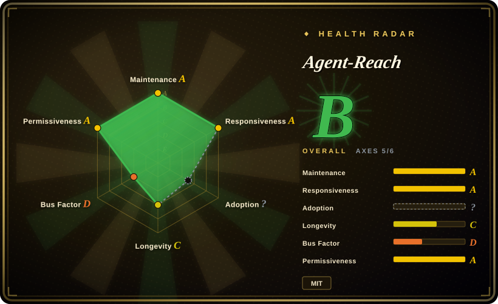
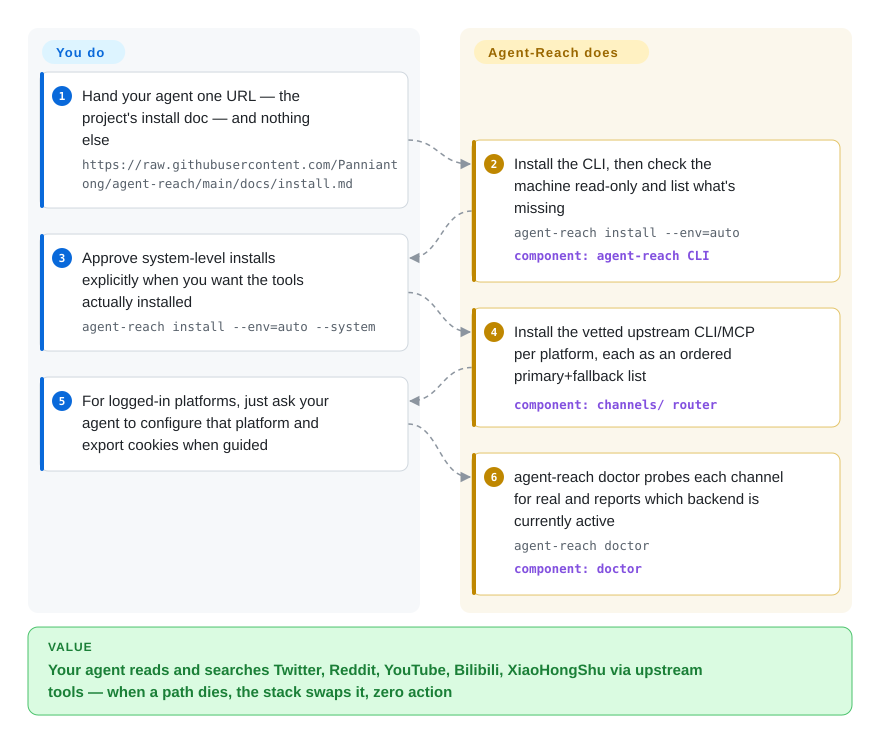

# Agent-Reach

An access/reach layer (not a research agent): a CLI that installs and routes a stack of upstream tools so your agent can read and search Twitter/X, Reddit, YouTube, GitHub, Bilibili, XiaoHongShu, Facebook, Instagram, RSS and the open web — "zero API fees".

## When to use

You're building a coding-agent or research-assistant workflow (Claude Code, Cursor, OpenClaw, your own loop) and you keep hitting the same wall: the agent reasons fine, but it's blind to the live internet. You want it to pull a YouTube transcript, read a blog cleanly, search Twitter/X for what people are saying about a library, grab a Reddit thread, or read a Bilibili / XiaoHongShu post — and you do **not** want to sign up for a dozen paid APIs, write a scraper per platform, or babysit which one broke this week. Agent-Reach resolves this by being the "eyes" layer: you point your agent at one install doc, it vets and installs the right upstream tool per platform (Jina Reader for web, yt-dlp for YouTube, `gh` for GitHub, twitter-cli / bili-cli / OpenCLI for the social platforms, Exa via MCP for semantic search), and registers a SKILL.md so your agent then calls those tools directly.

The part that earns its keep over a hand-rolled toolbox is **multi-backend routing**: each platform is an ordered primary-plus-fallback backend list ("首选 + 备选"), and `agent-reach doctor` health-checks each channel and reports the active backend. When an upstream method gets rate-limited or blocked — the README's running example is yt-dlp being fingerprint-blocked (HTTP 412) on Bilibili in 2026-06 and the stack auto-falling back to bili-cli — your agent keeps working with zero changes on your side. It's a good fit when *breadth of reachable sources* and *staying alive against anti-bot churn* matter more than deep, structured analysis.

## How it works

Agent-Reach is an installer, selector and health-checker — deliberately **not** a wrapper. You hand your agent the URL of the project's `docs/install.md`; the agent runs it, and from then on the actual reads are plain upstream commands the agent calls itself (`curl https://r.jina.ai/<url>`, `yt-dlp`, `gh repo view`, `bili search` …). The `agent-reach` binary itself stays involved in only two commands: `install` (provision the machine — read-only by default, it lists missing dependencies and only changes anything after you approve `--system`) and `doctor` (probe every channel for real — not just "does the binary exist" — and tell you which backend is active and how to repair a broken one). Under the hood each platform is one small `channels/*.py` file holding its ordered backend list, so "an access method got blocked and we swapped it" is a reorder in that file, not a rewrite — that's the mechanism behind the auto-fallback story above. What stays yours: exporting browser cookies for the logged-in platforms (Twitter/XiaoHongShu/Reddit, etc.), the account-ban risk that comes with cookie automation (the README itself says use a throwaway account), and — since the project installs from a GitHub archive rather than a package index — trusting what `pipx install <repo-archive.zip>` pulls in.

<!-- flow-steps:begin (generated from flows/agent-reach.json by tools/flow_card.py — do not edit) -->

Text version of the flow

1. **You**: Hand your agent one URL — the project's install doc — and nothing else — `https://raw.githubusercontent.com/Panniantong/agent-reach/main/docs/install.md`
2. **Agent-Reach**: Install the CLI, then check the machine read-only and list what's missing — `agent-reach install --env=auto` — component: `agent-reach CLI`
3. **You**: Approve system-level installs explicitly when you want the tools actually installed — `agent-reach install --env=auto --system`
4. **Agent-Reach**: Install the vetted upstream CLI/MCP per platform, each as an ordered primary+fallback list — component: `channels/ router`
5. **You**: For logged-in platforms, just ask your agent to configure that platform and export cookies when guided
6. **Agent-Reach**: agent-reach doctor probes each channel for real and reports which backend is currently active — `agent-reach doctor` — component: `doctor`

**Value**: Your agent reads and searches Twitter, Reddit, YouTube, Bilibili, XiaoHongShu via upstream tools — when a path dies, the stack swaps it, zero action

<!-- flow-steps:end -->

## When NOT to use

- **You actually want a deep-research agent.** Agent-Reach is a *fetch/access* layer; it does no iterative search→read→verify→synthesize loop and writes no cited report. If you want that pipeline, use a real research agent like [deep-research](deep-research.md) or [local-deep-research](local-deep-research.md) — and point *it* at sources Agent-Reach exposes if you want both.
- **You need legally/ToS-clean, account-safe access at scale.** Twitter/X, Reddit, Facebook, Instagram and XiaoHongShu require your own logged-in cookies; the README itself flags 封号风险 (account-suspension risk) for non-browser automation and recommends throwaway accounts. This is scraping with your credentials — not a sanctioned API — so terms-of-service and ban exposure are on you.
- **You need browser *actions*, not reads.** The stated scope is read/search only ("读内容 vs 操作网页"): no form submission, post-login flows, or CAPTCHA solving. The README itself points "doing" workflows to its sponsor BrowserAct.
- **You want a stable, self-contained dependency.** It orchestrates many third-party CLIs/MCP servers (yt-dlp, twitter-cli, bili-cli, rdt-cli, OpenCLI, mcporter, Exa) whose behavior, auth and anti-bot posture shift constantly — and the routing table itself has churned fast (e.g. Reddit went "no zero-config path at all", a Boss直聘 channel landed in September). The whole value prop is *managing* that churn — but you inherit a wide, fragile dependency surface and frequent breakage between releases.
- **Production / unattended pipelines.** Cookie-auth scraping that depends on consumer anti-bot weather is fine for an interactive agent, risky as a load-bearing backend.

## Comparison

| Alternative | In index | Our verdict | Tradeoff |
|---|---|---|---|
| [deep-research](deep-research.md) | ✅ | When the deliverable is a cited research report, pick deep-research — it runs the search→read→synthesize loop Agent-Reach deliberately omits; keep Agent-Reach only to open sources it can't see. | A true iterative research *agent* (fan-out search → read → recursive deepening → report); you wire your own LLM + search keys. Different layer of the stack, not a substitute — pair them. |
| [local-deep-research](local-deep-research.md) | ✅ | When you need privacy-first local synthesis with citations and local-LLM support, pick local-deep-research; add Agent-Reach only when the sources you must cite live in Twitter/XiaoHongShu threads. | Privacy-first local research assistant with synthesis + citations and local-LLM support. Does the reasoning Agent-Reach skips; pair them rather than choose. |
| [Vane](vane.md) | ✅ | When you want a self-hosted Perplexity-style answer box in one container, pick Vane; it bundles SearxNG for web search, so reach for Agent-Reach instead when the answer lives in social platforms Vane can't see. | Research/search agent focused on synthesis. Same "does the thinking" contrast — Agent-Reach is reach, not reasoning. |
| [Firecrawl](../web-scraping/crawling-tools/firecrawl.md) | ✅ | When you need clean web→markdown with a real crawl API you can build on, pick Firecrawl; pick Agent-Reach when your sources are social platforms, not web pages, and you won't pay per scrape. | Hosted/OSS web-scrape-to-markdown + crawl API; cleaner single-source web extraction and a real API, but paid and web-only — no Twitter/Reddit/Bilibili/XiaoHongShu social reach. |
| Exa / Tavily / SearXNG | 未收录 | When you need just one search backend, wire it directly (Agent-Reach already embeds Exa via MCP for exactly this); the per-platform social-scrape stack is what these don't give you. | Search backends (semantic / agent-search / self-hosted meta-search). Agent-Reach actually wraps Exa via MCP; these give you search but not the per-platform social-scrape stack. |

## Tech stack

- **Language:** Python (3.10+).
- **Orchestrated upstream tools:** Jina Reader (web→markdown), yt-dlp (YouTube subtitles/search — retired from Bilibili after 412 blocks), feedparser (RSS/Atom), `gh` CLI (GitHub), twitter-cli ▸ OpenCLI ▸ bird (Twitter/X), bili-cli ▸ OpenCLI ▸ search API (Bilibili), OpenCLI ▸ rdt-cli (Reddit, login-state only), OpenCLI (Facebook/Instagram via the desktop browser session), OpenCLI ▸ xiaohongshu-mcp ▸ xhs-cli (XiaoHongShu), mcp-server-linkedin ▸ Jina Reader (LinkedIn), a Boss直聘 channel via dedicated Chrome CDP (added 2026-09), native V2EX / 雪球 APIs, Whisper (小宇宙 podcast transcription).
- **Search:** Exa semantic search via `mcporter` (MCP), advertised as free / no key needed.
- **Integration model:** installs the CLIs/MCP servers and registers a SKILL.md, then the agent calls the upstream tools directly — "实际的读取和搜索由 Agent 直接调用上游工具完成" (no unified wrapper command for fetching).
- **Routing/health:** ordered primary+fallback backend list per platform in `channels/*.py`; `agent-reach doctor` for per-channel status and repair guidance.

## Dependencies

- **Runtime:** Python ≥ 3.10; a shell with the upstream CLIs installed. Many backends shell out to external binaries (`gh`, yt-dlp, twitter-cli, bili-cli, OpenCLI), some to MCP servers via `mcporter`; Node.js and `gh` are checked as system prerequisites.
- **Auth / state:** cookies for logged-in platforms (Twitter/X, Reddit, XiaoHongShu, …) exported from your own browser via Cookie-Editor or reused via OpenCLI's Chrome session; the README states they are stored locally on your machine only ("不上传不外传") with owner-only file permissions. 小宇宙 transcription needs a free API key.
- **Install:** `pipx install https://github.com/Panniantong/agent-reach/archive/main.zip` (or a venv + pip on the same archive URL) — the README explicitly warns the same-named PyPI package `agent-reach` is **not** this project; setup is agent-driven off the repo's `docs/install.md`.
- **External services:** Exa (via MCP) for semantic search; otherwise the public/social sites being read, subject to their rate-limits and anti-bot.

## Ops difficulty

**Medium.** First install plus per-platform auth (exporting cookies for each logged-in site) is more setup than a single hosted API, and zero-config only covers the public lane (web, YouTube, RSS, public GitHub, Exa search; by default only 6 zero-config channels are activated and the rest are opt-in per platform). The install itself is safety-gated (`install --env=auto` is read-only; `--system` only after explicit approval; `--dry-run` and `uninstall` exist), which helps but adds a step. The ongoing burden is the real cost: this is a thin layer over many fast-moving third-party scrapers and consumer anti-bot systems, so individual channels *will* break and need re-auth or a backend swap. `agent-reach doctor` and the fallback routing are explicitly there to make that survivable, but you're still operating a scraping stack, not consuming a stable API.

## Health & viability

- **Responsiveness**: Grade A — median first-response time 63.9 hours across 16 qualifying issues/PRs (2026-09-28 scoring window).
- **Maintenance (2026-09):** commits through 2026-09-15 (a new Boss直聘 channel landed), not archived. But note the shape: the latest git tag is still v1.5.0 (2026-06-11) while main keeps moving — it ships as a rolling archive install, not versioned releases. For a tool whose whole job is *managing upstream churn*, recency of maintenance is load-bearing: a coasting fork of this would silently rot as scrapers break. [推断]
- **Governance & bus factor:** `User`-owned (Panniantong) with ~85.8k stars (GitHub API, 2026-09-28) — a **bus-factor flag**: massive adoption riding on a single maintainer (top committer holds ~83% of 12-month commits per the health scorer), no foundation or vendor backstop. Higher stakes than usual here because the value *is* continuous upkeep, not a stable artifact. [推断]
- **Age & Lindy verdict:** created 2026-02-24, so age < 1 year — **young and hyped** (41.6k→85.8k stars in the ~3 months between 2026-06 and 2026-09 checks). Lindy is unproven, and this is a category where Lindy matters less than *current* upstream health: even a long-lived version would need constant re-vetting. [推断]
- **Risk flags:** the core risk is structural, not licensing (MIT is permissive). It orchestrates a wide, fragile surface of third-party scrapers/MCP servers (yt-dlp, twitter-cli, bili-cli, OpenCLI, Exa, …) plus cookie-auth scraping that carries ToS/account-suspension risk — so "health" depends as much on *those upstreams* as on this repo. The README's heavy sponsor block (BrowserAct et al.) suggests monetization pressure on a free tool; treat as interactive tooling, not a load-bearing production backend. [推断]

## Caveats (unverified)

- [未验证] ~85.8k stars, 7.5k forks and last-main-commit 2026-09-15 per GitHub API on 2026-09-28; latest release tag v1.5.0 (2026-06-11). Star counts are unreliable and date-sensitive; treat as indicative only.
- [未验证] The exact per-platform backend list, fallback ordering and zero-config matrix are taken from the README and may drift release-to-release; verify against `agent-reach doctor` and the current repo before relying on a specific channel.
- [推断] Reliability of any individual social channel depends on upstream tool health and the target site's anti-bot posture, which change continuously; "zero API fees" / "用户零操作" failover is the project's framing, not an independently measured guarantee.
- [推断] Account-suspension / ToS risk for cookie-auth scraping (Twitter/X, Reddit, XiaoHongShu, …) is acknowledged by the README but its severity is situational and unquantified here.
- [未验证] Exa-via-MCP being "free / no key needed" reflects the README's claim at time of writing; third-party service terms can change.
- [推断] The "rolling archive install, no versioned releases" characterization is based on the single v1.5.0 tag plus install.md's archive-URL flow; individual commits may still correspond to unpublished version bumps.
