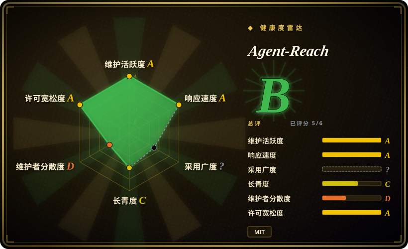
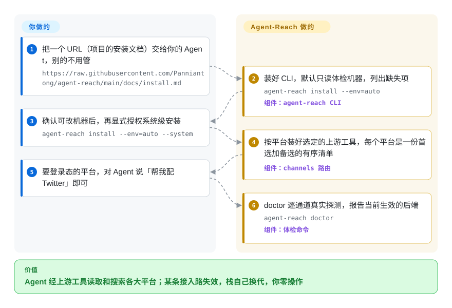

# Agent-Reach

一个「接入 / 触达」层（而非研究 agent）：一个 CLI，替你装好并路由一整套上游工具，让你的 agent 能读取和搜索 Twitter/X、Reddit、YouTube、GitHub、B站、小红书、Facebook、Instagram、RSS 和开放网页——「零 API 费用」。

## 何时使用

你在搭一套 coding-agent 或研究助手工作流（Claude Code、Cursor、OpenClaw、或你自己的循环），反复撞到同一堵墙：agent 推理没问题，但它对实时互联网是瞎的。你想让它拉一段 YouTube 字幕、干净地读一篇博客、上 Twitter/X 搜搜大家怎么评价某个库、抓一个 Reddit 帖、读一条 B站 / 小红书内容——而你**不想**为此注册一打付费 API、给每个平台手写爬虫、或者每周盯着哪个又挂了。Agent-Reach 用「眼睛」层解决这件事：你把项目安装文档的 URL 交给 Agent 跑一次，它就按平台甄选并装好对应的上游工具（网页用 Jina Reader、YouTube 用 yt-dlp、GitHub 用 `gh`、社交平台用 twitter-cli/bili-cli/OpenCLI、语义搜索用经 MCP 的 Exa），并注册一份 SKILL.md，之后你的 agent 直接调这些工具。

相比手搓工具箱，它真正值钱的地方是**多后端路由**：每个平台是一份「首选 + 备选」的有序后端清单，`agent-reach doctor` 会逐通道体检并报告当前生效的后端。当某个上游方法被限流或封锁——README 一直引用的例子是 2026-06 yt-dlp 在 B站被风控（412）封死、栈自动回退到 bili-cli——你这边零改动就能继续工作。当「可触达源的广度」和「在反爬变动里活下来」比深度结构化分析更重要时，它很合适。

## 怎么用起来

Agent-Reach 是安装器、甄选器和体检器——刻意**不做**包装层。你把项目 `docs/install.md` 的 URL 交给你的 Agent，它照着跑；此后真正的读取就是普通的上游命令，由 agent 自己调用（`curl https://r.jina.ai/<url>`、`yt-dlp`、`gh repo view`、`bili search` 等）。`agent-reach` 这个 CLI 本身只在两条命令里出场：`install`（给机器装环境——默认只读，只列出缺失项，等你明确批准 `--system` 才真正改动）和 `doctor`（逐通道做真实探测——不只是「命令存不存在」——告诉你当前走的是哪条后端、坏掉的那条怎么修）。底层机制是每个平台对应一个 `channels/*.py` 小文件，装着它的有序后端清单，所以「某条接入方式被封锁、我们换了下一条」只是把这个列表换个顺序，不是重写代码——上面那个自动回退的故事就是这么来的。仍然归你的部分：给需要登录的平台（Twitter/小红书/Reddit 等）从浏览器导出 cookie；cookie 自动化带来的封号风险（README 自己建议用小号）；以及——由于本项目从 GitHub 归档包安装、而不是包索引——你得信任 `pipx install <repo 归档 zip>` 拉进来的东西。

<!-- flow-steps:begin (generated from flows/agent-reach.json by tools/flow_card.py — do not edit) -->

流程文字版

1. **你**：把一个 URL（项目的安装文档）交给你的 Agent，别的不用管 — `https://raw.githubusercontent.com/Panniantong/agent-reach/main/docs/install.md`
2. **Agent-Reach**：装好 CLI，默认只读体检机器，列出缺失项 — `agent-reach install --env=auto` — 组件：`agent-reach CLI`
3. **你**：确认可改机器后，再显式授权系统级安装 — `agent-reach install --env=auto --system`
4. **Agent-Reach**：按平台装好选定的上游工具，每个平台是一份首选加备选的有序清单 — 组件：`channels 路由`
5. **你**：要登录态的平台，对 Agent 说「帮我配 Twitter」即可
6. **Agent-Reach**：doctor 逐通道真实探测，报告当前生效的后端 — `agent-reach doctor` — 组件：`体检命令`

**价值**：Agent 经上游工具读取和搜索各大平台；某条接入路失效，栈自己换代，你零操作

<!-- flow-steps:end -->

## 何时不用

- **你真正想要的是 deep-research agent。** Agent-Reach 是「抓取 / 接入」层；它**不做**迭代式 search→read→verify→synthesize 循环，也不产出带引用的报告。要那条流水线，请用真正的研究 agent，比如 [deep-research](deep-research.zh.md) 或 [local-deep-research](local-deep-research.zh.md)——若两者都要，就让研究 agent 去消费 Agent-Reach 暴露出的源。
- **你需要合规、ToS 干净、账号安全、可规模化的接入。** Twitter/X、Reddit、Facebook、Instagram、小红书都要你自己登录态的 cookie；README 自己标注了非浏览器自动化的**封号风险**并建议用小号。这是用你的凭据做爬取——不是受官方背书的 API——ToS 与封号风险由你承担。
- **你要的是浏览器「操作」而非「读取」。** 明确的范围声明是只读 / 只搜（「读内容 vs 操作网页」）：不做表单提交、登录后流程、过验证码。README 自己把「动手」场景指向它的赞助商 BrowserAct。
- **你想要一个稳定、自包含的依赖。** 它编排了一大堆第三方 CLI / MCP server（yt-dlp、twitter-cli、bili-cli、rdt-cli、OpenCLI、mcporter、Exa），它们的行为、鉴权和反爬姿态一直在变——而且路由表本身也在快速变动（比如 Reddit 变成了「完全没有零配置路径」，9 月又新上了 Boss直聘 通道）。它的整个价值就是**管理**这种变动——但你也因此继承了一个又宽又脆的依赖面，版本之间频繁出问题。
- **生产 / 无人值守流水线。** 依赖消费级反爬「天气」的 cookie 爬取，做交互式 agent 没问题，做承重后端就很危险。

## 横向对比

| 替代品 | 是否收录 | 我们的评价 | 取舍 |
|---|---|---|---|
| [deep-research](deep-research.zh.md) | ✅ | 交付物是带引用的研究报告时，选 deep-research——它跑的是 Agent-Reach 刻意不做的搜索→阅读→综合循环；Agent-Reach 只用来替它打开看不到的源。 | 真正的迭代式研究 *agent*（扇出搜索 → 阅读 → 递归深挖 → 出报告）；LLM 和搜索 key 要你自己接。是栈的不同层，不是替代关系——配对用。 |
| [local-deep-research](local-deep-research.zh.md) | ✅ | 需要隐私优先、带综合和引用、本地 LLM 支持的研究助手时，选 local-deep-research；只有当你要引用的材料活在 Twitter/小红书帖子里时，才补一个 Agent-Reach。 | 隐私优先的本地研究助手，带综合 + 引用，支持本地 LLM。做的是 Agent-Reach 跳过的推理；配对用，而非二选一。 |
| [Vane](vane.zh.md) | ✅ | 要一个单容器自托管、Perplexity 式的回答框时，选 Vane；它自带 SearxNG 覆盖网页搜索，答案活在 Vane 看不到的社交平台里时才轮到 Agent-Reach。 | 聚焦综合的研究 / 搜索 agent。同样是「负责思考」的对照——Agent-Reach 负责触达，不负责推理。 |
| [Firecrawl](../web-scraping/crawling-tools/firecrawl.zh.md) | ✅ | 需要干净的网页转 markdown、且有真正的爬取 API 可以在其上构建时，选 Firecrawl；源是社交平台而非网页、又不愿按次付费时，选 Agent-Reach。 | 托管 / 开源的网页抓取转 markdown + 爬取 API；单源网页提取更干净、有真 API，但付费且仅限网页——没有 Twitter/Reddit/B站/小红书的社交触达。 |
| Exa / Tavily / SearXNG | 未收录 | 只需要一个搜索后端时，直接接它（Agent-Reach 本来就是这样把 Exa 经 MCP 包进来的）；这些给不了的是逐平台社交爬取栈。 | 搜索后端（语义 / agent 搜索 / 自托管元搜索）。Agent-Reach 实际就经 MCP 包了 Exa；它们给你搜索，但没有逐平台的社交爬取栈。 |

## 技术栈

- **语言：** Python（3.10+）。
- **编排的上游工具：** Jina Reader（网页转 markdown）、yt-dlp（YouTube 字幕 / 搜索——因 412 封锁已从 B站退役）、feedparser（RSS/Atom）、`gh` CLI（GitHub）、twitter-cli ▸ OpenCLI ▸ bird（Twitter/X）、bili-cli ▸ OpenCLI ▸ 搜索 API（B站）、OpenCLI ▸ rdt-cli（Reddit，仅登录态路线）、OpenCLI（Facebook/Instagram，复用桌面浏览器登录态）、OpenCLI ▸ xiaohongshu-mcp ▸ xhs-cli（小红书）、mcp-server-linkedin ▸ Jina Reader（LinkedIn）、经专用 Chrome CDP 的 Boss直聘 通道（2026-09 新增）、原生 V2EX / 雪球 API、Whisper（小宇宙播客转录）。
- **搜索：** 经 `mcporter`（MCP）的 Exa 语义搜索，宣称免费 / 无需 key。
- **集成模型：** 装好这些 CLI / MCP server 并注册 SKILL.md，然后由 agent 直接调用上游工具——「实际的读取和搜索由 Agent 直接调用上游工具完成」（没有统一的单一抓取包装命令）。
- **路由 / 体检：** 每平台一个 `channels/*.py` 文件，装着有序的首选 + 备选后端清单；`agent-reach doctor` 给出逐通道状态和修复指引。

## 依赖

- **运行时：** Python ≥ 3.10；装好上游 CLI 的 shell。很多后端会 shell out 到外部二进制（`gh`、yt-dlp、twitter-cli、bili-cli、OpenCLI），部分经 `mcporter` 走 MCP server；Node.js 和 `gh` 会作为系统前置被检查。
- **鉴权 / 状态：** 登录态平台（Twitter/X、Reddit、小红书等）需要从自己浏览器导出的 cookie（经 Cookie-Editor，或由 OpenCLI 复用已有的 Chrome 会话）；README 声明 cookie 只存本地、不上传不外传，且文件权限仅所有者可读写。小宇宙播客转录需要一个免费 API key。
- **安装：** `pipx install https://github.com/Panniantong/agent-reach/archive/main.zip`（或 venv + pip 装同一个归档 URL）——README 明确警告 PyPI 上的同名包 `agent-reach` **不是**本项目；整体安装由 agent 对着仓库里的 `docs/install.md` 驱动完成。
- **外部服务：** Exa（经 MCP）做语义搜索；其余即被读取的公开 / 社交站点，受其限流与反爬约束。

## 运维难度

**中。** 首次安装外加逐平台鉴权（为每个登录站点导 cookie）比单一托管 API 要折腾，而且零配置只覆盖公开通道（网页、YouTube、RSS、公开 GitHub、Exa 搜索；默认只激活 6 个零配置通道，其余按平台逐个索取）。安装本身有安全闸门（`install --env=auto` 只读；须明确批准才 `--system`；另有 `--dry-run` 与 `uninstall`），有帮助但也多一道流程。真正的成本在持续维护：这是一层薄薄地盖在众多快速变动的第三方爬虫和消费级反爬系统之上的东西，单个通道**一定**会挂，需要重新鉴权或换后端。`agent-reach doctor` 和回退路由就是为了让这件事「能扛过去」，但你运维的终归是一套爬取栈，而非消费一个稳定 API。

## 健康度与可持续性

- **响应速度**：Grade A——中位首次响应 63.9 小时，基于 16 个合格 issue/PR（2026-09-28 评分窗口）。
- **维护（2026-09）：** 提交持续到 2026-09-15（新上了 Boss直聘 通道），未归档。但注意它的形态：最新的 git tag 仍是 v1.5.0（2026-06-11），main 却在持续推进——它按「滚动归档包安装」发布，而不是版本化 release。对一个全部工作就是*管理上游变动*的工具来说，维护的新鲜度是承重的：它的吃老本分叉会随着爬虫失效而悄悄烂掉。[推断]
- **治理与 bus factor：** `User` 名下（Panniantong），约 85.8k star（GitHub API，2026-09-28）——一个 **bus-factor 信号**：巨量采用押在单个维护者身上（健康度评分器统计近 12 个月 top1 提交占比约 83%），没有基金会或厂商兜底。这里的风险比通常更高，因为它的价值*就是*持续维护，而非一份稳定产物。[推断]
- **年龄与 Lindy 判断：** 建于 2026-02-24，年龄不足 1 年——**年轻且被炒作**（2026-06 到 2026-09 两次核查之间，star 从 41.6k 涨到 85.8k）。Lindy 未被证明；而且这是个 Lindy 不如*当下*上游健康度重要的类目：即便是长寿版本，也得不断重新甄选后端。[推断]
- **风险标记：** 核心风险是结构性的，而非 license（MIT 宽松）。它编排了一个又宽又脆的第三方爬虫 / MCP server 面（yt-dlp、twitter-cli、bili-cli、OpenCLI、Exa 等），外加带 ToS / 封号风险的 cookie 爬取——所以「健康度」既取决于本仓库，也取决于*那些上游*。README 里显眼的赞助商区块（BrowserAct 等）说明一个免费工具背后有变现压力；把它当交互式工具，而非承重的生产后端。[推断]

## 存疑（未验证）

- [未验证] 约 85.8k star、7.5k fork、main 最新提交 2026-09-15、最新 release tag v1.5.0（2026-06-11），均为 2026-09-28 经 GitHub API 查得；star 计数不可靠且对时间敏感，仅供参考。
- [未验证] 逐平台的后端列表、回退顺序和零配置矩阵取自 README，可能随版本漂移；依赖某具体通道前请对照 `agent-reach doctor` 和当前仓库核实。
- [推断] 任一社交通道的可用性取决于上游工具健康度和目标站点的反爬姿态，二者持续变化；「零 API 费用」/「用户零操作」的故障切换是项目的表述，不是独立测得的保证。
- [推断] cookie 爬取（Twitter/X、Reddit、小红书等）的封号 / ToS 风险 README 已承认，但其严重程度因情境而异，此处未量化。
- [未验证] Exa-经-MCP「免费 / 无需 key」反映 README 写作时的说法；第三方服务条款可能变化。
- [推断] 「滚动归档包安装、无版本化 release」的判断基于 v1.5.0 是唯一近期 tag 加上 install.md 的归档 URL 流程；个别提交可能对应未发布的版本号变更。
