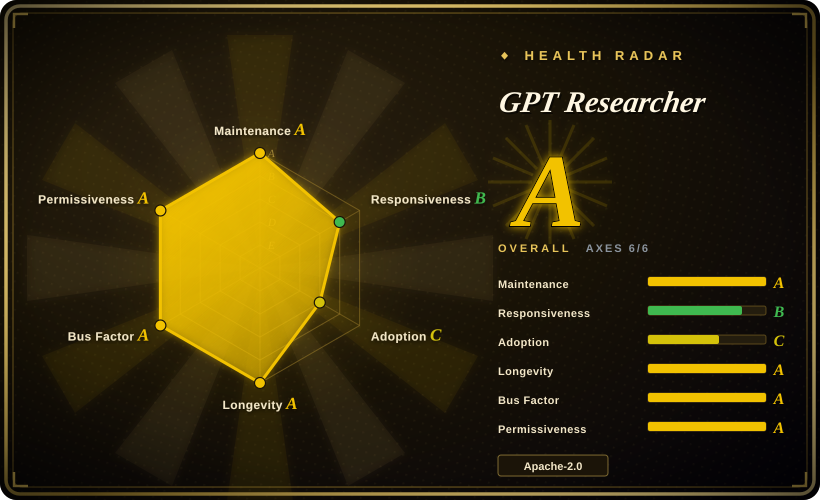
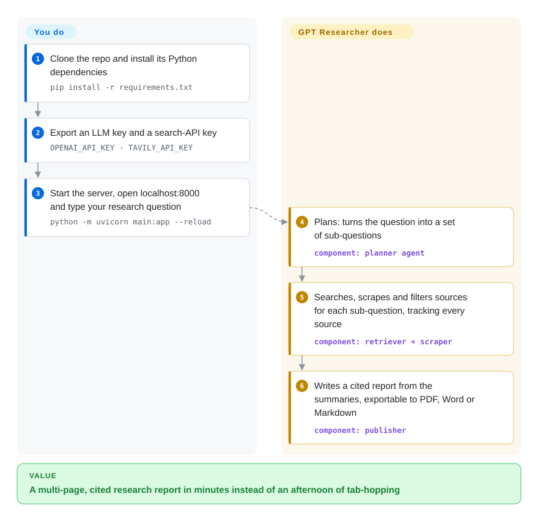

# GPT Researcher

Answering a real research question means an afternoon of opening twenty tabs, skimming, and pasting quotes into a doc — and a chatbot that answers from memory gives you no sources at all. GPT Researcher turns one question into sub-questions, searches and scrapes the web (or your own files) for each, and writes a multi-page report with every claim tied to a citation.

## When to use

You're an analyst, product manager or engineer who regularly needs a written brief — "what changed in EU AI Act enforcement this year", "compare the top three vector databases for our use case" — and you want it as a document with sources, not a chat reply. Doing it by hand takes hours; asking a chat model gives you a confident paragraph with no links. You run GPT Researcher (the web app, the `gpt-researcher` Python package, its MCP server, or the Claude skill), type the question, and a few minutes later get a ~1,200-word APA-style report (configurable) with references, exportable to PDF, Word or Markdown. Point `DOC_PATH` at a folder and it researches your PDFs, slides and spreadsheets the same way.

Pick it over its neighbors when you want the **most complete, batteries-included research app** rather than a minimal reference or a single-purpose engine: it ships a planner/executor/publisher pipeline, ~20 pluggable search backends (Tavily, DuckDuckGo, SearxNG, Google, Bing, Brave, Exa, arXiv, Semantic Scholar, PubMed Central, MCP servers…), any LLM via LangChain/LiteLLM including local Ollama, a recursive "deep research" mode, and both a lightweight and a Next.js front end. It is also Apache-2.0 and importable as a library, so you can embed the same research loop in your own service instead of only clicking through a UI.

## How it works

You hand GPT Researcher a question plus two keys — one for a language model, one for a search API — and **it does the research loop for you**: a *planner* agent breaks the question into a handful of sub-questions; *execution* agents search for each, scrape the result pages, and keep only the passages that help (a "context filter" — local keyword ranking by default, or a hosted ranking model called Jev if you set its key); a *publisher* step writes the report from those summaries, keeping track of which source each fact came from. You decide what goes in — the model, the search backend, local documents, report type and length — and you read and judge what comes out. The same engine is reachable three ways: the web app shown below, the `GPTResearcher` Python class (`conduct_research()` then `write_report()`), or an MCP server so an assistant like Claude can call it. Think of it as hiring a research assistant who works fast and always cites, but whose conclusions are only as good as the pages it found.

<!-- flow-steps:begin (generated from flows/gpt-researcher.json by tools/flow_card.py — do not edit) -->

Text version of the flow

1. **You**: Clone the repo and install its Python dependencies — `pip install -r requirements.txt`
2. **You**: Export an LLM key and a search-API key — `OPENAI_API_KEY · TAVILY_API_KEY`
3. **You**: Start the server, open localhost:8000 and type your research question — `python -m uvicorn main:app --reload`
4. **GPT Researcher**: Plans: turns the question into a set of sub-questions — component: `planner agent`
5. **GPT Researcher**: Searches, scrapes and filters sources for each sub-question, tracking every source — component: `retriever + scraper`
6. **GPT Researcher**: Writes a cited report from the summaries, exportable to PDF, Word or Markdown — component: `publisher`

**Value**: A multi-page, cited research report in minutes instead of an afternoon of tab-hopping

<!-- flow-steps:end -->

## When NOT to use

- **Nothing may leave your machine.** The defaults are OpenAI models, the Tavily search API and (if keyed) the hosted Jev filter. It *can* run on Ollama with a SearxNG retriever, but that is configuration you own; if local-only is the hard requirement, start from [Local Deep Research](local-deep-research.md), which is built around local LLMs and a bundled SearXNG.
- **You want a quick cited answer, not a report.** For "ask a question, get a sourced paragraph" in a Perplexity-style UI, [Vane](vane.md) is the lighter fit; GPT Researcher's report pipeline spends more calls and minutes per question.
- **You want a Wikipedia-style long article built from multiple expert perspectives.** [STORM](storm.md) generates an outline by simulating conversations between perspectives first; pick it when article structure matters more than speed.
- **You want a small codebase to read and fork.** This repo is a full product (backend, two front ends, multi-agent variants, MCP, Terraform). To learn the pattern or build your own, [deep-research](deep-research.md) is ~500 lines of TypeScript.
- **You need the report's claims audited, not just cited.** GPT Researcher reduces error by aggregating many sources and keeping citations; it does not cross-check each claim against its source. For high-stakes work where citations must be verified, [Hyperresearch](hyperresearch.md) runs an adversarial cite-checking pipeline (Claude Code only).
- **You want search-provider neutrality by default.** The default retriever is Tavily, and the project's creator builds Tavily; the default "smart" filter is a third-party hosted model. Both are swappable (`RETRIEVER=duckduckgo` or `searx`, `CONTEXT_FILTER=keyword`), but if defaults you didn't choose are a concern, set them explicitly or pick [Local Deep Research](local-deep-research.md).

## Comparison

| Alternative | In index | Our verdict | Tradeoff |
|---|---|---|---|
| [Local Deep Research](local-deep-research.md) | ✅ | When sensitive queries must stay on your own hardware, pick Local Deep Research; pick GPT Researcher when hosted LLMs and search APIs are acceptable and you want the broader retriever and front-end ecosystem. | Local-first defaults remove egress, but small local models usually write weaker reports and you run SearXNG; GPT Researcher is easier to get good output from but sends queries to third parties by default. |
| [STORM](storm.md) | ✅ | For a long, outline-driven encyclopedic article on a topic, pick STORM; for task-oriented briefs on arbitrary questions or your own documents, pick GPT Researcher. | STORM's perspective-guided outlining yields better article structure at more LLM calls and a research-prototype codebase; GPT Researcher is more of a product with UI, exports and local-doc support. |
| [Open Deep Research](open-deep-research.md) | ✅ | Open Deep Research was archived in 2026: read it as a LangGraph blueprint for a supervisor-plus-parallel-researchers design, but for anything you will actually run, pick GPT Researcher. | Its graph is smaller and easier to rewire node by node, but it no longer receives fixes and supports fewer search backends; GPT Researcher carries more surface area and is maintained. |
| [Vane](vane.md) | ✅ | For quick, cited answers in a self-hosted chat-style search UI, pick Vane; for multi-page reports with sub-question planning, pick GPT Researcher. | Vane answers in seconds with a SearxNG it bundles; it does not plan a multi-step investigation or write a structured report. |
| [deep-research](deep-research.md) | ✅ | To learn the recursive research pattern or fork a tiny base, pick dzhng/deep-research; to run research for real users today, pick GPT Researcher. | ~500 LOC is easy to own but has no UI, few backends and no releases; GPT Researcher trades that simplicity for features. |
| OpenAI Deep Research | not a repo | If you can send data to OpenAI and want the least setup, the hosted product is simpler; pick GPT Researcher when you need to choose the model, the search backend, or run it inside your own system. | The hosted service hides the pipeline and sources selection; GPT Researcher exposes and lets you change every stage, at the cost of running it. |

## Tech stack

- **Backend:** Python ≥ 3.12 (required since v3.7.0 / PyPI 0.16.x), FastAPI + Uvicorn, WebSockets for live progress.
- **LLM layer:** LangChain v1 (`langchain-openai`, `langchain-ollama`, …) plus LiteLLM; three model roles (`FAST_LLM`, `SMART_LLM`, `STRATEGIC_LLM`), default OpenAI GPT-5.4 family in `default.py`.
- **Retrieval:** ~20 retriever modules (`tavily` default, `duckduckgo`, `searx`, `google`, `bing`, `brave`, `exa`, `serper`, `serpapi`, `arxiv`, `semantic_scholar`, `pubmed_central`, `openalex`, `mcp`, `custom`, …) and, since v3.7.0, third-party retriever plugins via an entry point; BeautifulSoup scraper by default; `pymupdf`, `unstructured`, `python-docx`, `python-pptx` for local documents.
- **Multi-agent variants:** `multi_agents/` built on LangGraph (and AG2), inspired by the STORM paper.
- **Front ends:** a static HTML/JS UI served by FastAPI, and a Next.js + Tailwind app (Docker Compose runs the API on :8000 and the React app on :3000).
- **Outputs:** Markdown, PDF (`md2pdf`), DOCX (`htmldocx`).

## Dependencies

- **An LLM provider key** (OpenAI by default; any LangChain/LiteLLM-supported provider or a local Ollama works) — this is where most of the cost goes.
- **A search backend:** Tavily API key by default; DuckDuckGo needs no key; SearxNG needs your own instance; others need their own API keys.
- **Optional:** `TYPESAFE_API_KEY` for the Jev context filter (falls back to local BM25 without it), `GOOGLE_API_KEY` for inline AI images, LangSmith for tracing, MCP servers as extra data sources.
- **No database required:** memory backend is local by default; reports and outputs are files.

## Ops difficulty

**Low to try, medium to run for a team.** Locally it is clone → set two env vars → `pip install -r requirements.txt` → `uvicorn`, or `docker compose up --build` for API + Next.js UI. Running it as a shared service means managing API keys and spend (each report makes many LLM and search calls; the README quotes ~5 minutes and ~$0.4 per deep-research run on `o3-mini`, and the current default models differ), rate limits on the search provider, and scraping failures on JS-heavy or bot-protected sites. Upgrades can break configs: v3.7.0 raised the floor to Python 3.12 and changed the default context filter from embeddings to keyword ranking.

## Health & viability

- **Maintenance (2026-10).** Releases roughly monthly — v3.4.4 (2026-04) through v3.7.0 (2026-09-26), with PyPI `gpt-researcher` 0.16.1 published the same day; last default-branch commit 2026-09-26. Radar: maintenance A, responsiveness B (median first response ~12.6 days over 50 issues — slow), only 27 open issues against ~30k stars.
- **Governance / bus factor.** Owned by a personal account (assafelovic) whose GitHub profile lists Tavily.com as its company; ~22 contributors active in the last 12 months, top contributor ~36% of recent commits and a second long-time maintainer (ElishaKay) — a real team around a founder, but the roadmap belongs to one person and is tied to a search-API company's interests.
- **Age & Lindy.** Created 2023-05 (~3.4 years) and still shipping monthly — old for the LLM-agent wave, young in absolute terms; a moderate Lindy prior.
- **Adoption.** ~30k stars and ~4.1k forks, but PyPI shows only 39,651 downloads last month and no dependent repositories in the scorer's graph (adoption C) — popular to star and try, less often embedded as a library.
- **Risk flags.** Apache-2.0, no relicense history found. Watch the commercial defaults (Tavily retriever, hosted Jev filter) and frequent config-level breaking changes between minor releases.

## Caveats (unverified)

- [未验证] Star, fork, download and contributor numbers are GitHub/PyPI/scorer snapshots from 2026-10-08 and drift.
- [未验证] The README's Jev benchmark (73% vs 46% relevant passages) and the ~$0.4 / ~5 minute deep-research cost are the project's own measurements, not reproduced here.
- [推断] "The roadmap is tied to a search-API company's interests" is inferred from the owner's GitHub profile (company: Tavily.com) and Tavily being the default retriever; no conflicting governance document was found, but none was looked for beyond CONTRIBUTING.
- [推断] The low open-issue count relative to stars may reflect aggressive issue closing rather than few problems; not investigated.
- [未验证] Comparison claims about STORM, Open Deep Research and OpenAI Deep Research are based on their pages/positioning, not side-by-side runs.
