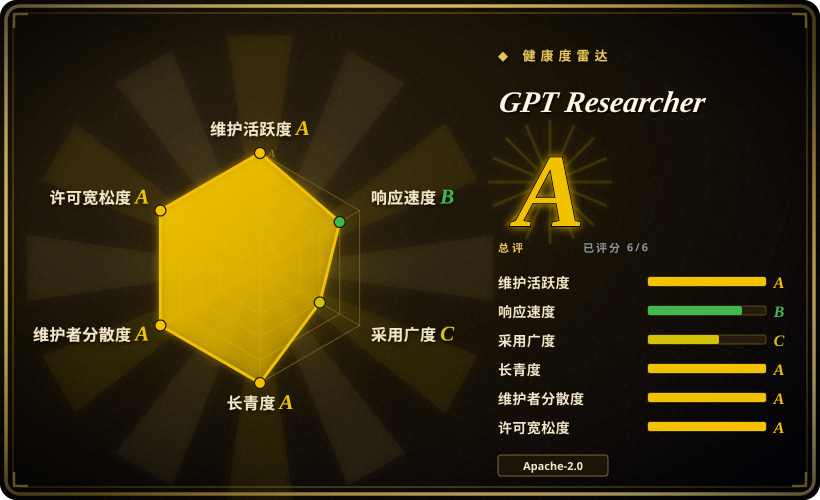
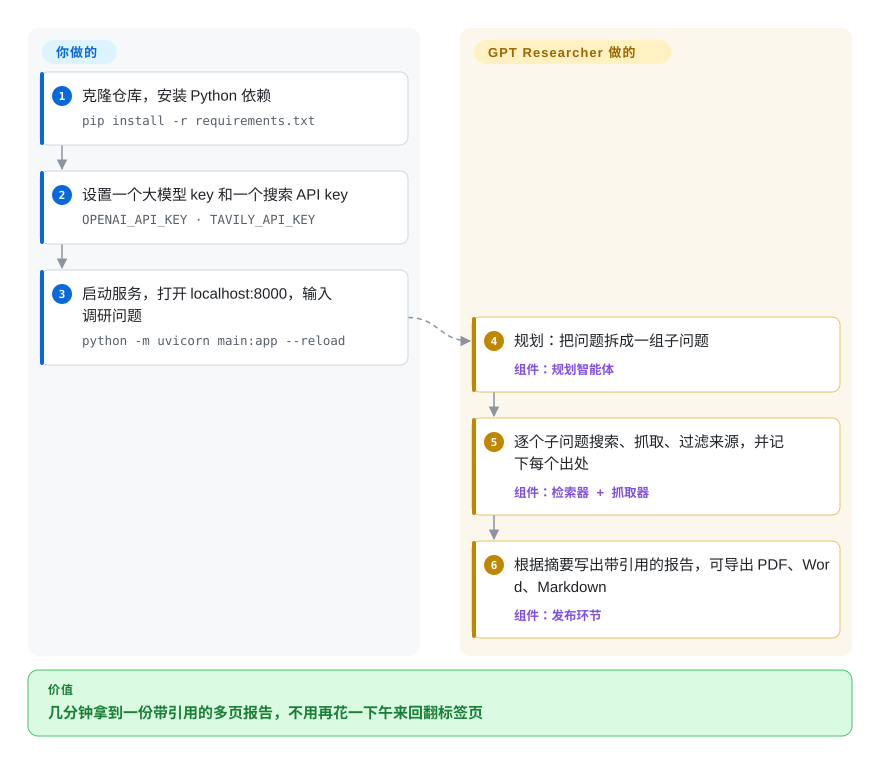

# GPT Researcher

认真回答一个调研问题，往往要开二十个标签页、一页页扫、把引文贴进文档，耗掉一下午；而聊天机器人凭记忆作答，一个来源都给不出。GPT Researcher 把一个问题拆成若干子问题，逐个去网上（或你自己的文件里）搜索、抓取，最后写出一份多页报告，每个论断都挂着出处。

## 何时使用

你是分析师、产品经理或工程师，经常要交一份书面简报——“今年欧盟 AI 法案的执法有什么变化”“为我们的场景比较三款主流向量数据库”——而且要的是带来源的文档，不是一段聊天回复。手工做要几个小时；问聊天模型，只会得到一段很笃定却没有链接的话。你运行 GPT Researcher（网页应用、`gpt-researcher` Python 包、它的 MCP 服务器或 Claude skill 都行），输入问题，几分钟后拿到一份约 1200 词、APA 格式（可配置）、附参考文献的报告，可导出为 PDF、Word 或 Markdown。把 `DOC_PATH` 指向一个文件夹，它就用同样的方式调研你的 PDF、幻灯片和表格。

当你要的是**功能最全、开箱即用的调研应用**，而不是一份最小参考实现或单一用途的引擎时，选它而不是同类：它自带“规划—执行—发布”流水线，约 20 种可插拔搜索后端（Tavily、DuckDuckGo、SearxNG、Google、Bing、Brave、Exa、arXiv、Semantic Scholar、PubMed Central、MCP 服务器……），通过 LangChain / LiteLLM 接任意大模型（包括本地 Ollama），有递归式“深度调研”模式，还有轻量版和 Next.js 两套前端。它是 Apache-2.0 许可，也能作为库导入，你可以把同一套调研循环嵌进自己的服务，而不只是在界面上点。

## 怎么用起来

你交给 GPT Researcher 一个问题，再给两把钥匙——一个大模型的 API key，一个搜索 API 的 key——**调研循环由它替你跑完**：*规划*智能体把问题拆成几个子问题；*执行*智能体逐个搜索、抓取结果页，只保留有用的段落（这一步叫“上下文过滤”：默认在本地按关键词排序，配了 key 就改用一个叫 Jev 的托管排序模型）；*发布*环节再根据这些摘要写出报告，并记下每条事实来自哪个来源。你负责决定输入什么——用哪个模型、哪个搜索后端、哪些本地文档、报告类型和长度——以及阅读、判断输出的结论。同一个引擎有三种接法：下图的网页应用、`GPTResearcher` Python 类（先 `conduct_research()` 再 `write_report()`），或者 MCP 服务器，让 Claude 这类助手直接调用。可以把它想成一个手脚很快、从不忘记标出处的研究助理——但它的结论好坏，取决于它找到的那些网页。

<!-- flow-steps:begin (generated from flows/gpt-researcher.json by tools/flow_card.py — do not edit) -->

流程文字版

1. **你**：克隆仓库，安装 Python 依赖 — `pip install -r requirements.txt`
2. **你**：设置一个大模型 key 和一个搜索 API key — `OPENAI_API_KEY · TAVILY_API_KEY`
3. **你**：启动服务，打开 localhost:8000，输入调研问题 — `python -m uvicorn main:app --reload`
4. **GPT Researcher**：规划：把问题拆成一组子问题 — 组件：`规划智能体`
5. **GPT Researcher**：逐个子问题搜索、抓取、过滤来源，并记下每个出处 — 组件：`检索器 + 抓取器`
6. **GPT Researcher**：根据摘要写出带引用的报告，可导出 PDF、Word、Markdown — 组件：`发布环节`

**价值**：几分钟拿到一份带引用的多页报告，不用再花一下午来回翻标签页

<!-- flow-steps:end -->

## 何时不用

- **任何数据都不能离开你的机器。** 默认配置用 OpenAI 模型、Tavily 搜索 API，配了 key 还会用托管的 Jev 过滤器。它*可以*改成 Ollama 加 SearxNG 检索，但这些配置得你自己负责；如果“纯本地”是硬约束，从 [Local Deep Research](local-deep-research.zh.md) 起步，它本来就围绕本地大模型和自带的 SearXNG 设计。
- **你要的是一个带出处的快速回答，而不是报告。** 想要 Perplexity 式的“问一句、得到一段带来源的话”，[Vane](vane.zh.md) 更轻；GPT Researcher 的报告流水线每个问题要花更多调用和分钟数。
- **你要的是多视角、类似维基百科的长篇条目。** [STORM](storm.zh.md) 先模拟不同视角之间的对话来生成大纲；更看重文章结构而不是速度时选它。
- **你想要一份能读完、能 fork 的小代码库。** 这个仓库是完整产品（后端、两套前端、多智能体变体、MCP、Terraform）。想学会这个模式或自己搭，[deep-research](deep-research.zh.md) 只有约 500 行 TypeScript。
- **你需要逐条核验报告里的论断，而不只是附上引用。** GPT Researcher 靠汇总大量来源、保留引用来减少错误，并不会把每条论断回到原文核对。对引用必须核实的高风险工作，[Hyperresearch](hyperresearch.zh.md) 有一条对抗式的引用核查流水线（只能在 Claude Code 里用）。
- **你希望默认就不偏向任何搜索服务商。** 默认检索器是 Tavily，而项目作者本人就在做 Tavily；默认的“智能”过滤器也是第三方托管模型。两者都能换（`RETRIEVER=duckduckgo` 或 `searx`，`CONTEXT_FILTER=keyword`），但如果你介意别人替你选的默认值，就显式设置，或者改选 [Local Deep Research](local-deep-research.zh.md)。

## 横向对比

| 替代品 | 是否收录 | 我们的评价 | 取舍 |
|---|---|---|---|
| [Local Deep Research](local-deep-research.zh.md) | ✅ | 敏感查询必须留在自己的硬件上，选 Local Deep Research；能接受托管大模型和搜索 API、又想要更广的检索器和前端生态，选 GPT Researcher。 | 本地优先的默认值杜绝了数据外发，但小型本地模型写出的报告通常更弱，还得自己运行 SearXNG；GPT Researcher 更容易出好结果，但默认会把查询发给第三方。 |
| [STORM](storm.zh.md) | ✅ | 要就某个主题写一篇由大纲驱动的百科式长文，选 STORM；要针对任意问题或自有文档出任务型简报，选 GPT Researcher。 | STORM 的多视角大纲带来更好的文章结构，代价是更多大模型调用和偏研究原型的代码；GPT Researcher 更像产品，有界面、导出和本地文档支持。 |
| [Open Deep Research](open-deep-research.zh.md) | ✅ | Open Deep Research 已于 2026 年归档：把它当作“主管加并行研究员”设计的 LangGraph 蓝图来读，但凡是要真正运行的场景，选 GPT Researcher。 | 它的图更小，更容易逐个节点改线，但不再有修复，支持的搜索后端也更少；GPT Researcher 面更宽，且仍在维护。 |
| [Vane](vane.zh.md) | ✅ | 要在自托管的聊天式搜索界面里快速得到带引用的回答，选 Vane；要先规划子问题、再写多页报告，选 GPT Researcher。 | Vane 借助自带的 SearxNG 几秒内作答，但不会规划多步调查，也不写结构化报告。 |
| [deep-research](deep-research.zh.md) | ✅ | 想学会递归调研模式或 fork 一个极小的底座，选 dzhng/deep-research；今天就要给真实用户跑调研，选 GPT Researcher。 | 约 500 行代码很容易自己掌控，但没有界面、后端少、也没有发版；GPT Researcher 用简单换来了功能。 |
| OpenAI Deep Research | 非仓库 | 如果可以把数据交给 OpenAI、又想最少折腾，托管产品更省事；需要自己选模型、选搜索后端，或要把它跑在自己系统里时，选 GPT Researcher。 | 托管服务把流水线和来源选择都藏起来了；GPT Researcher 每个环节都可见可改，代价是你要自己运行它。 |

## 技术栈

- **后端：** Python ≥ 3.12（自 v3.7.0 / PyPI 0.16.x 起强制），FastAPI + Uvicorn，用 WebSocket 推送实时进度。
- **大模型层：** LangChain v1（`langchain-openai`、`langchain-ollama` 等）加 LiteLLM；三种模型角色（`FAST_LLM`、`SMART_LLM`、`STRATEGIC_LLM`），`default.py` 里默认是 OpenAI GPT-5.4 系列。
- **检索：** 约 20 个检索器模块（默认 `tavily`，另有 `duckduckgo`、`searx`、`google`、`bing`、`brave`、`exa`、`serper`、`serpapi`、`arxiv`、`semantic_scholar`、`pubmed_central`、`openalex`、`mcp`、`custom` 等），v3.7.0 起还能通过 entry point 接第三方检索器插件；默认用 BeautifulSoup 抓取；本地文档靠 `pymupdf`、`unstructured`、`python-docx`、`python-pptx`。
- **多智能体变体：** `multi_agents/` 基于 LangGraph（以及 AG2），思路来自 STORM 论文。
- **前端：** 一套由 FastAPI 直接托管的静态 HTML/JS 界面，以及一套 Next.js + Tailwind 应用（Docker Compose 会在 :8000 起 API、在 :3000 起 React 应用）。
- **输出：** Markdown、PDF（`md2pdf`）、DOCX（`htmldocx`）。

## 依赖

- **一个大模型服务商的 key**（默认 OpenAI；任何 LangChain / LiteLLM 支持的服务商或本地 Ollama 都行）——大部分费用花在这里。
- **一个搜索后端：** 默认要 Tavily API key；DuckDuckGo 不需要 key；SearxNG 要你自己的实例；其他后端各需各的 key。
- **可选：** `TYPESAFE_API_KEY` 用于 Jev 上下文过滤（没有就退回本地 BM25），`GOOGLE_API_KEY` 用于报告内的 AI 配图，LangSmith 用于链路追踪，MCP 服务器作为额外数据源。
- **不需要数据库：** 记忆后端默认是本地的，报告和产物都是文件。

## 运维难度

**试用：低；给团队长期跑：中。** 本地就是克隆仓库 → 设两个环境变量 → `pip install -r requirements.txt` → `uvicorn`，或者 `docker compose up --build` 同时拉起 API 和 Next.js 界面。作为共享服务运行时，要管 API key 和花费（每份报告都会发出大量大模型和搜索调用；README 给的数字是深度调研在 `o3-mini` 上每次约 5 分钟、约 0.4 美元，而当前默认模型已不同）、搜索服务商的限流，以及 JS 重的页面或有反爬保护的网站抓取失败。升级可能让配置失效：v3.7.0 把 Python 下限提到 3.12，并把默认上下文过滤从向量嵌入改成了关键词排序。

## 健康度与可持续性

- **维护（2026-10）。** 大约每月发一版——从 v3.4.4（2026-04）到 v3.7.0（2026-09-26），同一天还发布了 PyPI 上的 `gpt-researcher` 0.16.1；默认分支最近一次提交在 2026-09-26。雷达：维护 A，响应 B（50 个 issue 的首次响应中位数约 12.6 天——偏慢），近 3 万星的项目只有 27 个未关闭 issue。
- **治理与巴士系数。** 仓库归属个人账号 assafelovic，其 GitHub 资料写的公司是 Tavily.com；近 12 个月约 22 名活跃贡献者，头号贡献者约占近期提交的 36%，另有一位长期维护者（ElishaKay）——创始人身边确实有团队，但路线图由一个人掌握，并且和一家搜索 API 公司的利益绑在一起。
- **年龄与 Lindy。** 2023-05 创建（约 3.4 年），仍按月发版——在大模型智能体这波项目里算老的，绝对年龄仍然年轻；Lindy 先验中等。
- **采用度。** 约 3 万星、约 4.1k fork，但 PyPI 上月只有 39,651 次下载，评分器的依赖图里没有下游仓库（采用度 C）——很多人点星试用，作为库被嵌入的少。
- **风险信号。** Apache-2.0，未发现改许可历史。需要留意商业默认值（Tavily 检索器、托管的 Jev 过滤器），以及小版本之间频繁出现的配置级不兼容变更。

## 存疑（未验证）

- [未验证] 星数、fork 数、下载量和贡献者数是 2026-10-08 的 GitHub / PyPI / 评分器快照，会漂移。
- [未验证] README 里 Jev 的基准数据（相关段落 73% 对 46%）和深度调研约 0.4 美元 / 约 5 分钟的成本，都是项目方自测，本次没有复现。
- [推断] “路线图和一家搜索 API 公司的利益绑在一起”是根据仓库主人的 GitHub 资料（公司：Tavily.com）以及 Tavily 是默认检索器推断的；除 CONTRIBUTING 外没有再找治理文档。
- [推断] 未关闭 issue 相对星数很少，可能是关 issue 关得勤，而不是问题少；没有深究。
- [未验证] 横向对比里关于 STORM、Open Deep Research、OpenAI Deep Research 的说法基于它们的页面和公开定位，没有并排实测。
