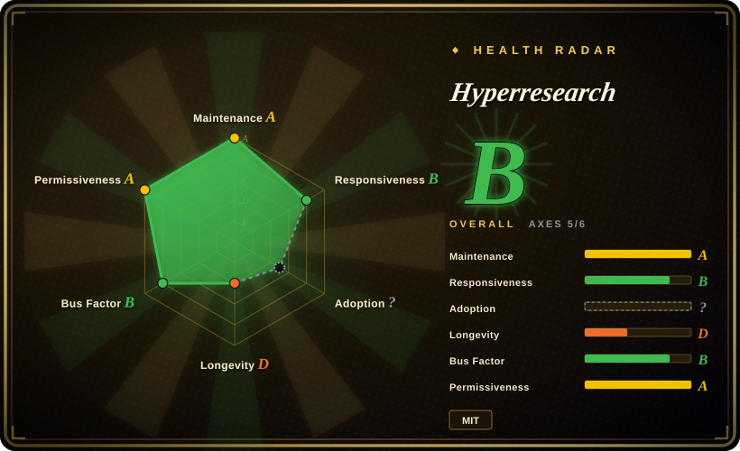

# Hyperresearch

A Claude Code deep-research harness: a tier-adaptive 16-step pipeline that turns one prompt into an adversarially-audited report with verified citations, and stores every source it reads in a persistent, searchable vault that future sessions reuse.

## When to use

You're an engineer or researcher working inside Claude Code, facing a question where a wrong or hallucinated citation is expensive — picking a foundational technology for a product, surveying a contested field before a build-vs-buy call, or writing a document that others will audit. You run `/hyperresearch <question>` and get a full pipeline: query decomposition, a width sweep across 55–130+ sources, contradiction clustering, parallel depth investigators, three independent draft angles, four adversarial critics, a skeptical cite-checker that verifies each cited source actually supports its sentence, and a tool-locked patcher that can only apply surgical edits — it physically cannot rewrite the report. Everything fetched lands in a SQLite-indexed markdown vault your next session searches before fetching anything new.

Pick this over the other deep-research options when the deciding factor is **verification rigor and compounding context inside Claude Code**, not portability or cost. GPT Researcher and Local Deep Research are framework/self-host plays that run on any LLM but ship lighter citation auditing; Hyperresearch's differentiation is the adversarial review chain (critics → gap-fetch → surgical patch → cite-check) plus the persistent vault. The tradeoff you accept: it only works in Claude Code, runs long (0.5–8 hours depending on tier), and burns serious tokens per run.

## When NOT to use

- **Routine engineering selection questions.** "Is this library maintained / A vs B for my scale" needs 10–20 sources and half an hour, not a 16-step pipeline — the citation-audit apparatus is overkill. Use a light manual pass (repo metadata + issue sampling) or [GPT Researcher](gpt-researcher.md) for a cheaper generic agent.
- **You're not on Claude Code.** The whole pipeline activates through Claude Code's Skill/subagent machinery; there is no standalone agent runtime. For any-LLM or other-harness research use [GPT Researcher](gpt-researcher.md) (framework) or [Local Deep Research](local-deep-research.md) (self-hosted) instead.
- **Tight token or time budget.** Even the `light` tier is ~30–40 minutes; `full` runs 1.5–2.5 h and `premier` gear 3–5 h with 100–130+ sources, all billed to your Claude usage (a past token-overconsumption bug, #83, was fixed but the design is inherently heavy). For a fast cited answer, a SaaS deep-research product (OpenAI / Gemini Deep Research, 未收录) is one click.
- **Queries must stay fully on your own infrastructure.** It fetches the live web and runs on Anthropic models through Claude Code. For fully-local inference and queries that never leave your machine, use [Local Deep Research](local-deep-research.md).
- **You're choosing it because it "leads DeepResearch-Bench."** That claim is the project's own stratified-pilot projection with third-party validation still pending (stated in its own README footnote) — treat it as marketing until independently replicated. [未验证]
- **You need stable interfaces today.** Pre-1.0 with fast churn — three releases landed on 2026-09-11 alone, and open issues document contradictory prompt contracts and duplicated config constants (#101/#102). Pin a version and re-read the docs after upgrades.

## Comparison

| Alternative | In index | Our verdict | Tradeoff |
|---|---|---|---|
| [GPT Researcher](gpt-researcher.md) | ✅ | Pick GPT Researcher when you need an LLM-agnostic research framework to embed in your own stack; pick Hyperresearch when you're already in Claude Code and want the strongest built-in citation auditing. | GPT Researcher is provider-agnostic and integrable but its output verification is lighter; Hyperresearch is Claude-Code-locked with a heavier adversarial chain. |
| [Local Deep Research](local-deep-research.md) | ✅ | Pick Local Deep Research when queries or documents must stay on your own machine with local models; pick Hyperresearch when report rigor matters more than locality. | Local Deep Research trades cloud-model quality for privacy and zero API dependency; Hyperresearch spends Anthropic tokens for a deeper critic/cite-check pipeline. |
| [Vane](vane.md) | ✅ | Pick Vane when you want a self-hosted Perplexity-style cited answer engine over your own SearxNG for everyday questions; pick Hyperresearch for occasional high-stakes reports, not daily lookup. | Vane is an always-on answer service with modest per-query depth; Hyperresearch is a batch report factory with 0.5–8 h runs. |
| [deep-research](deep-research.md) | ✅ | Pick the ~500-LOC reference implementation when you want to fork and understand a minimal agent loop; pick Hyperresearch when you want a finished, governed pipeline instead of a starting point. | The reference repo is readable and hackable but shallow; Hyperresearch is production-shaped but much harder to modify safely. |
| OpenAI / Gemini Deep Research (未收录) | ❌ | Pick the SaaS products when you want a one-click cited report with zero setup and predictable per-report pricing; pick Hyperresearch when you need the sources vault, resumable runs, and the audit trail on your own disk. | SaaS deep research is faster to first report and model-vendor-tuned, but closed, session-scoped, and non-inspectable; Hyperresearch is slower and token-hungry yet transparent and compounding. |

## Tech stack

Python 3.11–3.13 package (typer/rich/pydantic/jinja2 CLI) that installs step-skills and subagent definitions into Claude Code; crawl4ai for web fetching, PyMuPDF for PDF extraction, SQLite + markdown for the vault; optional MCP server (`mcp>=1.6,<2`, upper-bounded on purpose), optional scholarly clients (OpenAlex, Crossref, CORE, DOAB, ClinicalTrials.gov, SEC EDGAR, FRED), optional search providers (exa, tavily, Parallel) and embeddings (voyage/openai/none).

## Dependencies

- **Claude Code** (hard requirement — pipeline steps and subagents run through it; Anthropic usage is billed per run).
- **Python 3.11–3.13** (3.14 unsupported as of 2026-09), pip install from PyPI.
- No always-on service: the vault is local SQLite + markdown on disk; runs resume from a manifest after crashes.
- Optional: exa/tavily/Parallel API keys for extra search providers, a Chrome instance for the browser-fetcher escalation path, espeak-free local embeddings are opt-in (`none` default needs zero keys).

## Ops difficulty

**Low-to-medium.** Install is `pip install hyperresearch && hyperresearch install` per project (or `--global`); there is no daemon or database server to operate. The operational burden is not uptime but **run economics and churn**: runs last 0.5–8 h and consume significant Claude tokens, gears/profiles live in `.hyperresearch/config.toml`, and pre-1.0 releases can shift contracts between versions (documented in its own issue tracker). Long-running "watch" and MCP extras exist but are optional.

## Health & viability

- **Maintenance (2026-09):** active — v0.11.1 released 2026-09-11, last push 2026-09-12, 14 releases since creation. Cadence is real but spiky (three releases in one day), consistent with the pre-1.0 contract churn flagged in its own issues.
- **Governance / bus factor:** `User`-owned repo (jordan-gibbs) with 15 contributors — more than a solo project, but roadmap and quality bar remain owner-centric. [推断]
- **Age & Lindy (2026-09):** created 2026-04-09, ~5 months old — young; the elaborate 16-step design has not yet survived a year of upstream Claude Code behavior changes. Adopt for current value, not longevity.
- **Adoption:** ~3.3k stars / 325 forks (2026-09-16), published on PyPI; Hacker News traction minimal (one 2026-04 submission, 2 points). Issue tracker quality is unusually high — deep, root-caused reports with many fixes shipped (#72 stored XSS, #83 token overconsumption, #88 contract audit) — a better signal than stars. [推断]
- **Risk flags:** the headline "leads DeepResearch-Bench" is a self-run projection, third-party validation pending (its own footnote). MIT license — no relicense exposure. Security posture is proactive (untrusted-content fencing against prompt injection), but the attack surface (fetching arbitrary web content into agent context) is inherent to the category. [未验证]

## Caveats (unverified)

- [未验证] Stars (~3.3k) / forks (325) / contributor count (15) per GitHub API on 2026-09-16; date-sensitive.
- [未验证] The DeepResearch-Bench RACE leaderboard claim is a self-run "stratified pilot" projection per the README footnote; no independent replication found.
- [未验证] Tier runtimes (light ~30–40 min, full 1.5–2.5 h, dissertation 4–8 h), source counts (55–450), and word targets are the author's own numbers.
- [未验证] Claude-Code-only support is per the README; no Codex/other-harness path documented as of 2026-09-16.
- [未验证] HN traction assessment is based on one Algolia query (single 2026-04 submission, 2 points) — a thin sample.
- [推断] The 15-contributor count suggests some review surface, but merge rights and decision structure are unpublished; effective bus factor may be 1.
- [推断] Vault compounding value depends on repeatedly researching one domain; one-off users won't realize it.
