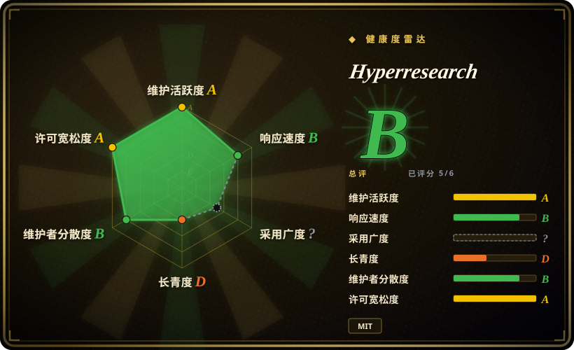

# Hyperresearch

一个 Claude Code 深度研究 harness：分档自适应的 16 步流水线，把一个 prompt 变成经过对抗式审计、引用逐条核验的报告，并把读过的每个来源存进持久可检索的 vault，供后续会话复用。

## 何时使用

你是在 Claude Code 里工作的工程师或研究员，面对一个引用错了代价很大的问题——为产品选基础技术栈、在 build-vs-buy 决策前调研一个有争议的领域、写一份会被别人审计的文档。你运行 `/hyperresearch <问题>`，得到一条完整流水线：查询分解、55–130+ 源的广度扫描、矛盾聚类、并行深度调查 agent、三个独立起草角度、四个对抗式 critic、一个怀疑式 cite-checker 逐条核验「被引来源是否真支持这句断言」，以及一个工具锁死的 patcher——只能做外科式编辑，物理上无法重写整篇报告。抓到的所有内容都落进 SQLite 索引的 markdown vault，下个会话先搜它再抓新东西。

当决定因素是 **Claude Code 内的验证严谨度和复利上下文**，而不是可移植性或成本时，选它而不是其它 deep-research 选项。GPT Researcher 和 Local Deep Research 是框架/自托管路线、任意 LLM 可用，但引用审计更轻；Hyperresearch 的差异化在对抗式评审链（critics→补抓→外科 patch→引用核验）加持久 vault。你接受的取舍：只在 Claude Code 里能用、跑很久（按档位 0.5–8 小时）、每跑一次烧大量 token。

## 何时不用

- **日常工程选型问题。**「这个库还在维护吗 / A 和 B 哪个适合我的规模」要的是 10–20 个源加半小时，不是 16 步流水线——引用审计装置在这里纯属 overkill。用轻量手动流程（仓库元数据+issue 采样）或 [GPT Researcher](gpt-researcher.zh.md) 这类更便宜的通用 agent。
- **不在 Claude Code 上。** 整条流水线靠 Claude Code 的 Skill/subagent 机制激活，没有独立 agent 运行时。要任意 LLM 或其它 harness，用 [GPT Researcher](gpt-researcher.zh.md)（框架）或 [Local Deep Research](local-deep-research.zh.md)（自托管）。
- **token 或时间预算紧张。** 即使 light 档也要约 30–40 分钟；full 档 1.5–2.5 小时、premier 档 3–5 小时、100–130+ 源，全部计入你的 Claude 用量（曾有 token 过度消耗的 bug，#83，已修，但设计本身就重）。要快速拿到带引用的答案，OpenAI / Gemini Deep Research 这类 SaaS（未收录）一键就有。
- **查询必须完全留在自己的基础设施上。** 它抓的是活网页、跑在 Anthropic 模型上。要全本地推理、查询不出本机，用 [Local Deep Research](local-deep-research.zh.md)。
- **冲着「DeepResearch-Bench 领先」来的。** 这个宣称是项目自己的分层试点 projection，第三方验证仍在 pending（README 脚注自己写明）——在独立复现之前按营销处理。[未验证]
- **今天就需要稳定接口。** pre-1.0 且 churn 快——光 2026-09-11 一天就发了三个 release，open issue 里记载着 prompt 契约互相矛盾、配置常量写两处（#101/#102）。用就 pin 版本，升级后重读文档。

## 横向对比

| 替代品 | 是否收录 | 我们的评价 | 取舍 |
|---|---|---|---|
| [GPT Researcher](gpt-researcher.zh.md) | ✅ | 需要 LLM 无关的研究框架嵌进自己的技术栈时选 GPT Researcher；已在 Claude Code 里且要最强的内置引用审计时选 Hyperresearch。 | GPT Researcher 提供商无关、可集成，但产出验证更轻；Hyperresearch 锁死 Claude Code，换来更重的对抗式链条。 |
| [Local Deep Research](local-deep-research.zh.md) | ✅ | 查询或文档必须留在本机、用本地模型时选 Local Deep Research；报告严谨度比本地化更重要时选 Hyperresearch。 | Local Deep Research 用云端模型质量换隐私和零 API 依赖；Hyperresearch 烧 Anthropic token 换更深的 critic/引用核验流水线。 |
| [Vane](vane.zh.md) | ✅ | 要一个自托管的 Perplexity 式带引用答案引擎、跑在自己 SearxNG 上回答日常问题时选 Vane；偶发的高风险报告才选 Hyperresearch，它不是日常查询工具。 | Vane 是常开答案服务、单次查询深度有限；Hyperresearch 是批量报告工厂，单次 0.5–8 小时。 |
| [deep-research](deep-research.zh.md) | ✅ | 想 fork 一个约 500 行的最小参考实现、读懂 agent 循环时选它；要一套现成的、有治理的流水线而不是起点时选 Hyperresearch。 | 参考实现可读可改但浅；Hyperresearch 是生产形态但难改动得多。 |
| OpenAI / Gemini Deep Research（未收录） | ❌ | 要零配置、一键、单次价格可预期的带引用报告时选这些 SaaS；要来源 vault、可续跑的 run、以及审计轨迹留在自己磁盘上时选 Hyperresearch。 | SaaS 出第一份报告更快、由模型厂商亲自调优，但闭源、会话级、不可检视；Hyperresearch 更慢更费 token，但透明且复利。 |

## 技术栈

Python 3.11–3.13 包（typer/rich/pydantic/jinja2 CLI），负责把 step-skill 和 subagent 定义装进 Claude Code；crawl4ai 抓网页，PyMuPDF 解析 PDF，SQLite+markdown 做 vault；可选 MCP server（`mcp>=1.6,<2`，刻意卡上界）、可选学术源客户端（OpenAlex、Crossref、CORE、DOAB、ClinicalTrials.gov、SEC EDGAR、FRED）、可选搜索提供商（exa、tavily、Parallel）与嵌入（voyage/openai/none）。

## 依赖

- **Claude Code**（硬依赖——流水线步骤和 subagent 都跑在它里面；Anthropic 用量按次计费）。
- **Python 3.11–3.13**（截至 2026-09 不支持 3.14），从 PyPI pip 安装。
- 无常驻服务：vault 是本地 SQLite+markdown 文件；崩溃后 run 可从 manifest 续跑。
- 可选：exa/tavily/Parallel 的 API key（额外搜索源）、Chrome 实例（browser-fetcher 升级路径）；嵌入默认 `none`，零 key 可用。

## 运维难度

**低到中。** 安装是每个项目 `pip install hyperresearch && hyperresearch install`（或 `--global`）；没有 daemon 或数据库服务要养。运维负担不在可用性而在**运行经济学与 churn**：一次 run 0.5–8 小时且消耗可观的 Claude token，gear/profile 配置在 `.hyperresearch/config.toml`，pre-1.0 的契约可能随版本变动（其自家 issue  tracker 有据可查）。watch 和 MCP 等附加件都是可选。

## 健康度与可持续性

- **维护（2026-09）：** 活跃——v0.11.1 发布于 2026-09-11，最近 push 2026-09-12，创建以来 14 个 release。节奏真实但呈脉冲式（一天三个 release），与其自家 issue 记载的 pre-1.0 契约 churn 一致。
- **治理 / 巴士因子：** `User` 所有仓库（jordan-gibbs），15 个 contributor——超出纯单人项目，但路线图与质量标准仍是以 owner 为中心。[推断]
- **年龄与 Lindy（2026-09）：** 创建于 2026-04-09，约 5 个月——年轻；这套精巧的 16 步设计还没经历过一年的 Claude Code 上游行为变迁。按当前价值采用，别按寿命押注。
- **采用：** 约 3.3k star / 325 fork（2026-09-16），已上 PyPI；Hacker News 声量极小（2026-04 一次 submission，2 分）。issue 质量异常高——带根因的深度报告多、修复落地多（#72 stored XSS、#83 token 过度消耗、#88 契约审计）——这比 star 更可信。[推断]
- **风险标记：** 头条宣称「领跑 DeepResearch-Bench」是自测 projection，第三方验证 pending（其自家脚注写明）。MIT 许可证——无再许可风险。安全姿态主动（对抓取内容做 untrusted 围栏防提示注入），但「把任意网页内容喂进 agent 上下文」的攻击面是该品类固有的。[未验证]

## 存疑（未验证）

- [未验证] star（约 3.3k）/ fork（325）/ contributor 数（15）来自 2026-09-16 的 GitHub API；对日期敏感。
- [未验证] DeepResearch-Bench RACE 榜单宣称是项目自测的「分层试点」projection（README 脚注）；未找到独立复现。
- [未验证] 各档运行时长（light 约 30–40 分、full 1.5–2.5 小时、dissertation 4–8 小时）、源数量（55–450）、字数目标均为作者自述。
- [未验证] 仅支持 Claude Code 的说法来自 README；截至 2026-09-16 未见 Codex/其它 harness 路径。
- [未验证] HN 声量判断基于一次 Algolia 查询（仅 2026-04 一条 submission、2 分）——样本很薄。
- [推断] 15 个 contributor 说明有一定评审面，但合并权限与决策结构未公开；有效巴士因子可能仍是 1。
- [推断] vault 的复利价值取决于是否在同一领域反复调研；一次性用户拿不到这个价值。
