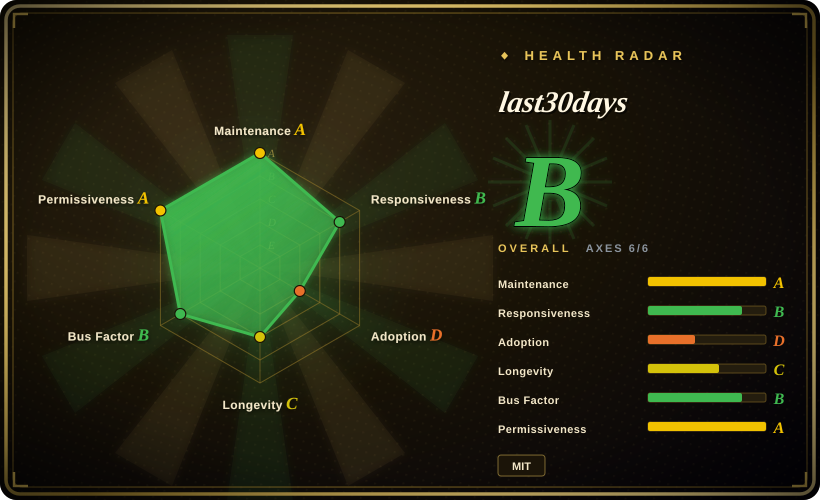
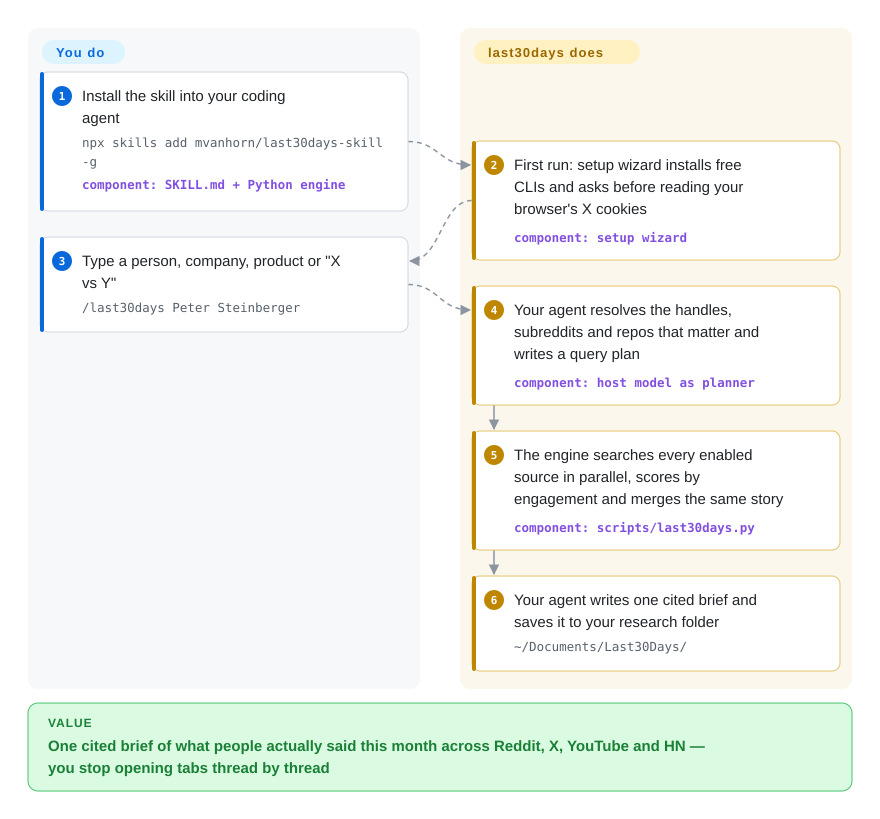

# last30days

You ask your agent what people think of a product, a person or a news story, and it hands back a vendor blog from last year and a LinkedIn profile from 2023 — the real conversation is in this week's Reddit comments, X threads and YouTube videos, which web search barely reaches. last30days is an agent skill that searches those community sources for the last 30 days in parallel, ranks what it finds by upvotes, likes and prediction-market money, and has your agent write one cited brief.

## When to use

You're a founder, analyst or content creator working inside Claude Code, Codex or another agent host. Tomorrow you have a call with a CEO, or you need to know whether developers actually like the tool you're about to adopt, or a story broke yesterday and you want the reaction, not the press release. Today you'd open r/ClaudeCode, search X, skim three YouTube reviews and check the Hacker News thread — an hour of tabs — and your agent's own web search would still return `Company X (@companyx) · LinkedIn` and a 2024 "top 10 tools" listicle. You type `/last30days <topic>` instead: your agent works out which handles, subreddits and repos matter, the bundled engine queries Reddit (with top comments), X, YouTube transcripts, TikTok, Hacker News, Polymarket, GitHub and more in one run, and you get a brief whose every claim carries the thread, the upvote count or the market odds it came from.

Pick it over the other research agents when the deciding factor is **recency and community signal rather than depth of literature**. GPT Researcher and Hyperresearch build long reports from the open web and papers; Agent-Reach gives your agent tools to fetch individual platforms but leaves ranking and synthesis to you. last30days is the one that fuses many social sources, weights them by what people actually engaged with, and packages that as a single slash command. The price you accept: a very large prompt loaded on every call, reliance on scraping and your own browser session for some sources, and a pay-as-you-go third-party scraper for TikTok/Instagram/LinkedIn.

## How it works

The project ships two halves that talk to each other. The `SKILL.md` file is a long instruction contract your agent reads: it tells the agent to run a first-time setup wizard, to act as the *planner* (turn your topic into search queries and a list of accounts, subreddits and repos worth checking), and to follow strict rules when writing the final brief. The Python engine (`scripts/last30days.py`, standard library only) does the mechanical work the agent can't do from its own tools: it calls each source's API, public feed or scraper in parallel, scores every item by relevance, freshness and engagement, merges copies of the same item found through different searches, and clusters the same story told on several platforms. Your agent then turns the engine's ranked evidence into the brief. What it does for you: finding the right communities, fetching, scoring, de-duplicating and citing. What you do: install it, answer the setup questions (including whether it may read your browser's X login), bring API keys for the paid sources you want, and type the topic. Think of a wire-service editor who reads every forum overnight and hands you one sheet — except the editor ranks stories by how many readers reacted, not by what the newsroom thinks matters.

<!-- flow-steps:begin (generated from flows/last30days.json by tools/flow_card.py — do not edit) -->

Text version of the flow

1. **You**: Install the skill into your coding agent — `npx skills add mvanhorn/last30days-skill -g` — component: `SKILL.md + Python engine`
2. **last30days**: First run: setup wizard installs free CLIs and asks before reading your browser's X cookies — component: `setup wizard`
3. **You**: Type a person, company, product or "X vs Y" — `/last30days Peter Steinberger`
4. **last30days**: Your agent resolves the handles, subreddits and repos that matter and writes a query plan — component: `host model as planner`
5. **last30days**: The engine searches every enabled source in parallel, scores by engagement and merges the same story — component: `scripts/last30days.py`
6. **last30days**: Your agent writes one cited brief and saves it to your research folder — `~/Documents/Last30Days/`

**Value**: One cited brief of what people actually said this month across Reddit, X, YouTube and HN — you stop opening tabs thread by thread

<!-- flow-steps:end -->

## When NOT to use

- **The answer lives in papers, docs or anything older than a month.** The whole pipeline is windowed to the last 30 days (with an `--as-of` flag to move the window, not widen it) and ranked by social engagement, so a 2023 design paper or a well-cited survey loses to a viral thread. For a literature-grounded report use [GPT Researcher](gpt-researcher.md) or [STORM](storm.md); for an audited, citation-checked report inside Claude Code use [Hyperresearch](hyperresearch.md).
- **Your agent just needs to read one platform, not a ranked brief.** If the task is "fetch this YouTube transcript" or "search X for this handle" inside your own workflow, last30days' planner, scoring and synthesis contract are overhead. [Agent-Reach](agent-reach.md) installs per-platform fetch tools your agent calls directly, with fallback backends per platform.
- **Your context or token budget is tight.** `SKILL.md` for v3.25.0 is 258,132 bytes (2,424 lines) and a skill body loads in full each time it is invoked; issue #956 measured ~56k tokens per call back when the file was 224 KB, and it has grown since. The proposed split into on-demand reference files was still held for the maintainer's decision on 2026-09-21. On small-context models or metered API plans, run the engine headlessly (`python3 skills/last30days/scripts/last30days.py "topic" --emit=json`) from your own script, or use [Agent-Reach](agent-reach.md), whose tool calls carry no such prompt.
- **You operate under platform terms or an employer's compliance rules.** The free paths scrape Reddit (RSS, the new-Reddit HTML, and the arctic-shift archive), read X through your own browser session cookies with a vendored copy of the unofficial Bird client, and route TikTok/Instagram/LinkedIn through ScrapeCreators, a commercial scraping API. None of the README or CONFIGURATION text discusses platform terms or account risk [推断]. On a work account, pin the licensed X path (`X_BEARER_TOKEN` with `LAST30DAYS_X_BACKEND=xapi`, which only reaches about the last week without full-archive access) and leave the scraping sources off — or use a licensed social-listening product.
- **The machine holds credentials you can't risk.** Setup can decrypt browser cookies (Chromium family, Firefox, Safari) and read macOS Keychain or `pass(1)` entries. A coordinated security disclosure (#663, 2026-06-23) about ambient credential access, cookie decryption and undisclosed LLM data sharing was still labelled "hold-captain-security" on 2026-09-22; the specific SessionStart hook it named is no longer in the tree. On a locked-down machine, decline the cookie step or use the Claude Desktop MCP bundle, which denies browser cookies by default — or use [Local Deep Research](local-deep-research.md) for research that stays on your hardware.
- **Queries must not leave your machine.** Every topic goes to Reddit, X, YouTube, the search backend, any paid API you've enabled, and the hosting model. For private research over local models and your own documents, use [Local Deep Research](local-deep-research.md).
- **You're on Windows.** The Claude Desktop `.mcpb` bundle ships for macOS and Linux only ("Windows support is deferred"), browser-cookie X login on Windows is Firefox-only, and open issues #110 and #823 report subprocess-timeout cleanup failures and orphaned Node processes exhausting RAM. Use WSL, or [Agent-Reach](agent-reach.md) for platform fetching.
- **You want to build a product on its output.** The user-facing contract is a prose prompt that changes almost weekly (46 releases in eight months), and sources break when upstream platforms move (a dead Reddit JSON API, yt-dlp bot-gating, Instagram search returning nothing in #1020). If you do integrate, consume the versioned `--emit=json` agent profile, pin a release, and set `LAST30DAYS_STRICT_EXIT=1` so degraded runs exit non-zero instead of returning a quietly partial brief.

## Comparison

| Alternative | In index | Our verdict | Tradeoff |
|---|---|---|---|
| [Agent-Reach](agent-reach.md) | ✅ | Pick Agent-Reach when your agent needs raw access to web and social platforms inside a workflow you design; pick last30days when you want the ranked, cross-platform "what are people saying" brief done for you. | Agent-Reach: thin tool layer with per-platform fallback backends and no big prompt, but no scoring, clustering or synthesis. last30days: engagement-weighted fusion and a finished brief, but a ~258 KB skill prompt per call and an opinionated output contract. |
| [GPT Researcher](gpt-researcher.md) | ✅ | Pick GPT Researcher for an LLM-agnostic, embeddable agent that writes long reports from web pages and documents; pick last30days when the question is about this month's community reaction rather than settled knowledge. | GPT Researcher: framework you can host behind an API, any time horizon, weak on Reddit comments and X. last30days: strong on social and prediction-market signal, 30-day window, runs as a skill inside an agent host. |
| [Hyperresearch](hyperresearch.md) | ✅ | In Claude Code, pick Hyperresearch for a high-stakes report whose citations must be checked one by one; pick last30days for a quick pulse check you'll act on the same day. | Hyperresearch: adversarial critics, cite-checking and a source vault, at 0.5–8 hours and heavy tokens per run. last30days: minutes per run and social depth, but no per-claim citation audit. |
| MediaCrawler | 未收录 | Pick MediaCrawler when you need bulk raw posts and comments from Xiaohongshu, Douyin, Kuaishou, Bilibili, Weibo, Tieba or Zhihu for your own analysis, and your use is non-commercial; pick last30days for English-language platforms and a synthesized brief. | MediaCrawler (NanmiCoder, ~65.9k stars, pushed 2026-09-19): Playwright-based crawlers with data export, but under a non-commercial learning license and with no ranking or synthesis. last30days covers Xiaohongshu only through a local helper service. Not added in this tab-intake batch. |
| Grok DeepSearch / Perplexity | not a repo | Pick a hosted answer engine when you want zero setup and don't need Reddit comments or engagement counts; pick last30days when you want the community signal, local saved briefs, and your own keys. | Hosted services: one click and vendor-tuned, but closed, each limited to the platforms its vendor has access deals with (the README's example: ChatGPT reaches Reddit but not X or TikTok), and nothing lands on your disk. last30days: you assemble access yourself, and keep the output. Closed services, so out of scope for this index. |

## Tech stack

- **Engine:** Python ≥ 3.12, standard library only — `pyproject.toml` declares `dependencies = []`; about 98 modules under `skills/last30days/scripts/lib/` (one per source plus planner, fusion, clustering, rerank, render). The skill can provision Python 3.12 through `uv` on hosts that lack it.
- **Agent contract:** `skills/last30days/SKILL.md` (Agent Skills format) plus native plugin manifests for Claude Code (`.claude-plugin/`), Codex (`.codex-plugin/`), Grok Build (`.grok-plugin/`) and Gemini CLI (`gemini-extension.json`).
- **X search:** a vendored subset of the Bird CLI (`bird-search`, based on steipete/bird v0.8.0, MIT) running on Node ≥ 22; alternatives are the official X API, xAI's search, Xquik, or the Grok CLI.
- **Claude Desktop:** a Go MCP server (`mcp/`, built on `mark3labs/mcp-go`) that embeds the Python engine and shells out to the host's `python3`, packaged as `.mcpb` bundles.
- **Storage:** Markdown briefs under `~/Documents/Last30Days/`, an optional SQLite store (`--store`) for trend monitoring, and a generated HTML/Atom library feed.
- **Quality gates:** pytest suite (README says 2,700+ tests) with an 84% coverage floor, plus Semgrep, OSV-Scanner, zizmor and OpenSSF Scorecard workflows in CI.

## Dependencies

- An **agent host**: Claude Code, Codex, Cursor, Copilot, Gemini CLI, Grok Build, OpenClaw or another Agent Skills host; claude.ai (with code execution enabled) or Claude Desktop via the `.mcpb` bundle.
- **Python 3.12+** on PATH (or `uv` so the skill can provision one); **Node ≥ 22** for the cookie-based X path.
- **Zero-key sources:** Reddit (with comments), Hacker News, Polymarket, GitHub and StockTwits work out of the box; arXiv, Techmeme and Digg need small CLIs the setup wizard installs.
- **Optional keys and tools:** `yt-dlp` for YouTube; a ScrapeCreators key for TikTok, Instagram, Threads, Pinterest, LinkedIn and YouTube comments (10,000 free calls, then pay as you go); a logged-in browser or `X_BEARER_TOKEN` / `XAI_API_KEY` / `XQUIK_API_KEY` for X; a Bluesky app password; Brave/Exa/Serper/Parallel for web search when the host has none; Perplexity or OpenRouter for the Perplexity source.
- **Headless runs** (cron, CI, watchlists) additionally need one reasoning provider key — Gemini, OpenAI, xAI or OpenRouter — or fall back to lower-quality deterministic planning.

## Ops difficulty

**Low to install, medium to keep working.** Installation is one command and there is no server to run. The ongoing cost is source upkeep: keys for the sources you want, a browser session for X that expires, `yt-dlp` updates as YouTube tightens bot checks, and upstream platforms that change without notice (issues record Reddit's JSON API dying, GitHub search returning HTTP 422, and Instagram search returning nothing). A built-in `doctor` command reports which sources are working, unverified, broken or available, and `doctor --postmortem` explains what failed in the last run. The other running cost is tokens: the big skill prompt on every call, plus the ScrapeCreators or search API bills if you enable them. Recurring monitoring (`watchlist.py`, `briefing.py`) adds a scheduler you own.

## Health & viability

- **Maintenance — very active (as of 2026-09-28).** v3.25.0 released 2026-09-18; 46 releases since the repo was created, with CHANGELOG entries generated by towncrier; last push 2026-09-27 (dependency bumps). Not archived.
- **Governance and bus factor — one owner with a real second maintainer.** User-owned by Matt Van Horn (`mvanhorn`, 472 commits); `tmchow` has 343 commits and the next contributors have 37–40 each, out of 129 contributors in total. Issue triage is run by an AI agent speaking as "Matt's firstmate", which labels items and holds anything security-related for the owner ("hold-captain") — so decisions still funnel through one person.
- **Age and Lindy — young.** Created 2026-01-23, about eight months old at verification. There is no track record to lean on; judge it by the visible engineering discipline (coverage floor, security scanning, named-failure-mode notes in `SKILL.md`) rather than by age.
- **Adoption.** About 63.1k stars and 5.5k forks (2026-09-28), a README badge claiming #1 on GitHub Trending, and distribution through the Claude Code marketplace, `npx skills`, ClawHub and an xAI plugin listing. The star count on an eight-month-old repo reflects hype as much as usage [推断]; the 129 contributors and steady external PRs are the stronger signal.
- **Risk flags.** MIT, no CLA found, no relicense history. The risks are operational rather than legal: dependence on scraping and unofficial clients that platforms can break or disallow; a commercial scraper (ScrapeCreators) built into onboarding, including a GitHub device-login flow that mints its key; an open security disclosure (#663) about credential and cookie handling; and a context cost (#956) that grows with every feature. A prompt-injection fence escape (#1054) is fixed in the current `rerank.py` although the issue is still open.

## Caveats (unverified)

- [推断] "No platform-terms or account-risk discussion in README or CONFIGURATION" is based on a keyword search (terms, suspend, ban) of those two files on 2026-09-28; the 258 KB `SKILL.md` was only spot-checked.
- [推断] The current per-call token cost (~64k tokens) is extrapolated from issue #956's ~56k tokens at 224 KB using the current 258 KB file size; it was not measured.
- [未验证] The ScrapeCreators pricing (10,000 free calls, then pay as you go) and Brave's 2,000 free queries/month are as stated in the README, not checked against the vendors' pricing pages.
- [未验证] "2,700+ tests" is the README figure; a grep for `def test` across `tests/` on 2026-09-28 found about 4,800 test functions, so the README number is likely stale rather than inflated.
- [推断] That the star count overstates real usage is a judgment from the repo's age and trending history; no download or install telemetry exists to check it (the README says there is no tracking).
- [未验证] Whether the security disclosure #663's remaining findings (OAuth token transit via a third party, cookie-decryption surface, LLM data sharing) have been addressed in code; only the SessionStart hook's removal was confirmed.
- [未验证] Any business relationship between the project and ScrapeCreators; the onboarding promotes it and uses its GitHub device-auth endpoint, but no disclosure either way was found.
- [未验证] MediaCrawler's star count and platform list come from the GitHub API and description on 2026-09-28; its crawlers were not run.
