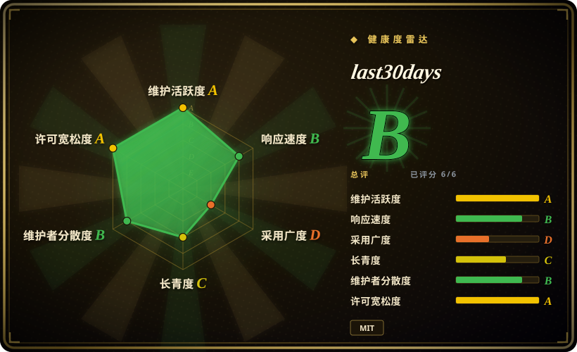
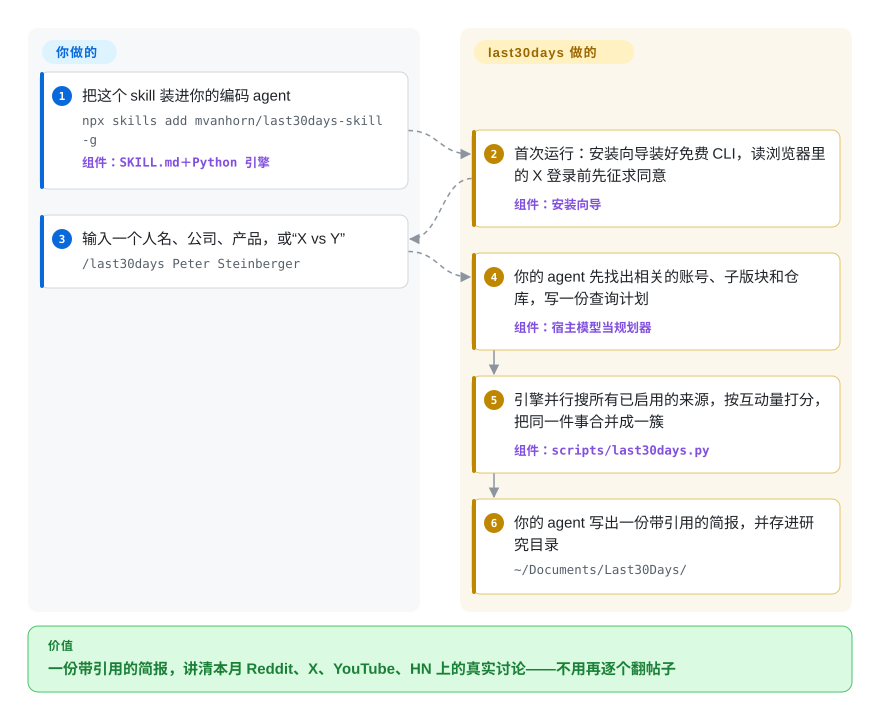

# last30days

你问 agent 大家怎么看某个产品、某个人或某条新闻，它递回来一篇去年的厂商博客和一份 2023 年的 LinkedIn 简介——真正的讨论在这周的 Reddit 评论、X 帖子和 YouTube 视频里，普通网页搜索几乎够不着。last30days 是一个 agent skill：并行搜这些社区来源最近 30 天的内容，按点赞、投票和预测市场里押上的真钱排序，再让你的 agent 写出一份带引用的简报。

## 何时使用

你是创始人、分析师或内容创作者，平时在 Claude Code、Codex 或别的 agent 宿主里干活。明天要和一位 CEO 通电话；或者你要判断开发者到底喜不喜欢你准备引入的那个工具；或者昨天出了条新闻，你想看反应，而不是新闻稿。以前你会打开 r/ClaudeCode、搜 X、扫三个 YouTube 测评、再看 Hacker News 的帖子——一小时的标签页——而 agent 自带的网页搜索照样只给你 `Company X (@companyx) · LinkedIn` 和一篇 2024 年的“十大工具”盘点。现在你输入 `/last30days <主题>`：agent 先弄清楚哪些账号、子版块和仓库相关，随包的引擎一次跑完 Reddit（带高赞评论）、X、YouTube 字幕、TikTok、Hacker News、Polymarket、GitHub 等来源，你拿到的简报里每条说法都注明出自哪个帖子、多少赞、市场赔率是多少。

跟其他研究类 agent 比，决定性的差别在于：**要的是近期的社区信号，而不是文献深度**。GPT Researcher 和 Hyperresearch 从开放网页和论文里写长报告；Agent-Reach 给 agent 装上逐个平台抓取的工具，但排序和综合要你自己来。last30days 把多个社交来源融合在一起，按大家真实的互动量加权，打包成一条斜杠命令。你要接受的代价是：每次调用都要加载一份非常大的提示词；部分来源靠抓取和你自己的浏览器登录态；TikTok／Instagram／LinkedIn 要走一个按量付费的第三方抓取服务。

## 怎么用起来

项目由互相配合的两半组成。`SKILL.md` 是一份很长的指令契约，由你的 agent 读：它让 agent 跑首次安装向导，让 agent 充当**规划器**（把你的主题拆成搜索查询，并列出值得查的账号、子版块和仓库），并规定写最终简报时必须遵守的规则。Python 引擎（`scripts/last30days.py`，只用标准库）做 agent 靠自带工具做不了的机械活：并行调用各来源的 API、公开订阅源或抓取器，按相关度、新鲜度和互动量给每条内容打分，把不同搜索里抓到的同一条内容合并，再把几个平台上讲的同一件事归成一簇。最后由 agent 把引擎排好序的证据写成简报。它替你做的：找对社区、抓取、打分、去重、标注出处。你要做的：安装，回答安装向导的问题（包括是否允许它读你浏览器里的 X 登录），为想用的付费来源配好 API key，然后输入主题。像一位通宵读完所有论坛的通讯社编辑，早上递给你一页纸——只不过他排新闻的依据是多少读者有反应，而不是编辑部觉得什么重要。

<!-- flow-steps:begin (generated from flows/last30days.json by tools/flow_card.py — do not edit) -->

流程文字版

1. **你**：把这个 skill 装进你的编码 agent — `npx skills add mvanhorn/last30days-skill -g` — 组件：`SKILL.md＋Python 引擎`
2. **last30days**：首次运行：安装向导装好免费 CLI，读浏览器里的 X 登录前先征求同意 — 组件：`安装向导`
3. **你**：输入一个人名、公司、产品，或“X vs Y” — `/last30days Peter Steinberger`
4. **last30days**：你的 agent 先找出相关的账号、子版块和仓库，写一份查询计划 — 组件：`宿主模型当规划器`
5. **last30days**：引擎并行搜所有已启用的来源，按互动量打分，把同一件事合并成一簇 — 组件：`scripts/last30days.py`
6. **last30days**：你的 agent 写出一份带引用的简报，并存进研究目录 — `~/Documents/Last30Days/`

**价值**：一份带引用的简报，讲清本月 Reddit、X、YouTube、HN 上的真实讨论——不用再逐个翻帖子

<!-- flow-steps:end -->

## 何时不用

- **答案在论文、文档里，或者比一个月更早。** 整条流水线都限定在最近 30 天（`--as-of` 参数只能平移这个窗口，不能拉宽），并按社交互动排序，所以一篇 2023 年的设计论文或一篇被广泛引用的综述，会输给一个爆火的帖子。要基于文献的报告，用 [GPT Researcher](gpt-researcher.zh.md) 或 [STORM](storm.zh.md)；要在 Claude Code 里产出引用逐条核验的报告，用 [Hyperresearch](hyperresearch.zh.md)。
- **你的 agent 只需要读某一个平台，不需要排好序的简报。** 如果任务是在你自己的流程里“抓这个 YouTube 字幕”或“在 X 上搜这个账号”，last30days 的规划、打分和综合契约都是多余的开销。[Agent-Reach](agent-reach.zh.md) 给 agent 装上按平台划分的抓取工具，agent 直接调用，每个平台还有备用后端。
- **上下文或 token 预算紧。** v3.25.0 的 `SKILL.md` 有 258,132 字节（2,424 行），而 skill 正文每次调用都会整份加载；issue #956 在文件还是 224 KB 时就测得每次约 5.6 万 token，之后文件又变大了。把它拆成按需加载的参考文件的提议，截至 2026-09-21 仍在等维护者拍板。用小上下文模型或按量计费的 API 时，改为在你自己的脚本里无界面地跑引擎（`python3 skills/last30days/scripts/last30days.py "topic" --emit=json`），或者用 [Agent-Reach](agent-reach.zh.md)，它的工具调用不带这么大的提示词。
- **你受平台条款或雇主合规要求约束。** 免费路径会抓取 Reddit（RSS、新版 Reddit 的 HTML 页面，以及 arctic-shift 存档），用你自己浏览器的登录 cookie 加上随包附带的非官方 Bird 客户端读 X，并把 TikTok／Instagram／LinkedIn 交给商业抓取 API ScrapeCreators。README 和 CONFIGURATION 里都没有讨论平台条款或账号风险 [推断]。用工作账号时，钉死有授权的 X 路径（`X_BEARER_TOKEN` 加 `LAST30DAYS_X_BACKEND=xapi`，没有全量存档权限时只能覆盖约最近一周），关掉抓取类来源——或者改用有授权的舆情监测产品。
- **这台机器上有不能冒险的凭据。** 安装流程可以解密浏览器 cookie（Chromium 系、Firefox、Safari），也会读 macOS 钥匙串或 `pass(1)` 里的条目。一份关于常驻凭据访问、cookie 解密和未披露的 LLM 数据共享的协调披露（#663，2026-06-23）在 2026-09-22 仍标着“hold-captain-security”；它点名的那个 SessionStart hook 已经不在代码树里了。在管控严格的机器上，拒绝 cookie 那一步，或者用 Claude Desktop 的 MCP 包（默认禁止读浏览器 cookie）——或者用 [Local Deep Research](local-deep-research.zh.md) 做只留在本机的研究。
- **查询内容不能离开本机。** 每个主题都会发给 Reddit、X、YouTube、搜索后端、你启用的所有付费 API，以及宿主模型。要基于本地模型和你自己文档的私密研究，用 [Local Deep Research](local-deep-research.zh.md)。
- **你在 Windows 上。** Claude Desktop 的 `.mcpb` 包只出 macOS 和 Linux 版（README 写着“Windows support is deferred”），Windows 上用浏览器 cookie 登录 X 只支持 Firefox，未关闭的 issue #110 和 #823 报告了子进程超时清理失败、Node 孤儿进程吃光内存。用 WSL，或者用 [Agent-Reach](agent-reach.zh.md) 做平台抓取。
- **你想在它的输出上搭产品。** 面向用户的契约是一份几乎每周都在改的散文提示词（八个月 46 个版本），上游平台一变来源就坏（Reddit JSON API 停用、yt-dlp 被反机器人拦截、#1020 里 Instagram 搜索一律返回空）。真要集成，就用有版本号的 `--emit=json` agent 输出格式，钉住一个版本，并设置 `LAST30DAYS_STRICT_EXIT=1`，让来源降级的运行以非零码退出，而不是悄悄返回一份残缺的简报。

## 横向对比

| 替代品 | 是否收录 | 我们的评价 | 取舍 |
|---|---|---|---|
| [Agent-Reach](agent-reach.zh.md) | ✅ | agent 需要在你自己设计的流程里直接访问网页和社交平台，选 Agent-Reach；想要别人替你做好的、跨平台排好序的“大家在说什么”简报，选 last30days。 | Agent-Reach：薄薄一层工具，每个平台有备用后端，没有大提示词，但不打分、不聚类、不综合。last30days：按互动加权融合并直接出简报，但每次调用要带约 258 KB 的 skill 提示词，输出契约也很强势。 |
| [GPT Researcher](gpt-researcher.zh.md) | ✅ | 要一个不绑模型、可嵌入的 agent，从网页和文档写长报告，选 GPT Researcher；问题是“这个月社区什么反应”而不是既定知识，选 last30days。 | GPT Researcher：可以挂在 API 后面托管的框架，不限时间范围，但 Reddit 评论和 X 覆盖弱。last30days：社交和预测市场信号强，窗口 30 天，以 skill 形式跑在 agent 宿主里。 |
| [Hyperresearch](hyperresearch.zh.md) | ✅ | 在 Claude Code 里，要一份引用必须逐条核验的高风险报告，选 Hyperresearch；要一次当天就能拿来行动的快速摸底，选 last30days。 | Hyperresearch：对抗式评审、引用核验、来源库，每轮 0.5–8 小时且 token 消耗大。last30days：每轮几分钟、社交信息深，但没有逐条引用审计。 |
| MediaCrawler | 未收录 | 需要从小红书、抖音、快手、B 站、微博、贴吧、知乎批量拿原始帖子和评论自己分析，且用途非商业，选 MediaCrawler；面向英文平台、要一份综合好的简报，选 last30days。 | MediaCrawler（NanmiCoder，约 6.59 万星，2026-09-19 仍有推送）：基于 Playwright 的爬虫，能导出数据，但采用非商业学习许可证，也不排序、不综合。last30days 只能通过本地辅助服务覆盖小红书。本批次（tab-intake）未收录。 |
| Grok DeepSearch／Perplexity | 非仓库 | 想零配置、也不需要 Reddit 评论和互动数，选托管的答案引擎；想要社区信号、本地存档的简报、并用自己的 key，选 last30days。 | 托管服务：一键可用、由厂商调优，但闭源，只能覆盖厂商谈下接入的平台（README 的例子：ChatGPT 能搜 Reddit，搜不了 X 和 TikTok），结果也不落到你的磁盘上。last30days：接入要你自己拼，但输出归你。它们是闭源服务，不在本索引收录范围内。 |

## 技术栈

- **引擎：** Python ≥ 3.12，只用标准库——`pyproject.toml` 声明 `dependencies = []`；`skills/last30days/scripts/lib/` 下约 98 个模块（每个来源一个，另有规划、融合、聚类、重排、渲染）。宿主缺 Python 3.12 时，skill 可以通过 `uv` 自动装一个。
- **agent 契约：** `skills/last30days/SKILL.md`（Agent Skills 格式），外加 Claude Code（`.claude-plugin/`）、Codex（`.codex-plugin/`）、Grok Build（`.grok-plugin/`）和 Gemini CLI（`gemini-extension.json`）的原生插件清单。
- **X 搜索：** 随包附带的 Bird CLI 子集（`bird-search`，基于 steipete/bird v0.8.0，MIT），跑在 Node ≥ 22 上；备选是官方 X API、xAI 的搜索、Xquik 或 Grok CLI。
- **Claude Desktop：** 一个 Go 写的 MCP 服务器（`mcp/`，基于 `mark3labs/mcp-go`），内嵌 Python 引擎，运行时调用宿主的 `python3`，打包成 `.mcpb`。
- **存储：** 简报以 Markdown 存在 `~/Documents/Last30Days/`，可选的 SQLite 存储（`--store`）用于趋势追踪，另可生成 HTML／Atom 的研究库订阅源。
- **质量关卡：** pytest 测试集（README 说有 2,700 多个测试），覆盖率下限 84%；CI 里还有 Semgrep、OSV-Scanner、zizmor 和 OpenSSF Scorecard。

## 依赖

- 一个 **agent 宿主**：Claude Code、Codex、Cursor、Copilot、Gemini CLI、Grok Build、OpenClaw 或其他支持 Agent Skills 的宿主；claude.ai（需开启代码执行），或通过 `.mcpb` 包接入 Claude Desktop。
- PATH 上有 **Python 3.12+**（或有 `uv`，让 skill 自己装）；走 cookie 读 X 的路径需要 **Node ≥ 22**。
- **免 key 的来源：** Reddit（带评论）、Hacker News、Polymarket、GitHub 和 StockTwits 开箱即用；arXiv、Techmeme 和 Digg 需要几个小 CLI，由安装向导装好。
- **可选的 key 和工具：** YouTube 需要 `yt-dlp`；TikTok、Instagram、Threads、Pinterest、LinkedIn 和 YouTube 评论需要 ScrapeCreators 的 key（前 10,000 次调用免费，之后按量付费）；X 需要一个已登录的浏览器，或 `X_BEARER_TOKEN`／`XAI_API_KEY`／`XQUIK_API_KEY`；Bluesky 需要应用专用密码；宿主没有网页搜索时，用 Brave／Exa／Serper／Parallel；Perplexity 来源需要 Perplexity 或 OpenRouter 的 key。
- **无界面运行**（cron、CI、watchlist）还需要一个推理模型的 key——Gemini、OpenAI、xAI 或 OpenRouter——否则退回质量更低的确定性规划。

## 运维难度

**安装低，保持可用中等。** 装好只要一条命令，也没有要常驻的服务。持续的成本在来源维护：为想用的来源备好 key，X 的浏览器登录会过期，YouTube 收紧反机器人检查后要更新 `yt-dlp`，上游平台还会不打招呼地变（issue 里记录过 Reddit JSON API 停用、GitHub 搜索返回 HTTP 422、Instagram 搜索一律为空）。内置的 `doctor` 命令会逐个来源报告“在工作／已开启但未验证／坏了／可以开启”，`doctor --postmortem` 解释上一轮哪里出了问题。另一项持续成本是 token：每次调用都带那份大提示词，再加上你启用的 ScrapeCreators 或搜索 API 账单。定期监测（`watchlist.py`、`briefing.py`）还要你自己管一个定时任务。

## 健康度与可持续性

- **维护——非常活跃（截至 2026-09-28）。** v3.25.0 于 2026-09-18 发布；建仓以来共 46 个版本，CHANGELOG 由 towncrier 生成；最近一次推送在 2026-09-27（依赖升级）。未归档。
- **治理与巴士因子——一位所有者，外加一位实打实的第二维护者。** 仓库归个人 Matt Van Horn（`mvanhorn`，472 个提交）所有；`tmchow` 有 343 个提交，其后的贡献者各 37–40 个，贡献者共 129 人。issue 分诊由一个以“Matt 的大副”（firstmate）自称的 AI agent 负责，它打标签，并把所有安全相关的事项搁置等所有者处理（“hold-captain”）——所以决策仍然汇到一个人身上。
- **年龄与林迪效应——年轻。** 2026-01-23 创建，核实时约八个月大。没有历史可依；判断它要看肉眼可见的工程纪律（覆盖率下限、安全扫描、`SKILL.md` 里逐条记录的“具名失败模式”），而不是年头。
- **采用。** 约 6.31 万星、5.5 千 fork（2026-09-28），README 挂着一个自称登上 GitHub Trending 第一的徽章，并通过 Claude Code 插件市场、`npx skills`、ClawHub 和 xAI 插件列表分发。一个八个月大的仓库有这么多星，反映的热度不亚于真实使用 [推断]；129 位贡献者和持续不断的外部 PR 是更可靠的信号。
- **风险信号。** MIT 许可，未发现 CLA，没有改许可证的历史。风险在运营而非法律层面：依赖平台随时可能弄坏或禁止的抓取和非官方客户端；安装流程内置一个商业抓取服务（ScrapeCreators），甚至有一个用 GitHub 设备登录为你生成其 key 的流程；一份关于凭据和 cookie 处理的安全披露（#663）仍未关闭；上下文开销（#956）随每个新功能增长。一个提示注入的围栏逃逸问题（#1054）在当前的 `rerank.py` 里已修复，只是 issue 还没关。

## 存疑（未验证）

- [推断] “README 和 CONFIGURATION 没有讨论平台条款或账号风险”依据的是 2026-09-28 对这两个文件的关键词搜索（terms、suspend、ban）；258 KB 的 `SKILL.md` 只做了抽查。
- [推断] 当前每次调用的 token 开销（约 6.4 万）是按 issue #956 在 224 KB 时测得约 5.6 万 token、再按当前 258 KB 的文件大小外推出来的，没有实测。
- [未验证] ScrapeCreators 的价格（前 10,000 次免费，之后按量付费）和 Brave 每月 2,000 次免费查询取自 README，没有到厂商的价格页核对。
- [未验证] “2,700 多个测试”是 README 的数字；2026-09-28 在 `tests/` 下 grep `def test` 约有 4,800 个测试函数，所以 README 的数字更可能是过时了，而不是虚报。
- [推断] 星数高估了真实使用量，是根据仓库年龄和上榜经历做的判断；项目没有下载或安装遥测可以核对（README 说不做任何追踪）。
- [未验证] 安全披露 #663 其余的发现（OAuth token 经第三方中转、cookie 解密面、LLM 数据共享）是否已在代码里处理；只确认了 SessionStart hook 已被移除。
- [未验证] 项目与 ScrapeCreators 之间是否有商业关系；安装流程在推它，也用它的 GitHub 设备授权端点，但没找到任何一方的披露。
- [未验证] MediaCrawler 的星数和平台列表取自 2026-09-28 的 GitHub API 和仓库描述，没有实际运行它的爬虫。
