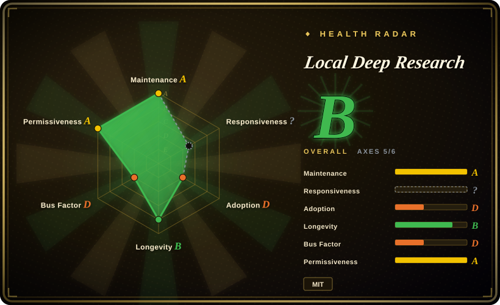
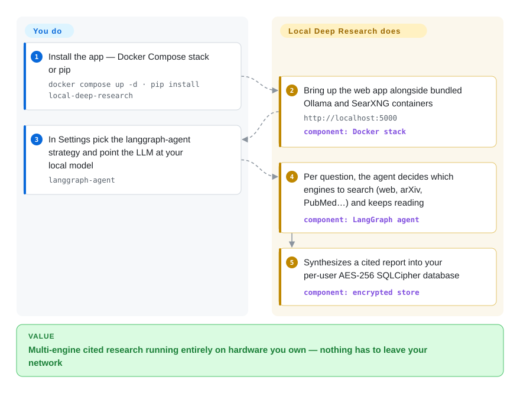

# Local Deep Research

A self-hostable deep-research assistant (web UI + API + CLI + MCP) that runs the whole iterative search-and-synthesize loop on your own machine, including with local LLMs and a local SearXNG meta-search, so nothing has to leave your network.

## When to use

You're an engineer or analyst at an org where research questions touch sensitive material — internal docs, patient or legal records, an unannounced product — and pasting any of it into a hosted "deep research" SaaS is a non-starter. You still want the real thing: an agent that fans out across many sources, reads them, and writes a cited report. Local Deep Research gives you that loop in a container you control. Point it at Ollama or LM Studio for the LLM and a bundled SearXNG for web search, and the entire pipeline — query planning, retrieval, synthesis, citations — runs on hardware you own, with per-user SQLCipher-encrypted (AES-256) storage so even the box's admin can't read your sessions.

You're also a good fit if your research is *academic or technical* rather than open-web trivia: LDR ships first-class connectors for arXiv, PubMed, Semantic Scholar, Wikipedia, GitHub, Wayback Machine, Elasticsearch and news sources, plus a knowledge-base mode that downloads and indexes sources into a private searchable library, a journal-quality filter (v1.6, powered by OpenAlex/DOAJ data) and subscribable research digests. You pick a depth — Quick Summary (30 seconds to 3 minutes) up to a full Report — and you can drive it from the web UI, a REST API, an in-process Python API, a CLI, or as an MCP server (`ldr-mcp`) so Claude or another agent can call it as a research tool. When you want cloud models, the same interface speaks to OpenAI / Anthropic / Gemini / OpenRouter; "local" is the default, not the only, mode.

## How it works

LDR is a research pipeline you host. You ask a question; its flagship `langgraph-agent` strategy — a LangGraph loop (a graph-shaped agent, not a fixed pipeline) in which the LLM itself decides what to search next — plans queries, picks engines (SearXNG web, arXiv, PubMed, …), reads the hits, keeps going until it has enough, then synthesizes a report with citations. What you touch is one of four surfaces: a Docker Compose stack that ships Ollama and SearXNG as sibling containers, `pip install` + `python -m local_deep_research.web.app` (web UI on `http://localhost:5000`), the REST/in-process Python API (`quick_summary()` can take your own LangChain retriever so LDR reads your existing knowledge base), or the `ldr-mcp` server for agent clients. Every user's sessions, reports and API keys live in that user's own SQLCipher-encrypted database whose key is derived from their password — the password *is* the key, so there is no recovery. What stays yours: the GPU and model management behind Ollama, keeping a self-run SearXNG un-blocked by search engines, and absorbing the breaking config changes the fast v1.10.x line still ships (its README keeps an explicit "Upgrading from Earlier Versions" section).

<!-- flow-steps:begin (generated from flows/local-deep-research.json by tools/flow_card.py — do not edit) -->

Text version of the flow

1. **You**: Install the app — Docker Compose stack or pip — `docker compose up -d · pip install local-deep-research`
2. **Local Deep Research**: Bring up the web app alongside bundled Ollama and SearXNG containers — `http://localhost:5000` — component: `Docker stack`
3. **You**: In Settings pick the langgraph-agent strategy and point the LLM at your local model — `langgraph-agent`
4. **Local Deep Research**: Per question, the agent decides which engines to search (web, arXiv, PubMed…) and keeps reading — component: `LangGraph agent`
5. **Local Deep Research**: Synthesizes a cited report into your per-user AES-256 SQLCipher database — component: `encrypted store`

**Value**: Multi-engine cited research running entirely on hardware you own — nothing has to leave your network

<!-- flow-steps:end -->

## When NOT to use

- **You have no GPU and want fully-local quality.** The headline accuracy numbers assume a capable local model (e.g. a 27B on a 3090). On a CPU-only box, local-model research is slow and weak; you'd fall back to cloud APIs, which defeats the privacy premise.
- **You want a tiny embeddable library, not an app.** LDR does expose an in-process API (`quick_summary()`), but it drags a full application's dependency tree behind it (web server, queue/dispatcher, encrypted DB, JS frontend, Python ≥ 3.12). If you just need a function that takes a query and returns a report inside your own service, a script-style tool like [deep-research](deep-research.md) is far lighter to vendor in.
- **You need a managed, zero-ops hosted product.** This is self-hosted by design — you run and maintain Ollama, SearXNG, the database and upgrades. There is no SaaS to sign up for.
- **You can't absorb breaking config changes.** The fast v1.10.x line still ships them, documented in the README itself: the `llm.model` default was removed in 1.6.3 (silent multi-GB model downloads stopped, but unconfigured installs now fail loudly), the `auto`/`parallel` meta search engines were deleted in favor of the langgraph-agent strategy, and llama.cpp support switched from in-process loading to an external `llama-server`. Pin a version and read the upgrade notes before bumping.
- **Adversarial fact-checking is the whole job.** LDR searches and synthesizes with citations, but it's not a dedicated claim-by-claim verification harness; if your need is "prove or disprove these specific claims," a verification-first pipeline fits better.
- **You distrust self-reported benchmarks.** The ~95% SimpleQA / 77% xbench-DeepSearch figures are the project's own, on chosen hardware/models — and the README itself flags "small samples, LLM-grader noise, and SimpleQA contamination risk". [未验证] Don't treat them as independent or as predictive of your model choice.

## Comparison

| Alternative | In index | Our verdict | Tradeoff |
|---|---|---|---|
| [deep-research](deep-research.md) | ✅ | Choose deep-research when you want a minimal TypeScript script you embed and own end-to-end; choose LDR when the deliverable is a deployable privacy product (multi-user, encrypted, UI, API) rather than code you keep rewriting. | Minimal TypeScript script you embed/own end-to-end; you wire your own LLM+search keys. Far lighter than LDR, but no UI, no local-LLM/privacy bundle, no academic-source connectors or encrypted multi-user store. |
| [Vane](vane.md) | ✅ | Choose Vane when you want a slick one-container self-hosted answer box (SearxNG bundled in the image since the 2026 releases, three depth modes); choose LDR when academic connectors, per-user encrypted multi-user storage and a benchmark harness matter. | Another self-hosted research/search agent. Simpler to run (one image), but its goal is cited quick answers, not LDR's deep-research strategies, encrypted per-user DBs and journal-quality filtering. |
| [Agent-Reach](agent-reach.md) | ✅ | Choose Agent-Reach when the deliverable is web/social *reach* rather than cited reports; it can also serve as LDR's missing eyes for Twitter/XiaoHongShu sources — pair them, don't pick. | Focuses on agent outreach/reach over web sources; adjacent but a different deliverable than LDR's cited research reports. |
| [GPT Researcher](gpt-researcher.md) | ✅ | Choose GPT Researcher when you want a popular Python deep-research agent with web UI/report export and don't mind cloud-LLM-first defaults; choose LDR when fully-local + encryption + academic connectors decide it. | Popular Python deep-research agent with web UI and report export; cloud-LLM-first by default. LDR leans harder into fully-local + encryption + academic connectors. |
| [MiroThinker](mirothinker.md) | ✅ | Choose MiroThinker when you want open-weights fine-tuned deep-research *models* to self-host and tune (BrowseComp/GAIA-tuned, 30B–235B); choose LDR when the app around your existing local model — UI, encryption, connectors — is the gap. | Framework + fine-tuned weights with heavy GPU and commercial-API dependencies; LDR orchestrates whichever model you already run, with no self-hosted weights of its own. |
| Perplexity / OpenAI Deep Research | 非仓库 | Choose hosted research SaaS when quality and zero ops outweigh privacy/local control; it's the only way to skip hardware entirely — and the only way your queries leave the building. | Hosted SaaS, strong quality and zero ops — but your queries and context leave your machine, the opposite of LDR's premise. |

## Tech stack

- **Language:** Python backend (requires ≥ 3.12, < 3.15 per `pyproject.toml`); JavaScript/Node frontend built with Vite.
- **Orchestration:** LangChain for LLM plumbing, LangGraph for the flagship `langgraph-agent` strategy that decides which engines to call and when to synthesize (it replaced the older `auto`/`parallel` meta engines).
- **LLMs:** local via Ollama / LM Studio / llama.cpp (now via external `llama-server`'s OpenAI-compatible endpoint); cloud via OpenAI / Anthropic / Google, OpenRouter / Requesty (100+ models each), or any OpenAI-compatible endpoint — plus self-hosted Anthropic-compatible endpoints.
- **Search:** SearXNG meta-search; dedicated connectors for arXiv, PubMed, Semantic Scholar, Wikipedia, GitHub, Elasticsearch, Wayback Machine, The Guardian, Wikinews; premium APIs (Google via SerpAPI/Programmable Search, Brave, Tavily, Serper); LangChain retrievers as custom search engines.
- **Storage / retrieval:** SQLite with SQLCipher (AES-256) per-user encryption (pre-built wheels, no compilation); vector stores via LangChain (FAISS, Chroma, Pinecone, Weaviate, Elasticsearch).
- **Interfaces:** web UI, REST API, CLI, in-process Python API, and an MCP server (`ldr-mcp`, STDIO-only, local) so agents can call `search`/`quick_research`/`generate_report` as tools; WebSocket progress; PDF/Markdown export; research digests.

## Dependencies

- **Runtime:** Python ≥ 3.12, < 3.15 (verified against `pyproject.toml` 2026-09-28); an AVX-capable x86-64 (2011-era Sandy Bridge/Bulldozer floor — the README says some scientific wheels crash without it) or ARM64 CPU. A CUDA GPU is effectively required for usable fully-local LLM research.
- **External services you run:** an LLM backend (Ollama/LM Studio/llama.cpp, or a cloud API key) and a search backend (bundled SearXNG, or premium search API keys). Docker images orchestrate Ollama + SearXNG for you; since v1.10.3, private/localhost engine URLs are blocked unless explicitly operator-approved.
- **Optional:** SQLCipher for the encrypted database (ships in pre-built wheels; `LDR_BOOTSTRAP_ALLOW_UNENCRYPTED=true` falls back to plain SQLite); vector-store backends (FAISS/Chroma/Pinecone) for the knowledge-base/RAG features.
- **Install:** `pip install local-deep-research` then `python -m local_deep_research.web.app`; or `docker run` / `docker compose` (CPU-only or NVIDIA-GPU override), plus an Unraid template.

## Ops difficulty

**Medium.** The Docker/compose path makes a first run reasonable — it can spin up Ollama and SearXNG alongside the app. The burden is everything that follows: you own model downloads and GPU drivers, a SearXNG instance that search engines will rate-limit or block (and whose URL, if self-run, must be operator-approved since v1.10.3), an encrypted SQLCipher database with zero-knowledge / no-password-recovery semantics (lose the key, lose the data), and version upgrades across a fast-moving line that documents breaking config changes ("Upgrading from Earlier Versions") release-to-release. Cloud-LLM-only mode is easier to stand up but trades away the privacy reason to choose LDR in the first place.

## Health & viability

- **Responsiveness**: Grade ? — unmeasurable at the 2026-09-28 window (no qualifying answered issue; the axis counts against the aggregate as a gap, not a pass — the prior window measured ~16h on 3 issues).
- **Maintenance (2026-09):** **very active** — commits the day this page was re-verified (last main commit 2026-09-27), v1.10.7 on 2026-08-28 after *seven* v1.10.x releases in August alone (GitHub releases API). A real release line with security hardening threaded through it (the repo runs CodeQL, Semgrep, OpenSSF Scorecard and publishes signed images with SLSA attestations), not a one-off demo.
- **Governance & bus factor:** `User`-owned (`LearningCircuit`) with ~9.1k stars (GitHub API, 2026-09-28) — community-style project, no foundation or vendor backing; the scorer sees 73 active committers in 12 months but the top one holds ~88% of commits, so the roadmap is still effectively single-carried. [推断]
- **Age & Lindy (created 2025-02, ~1.6 yr):** no longer brand-new; *age × still-active* — two straight years of releasing — gives a modest Lindy prior, stronger than a young hyped repo's. It still documents breaking changes, so pin a version.
- **Adoption/ecosystem:** PyPI downloads 4100/month and a thin dependency-graph signal (adoption axis D per the 2026-09-28 scorer) — real community (Discord, r/LocalDeepResearch, LangChain's own promotion, coverage in six languages) but modest install base. Headline accuracy numbers are self-reported on chosen hardware, with contamination caveats the README itself admits. [未验证]

## Caveats (unverified)

- [未验证] Star count ~9.1k (GitHub API, 2026-09-28); GitHub stars are unreliable and time-sensitive — indicative only.
- [未验证] Benchmark claims (~95% SimpleQA via Qwen3.6-27B on a 3090; 77% xbench-DeepSearch) are self-reported on chosen models/hardware with small samples; the README itself warns of LLM-grader noise and SimpleQA contamination. Not independently reproduced here.
- [未验证] "20+ search engines" and the exact connector list are the project's own framing; verify a specific source's support against the current repo before relying on it.
- [推断] The "community benchmark dataset" on Hugging Face being *community*-submitted at scale is the project's framing; we counted no third-party contributors directly.
- [推断] Being a fast-moving pre-2.0 app, config keys, REST API shape and DB schema may change between releases; pin a version for reproducibility.
- [未验证] License is MIT for the project; third-party dependencies are stated to be permissive (MIT/Apache-2.0/BSD, with a CI allowlist) but were not individually audited here.
