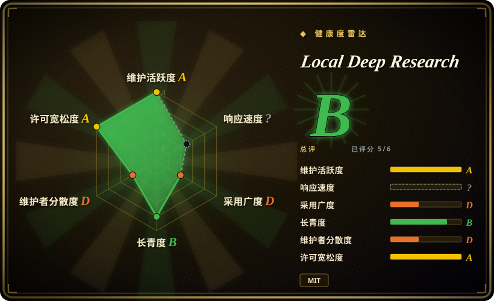
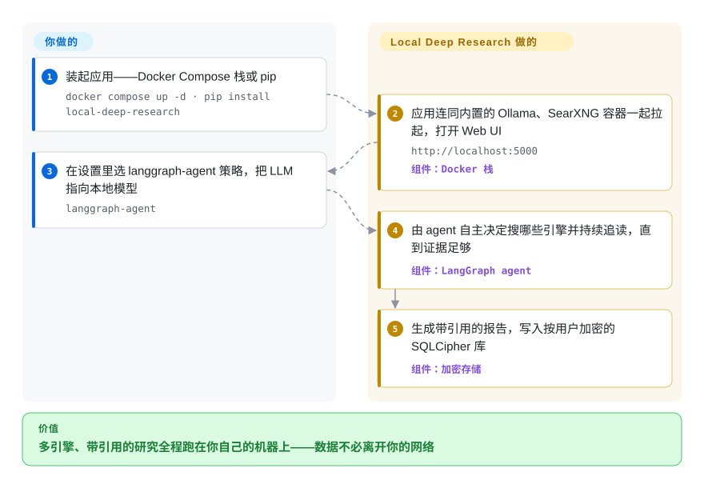

# Local Deep Research

一个可自托管的深度研究助手（Web UI + API + CLI + MCP），把整套「迭代检索—综合」的循环跑在你自己的机器上，可全程用本地 LLM 和本地 SearXNG 元搜索，数据无需离开你的网络。

## 何时使用

你是某个组织里的工程师或分析师，研究问题会碰到敏感材料——内部文档、病历或法律记录、尚未公布的产品——把这些贴进任何托管的「深度研究」SaaS 都是不可接受的。但你仍想要真正的能力：一个能在大量来源间扇出、逐篇阅读、并写出带引用报告的 agent。Local Deep Research 把这套循环放进一个你完全掌控的容器里。把 LLM 指向 Ollama 或 LM Studio，搜索用内置的 SearXNG，整条流水线——查询规划、检索、综合、引用——都跑在你自己的硬件上，而且每个用户用 SQLCipher（AES-256）加密存储，连机器的管理员都读不到你的会话。

如果你的研究偏*学术或技术*而非开放网络的杂项，你也很合适：LDR 自带 arXiv、PubMed、Semantic Scholar、Wikipedia、GitHub、Wayback Machine、Elasticsearch 和新闻源的一流连接器，还有把来源下载并索引成可检索私有库的知识库模式、一个期刊质量过滤器（v1.6，基于 OpenAlex/DOAJ 数据）、以及可订阅的研究摘要推送。你选一个深度——从 Quick Summary（30 秒到 3 分钟）到完整 Report——并可从 Web UI、REST API、进程内 Python API、CLI 驱动，或作为 MCP server（`ldr-mcp`）让 Claude 等 agent 把它当研究工具调用。需要云端模型时，同一套接口也能对接 OpenAI / Anthropic / Gemini / OpenRouter；「本地」是默认，而非唯一模式。

## 怎么用起来

LDR 是一条由你自托管的研究流水线。你提出一个问题；它的招牌 `langgraph-agent` 策略——一个 LangGraph 循环（图状 agent，不是固定管线），由 LLM 自己决定下一步搜什么——规划查询、挑选引擎（SearXNG 网页、arXiv、PubMed……）、阅读命中结果，直到证据足够再做综合，产出带引用的报告。你能接触的表面有四个：把 Ollama 和 SearXNG 作为同栈容器一起拉起的 Docker Compose 栈；`pip install` 加 `python -m local_deep_research.web.app`（Web UI 在 `http://localhost:5000`）；REST / 进程内 Python API（`quick_summary()` 可以传入你自己的 LangChain retriever，让 LDR 直接读你已有的知识库）；或者给 agent 客户端用的 `ldr-mcp` server。每个用户的会话、报告和 API key 都存在该用户自己的 SQLCipher 加密库里，密钥由密码派生——密码*就是*钥匙，所以没有找回机制。仍然归你的部分：Ollama 背后的 GPU 和模型管理、让自跑的 SearXNG 不被搜索引擎封禁、以及消化快速演进的 v1.10.x 线仍在发布的破坏性配置变更（它的 README 专门有一节「Upgrading from Earlier Versions」）。

<!-- flow-steps:begin (generated from flows/local-deep-research.json by tools/flow_card.py — do not edit) -->

流程文字版

1. **你**：装起应用——Docker Compose 栈或 pip — `docker compose up -d · pip install local-deep-research`
2. **Local Deep Research**：应用连同内置的 Ollama、SearXNG 容器一起拉起，打开 Web UI — `http://localhost:5000` — 组件：`Docker 栈`
3. **你**：在设置里选 langgraph-agent 策略，把 LLM 指向本地模型 — `langgraph-agent`
4. **Local Deep Research**：由 agent 自主决定搜哪些引擎并持续追读，直到证据足够 — 组件：`LangGraph agent`
5. **Local Deep Research**：生成带引用的报告，写入按用户加密的 SQLCipher 库 — 组件：`加密存储`

**价值**：多引擎、带引用的研究全程跑在你自己的机器上——数据不必离开你的网络

<!-- flow-steps:end -->

## 何时不用

- **没有 GPU 又想要纯本地的质量。** 那些亮眼的准确率数字假设你有一块能打的本地模型（比如 3090 上跑 27B）。在纯 CPU 机器上，本地模型做研究又慢又弱；你只能退回云端 API，而那正好破坏了隐私前提。
- **你要的是一个极小的可嵌入库，而不是一个应用。** LDR 确实暴露了进程内 API（`quick_summary()`），但它背后拖着一整个应用的依赖树（Web server、队列/分发器、加密 DB、JS 前端，Python ≥ 3.12）。如果你只想要一个「传入 query、返回报告」的函数嵌进自己的服务，脚本式工具如 [deep-research](deep-research.zh.md) vendoring 进去轻得多。
- **你想要托管、零运维的现成产品。** 它生来就是自托管——Ollama、SearXNG、数据库和升级都要你自己跑、自己维护。没有可以注册的 SaaS。
- **你消化不了破坏性配置变更。** 快速演进的 v1.10.x 线仍在发这些，README 自己就有记录：`llm.model` 的默认值在 1.6.3 被移除（不再静默下载多 GB 模型，但未配置的实例会直接报错）；`auto`/`parallel` 元搜索引擎被删掉、由 langgraph-agent 策略取代；llama.cpp 支持从进程内加载改为外部 `llama-server`。请 pin 版本，升级前先读升级说明。
- **对抗式事实核查才是核心任务。** LDR 会带引用地检索并综合，但它不是逐条断言的专用核验 harness；如果你的需求是「证实或证伪这些具体断言」，一个核验优先的流水线更合适。
- **你不信自报跑分。** ~95% SimpleQA / 77% xbench-DeepSearch 是项目自己在选定硬件/模型上得出的——README 自己也标注了「样本小、LLM 评分噪声、SimpleQA 污染风险」。[未验证] 别把它当作独立结论，也别当作对你的模型选择的预测。

## 横向对比

| 替代品 | 是否收录 | 我们的评价 | 取舍 |
|---|---|---|---|
| [deep-research](deep-research.zh.md) | ✅ | 需要可嵌入、端到端自己掌控的极简 TypeScript 脚本时，选 deep-research；当交付物是一个可部署的隐私产品（多用户、加密、UI、API）而非一份要自己不断重写的代码时，选 LDR。 | 极简 TypeScript 脚本，端到端自己嵌、自己掌控；LLM+搜索 key 你自己接。比 LDR 轻得多，但没有 UI、没有本地 LLM/隐私套件、没有学术源连接器或加密多用户存储。 |
| [Vane](vane.zh.md) | ✅ | 要一个单容器、开箱即用的自托管回答框（2026 版镜像已内置 SearxNG，三档深度模式）时，选 Vane；当学术源连接器、按用户加密的多用户存储和基准测试框架是关键时，选 LDR。 | 另一个自托管研究/搜索 agent。跑起来更简单（一个镜像），但它的目标是带引用的快速解答，不是 LDR 的深度研究策略、按用户加密库和期刊质量过滤。 |
| [Agent-Reach](agent-reach.zh.md) | ✅ | 交付物是 web/社交*触达*而非带引用报告时，选 Agent-Reach；它还能当 LDR 缺的那双「眼睛」去够 Twitter/小红书的源——配对用，不是二选一。 | 聚焦在面向 web 来源的 agent 触达/reach；相邻但交付物与 LDR 的带引用研究报告不同。 |
| [GPT Researcher](gpt-researcher.zh.md) | ✅ | 需要一个流行的、带 Web UI 和报告导出的 Python 深度研究 agent、且不介意默认云端 LLM 优先时，选 GPT Researcher；当全本地 + 加密 + 学术连接器才是决定项时，选 LDR。 | 流行的 Python 深度研究 agent，带 Web UI 和报告导出；默认云端 LLM 优先。LDR 更彻底地押注全本地 + 加密 + 学术源连接器。 |
| [MiroThinker](mirothinker.zh.md) | ✅ | 想要一套可自托管、可微调的开权重深度研究*模型*（BrowseComp/GAIA 调优，30B–235B）时，选 MiroThinker；当缺口在你已有本地模型外围的应用层——UI、加密、连接器——时，选 LDR。 | 框架 + 微调权重，GPU 和商业 API 依赖都很重；LDR 编排你已经在跑的任意模型，自身不带微调权重。 |
| Perplexity / OpenAI Deep Research | 非仓库 | 当质量与零运维高于隐私/本地控制时，选托管研究 SaaS——那是唯一完全免硬件的路，也是你的查询必然出楼的路。 | 托管 SaaS，质量强、零运维——但你的查询和上下文会离开你的机器，与 LDR 的前提正相反。 |

## 技术栈

- **语言：** Python 后端（按 `pyproject.toml` 要求 ≥ 3.12、< 3.15）；JavaScript/Node 前端，用 Vite 构建。
- **编排：** LangChain 做 LLM 接线，LangGraph 实现招牌的 `langgraph-agent` 策略——由它决定调用哪些引擎、何时综合（它取代了旧的 `auto`/`parallel` 元搜索引擎）。
- **LLM：** 本地走 Ollama / LM Studio / llama.cpp（现在经外部 `llama-server` 的 OpenAI 兼容端点）；云端走 OpenAI / Anthropic / Google、OpenRouter / Requesty（各 100+ 模型），或任何讲 OpenAI chat-completions API 的服务——另支持自托管的 Anthropic 兼容端点。
- **搜索：** SearXNG 元搜索；arXiv、PubMed、Semantic Scholar、Wikipedia、GitHub、Elasticsearch、Wayback Machine、The Guardian、Wikinews 的专用连接器；付费 API（Google 经 SerpAPI/Programmable Search、Brave、Tavily、Serper）；LangChain retriever 可作为自定义搜索源。
- **存储 / 检索：** SQLite + SQLCipher（AES-256）按用户加密（预编译 wheel，无需编译）；向量库经 LangChain（FAISS、Chroma、Pinecone、Weaviate、Elasticsearch）。
- **接口：** Web UI、REST API、CLI、进程内 Python API，以及一个仅限本地 STDIO 的 MCP server（`ldr-mcp`），让 agent 把 `search`/`quick_research`/`generate_report` 当工具调用；WebSocket 实时进度；PDF/Markdown 导出；研究订阅摘要。

## 依赖

- **运行时：** Python ≥ 3.12、< 3.15（2026-09-28 对照 `pyproject.toml` 核实）；支持 AVX 的 x86-64（2011 年 Sandy Bridge/Bulldozer 起步——README 称部分科学计算 wheel 缺 AVX 会崩）或 ARM64 CPU。要让纯本地 LLM 研究可用，基本需要一块 CUDA GPU。
- **你需要自己跑的外部服务：** 一个 LLM 后端（Ollama/LM Studio/llama.cpp，或一个云端 API key）和一个搜索后端（内置 SearXNG，或付费搜索 API key）。Docker 镜像会帮你编排 Ollama + SearXNG；自 v1.10.3 起，私有/localhost 引擎 URL 默认被拦截，需运维方显式批准。
- **可选：** 加密数据库用的 SQLCipher（已含在预编译 wheel；`LDR_BOOTSTRAP_ALLOW_UNENCRYPTED=true` 可退回普通 SQLite）；知识库/RAG 功能用的向量库后端（FAISS/Chroma/Pinecone）。
- **安装：** `pip install local-deep-research`，然后 `python -m local_deep_research.web.app`；或 `docker run` / `docker compose`（纯 CPU 或 NVIDIA-GPU override），还附带 Unraid 模板。

## 运维难度

**中。** Docker/compose 路径让首次跑起来还算合理——它能把 Ollama 和 SearXNG 和应用一起拉起来。负担在后续：模型下载和 GPU 驱动要你管；一个会被搜索引擎限速或封禁、且自跑实例的 URL 自 v1.10.3 起需运维批准的 SearXNG 要你维护；一个加密的 SQLCipher 数据库是零知识 / 无密码找回语义——丢了 key 就丢了数据；还要在一个快速演进、README 专门记录破坏性配置变更的版本线上跨版本升级。纯云端 LLM 模式更容易搭起来，但那就交换掉了你当初选 LDR 的隐私理由。

## 健康度与可持续性

- **响应速度**：Grade ?——2026-09-28 评分窗口内无合格的已响应 issue，无法测量（该轴按缺口计入总分、不是通过；上一个窗口曾以 3 个 issue 测得约 16 小时）。
- **维护（2026-09）：** **极其活跃**——本页重核当天仍有提交（main 最新提交 2026-09-27），v1.10.7 发布于 2026-08-28，仅 8 月就发了*七个* v1.10.x 版本（GitHub releases API）。这是一条贯穿安全加固的真实 release 线（仓库跑着 CodeQL、Semgrep、OpenSSF Scorecard，发布带签名的镜像和 SLSA attestation），不是一次性 demo。
- **治理与 bus factor：** `User` 名下（`LearningCircuit`），约 9.1k star（GitHub API，2026-09-28）——社区式项目，没有基金会或厂商背书；评分器看到 12 个月内有 73 名活跃提交者，但 top1 占比约 88%，路线图谱实际上仍由一人主导。[推断]
- **年龄与 Lindy（2025-02 创建，约 1.6 年）：** 已不是全新项目；*年龄 × 仍活跃*——连续两年持续发版——给出温和的 Lindy 先验，比年轻爆红仓库更稳。它仍在记录破坏性变更，所以请 pin 版本。
- **采用/生态：** PyPI 月下载 4100 次、依赖图信号弱（2026-09-28 评分器采用轴 D）——社区是活的（Discord、r/LocalDeepResearch、LangChain 官方转发、六种语言的媒体报道），但装机量级不大。亮眼准确率数字是在选定硬件上自报的，且 README 自己承认污染与样本问题。[未验证]

## 存疑（未验证）

- [未验证] star 约 9.1k（GitHub API，2026-09-28）；GitHub star 不可靠且对时间敏感，仅供参考。
- [未验证] 跑分（3090 上 Qwen3.6-27B 跑出约 95% SimpleQA；77% xbench-DeepSearch）为自报，选定模型/硬件、样本小；README 自己标注了 LLM 评分噪声与 SimpleQA 污染风险。本页未独立复现。
- [未验证] 「20+ 搜索引擎」及具体连接器清单是项目自己的表述；依赖某具体来源前请对照当前仓库核实其支持。
- [推断] Hugging Face 上的「community benchmark dataset」达到*社区*投稿规模是项目的表述；本页未逐一统计第三方投稿者。
- [推断] 作为快速迭代的 2.0 前应用，config 项、REST API 形态和 DB schema 可能逐版变化；为可复现请 pin 一个版本。
- [未验证] 项目 license 为 MIT；第三方依赖据称均为宽松许可（MIT/Apache-2.0/BSD，CI 有 allowlist），但本页未逐一审计。
