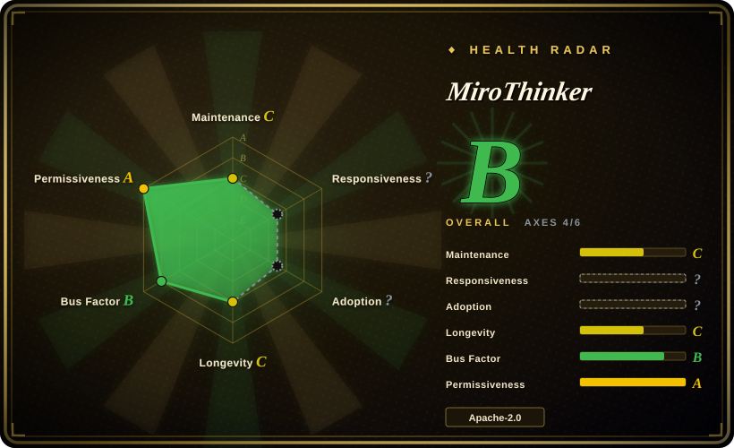
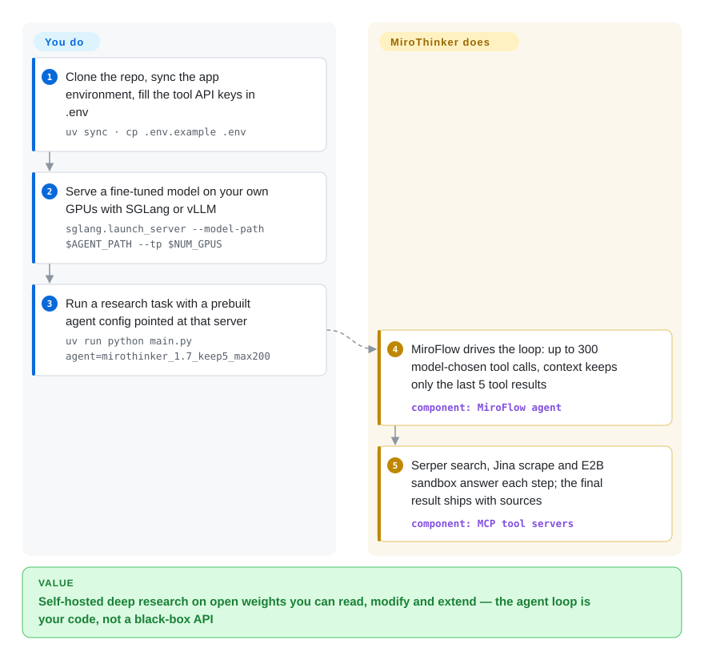

# MiroThinker

An open-source deep-research agent you host yourself: fine-tuned LLMs plus an MCP-tool environment (web search, scraping, code execution) orchestrated by the MiroFlow framework — built for people who want to read, modify and reproduce the agent loop, not call a closed per-query API.

## When to use

You're an ML engineer at a research-tooling team and you want a self-hosted, open-weights answer to "deep research" agents — something that browses the web, reads pages, runs code, and synthesizes a multi-step answer, but that you can run on your own GPUs instead of paying a closed API per query. You clone MiroThinker, host one of its fine-tuned models (Qwen-based; the v1.7 line is 30B-mini and 235B, 256K context) on SGLang or vLLM, set three tool API keys in `.env` (Serper for search, Jina for scraping, E2B for the code sandbox), pick a prebuilt agent config (`mirothinker_1.7_keep5_max200` is the README's default recommendation), and run a research task end-to-end. Because the agent's tools are wired as MCP servers and the orchestration (context retention, up to 300 tool calls per task in v1.7) lives in the MiroFlow framework in this same repo, you can study, modify, or extend the agent loop rather than treat it as a black box. It's aimed at people who want to *reproduce and build on* a competitive open deep-research agent — including its reported BrowseComp/GAIA benchmark results — not just call a product.

## How it works

MiroThinker is two things in one repo: a family of fine-tuned deep-research **models** (Qwen-based; v1.7 ships a 30B "mini" and a 235B, each with a 256K context window) and the **MiroFlow harness** that puts them to work. You serve the weights yourself — `python3 -m sglang.launch_server --model-path miromind-ai/MiroThinker-1.7-mini --tp 4` behind an OpenAI-compatible URL, or llama.cpp/Ollama via their quantized deployment guide — then run `uv run python main.py llm=qwen-3 agent=mirothinker_1.7_keep5_max200 llm.base_url=…` with your task question edited into `main.py`. The loop is ReAct-shaped — the model decides which tool to call (search via Serper, scrape via Jina, code in an E2B sandbox — each one an MCP server the harness spawns), the harness executes it and feeds the result back — up to 200–300 tool calls per task. The one piece of real engineering in the harness is its context-retention strategy (`keep_tool_result: 5`): the message history keeps the full reasoning/action trace but only the K most recent tool outputs — older observations drop out so a 200-turn trajectory doesn't overflow the 256K window. What stays yours: GPU capacity and the serving stack, the third-party API credits (Serper/Jina/E2B bill per run), the question, and — if you want to chase its published scores — the benchmark harness, which is a separate setup with its own OpenAI-as-judge keys.

<!-- flow-steps:begin (generated from flows/mirothinker.json by tools/flow_card.py — do not edit) -->

Text version of the flow

1. **You**: Clone the repo, sync the app environment, fill the tool API keys in .env — `uv sync · cp .env.example .env`
2. **You**: Serve a fine-tuned model on your own GPUs with SGLang or vLLM — `sglang.launch_server --model-path $AGENT_PATH --tp $NUM_GPUS`
3. **You**: Run a research task with a prebuilt agent config pointed at that server — `uv run python main.py agent=mirothinker_1.7_keep5_max200`
4. **MiroThinker**: MiroFlow drives the loop: up to 300 model-chosen tool calls, context keeps only the last 5 tool results — component: `MiroFlow agent`
5. **MiroThinker**: Serper search, Jina scrape and E2B sandbox answer each step; the final result ships with sources — component: `MCP tool servers`

**Value**: Self-hosted deep research on open weights you can read, modify and extend — the agent loop is your code, not a black-box API

<!-- flow-steps:end -->

## When NOT to use

- **The open-source line has been silent for ~6 months (checked 2026-09-28).** Last default-branch commit 2026-03-23 (README edits only); the newest model release is v1.7 (2026-03-11); org-wide GitHub activity stops 2026-07-06; recent September issues — a stuck-task bug report and a docs PR — sit at zero maintainer replies, and issue #176 ("还是1.7,好久没有升级了…") is likewise unanswered. The repo is **not archived**, but its README headlines *proprietary* MiroThinker-H1 as the current best agent. [推断] Treat the open line as a frozen snapshot / pattern source, not as something that will fix itself when a platform or API breaks; if you need an actively maintained self-hosted research stack, use [local-deep-research](local-deep-research.md) or [GPT Researcher](gpt-researcher.md) instead.
- **You just want a working research assistant, not infrastructure.** This is a framework + model weights you self-host, with multiple commercial API dependencies wired in. If you want a turnkey product, a hosted deep-research offering is far less work.
- **You can't provision serious GPU.** The 30B–235B models need multi-GPU serving (the README example is `--tp 4` on SGLang/vLLM); quantized llama.cpp/Ollama paths exist but the headline scores assume the big served models. Without that hardware, this isn't runnable at full capability. [推断]
- **You need a fully self-contained / offline / no-egress agent.** Full functionality depends on external commercial APIs (Serper, Jina, E2B, and OpenAI for some preprocessing/benchmarking) — data leaves your environment and costs accrue per run. The company also runs a hosted product (dr.miromind.ai); the open repo and that service are different surfaces.
- **Robust multimodal or non-English is critical.** The README states MiroThinker is text-only — GAIA image/audio/video tasks are pre-processed to text descriptions with GPT-4o — and the Chinese capability was built on mostly-English training data (improved by v1.7's BrowseComp-ZH numbers, but verify for your language/modality). [未验证]

## Comparison

| Alternative | In index | Our verdict | Tradeoff |
|---|---|---|---|
| OpenAI / Gemini "Deep Research" | 非仓库 | Choose hosted Deep Research products when turnkey quality and no GPU matter most — you give up the only reasons this repo exists (open weights, inspectable loop). | Hosted, turnkey, strong quality, no GPU to run; but closed, paid per use, no self-hosting or model control — the opposite tradeoff to MiroThinker. |
| [Local Deep Research](local-deep-research.md) | ✅ | Choose local-deep-research when you want a *maintained application* (actively releasing 2026-09) that orchestrates any LLM you already run, with UI/encryption/connectors around it; choose MiroThinker only when its fine-tuned weights and hackable agent loop are the point. | Self-hosted research app with local-LLM and privacy features, still actively releasing; it brings no benchmark-tuned weights of its own and can't reproduce MiroThinker's scores on a budget model. |
| [GPT-Researcher](gpt-researcher.md) | ✅ | Choose GPT-Researcher when you need a lightweight open research agent over LLM APIs and web tools — running today, no GPU cluster needed; choose MiroThinker when you want the agent itself (model + loop) to be open and benchmark-competitive. | Lightweight open research agent that orchestrates a frozen LLM API + web tools; far cheaper to run (no self-hosted weights) but not its own fine-tuned models or benchmark-tuned framework. |
| [smolagents](../agent-frameworks/agent-runtimes/agent-sdks/smolagents.md) / LangGraph + tools | 部分已收录 | Choose smolagents or LangGraph when you want to assemble the research loop yourself on any model and need a maintained dependency; MiroThinker hands you the loop *and* tuned weights, but at 2026-03 freeze-state. | General agent frameworks you'd assemble a research loop on; more flexible and model-agnostic, but you build the research pipeline and provide tuning yourself. |
| [Open Deep Research (HF)](open-deep-research.md) | ✅ | Choose Open Deep Research when you want a maintained, API-model reproduction of a deep-research agent to study or fork without GPU; MiroThinker differs by shipping its own fine-tuned weights with published BrowseComp/GAIA scores. | Open reproduction of a deep-research agent over an API model; similar open spirit, different stack and (usually) no self-hosted fine-tuned weights. |

## Tech stack

- **Language:** Python (3.10+), `uv` for environment management.
- **Orchestration:** the **MiroFlow** agent framework (same org; separate repo `MiroMindAI/MiroFlow`, bundled app under `apps/miroflow-agent`) — manages the agent–environment loop and a recency-based context-retention strategy (keep last K tool responses). Config via Hydra YAML under `conf/agent/`.
- **Models:** Qwen-based, fine-tuned via SFT + DPO; v1.7 line: 30B ("mini") and 235B, 256K context, up to 300 tool calls/task (earlier lines: v1.0 8B/30B/72B up to 600 calls, v1.5 30B/235B up to 400). Served with **SGLang** or **vLLM**; quantized llama.cpp/Ollama deployment documented.
- **Tools:** MCP servers — `tool-python` (E2B sandbox), `search_and_scrape_webpage` (Serper), `jina_scrape_llm_summary` (Jina + a summary LLM), plus optional vision/transcription/reasoning/reading servers.
- **Extras:** Gradio demo app (`apps/gradio-demo`), benchmark evaluation harnesses, trace collection for SFT/DPO reuse.

## Dependencies

- **Models:** self-hosted Qwen-based weights (or a compatible LLM backend) — sizeable downloads from Hugging Face.
- **Hardware:** GPU serving (the README's example runs the 30B-mini across `--tp 4` on SGLang); quantized CPU/GPU paths exist for smaller setups.
- **External APIs (required for full function):** Serper (search), Jina (scraping), E2B (code sandbox), plus a SUMMARY_LLM endpoint and OpenAI keys for benchmark judging / multimodal preprocessing — configured via `.env` (`cp .env.example .env`). API credits accrue per run.
- **Network:** outbound egress to those services; not an offline agent.

## Ops difficulty

**High.** This is the most demanding kind of deployment here: you stand up a GPU serving stack (SGLang/vLLM) for a large model, manage the model download/placement, wire several third-party API keys, and pick/tune agent config (context retention `keep_tool_result`, tool-call budget `max_turns`). Running it well means owning GPU capacity, monitoring cost across the external APIs, and accepting reproducibility caveats of a frozen research codebase. Evaluation/benchmark reproduction adds its own harness setup (including OpenAI-as-judge keys). This is infrastructure to operate, not a library to import — and since the repo stopped taking fixes (see *When NOT to use*), breakage in its third-party API assumptions is yours to patch.

## Health & viability

- **Responsiveness**: Grade ? — the scorer found no qualifying response window; as of 2026-09-28, September issues sit unanswered (consistent with that).
- **Maintenance (2026-09).** **Stalled** (scorer grade C): last default-branch commit 2026-03-23 (189 days at scoring time); last model line v1.7 (2026-03-11); no GitHub releases ever (HF-only distribution); org-wide repo pushes stop 2026-07-06. Not archived, but ~6 months quiet on main is the signal, not the archive flag.
- **Governance / backing.** Org-backed (**MiroMindAI**, miromind.ai), multi-contributor while it ran (grade B: 10 active committers in 12 months, top1 ~59%) — better bus factor than a solo repo, but a single company's research project whose README now spotlights the *proprietary* MiroThinker-H1; [推断] open-source investment appears deprioritized relative to the hosted product.
- **Age & Lindy verdict.** Created 2025-08 (~1.1 years, longevity grade C) with a v0.1→v1.7 arc in 7 months, then silence — the worst Lindy quadrant for a bet: young *and* cooling. High early stars (~8.4k) were benchmark-driven momentum, not durability proof. [推断]
- **Adoption.** ~8.4k stars / ~646 forks (GitHub API, 2026-09-28), driven by competitive open benchmark claims (BrowseComp/GAIA); real production adoption beyond research/eval is unverified. The scorer grades adoption **?** (ambiguous signal — the models live on Hugging Face, not a package registry, so the registry-based probe can't read it); the aggregate overall is therefore only a 4/6-axis coverage (B) — read it as "insufficient evidence", not "healthy".
- **Risk flags.** Apache-2.0 code (clean), but heavy external-API and GPU dependence, the 2026 stall, single-company stewardship with proprietary shift, and benchmark-driven framing (numbers vary by version and harness — the README headline even claims "88.2 on BrowseComp" while its v1.7 table says 74.0) are the bets you're making. [推断]

## Caveats (unverified)

- [未验证] ~8.4k stars / ~646 forks as of 2026-09-28 (GitHub API); counts are date-sensitive. Last main commit 2026-03-23 and org push cutoff 2026-07-06 are API facts; reading them as "development moved to the proprietary H1 line" is [推断] — no maintainer statement was found (September issues unanswered).
- [未验证] Reported benchmark numbers (v1.7: 74.0 BrowseComp / 75.3 BrowseComp-ZH / 82.7 GAIA-Val-165 / 42.9 HLE-Text; README headline separately claims 88.2 on BrowseComp) are the project's own claims and inconsistent inside the README itself — not independently reproduced here.
- [推断] GPU / multi-GPU requirement (`--tp 4`) is from the README's serving example, not measured; the practical floor for the quantized llama.cpp/Ollama path is untested here.
- [未验证] Python 3.10+, `uv` workflow, Hydra config, and the exact tool/API matrix are read from the README at commit 1c4253f6 (frozen since 2026-03) and match the shipped `conf/` names; they were not executed end-to-end.
- [未验证] Whether the hosted product (dr.miromind.ai) still runs or bills the same way was not checked; the README's last online-product note is 2026-01-23.
- [推断] "No Lindy yet / sustainability unproven" follows from the 2025 creation date, the ~6-month stall, and single-company backing.
