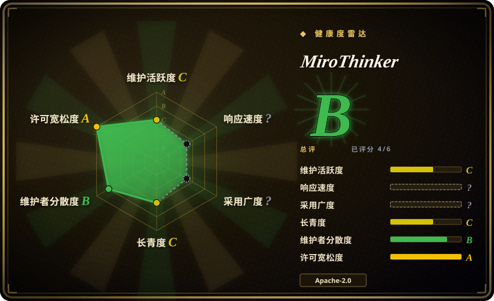
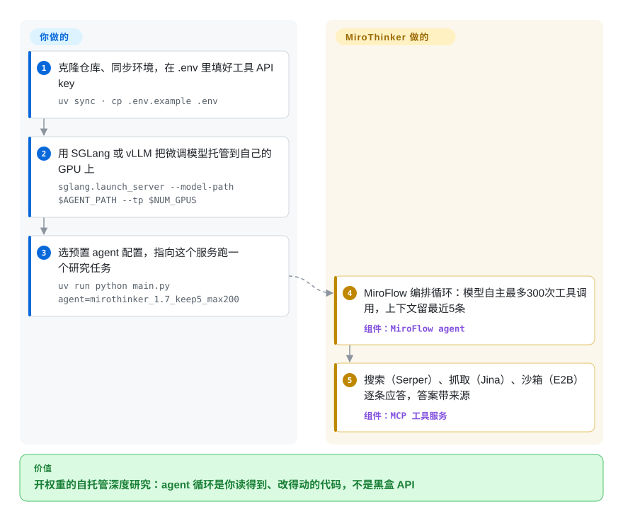

# MiroThinker

一个由你自己托管的开源 deep-research agent：微调过的 LLM 加上一套 MCP 工具环境（网络搜索、抓取、代码执行），由 MiroFlow 框架编排——为想读得懂、改得动、能复现 agent 循环的人而建，而不是又一个按次计费的闭源 API。

## 何时使用

你是研究工具团队的 ML 工程师，想要一个自托管、开权重的「deep research」agent 答案——能上网浏览、读页面、跑代码、综合出多步答案，但你可以在自己的 GPU 上跑，而不必为每次查询给一个闭源 API 付费。你克隆 MiroThinker，把它某个微调模型（基于 Qwen，v1.7 线是 30B「mini」和 235B，256K 上下文）托管在 SGLang 或 vLLM 上，在 `.env` 里设好三个工具 API key（Serper 搜索、Jina 抓取、E2B 代码沙箱），选一个预置 agent 配置（README 默认推荐 `mirothinker_1.7_keep5_max200`），端到端跑一个研究任务。因为 agent 的工具是以 MCP server 接线的、编排逻辑（上下文保留、v1.7 单任务最多数百次工具调用）就在同仓库的 MiroFlow 框架里，你可以研究、修改或扩展 agent 循环，而不必把它当黑盒。它面向那些想*复现并在其上构建*一个有竞争力的开源 deep-research agent 的人——包括它报告的 BrowseComp/GAIA 基准成绩——而不只是调一个产品。

## 怎么用起来

MiroThinker 在一个仓库里其实是两样东西：一组微调过的 deep-research **模型**（基于 Qwen，v1.7 线发 30B「mini」和 235B，各带 256K 上下文窗口），以及把它们用起来的那套 **MiroFlow 装配框架**。权重由你自己服务化——`python3 -m sglang.launch_server --model-path miromind-ai/MiroThinker-1.7-mini --tp 4`，暴露成 OpenAI 兼容 URL，或按官方量化指南走 llama.cpp/Ollama——然后 `uv run python main.py llm=qwen-3 agent=mirothinker_1.7_keep5_max200 llm.base_url=…` 启动，任务问题直接改在 `main.py` 里。循环是 ReAct 式的——模型自己决定调哪个工具（Serper 搜索、Jina 抓取、E2B 沙箱里跑代码，每个都是框架拉起的 MCP server），框架执行并把结果喂回去——单任务最多 200–300 次工具调用。这套框架里真正有工程含量的是一处上下文保留策略（`keep_tool_result: 5`）：消息历史保留完整的推理/行动轨迹，但工具输出只保留最近 K 条——旧的观察结果被丢弃，200 轮的轨迹才不会撑爆 256K 窗口。仍然归你的部分：GPU 容量和服务栈、第三方 API 额度（Serper/Jina/E2B 按次计费）、问题本身，以及——如果你想追它公布的基准分数——那套评测 harness，它要单独搭，还要自备 OpenAI-as-judge 的 key。

<!-- flow-steps:begin (generated from flows/mirothinker.json by tools/flow_card.py — do not edit) -->

流程文字版

1. **你**：克隆仓库、同步环境，在 .env 里填好工具 API key — `uv sync · cp .env.example .env`
2. **你**：用 SGLang 或 vLLM 把微调模型托管到自己的 GPU 上 — `sglang.launch_server --model-path $AGENT_PATH --tp $NUM_GPUS`
3. **你**：选预置 agent 配置，指向这个服务跑一个研究任务 — `uv run python main.py agent=mirothinker_1.7_keep5_max200`
4. **MiroThinker**：MiroFlow 编排循环：模型自主最多300次工具调用，上下文留最近5条 — 组件：`MiroFlow agent`
5. **MiroThinker**：搜索（Serper）、抓取（Jina）、沙箱（E2B）逐条应答，答案带来源 — 组件：`MCP 工具服务`

**价值**：开权重的自托管深度研究：agent 循环是你读得到、改得动的代码，不是黑盒 API

<!-- flow-steps:end -->

## 何时不用

- **开源线已静默约 6 个月（2026-09-28 核查）。** 默认分支最后一次提交是 2026-03-23（还只是 README 编辑）；最新的模型线是 v1.7（2026-03-11）；org 范围内的 GitHub 活动止步 2026-07-06；9 月的新 issue——一个卡任务的 bug 反馈和一个文档 PR——维护者零回复，连问「还是 1.7，好久没有升级了……」的 issue #176 也没人答。仓库**未归档**，但 README 头条宣传的是*私有*的 MiroThinker-H1。[推断] 把开源线当一份冻结快照 / 设计参考，别指望平台或 API 坏了它会自己修；需要仍在维护的自托管研究栈，请用 [local-deep-research](local-deep-research.zh.md) 或 [GPT Researcher](gpt-researcher.zh.md)。
- **你只想要一个能用的研究助手，而不是一套基础设施。** 这是你自托管的框架 + 模型权重，并接入了多个商业 API 依赖。如果你想要开箱即用的产品，托管的 deep-research 服务省事得多。
- **你拿不出像样的 GPU。** 30B–235B 模型需要多卡服务化（README 示例是 SGLang/vLLM 上 `--tp 4`）；量化版 llama.cpp/Ollama 路线存在，但头条分数假设的是大模型服务化。没有这种硬件，它无法以完整能力运行。[推断]
- **你需要完全自包含 / 离线 / 不出网的 agent。** 完整功能依赖外部商业 API（Serper、Jina、E2B，以及部分预处理/基准用的 OpenAI）——数据会离开你的环境，且每次运行都产生费用。该公司还运营着托管产品（dr.miromind.ai）；开源仓库和那个服务是两个界面。
- **稳健的多模态或非英文至关重要。** README 明说 MiroThinker 是纯文本模型——GAIA 的图/音/视频任务要用 GPT-4o 预处理成文字描述——且中文能力建立在以英文为主的训练数据上（v1.7 的 BrowseComp-ZH 数字有改善，但请针对你的语言/模态实测覆盖）。[未验证]

## 横向对比

| 替代品 | 是否收录 | 我们的评价 | 取舍 |
|---|---|---|---|
| OpenAI / Gemini "Deep Research" | 非仓库 | 开箱即用的强质量、无需 GPU 时，选托管 Deep Research——代价是放弃这个仓库存在的唯一理由（开权重、可读的循环）。 | 托管、开箱即用、质量强、无需自己跑 GPU；但闭源、按用量付费、不能自托管或控制模型——与 MiroThinker 取舍相反。 |
| [Local Deep Research](local-deep-research.zh.md) | ✅ | 想要一个*仍在维护*的应用（2026-09 还在发版）来编排你已在跑的任意 LLM、外带 UI/加密/连接器时，选 local-deep-research；只有当你就是要它的微调权重和可改造的 agent 循环时，才选 MiroThinker。 | 自托管研究应用，带本地 LLM 与隐私能力，仍在持续发版；但它不带自己的基准调优权重，在小模型上也复现不了 MiroThinker 的分数。 |
| [GPT-Researcher](gpt-researcher.zh.md) | ✅ | 需要一个当下就能跑、不需要 GPU 集群、基于 LLM API 与网络工具的轻量开源研究 agent 时，选 GPT-Researcher；当你想让 agent 本体（模型 + 循环）开源且有基准竞争力时，选 MiroThinker。 | 轻量的开源研究 agent，编排一个冻结的 LLM API + 网络工具；跑起来便宜得多（无自托管权重），但没有自己的微调模型或基准调优框架。 |
| [smolagents](../agent-frameworks/agent-runtimes/agent-sdks/smolagents.zh.md) / LangGraph + 工具 | 部分已收录 | 想在任意模型上自己组装研究循环、且需要仍在维护的依赖时，选 smolagents 或 LangGraph；MiroThinker 把循环*和*调优过的权重一起给你，但停在 2026-03 的冻结态。 | 你在其上自行组装研究循环的通用 agent 框架；更灵活、模型无关，但研究管线和调优要你自己搭。 |
| [Open Deep Research（HF）](open-deep-research.zh.md) | ✅ | 想要一份仍在维护、基于 API 模型的 deep-research agent 开源复现来学习或 fork、且不用 GPU 时，选 Open Deep Research；MiroThinker 的差异在于自带微调权重与公布的 BrowseComp/GAIA 成绩。 | 在 API 模型上对 deep-research agent 的开源复现；开源精神相近，但栈不同，且（通常）没有自托管的微调权重。 |

## 技术栈

- **语言：** Python（3.10+），用 `uv` 管理环境。
- **编排：** **MiroFlow** agent 框架（同一 org；独立仓库 `MiroMindAI/MiroFlow`，本仓库内打包为 `apps/miroflow-agent`）——管理 agent–环境循环与「按新旧保留」的上下文策略（只保留最近 K 条工具响应）。配置经 Hydra YAML，位于 `conf/agent/`。
- **模型：** 基于 Qwen，经 SFT + DPO 微调；v1.7 线：30B（「mini」）与 235B，256K 上下文、单任务最多 300 次工具调用（更早线：v1.0 有 8B/30B/72B、最多 600 次；v1.5 有 30B/235B、最多 400 次）。用 **SGLang** 或 **vLLM** 服务化；量化 llama.cpp/Ollama 部署有官方文档。
- **工具：** MCP server——`tool-python`（E2B 沙箱）、`search_and_scrape_webpage`（Serper）、`jina_scrape_llm_summary`（Jina + 一个 summary LLM），另有可选的视觉/转写/推理/文档阅读 server。
- **配套：** Gradio 演示应用（`apps/gradio-demo`）、基准评测 harness、供 SFT/DPO 复用的轨迹收集。

## 依赖

- **模型：** 自托管的基于 Qwen 的权重（或兼容的 LLM 后端）——从 Hugging Face 下载，体量不小。
- **硬件：** GPU 服务化（README 示例把 30B-mini 跑在 `--tp 4` 上）；小规模场景有量化 CPU/GPU 路线。
- **外部 API（完整功能所需）：** Serper（搜索）、Jina（抓取）、E2B（代码沙箱），外加一个 SUMMARY_LLM 端点以及基准评审 / 多模态预处理用的 OpenAI key——经 `.env` 配置（`cp .env.example .env`）。每次运行都消耗 API 额度。
- **网络：** 需向这些服务出网；不是离线 agent。

## 运维难度

**高。** 这是本批里最吃力的部署：你要为一个大模型搭起 GPU 服务栈（SGLang/vLLM）、管理模型下载/落盘、接好几个第三方 API key，并挑选/调校 agent 配置（上下文保留 `keep_tool_result`、工具调用预算 `max_turns`）。要跑好它意味着自己掌握 GPU 容量、跨外部 API 监控成本，并接受一个已冻结的研究代码库的可复现性注意事项。评测/基准复现还要另搭一套 harness（含 OpenAI-as-judge 的 key）。这是要运维的基础设施，不是拿来 import 的库——而且既然仓库已不再接收修复（见「何时不用」），它的第三方 API 假设一旦坏掉，补丁得你自己打。

## 健康度与可持续性

- **响应速度**：Grade ?——评分器找不到合格的响应窗口；截至 2026-09-28，9 月的 issue 无人回复（与之一致）。
- **维护（2026-09）。** **停滞**（评分器 C 档）：默认分支最后提交 2026-03-23（评分时点已 189 天）；最新模型线 v1.7（2026-03-11）；GitHub releases 从未发布（仅经 Hugging Face 分发）；org 范围仓库推送止于 2026-07-06。未归档，但 main 上约 6 个月的沉寂才是信号，归档标志不是。
- **治理 / 背书。** 有组织背书（**MiroMindAI**，miromind.ai），运行期是多贡献者（B 档：12 个月 10 名活跃提交者，top1 约 59%）——bus factor 比单人仓库好；但它是单一公司的研究项目，README 现在头条的是*私有*的 MiroThinker-H1；[推断] 相对托管产品，开源投入疑似降级。
- **年龄与 Lindy 判断。** 2025-08 创建（约 1.1 年，longevity C 档），7 个月内走完 v0.1→v1.7，然后沉寂——下注视角里最差的 Lindy 象限：既年轻*又*降温。早期的高 star（约 8.4k）是基准拉动的势能，不是耐久性证明。[推断]
- **采用度。** 约 8.4k star / 约 646 fork（GitHub API，2026-09-28），由有竞争力的开源基准成绩（BrowseComp/GAIA）拉动；研究/评测之外的真实生产采用未经验证。评分器把采用轴判为 **?**（信号含糊——模型活在 Hugging Face 上而非包注册中心，基于注册中心的探针读不出来）；因此总评只是 4/6 轴的覆盖（B）——请读作「证据不足」，而非「健康」。
- **风险标记。** Apache-2.0 代码（干净），但对外部 API 与 GPU 的重度依赖、2026 年的停滞、单一公司主导且转向私有、以基准为框架的叙事（数字随版本和 harness 变动——README 头条甚至写「BrowseComp 88.2」，而它自己的 v1.7 表格是 74.0）都是你下的赌注。[推断]

## 存疑（未验证）

- [未验证] 约 8.4k star / 约 646 fork（GitHub API，2026-09-28），计数对时间敏感。main 最后提交 2026-03-23、org 推送止于 2026-07-06 是 API 事实；把它们解读为「开发转向私有 H1 线」是[推断]——未找到维护者声明（9 月 issue 无人回复）。
- [未验证] 报告的基准数字（v1.7：BrowseComp 74.0、BrowseComp-ZH 75.3、GAIA-Val-165 82.7、HLE-Text 42.9；README 头条另行宣称 BrowseComp 88.2）为项目自报，且在 README 内部自相不一致——此处未独立复现。
- [推断] GPU / 多卡需求（`--tp 4`）来自 README 的服务化示例，未实测；量化 llama.cpp/Ollama 路线的实际下限未测。
- [未验证] Python 3.10+、`uv` 流程、Hydra 配置与确切的工具/API 矩阵读自 commit 1c4253f6（2026-03 起冻结）的 README，并与仓库内 `conf/` 文件名核对一致；未端到端执行。
- [未验证] 托管产品（dr.miromind.ai）是否仍按同样方式运行/计费未核实；README 关于在线产品的最后记录是 2026-01-23。
- [推断] 「尚无 Lindy / 可持续性未经验证」直接源自 2025 创建时间、约 6 个月停滞与单一公司背书。
