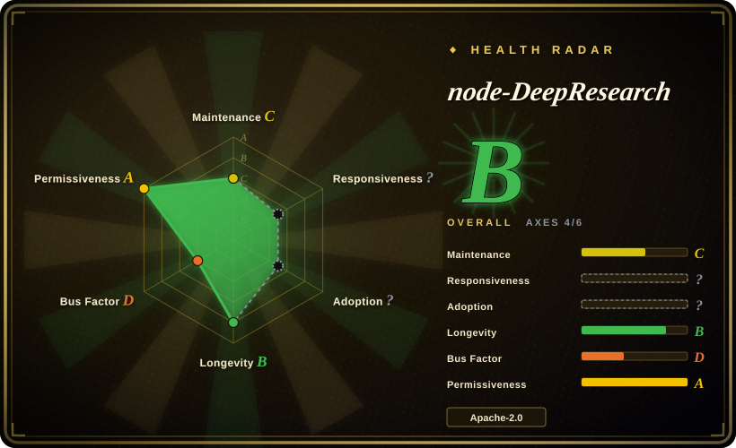
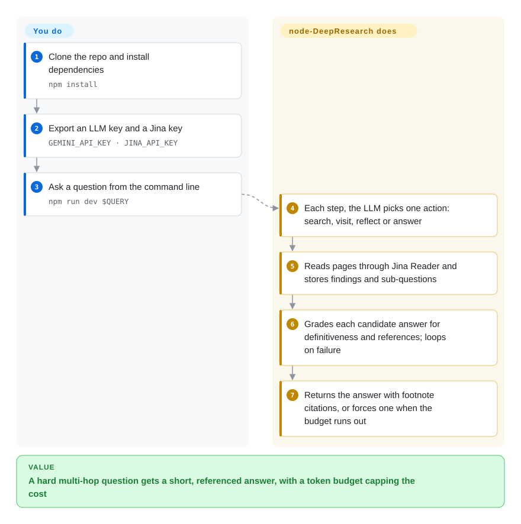

# node-DeepResearch

You ask a factual question whose answer is scattered across several web pages — "what is the context length of readerlm-v2?", "who is bigger: Cohere, Jina AI or Voyage?" — and a chatbot either guesses from memory or stops after one search. node-DeepResearch keeps searching, reading pages and reasoning in a loop until it has an answer it judges definitive and backed by references, or until a token budget runs out — and then returns a short answer, not a report.

## When to use

You're a developer adding a "hard question" feature to a product or an agent: users ask lookup questions that need several hops (find the company, then its founder, then the founder's account), and your single-shot RAG call returns `I couldn't find that information` or a plausible wrong name. You want something that keeps digging until it can cite a source, that you can self-host, and that plugs into tools you already have. node-DeepResearch runs as a CLI (`npm run dev "your question"`) or as a server exposing an OpenAI-compatible `/v1/chat/completions` endpoint (model name `jina-deepsearch-v1`), so CherryStudio, Chatbox or your own OpenAI client can call it unchanged.

Pick it over [STORM](storm.md) and [GPT Researcher](gpt-researcher.md) when you want **an answer, not an article** — the README says outright that long-form reports are "a completely different problem" it does not optimize for. Pick it over [deep-research](deep-research.md) when you want the loop to decide for itself when it is done (answer evaluation plus a token budget) instead of running a fixed breadth × depth. The price is coupling to Jina AI's hosted APIs for reading pages, and a code-running tool you must isolate (see below).

## How it works

The agent works like a detective with a notebook of open leads. At every step the LLM picks one action: **search** (query the search provider, Jina by default, or Brave, Serper or DuckDuckGo via `config.json`), **visit** (fetch URLs through Jina Reader — a hosted service that turns a webpage into clean text), **reflect** (split the question into sub-questions and put them on the list of open "gaps"), **answer**, or **code** (write and run a small JavaScript snippet, for arithmetic or data wrangling). Answers to sub-questions are kept as knowledge; an answer to the original question is graded by a separate evaluator — is it definitive, does it cite references? — and a failed attempt is recorded and the loop continues. When the token budget is spent it switches to "Beast Mode" and forces a final answer from whatever it has gathered. **It does all of the searching, reading, judging and stopping; you provide** an LLM (Gemini by default, OpenAI, or a local model through an OpenAI-compatible endpoint, which must handle structured JSON output well), a Jina API key, and the question — or you start the server and point an existing chat client at it.

<!-- flow-steps:begin (generated from flows/node-deepresearch.json by tools/flow_card.py — do not edit) -->

Text version of the flow

1. **You**: Clone the repo and install dependencies — `npm install`
2. **You**: Export an LLM key and a Jina key — `GEMINI_API_KEY · JINA_API_KEY`
3. **You**: Ask a question from the command line — `npm run dev $QUERY`
4. **node-DeepResearch**: Each step, the LLM picks one action: search, visit, reflect or answer
5. **node-DeepResearch**: Reads pages through Jina Reader and stores findings and sub-questions
6. **node-DeepResearch**: Grades each candidate answer for definitiveness and references; loops on failure
7. **node-DeepResearch**: Returns the answer with footnote citations, or forces one when the budget runs out

**Value**: A hard multi-hop question gets a short, referenced answer, with a token budget capping the cost

<!-- flow-steps:end -->

## When NOT to use

- **You want a long report or article.** The README says it does not optimize for long-form output. Use [GPT Researcher](gpt-researcher.md) for cited reports or [STORM](storm.md) for Wikipedia-style articles.
- **You can't send traffic to Jina AI's hosted APIs.** Even with Brave or Serper as the search provider, page reading goes through `r.jina.ai` and embeddings/reranking through `api.jina.ai`, all with `JINA_API_KEY`. For research that must stay on your own machine, use [Local Deep Research](local-deep-research.md) with a local SearXNG.
- **You will expose it to untrusted users or untrusted URLs.** The "code" action runs LLM-written JavaScript in-process via `new Function(...)`, which is not a sandbox, and open issue #131 (2026-05) reports a proof of concept where instructions planted in a fetched page steered the agent into server-side code execution. If you must serve it, run it in a locked-down container with no secrets beyond its own API keys; if you only need the capability, Jina's hosted DeepSearch API (not a repo) avoids running the code yourself.
- **You need a pinned, versioned dependency.** The last tag/npm release is v1.4.0 (2025-02), the README itself says the npm package is "not recommended for now", and `main` has since moved on, partly for Jina's hosted service (e.g. a "saas: llm usage" multiplier commit). Pin a commit SHA, or use [deep-research](deep-research.md) if a tiny fork-and-own codebase suits you better.
- **Your local model is weak at structured output.** Every step depends on the model returning valid JSON against a schema; the README warns not every LLM works. With a small local model, expect failed steps — use a hosted Gemini/OpenAI model or [Local Deep Research](local-deep-research.md), which is built around local models.

## Comparison

| Alternative | In index | Our verdict | Tradeoff |
|---|---|---|---|
| [deep-research](deep-research.md) | ✅ | To read and fork the smallest possible research loop, take deep-research; to get one referenced answer with the loop deciding when to stop, take node-DeepResearch. | deep-research runs a fixed breadth × depth and writes a learnings report via Firecrawl; node-DeepResearch evaluates its own answers and stops on success or budget, but depends on Jina's APIs. |
| [STORM](storm.md) | ✅ | For a broad, cited overview article, pick STORM; for a short definitive answer, pick node-DeepResearch. | STORM produces long structured text and supports many retrievers, but its code is frozen since 2025-09; node-DeepResearch answers concisely and is still (sparsely) committed to. |
| [GPT Researcher](gpt-researcher.md) | ✅ | When the deliverable is a multi-page cited report with a maintained web UI, pick GPT Researcher; when it is an answer behind an OpenAI-compatible endpoint, pick node-DeepResearch. | GPT Researcher is broader and better maintained; node-DeepResearch is narrower but drops into any OpenAI-client tool as a model. |
| [Local Deep Research](local-deep-research.md) | ✅ | When queries must not leave your network, pick Local Deep Research; node-DeepResearch always calls Jina's hosted reader. | Local Deep Research runs fully local with SearXNG and local LLMs; node-DeepResearch needs a Jina key but has a lighter, answer-focused loop. |
| [Vane](vane.md) | ✅ | For quick cited answers from a self-hosted Perplexity-style UI, pick Vane; for multi-hop questions that need many search-read-reason rounds, pick node-DeepResearch. | Vane answers in one search pass with a full chat UI; node-DeepResearch spends more tokens per question to go several hops deep, with no UI of its own. |
| Jina DeepSearch API | not a repo | If you only need the capability and accept a vendor dependency, call the hosted API; self-host node-DeepResearch to control the model, prompts and isolation. | Hosted, rate-limited and paid per token, no ops; self-hosting costs you the security isolation work and still needs Jina keys for reading. |

## Tech stack

- **Language:** TypeScript on Node.js, run with `ts-node` (`npm run dev` for the CLI, `npm run serve` for the server).
- **LLM layer:** Vercel AI SDK (`ai` 4.x) with `@ai-sdk/google` and `@ai-sdk/openai`; `zod` schemas force structured output at each step. Default model in `config.json` is `gemini-2.5-flash` (the README still mentions `gemini-2.0-flash`).
- **Web access:** Jina Reader (`r.jina.ai`) for page reading, Jina search/embeddings/rerank APIs; optional Brave, Serper or `duck-duck-scrape` search.
- **Server:** `express` exposing an OpenAI-compatible `/v1/chat/completions` (streaming supported, `<think>` blocks for intermediate reasoning, footnote-style citations); optional bearer secret via `--secret`.
- **Packaging:** Dockerfile and `docker-compose.yml`; npm package `node-deepresearch` (1.4.0).

## Dependencies

- **Node.js** (no `engines` field is declared) or Docker.
- **An LLM:** `GEMINI_API_KEY` (default), or `OPENAI_API_KEY` with `LLM_PROVIDER=openai`, or a local Ollama/LM Studio server via `OPENAI_BASE_URL` + `DEFAULT_MODEL_NAME` — it must support JSON-schema output.
- **`JINA_API_KEY`** — required in practice: reading pages and embeddings go through Jina's hosted APIs (the README says new keys come with 1M free tokens).
- **Optional:** `BRAVE_API_KEY` or `SERPER_API_KEY` for alternative search; `https_proxy` for outbound proxying.
- **No database** — state lives in memory for the duration of a question.

## Ops difficulty

**Low to try, medium to serve.** Locally it is `npm install`, two environment variables and `npm run dev "question"`. Serving it is where the work is: protect the endpoint with `--secret`, isolate the process because of the in-process code tool and the open prompt-injection report, watch per-question token spend (the README demos range from 2 to 42 steps for different questions), and track Jina API quotas, since every page read is a hosted call. There is no versioned release to upgrade along, so updates mean re-pinning to a newer commit and re-testing.

## Health & viability

- **Maintenance (2026-10): coasting.** Last commit 2026-05-01 (moving its eval model to a newer Gemini); before that 2025-12 and 2025-10, so a handful of commits in the past year and none in the last 13 weeks. Releases stopped at v1.4.0 (2025-02). The scorer grades maintenance C.
- **Governance / bus factor.** Lives under the `jina-ai` organization but is effectively one person's project: Han Xiao has ~470 commits, more than all other contributors combined, and the scorer counts 1 active maintainer in the last 12 months (governance D). Elastic acquired Jina AI in October 2025; the repo's future now depends on how Elastic treats Jina's side projects.
- **Age × Lindy.** Created 2025-01 (~1.7 years); the scorer grades longevity B, but with commits thinning out the Lindy prior adds little.
- **Adoption.** ~5.2k stars and ~460 forks; the README says Jina's hosted search.jina.ai runs this exact codebase. The scorer could not grade adoption (`?`: ambiguous package match).
- **Risk flags.** Apache-2.0, no relicense history. Real risks: an open security report (#131) with no maintainer response as of 2026-10 on prompt-injection-driven code execution, a hard dependency on a vendor's hosted APIs, and a codebase increasingly shaped by that vendor's SaaS.

## Caveats (unverified)

- [未验证] Stars (~5.2k) and forks (~460) are 2026-10 snapshots; indicative only.
- [未验证] The PoC in issue #131 (prompt injection from a fetched page leading to server-side effects) was read from the issue text, not reproduced; that `new Function` runs the generated code in-process was confirmed in `src/tools/code-sandbox.ts`.
- [推断] Elastic's acquisition of Jina AI (announced 2025-10-09) is confirmed from Elastic's press release; its effect on this repository's maintenance is inference, not a stated plan.
- [未验证] "search.jina.ai runs this exact codebase" is the README's claim; whether the hosted service has since diverged was not checked.
- [推断] Whether a local model works depends on its JSON-schema reliability; no specific local model was tested here.
