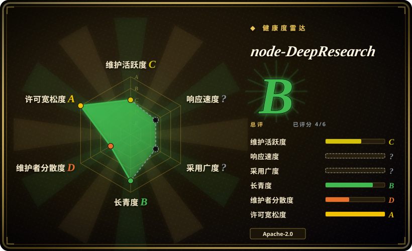
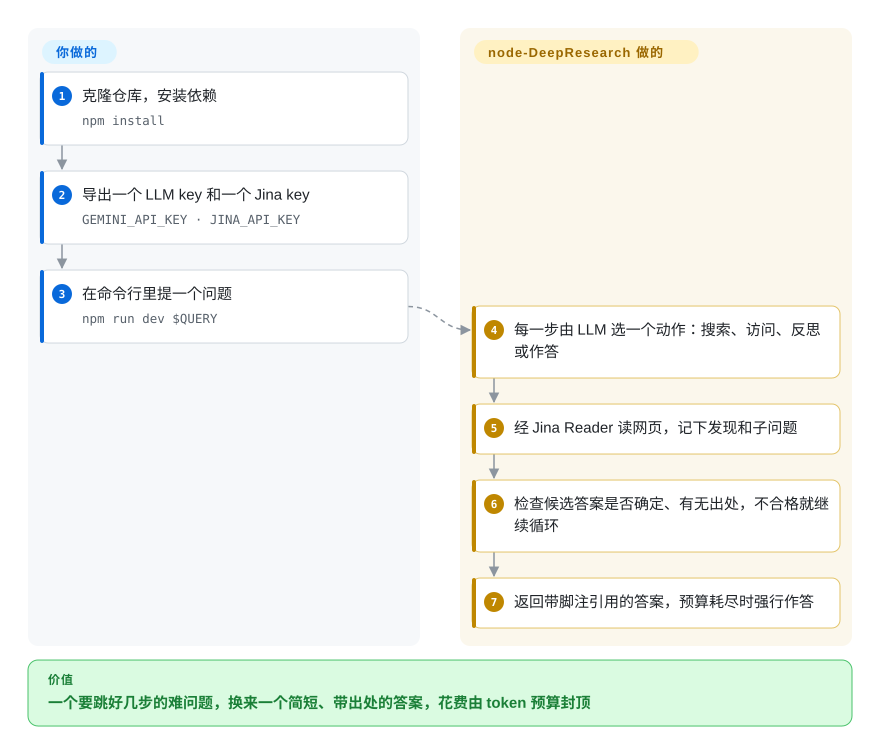

# node-DeepResearch

你问一个事实性问题，答案散落在好几个网页里——“readerlm-v2 的上下文长度是多少？”“Cohere、Jina AI、Voyage 谁更大？”——聊天机器人要么凭记忆瞎猜，要么搜一次就收工。node-DeepResearch 会在一个循环里不停地搜索、读网页、推理，直到得出一个它判定为确定、并且有出处支撑的答案，或者 token 预算耗尽——最后交给你的是一个简短答案，不是一份报告。

## 何时使用

你是开发者，要给产品或 agent 加一个“难问题”功能：用户问的查询题得跳好几步（先找到公司，再找创始人，再找创始人的账号），而你的单次 RAG 调用要么返回 `I couldn't find that information`，要么给出一个似是而非的错名字。你想要一个会一直挖到能引出处为止、能自己部署、还能接进现有工具的东西。node-DeepResearch 既能当命令行用（`npm run dev "你的问题"`），也能当服务跑，暴露一个兼容 OpenAI 的 `/v1/chat/completions` 接口（模型名 `jina-deepsearch-v1`），CherryStudio、Chatbox 或你自己的 OpenAI 客户端不用改就能调。

当你要的是**答案而不是文章**时，选它而不是 [STORM](storm.zh.md) 和 [GPT Researcher](gpt-researcher.zh.md)——README 明说长篇报告是“完全不同的问题”，它不为此优化。当你希望循环自己判断什么时候算完（答案评估加 token 预算），而不是跑固定的广度 × 深度时，选它而不是 [deep-research](deep-research.zh.md)。代价是读网页要绑定 Jina AI 的托管 API，以及一个会执行代码、必须隔离的工具（见下文）。

## 怎么用起来

这个 agent 像一个随身带着“待查线索”本子的侦探。每一步，LLM 只挑一个动作：**search**（查搜索服务，默认用 Jina，也可在 `config.json` 里换成 Brave、Serper 或 DuckDuckGo）、**visit**（通过 Jina Reader 读取网址——一个把网页变成干净文本的托管服务）、**reflect**（把问题拆成子问题，放进待解决的“缺口”清单）、**answer**（作答），或 **code**（写一小段 JavaScript 并运行，用于算数或整理数据）。子问题的答案存为知识；对原问题的回答会交给单独的评估器打分——够不够确定？有没有引用出处？——不合格就记下这次失败，循环继续。token 预算花完时，它切换到“Beast Mode”，用手头攒下的材料强行给出最终答案。**搜索、阅读、判断、何时停下，全都由它来做；你提供的是**一个 LLM（默认 Gemini，也可以是 OpenAI，或通过兼容 OpenAI 的地址接本地模型，但本地模型必须能稳定输出结构化 JSON）、一个 Jina API key，以及问题本身——或者把服务跑起来，让现有的聊天客户端指向它。

<!-- flow-steps:begin (generated from flows/node-deepresearch.json by tools/flow_card.py — do not edit) -->

流程文字版

1. **你**：克隆仓库，安装依赖 — `npm install`
2. **你**：导出一个 LLM key 和一个 Jina key — `GEMINI_API_KEY · JINA_API_KEY`
3. **你**：在命令行里提一个问题 — `npm run dev $QUERY`
4. **node-DeepResearch**：每一步由 LLM 选一个动作：搜索、访问、反思或作答
5. **node-DeepResearch**：经 Jina Reader 读网页，记下发现和子问题
6. **node-DeepResearch**：检查候选答案是否确定、有无出处，不合格就继续循环
7. **node-DeepResearch**：返回带脚注引用的答案，预算耗尽时强行作答

**价值**：一个要跳好几步的难问题，换来一个简短、带出处的答案，花费由 token 预算封顶

<!-- flow-steps:end -->

## 何时不用

- **你要的是长报告或文章。** README 明说它不为长篇输出优化。要带引用的报告用 [GPT Researcher](gpt-researcher.zh.md)，要维基风文章用 [STORM](storm.zh.md)。
- **你不能把流量发到 Jina AI 的托管 API。** 即使把搜索换成 Brave 或 Serper，读网页仍走 `r.jina.ai`，嵌入和重排走 `api.jina.ai`，都要 `JINA_API_KEY`。研究必须留在本机时，用配本地 SearXNG 的 [Local Deep Research](local-deep-research.zh.md)。
- **你要把它开放给不可信的用户或不可信的网址。** “code”动作用 `new Function(...)` 在进程内执行 LLM 写的 JavaScript，这不是沙箱；open issue #131（2026-05）报告了一个概念验证：埋在被抓取网页里的指令把 agent 引向了服务器端代码执行。真要对外提供服务，就把它放进锁死的容器，除了它自己的 API key 不放任何机密；如果你只需要这个能力，用 Jina 托管的 DeepSearch API（非仓库），就不必自己运行这段代码。
- **你需要一个钉得住版本的依赖。** 最后一个 tag／npm 版本是 v1.4.0（2025-02），README 自己说 npm 包“暂不推荐”，而 `main` 之后一直在变，其中一部分是为 Jina 的托管服务改的（比如一个“saas: llm usage”计费倍率的提交）。钉住某个提交 SHA；或者如果一个能 fork 下来自己养的极小代码库更合适，用 [deep-research](deep-research.zh.md)。
- **你的本地模型不擅长结构化输出。** 每一步都要求模型按 schema 返回合法 JSON；README 提醒并非所有 LLM 都行。用小的本地模型，就要做好步骤失败的准备——改用托管的 Gemini／OpenAI 模型，或者用围绕本地模型构建的 [Local Deep Research](local-deep-research.zh.md)。

## 横向对比

| 替代品 | 是否收录 | 我们的评价 | 取舍 |
|---|---|---|---|
| [deep-research](deep-research.zh.md) | 已收录 | 想读懂并 fork 最小的研究循环，选 deep-research；想要一个带出处的答案、由循环自己决定何时停下，选 node-DeepResearch。 | deep-research 跑固定的广度 × 深度，经 Firecrawl 写出要点报告；node-DeepResearch 会评估自己的答案，成功或预算耗尽才停，但依赖 Jina 的 API。 |
| [STORM](storm.zh.md) | 已收录 | 要一篇面面俱到、带引用的概览文章，选 STORM；要一个简短而确定的答案，选 node-DeepResearch。 | STORM 产出有结构的长文、支持多种检索器，但代码自 2025-09 起冻结；node-DeepResearch 回答简洁，仍有（稀疏的）提交。 |
| [GPT Researcher](gpt-researcher.zh.md) | 已收录 | 交付物是带引用的多页报告、还要有人维护的网页界面，选 GPT Researcher；交付物是挂在兼容 OpenAI 接口后面的答案，选 node-DeepResearch。 | GPT Researcher 覆盖更广、维护更好；node-DeepResearch 更窄，但能当作一个“模型”塞进任何 OpenAI 客户端工具。 |
| [Local Deep Research](local-deep-research.zh.md) | 已收录 | 查询绝不能出你的网络，选 Local Deep Research；node-DeepResearch 总要调用 Jina 的托管阅读服务。 | Local Deep Research 配 SearXNG 和本地 LLM 可完全本地运行；node-DeepResearch 需要 Jina key，但循环更轻、更聚焦于答案。 |
| [Vane](vane.zh.md) | 已收录 | 想从自托管的 Perplexity 式界面快速拿到带引用的答案，选 Vane；遇到要搜、读、想好几轮的多跳问题，选 node-DeepResearch。 | Vane 一次搜索就作答，自带完整聊天界面；node-DeepResearch 每个问题花更多 token 往深处跳几步，自己没有界面。 |
| Jina DeepSearch API | 非仓库 | 只要这个能力、接受依赖厂商，直接调托管 API；要控制模型、提示词和隔离方式，就自己部署 node-DeepResearch。 | 托管、限速、按 token 付费，免运维；自己部署则要做安全隔离，而且读网页仍然需要 Jina key。 |

## 技术栈

- **语言：** 跑在 Node.js 上的 TypeScript，用 `ts-node` 运行（命令行用 `npm run dev`，服务用 `npm run serve`）。
- **LLM 层：** Vercel AI SDK（`ai` 4.x）配 `@ai-sdk/google` 和 `@ai-sdk/openai`；每一步都用 `zod` schema 强制结构化输出。`config.json` 里的默认模型是 `gemini-2.5-flash`（README 里写的还是 `gemini-2.0-flash`）。
- **网络访问：** Jina Reader（`r.jina.ai`）读网页，外加 Jina 的搜索、嵌入、重排 API；可选 Brave、Serper 或 `duck-duck-scrape` 搜索。
- **服务：** `express` 暴露兼容 OpenAI 的 `/v1/chat/completions`（支持流式，中间推理放在 `<think>` 块里，引用用脚注格式）；可用 `--secret` 加 bearer 口令。
- **打包：** Dockerfile 和 `docker-compose.yml`；npm 包 `node-deepresearch`（1.4.0）。

## 依赖

- **Node.js**（没有声明 `engines` 字段）或 Docker。
- **一个 LLM：** `GEMINI_API_KEY`（默认），或 `OPENAI_API_KEY` 配 `LLM_PROVIDER=openai`，或通过 `OPENAI_BASE_URL` + `DEFAULT_MODEL_NAME` 接本地 Ollama／LM Studio——必须支持 JSON schema 输出。
- **`JINA_API_KEY`**——实际上必需：读网页和嵌入都走 Jina 的托管 API（README 说新 key 送 100 万免费 token）。
- **可选：** `BRAVE_API_KEY` 或 `SERPER_API_KEY` 用于替换搜索；`https_proxy` 用于出站代理。
- **不需要数据库**——状态只在回答一个问题期间存在内存里。

## 运维难度

**试用很低，对外服务中等。** 本地就是 `npm install`、两个环境变量、`npm run dev "问题"`。真正的工作量在对外服务：用 `--secret` 保护接口；因为进程内的代码工具和尚未处理的提示注入报告，要把进程隔离起来；盯住每个问题的 token 花费（README 的演示里，不同问题从 2 步到 42 步不等）；还要跟踪 Jina API 配额，因为每读一个网页都是一次托管调用。没有带版本号的发布可以跟着升级，所以更新就意味着重新钉到更新的提交并重新测试。

## 健康度与可持续性

- **维护（2026-10）：在吃老本。** 最后一次提交在 2026-05-01（把评测用模型换成更新的 Gemini）；再往前是 2025-12 和 2025-10，过去一年只有寥寥几次提交，最近 13 周一次都没有。发版停在 v1.4.0（2025-02）。评分器给维护评 C。
- **治理／bus factor。** 挂在 `jina-ai` 组织下，实际上是一个人的项目：Han Xiao 有约 470 次提交，比其他所有贡献者加起来还多；评分器统计过去 12 个月只有 1 名活跃维护者（治理 D）。Elastic 于 2025 年 10 月收购了 Jina AI；这个仓库的前途如今取决于 Elastic 怎么对待 Jina 的周边项目。
- **年龄 × Lindy。** 2025-01 创建（约 1.7 年）；评分器给长寿度评 B，但提交越来越少，Lindy 先验加分有限。
- **采用度。** 约 5.2 千 star、约 460 fork；README 说 Jina 托管的 search.jina.ai 跑的就是这份代码。评分器无法给采用度打分（`?`：包名匹配不明确）。
- **风险标记。** Apache-2.0，无改许可历史。真正的风险：一份截至 2026-10 无维护者回应的公开安全报告（#131，提示注入导致代码执行）、对厂商托管 API 的硬依赖，以及越来越受厂商 SaaS 需求左右的代码库。

## 存疑（未验证）

- [未验证] star（约 5.2 千）和 fork（约 460）为 2026-10 的快照，仅供参考。
- [未验证] issue #131 里的概念验证（被抓取网页中的提示注入导致服务器端副作用）只读了 issue 原文，没有复现；`new Function` 在进程内执行生成代码这一点已在 `src/tools/code-sandbox.ts` 中确认。
- [推断] Elastic 收购 Jina AI（2025-10-09 公布）已从 Elastic 新闻稿确认；它对本仓库维护的影响是推断，不是官方表态。
- [未验证] “search.jina.ai 跑的就是这份代码”是 README 的说法；托管服务此后是否已经分叉没有核实。
- [推断] 本地模型能不能用取决于它输出 JSON schema 的可靠程度；这里没有测试任何具体的本地模型。
