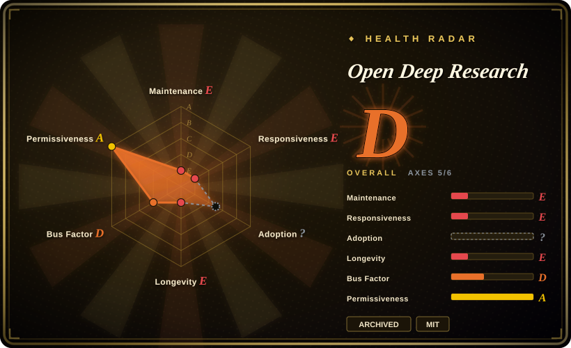
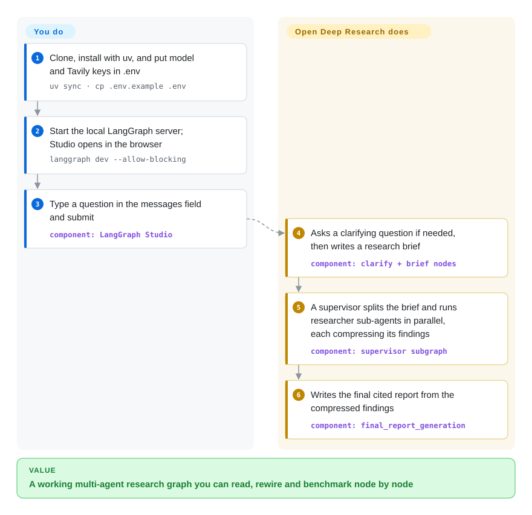

# Open Deep Research

"Deep research" products hide how they work — who decides what to search, how many searches run at once, how pages of findings get squeezed into one report — so you can't tune or rebuild one. Open Deep Research is LangChain's compact LangGraph reference that lays all of that out as a readable graph; **the repository was archived in 2026, so treat it as a blueprint to study or fork, not a dependency to run.**

## When to use

You're an engineer building your own research agent on LangGraph — for an internal knowledge tool, a due-diligence assistant, or a benchmark experiment — and you keep hitting design questions with no good answer: should one agent plan and search, or should a supervisor hand topics to parallel sub-researchers? When do you compress findings before they blow the context window? How do you know a change made reports better? Open Deep Research answers those with working code: a four-stage graph (clarify → research brief → supervisor with parallel researchers → final report) of a few hundred lines, every model role configurable through LangChain's `init_chat_model`, MCP tools pluggable, plus a ready harness that runs the 100-task Deep Research Bench and reports a RACE score (the README lists 0.4309 for its defaults at about $46 for the full run).

Pick it over [GPT Researcher](gpt-researcher.md) or [Local Deep Research](local-deep-research.md) when what you want is **the design, not the product**: you will read it, copy the supervisor/researcher split into your own graph, and measure your variant against its benchmark numbers. Because the repo is now archived, that is the only use the index recommends.

## How it works

Under the hood it is a LangGraph *graph* — a set of steps (nodes) connected by arrows that a runtime executes in order, with branches decided by the model. **It supplies the whole research pipeline and the prompts**: first it may ask you one clarifying question, then rewrites your request into a research brief; a *supervisor* model splits that brief into topics and hands each to a *researcher* sub-agent (up to 5 run at once by default), which calls search tools (Tavily by default, or the model provider's native web search, or any MCP server) in a loop and then *compresses* what it found into a short, cited summary so the context window doesn't overflow; finally a report model writes the answer from those summaries. **You supply** API keys in `.env`, choose the models (they must support tool calling and structured output) and search tool in `configuration.py` or the Studio "Manage Assistants" tab, and you run it — locally through `langgraph dev`, which opens LangGraph Studio in the browser as the UI. It's like a newsroom: an editor assigns beats, reporters chase them in parallel and file short memos, and one writer turns the memos into the story — and every role is a model you pick.

<!-- flow-steps:begin (generated from flows/open-deep-research.json by tools/flow_card.py — do not edit) -->

Text version of the flow

1. **You**: Clone, install with uv, and put model and Tavily keys in .env — `uv sync · cp .env.example .env`
2. **You**: Start the local LangGraph server; Studio opens in the browser — `langgraph dev --allow-blocking`
3. **You**: Type a question in the messages field and submit — component: `LangGraph Studio`
4. **Open Deep Research**: Asks a clarifying question if needed, then writes a research brief — component: `clarify + brief nodes`
5. **Open Deep Research**: A supervisor splits the brief and runs researcher sub-agents in parallel, each compressing its findings — component: `supervisor subgraph`
6. **Open Deep Research**: Writes the final cited report from the compressed findings — component: `final_report_generation`

**Value**: A working multi-agent research graph you can read, rewire and benchmark node by node

<!-- flow-steps:end -->

## When NOT to use

- **⚠️ You need something maintained.** The repo is **archived (read-only) as of 2026-10-08**; the last human commit was a CI fix in 2026-02 and its author's last commits were in 2025-08, and the PyPI package stopped at 0.0.16 (2025-07). No bug or security fixes will come. For a research agent you will run, pick [GPT Researcher](gpt-researcher.md) (actively released) or [Local Deep Research](local-deep-research.md).
- **You want to stay on current LangChain.** Its manifest targets the 2025 LangGraph/LangChain 0.3-era packages and defaults to `openai:gpt-4.1` models; the ecosystem has moved to LangChain v1. If you want LangChain's maintained take on long-running research-style agents, look at Deep Agents (`langchain-ai/deepagents`, not indexed) instead.
- **Non-technical users need a UI.** The quickstart's interface is LangGraph Studio, a developer tool served from `smith.langchain.com` and pointed at your local server; there's no end-user app in the repo. For a self-hosted UI, use [GPT Researcher](gpt-researcher.md) (report-style) or [Vane](vane.md) (answer-style).
- **You need free or self-hosted search.** The current graph only supports Tavily, Anthropic/OpenAI native web search, or MCP tools (DuckDuckGo, Exa, arXiv and others survive only in the `legacy/` implementations). For SearXNG or keyless search, use [Local Deep Research](local-deep-research.md) or GPT Researcher's `duckduckgo`/`searx` retrievers.
- **You want small local models.** Every role needs reliable tool calling and structured output, and Ollama support is documented only in an issue comment; for local-first research, [Local Deep Research](local-deep-research.md) is built for it.
- **You're on a tight token budget.** The README's own benchmark spent ~58M tokens (~$46) for 100 tasks on defaults and ~$187 with Claude Sonnet 4 as the researcher — parallel sub-researchers multiply calls. For cheaper single-thread exploration, [deep-research](deep-research.md) or [node-DeepResearch](node-deepresearch.md) keep the loop simpler.

## Comparison

| Alternative | In index | Our verdict | Tradeoff |
|---|---|---|---|
| [GPT Researcher](gpt-researcher.md) | ✅ | For any research agent you'll actually deploy, pick GPT Researcher; keep Open Deep Research only as a reading reference, because it is archived. | GPT Researcher is a maintained app with a UI, pip package and ~20 search backends; it is a larger codebase with more opinions than ODR's small graph. |
| [Local Deep Research](local-deep-research.md) | ✅ | When queries must stay on your machine with local LLMs and SearXNG, pick Local Deep Research; ODR assumes hosted models with strong tool calling and hosted search. | Local Deep Research is maintained and privacy-first but heavier to set up; ODR is easier to read but frozen. |
| [deep-research](deep-research.md) | ✅ | To learn the recursive search-and-synthesize loop in the fewest lines, pick dzhng/deep-research; to study supervisor-plus-parallel-researchers on LangGraph with a benchmark harness, read ODR. | dzhng's ~500 lines of TypeScript are simpler but single-agent and Firecrawl-bound; ODR shows a multi-agent split and evaluation, but nobody fixes it now. |
| [node-DeepResearch](node-deepresearch.md) | ✅ | If you want a TypeScript agent that keeps searching and reading until it finds an answer within a token budget, and is still updated (last commit 2026-05), pick node-DeepResearch; ODR fits only if you specifically want LangGraph's multi-agent structure as a reference. | node-DeepResearch leans on Jina's reader/search APIs and updates only occasionally; ODR is provider-flexible but archived. |
| Deep Agents (`langchain-ai/deepagents`) | not indexed | If you want LangChain's actively developed building blocks for long-running, planning, sub-agent workflows, start from Deep Agents rather than forking an archived graph. | Deep Agents is a general agent harness, not a research-specific pipeline, so you assemble the research flow yourself; ODR gives you that flow ready-made but unmaintained. |

## Tech stack

- **Language:** Python (`requires-python >=3.10`; the quickstart runs the server under Python 3.11).
- **Orchestration:** LangGraph (`langgraph>=0.5.4`) — nodes `clarify_with_user`, `write_research_brief`, a supervisor subgraph and a researcher subgraph (`researcher` → `researcher_tools` → `compress_research`), then `final_report_generation` in `src/open_deep_research/deep_researcher.py`.
- **Models:** any chat model via LangChain's `init_chat_model`; four roles (summarization `gpt-4.1-mini`, research / compression / final report `gpt-4.1` by default); provider packages for OpenAI, Anthropic, Google, AWS, Groq, DeepSeek in the manifest.
- **Search & tools:** `SearchAPI` enum = Tavily (default), Anthropic native, OpenAI native, none; MCP tools via `langchain-mcp-adapters`.
- **Serving & evaluation:** LangGraph CLI dev server (API on `127.0.0.1:2024`, Studio UI), LangGraph Platform / Open Agent Platform for hosting; LangSmith-based Deep Research Bench scripts in `tests/`.
- **Legacy:** `src/legacy/` keeps two earlier designs (plan-and-execute workflow with human approval; supervisor/researcher multi-agent) with more search backends.

## Dependencies

- **Model API keys** for whichever providers you configure (OpenAI by default for all four roles).
- **A search provider:** Tavily API key by default, or a model provider with native web search, or MCP servers you run.
- **LangGraph CLI** for local serving (`langgraph-cli[inmem]`, pulled via `uvx`); **LangSmith** account if you use the hosted Studio UI or the evaluation scripts.
- No database for the local dev server (in-memory); hosted deployment means LangGraph Platform or your own LangGraph server setup.

## Ops difficulty

**Low to run as a demo, high to operate as a product.** The demo path is `uv sync`, a `.env`, and one `langgraph dev` command. Beyond that you own everything: there's no end-user UI, no auth, no persistence outside the LangGraph runtime, and because the repo is archived you also own dependency upgrades and security fixes yourself (the last dependency bump was 2026-08). Cost control is your problem too — parallel researchers and per-researcher compression multiply model calls (see the benchmark spend in When NOT to use).

## Health & viability

- **Maintenance — archived (as of 2026-10-08).** The repository is read-only. Since 2025-08 the only commits were Dependabot bumps (last 2026-08-10) and a 2026-02 CI fix; no GitHub releases exist, and PyPI `open-deep-research` stopped at 0.0.16 (2025-07-16). The README carries no archive notice or successor pointer. Radar: maintenance E, responsiveness E, overall D.
- **Governance / bus factor.** Under the `langchain-ai` organization, but effectively one author: Lance Martin wrote ~132 of the commits and is the sole listed author; the scorer found 1 active maintainer in 12 months (governance D). Organizational backing did not prevent archival.
- **Age & Lindy.** Created 2024-11 and archived ~2 years later — the Lindy prior does not apply to an archived project; it has no future maintenance to extrapolate.
- **Adoption.** ~12.7k stars and ~1.9k forks, a LangChain Academy course built on it (`deep_research_from_scratch`), and a #6 Deep Research Bench placement claimed in 2025-08 — real interest as a learning reference; package-level adoption could not be measured (adoption `?`).
- **Risk flags.** MIT, so forking is unrestricted; the risk is entirely the frozen dependency set and pinned-era model defaults.

## Caveats (unverified)

- [未验证] The exact archive date is unknown; GitHub's API reports `archived: true` on 2026-10-08 and the last push was 2026-08-10, so it was archived between those dates.
- [未验证] Benchmark numbers (RACE 0.4309 on defaults, ~$46 / ~58M tokens per 100 tasks; #6 leaderboard rank) are the README's own figures from 2025-08 and were not reproduced.
- [推断] Treating Deep Agents as the place LangChain's research-agent work moved is an inference from it being LangChain's active agent-harness repo; no official "successor" statement was found.
- [推断] "Studio UI requires a LangSmith account" is inferred from the Studio URL living on `smith.langchain.com`; not tested here.
- [未验证] Star and fork counts are GitHub snapshots from 2026-10-08.
