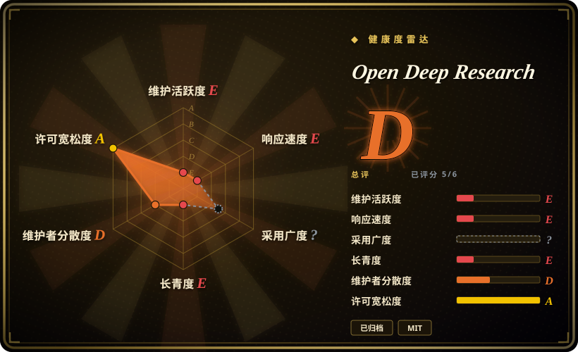
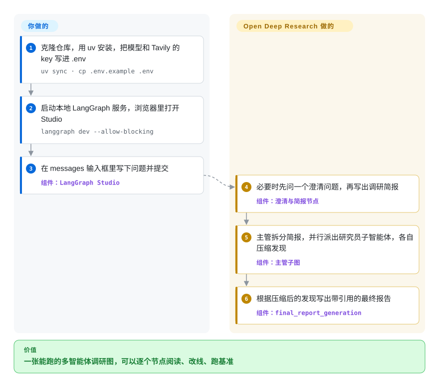

# Open Deep Research

“深度调研”产品都把内部藏起来：谁决定搜什么、同时跑几路搜索、几十页发现怎么压成一份报告——你既调不了，也照着搭不出来。Open Deep Research 是 LangChain 出的一份精简 LangGraph 参考实现，把这些都摊成一张看得懂的流程图；**该仓库已于 2026 年归档，只适合拿来学习或 fork 的蓝图，不适合当作要运行的依赖。**

## 何时使用

你是一名在 LangGraph 上自建调研智能体的工程师——做内部知识工具、尽调助手，或者跑基准实验——一直卡在几个没有好答案的设计问题上：该让一个智能体既规划又搜索，还是让一个主管把题目分给几个并行的子研究员？发现的内容什么时候先压缩，才不会撑爆上下文窗口？怎么知道一次改动让报告变好了？Open Deep Research 用能跑的代码回答了这些：一张四段式流程图（澄清 → 调研简报 → 主管加并行研究员 → 最终报告），只有几百行，每个模型角色都能通过 LangChain 的 `init_chat_model` 配置，MCP 工具可插拔，还带一套现成脚手架，能跑 100 题的 Deep Research Bench 并给出 RACE 分数（README 列出默认配置得 0.4309，跑完全集约花 46 美元）。

当你要的是**设计而不是产品**时，选它而不是 [GPT Researcher](gpt-researcher.zh.md) 或 [Local Deep Research](local-deep-research.zh.md)：你会读它，把“主管 / 研究员”的拆分抄进自己的图里，再拿它的基准数字衡量你的改版。仓库已经归档，本索引只推荐这一种用法。

## 怎么用起来

它底下是一张 LangGraph *图*——若干步骤（节点）用箭头连起来，由运行时按顺序执行，分支由模型决定。**整条调研流水线和提示词都由它提供**：先视情况问你一个澄清问题，再把你的请求改写成一份调研简报；一个*主管*模型把简报拆成几个题目，分给各个*研究员*子智能体（默认最多同时跑 5 个），研究员循环调用搜索工具（默认 Tavily，也可以用模型服务商自带的联网搜索，或任意 MCP 服务器），然后把找到的东西*压缩*成一段简短、带引用的摘要，免得上下文窗口溢出；最后由报告模型根据这些摘要写出答案。**你要提供的**是 `.env` 里的 API key，在 `configuration.py` 或 Studio 的“Manage Assistants”页里选模型（必须支持工具调用和结构化输出）和搜索工具，然后把它跑起来——本地用 `langgraph dev`，浏览器里打开的 LangGraph Studio 就是界面。可以把它想成一间编辑部：主编分派选题，记者们并行跑新闻、各交一份短稿，再由一位写手把短稿写成成稿——而每个角色都是你挑的模型。

<!-- flow-steps:begin (generated from flows/open-deep-research.json by tools/flow_card.py — do not edit) -->

流程文字版

1. **你**：克隆仓库，用 uv 安装，把模型和 Tavily 的 key 写进 .env — `uv sync · cp .env.example .env`
2. **你**：启动本地 LangGraph 服务，浏览器里打开 Studio — `langgraph dev --allow-blocking`
3. **你**：在 messages 输入框里写下问题并提交 — 组件：`LangGraph Studio`
4. **Open Deep Research**：必要时先问一个澄清问题，再写出调研简报 — 组件：`澄清与简报节点`
5. **Open Deep Research**：主管拆分简报，并行派出研究员子智能体，各自压缩发现 — 组件：`主管子图`
6. **Open Deep Research**：根据压缩后的发现写出带引用的最终报告 — 组件：`final_report_generation`

**价值**：一张能跑的多智能体调研图，可以逐个节点阅读、改线、跑基准

<!-- flow-steps:end -->

## 何时不用

- **⚠️ 你需要一个有人维护的项目。** 该仓库**截至 2026-10-08 已归档（只读）**；最后一次人工提交是 2026-02 的一个 CI 修复，作者本人的最后几次提交在 2025-08，PyPI 包停在 0.0.16（2025-07）。不会再有缺陷或安全修复。要真正运行的调研智能体，选 [GPT Researcher](gpt-researcher.zh.md)（持续发版）或 [Local Deep Research](local-deep-research.zh.md)。
- **你想跟上当前版本的 LangChain。** 它的依赖清单面向 2025 年 LangGraph / LangChain 0.3 时代的包，默认模型是 `openai:gpt-4.1`；生态已经转到 LangChain v1。想要 LangChain 仍在维护的长时运行、调研型智能体方案，去看 Deep Agents（`langchain-ai/deepagents`，未收录）。
- **非技术用户需要一个界面。** 快速上手给的界面是 LangGraph Studio——一个托管在 `smith.langchain.com`、连到你本地服务器的开发者工具；仓库里没有面向终端用户的应用。要自托管的界面，用 [GPT Researcher](gpt-researcher.zh.md)（报告式）或 [Vane](vane.zh.md)（问答式）。
- **你需要免费或自托管的搜索。** 当前的图只支持 Tavily、Anthropic / OpenAI 自带联网搜索或 MCP 工具（DuckDuckGo、Exa、arXiv 等只留在 `legacy/` 旧实现里）。要 SearXNG 或免 key 搜索，用 [Local Deep Research](local-deep-research.zh.md)，或 GPT Researcher 的 `duckduckgo` / `searx` 检索器。
- **你想用小型本地模型。** 每个角色都要求可靠的工具调用和结构化输出，而 Ollama 的用法只写在一条 issue 评论里；要本地优先的调研，[Local Deep Research](local-deep-research.zh.md) 就是为此做的。
- **你的 token 预算很紧。** README 自己的基准里，默认配置跑 100 题用了约 5800 万 token（约 46 美元），换 Claude Sonnet 4 当研究员则约 187 美元——并行子研究员会成倍放大调用量。想要更省的单线程探索，[deep-research](deep-research.zh.md) 或 [node-DeepResearch](node-deepresearch.zh.md) 的循环更简单。

## 横向对比

| 替代品 | 是否收录 | 我们的评价 | 取舍 |
|---|---|---|---|
| [GPT Researcher](gpt-researcher.zh.md) | ✅ | 凡是真要部署的调研智能体，选 GPT Researcher；Open Deep Research 已归档，只留作阅读参考。 | GPT Researcher 是仍在维护的应用，有界面、pip 包和约 20 种搜索后端；代价是代码库更大，取舍也更多，不如 ODR 的小图好读。 |
| [Local Deep Research](local-deep-research.zh.md) | ✅ | 查询必须留在本机、配本地大模型和 SearXNG 时，选 Local Deep Research；ODR 默认依赖托管模型（要求工具调用强）和托管搜索。 | Local Deep Research 有人维护、隐私优先，但搭起来更重；ODR 更好读，但已经冻结。 |
| [deep-research](deep-research.zh.md) | ✅ | 想用最少的代码学会“递归搜索—综合”的循环，选 dzhng/deep-research；想在 LangGraph 上研究“主管加并行研究员”结构并带基准脚手架，读 ODR。 | dzhng 那约 500 行 TypeScript 更简单，但只有单智能体，且绑定 Firecrawl；ODR 展示了多智能体拆分和评测，但现在没人修了。 |
| [node-DeepResearch](node-deepresearch.zh.md) | ✅ | 想要一个在 token 预算内持续搜索、阅读直到找到答案、且仍有更新（最近提交 2026-05）的 TypeScript 智能体，选 node-DeepResearch；只有专门想参考 LangGraph 多智能体结构时才用 ODR。 | node-DeepResearch 依赖 Jina 的阅读 / 搜索 API，更新也只是偶尔；ODR 不挑服务商，但已归档。 |
| Deep Agents（`langchain-ai/deepagents`） | 未收录 | 想要 LangChain 仍在积极开发的、用于长时规划和子智能体工作流的构件，从 Deep Agents 起步，而不是 fork 一张已归档的图。 | Deep Agents 是通用的智能体框架，不是专门的调研流水线，调研流程得你自己搭；ODR 把流程现成给你，但无人维护。 |

## 技术栈

- **语言：** Python（`requires-python >=3.10`；快速上手用 Python 3.11 运行服务）。
- **编排：** LangGraph（`langgraph>=0.5.4`）——`src/open_deep_research/deep_researcher.py` 里依次是 `clarify_with_user`、`write_research_brief`、主管子图、研究员子图（`researcher` → `researcher_tools` → `compress_research`），最后是 `final_report_generation`。
- **模型：** 通过 LangChain 的 `init_chat_model` 接任意聊天模型；四个角色（摘要默认 `gpt-4.1-mini`，调研 / 压缩 / 最终报告默认 `gpt-4.1`）；依赖清单里带 OpenAI、Anthropic、Google、AWS、Groq、DeepSeek 的服务商包。
- **搜索与工具：** `SearchAPI` 枚举 = Tavily（默认）、Anthropic 自带、OpenAI 自带、无；MCP 工具通过 `langchain-mcp-adapters` 接入。
- **运行与评测：** LangGraph CLI 开发服务器（API 在 `127.0.0.1:2024`，配 Studio 界面），托管可用 LangGraph Platform / Open Agent Platform；`tests/` 里有基于 LangSmith 的 Deep Research Bench 脚本。
- **旧实现：** `src/legacy/` 保留了两种早期设计（带人工审批的“先规划再执行”工作流；主管 / 研究员多智能体），支持的搜索后端更多。

## 依赖

- **模型 API key**，按你配置的服务商来（默认四个角色全用 OpenAI）。
- **一个搜索服务：** 默认要 Tavily API key，或者用带联网搜索的模型服务商，或者你自己运行的 MCP 服务器。
- **LangGraph CLI** 用于本地运行（`langgraph-cli[inmem]`，通过 `uvx` 拉取）；用托管的 Studio 界面或评测脚本还需要 **LangSmith** 账号。
- 本地开发服务器不需要数据库（内存模式）；托管部署则意味着 LangGraph Platform 或你自建的 LangGraph 服务。

## 运维难度

**当演示跑：低；当产品运营：高。** 演示路径就是 `uv sync`、一个 `.env` 和一条 `langgraph dev` 命令。再往前一切都归你：没有终端用户界面，没有鉴权，除了 LangGraph 运行时也没有持久化；而且仓库已归档，依赖升级和安全修复也得你自己扛（最后一次依赖升级在 2026-08）。成本控制同样是你的事——并行研究员和每个研究员的压缩步骤都会成倍增加模型调用（见“何时不用”里的基准花费）。

## 健康度与可持续性

- **维护——已归档（截至 2026-10-08）。** 仓库只读。2025-08 以后只有 Dependabot 的依赖升级（最后一次 2026-08-10）和 2026-02 的一个 CI 修复；GitHub 上没有发过 release，PyPI 上的 `open-deep-research` 停在 0.0.16（2025-07-16）。README 没有归档说明，也没有指向后继项目。雷达：维护 E，响应 E，总体 D。
- **治理与巴士系数。** 挂在 `langchain-ai` 组织下，但实际上是一个人的项目：Lance Martin 写了约 132 次提交，也是唯一登记的作者；评分器在 12 个月窗口里只找到 1 位活跃维护者（治理 D）。组织背书并没有阻止它被归档。
- **年龄与 Lindy。** 2024-11 创建，约两年后归档——Lindy 先验不适用于已归档项目，它没有未来的维护可供外推。
- **采用度。** 约 1.27 万星、约 1.9k fork，LangChain Academy 有一门基于它的课程（`deep_research_from_scratch`），2025-08 还自称在 Deep Research Bench 排到第 6——作为学习参考确实有人关注；包级采用度无法测量（采用度 `?`）。
- **风险信号。** MIT 许可，fork 不受限制；风险完全在于冻结的依赖和停在当年的默认模型。

## 存疑（未验证）

- [未验证] 确切的归档日期未知；GitHub API 在 2026-10-08 报告 `archived: true`，最后一次推送是 2026-08-10，所以归档发生在这两个日期之间。
- [未验证] 基准数字（默认配置 RACE 0.4309，100 题约 46 美元 / 约 5800 万 token；排行榜第 6）是 README 在 2025-08 给出的自测数据，本次没有复现。
- [推断] 把 Deep Agents 当作 LangChain 调研智能体工作的去向，是因为它是 LangChain 当前活跃的智能体框架仓库；没有找到官方“后继”声明。
- [推断] “Studio 界面需要 LangSmith 账号”是根据 Studio 的地址在 `smith.langchain.com` 推断的，本次没有实测。
- [未验证] 星数和 fork 数是 2026-10-08 的 GitHub 快照。
