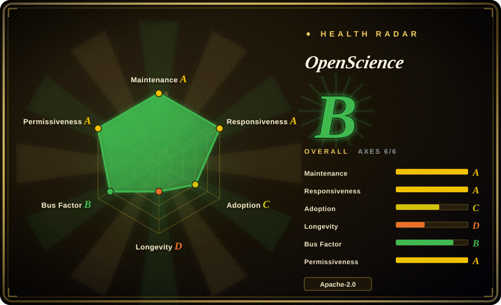
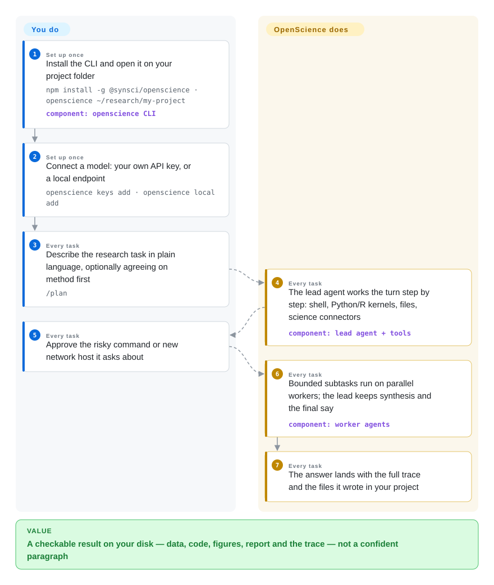

# OpenScience

You ask a chatbot to reproduce a figure or check a published claim, and you get a confident paragraph — no code, no files, no way to see what it actually did. OpenScience is a research agent that works inside a folder on your own machine: it reads the literature, writes and runs the analysis, and hands back the results with every search, command and file edit kept in a trace you can audit turn by turn.

## When to use

You are the person in your group who does the computational gruntwork of research — checking a paper's figure before you cite it, cleaning a sample table where `samples.csv` has three spellings of the same label, sweeping a hyperparameter while the methods section is due. A general chat agent gives you plausible prose with nothing runnable behind it; a general coding agent gives you a fine loop with no science in it — you would assemble the PubMed lookups, the ChEMBL queries, the kernel setup yourself. You point OpenScience at a project folder (`openscience ~/research/my-project`), describe the task in plain language, and it plans the turn, searches literature and science databases, writes Python or R and executes it in kernels on your machine, then drops the report, the figures and the code that reproduces them into the folder — asking you before risky commands and new network hosts. Long bounded subtasks go to parallel domain workers while the lead agent keeps synthesis and the final say.

Pick it over the deep-research report generators when the answer requires **running code against your own files**, not only reading pages — GPT Researcher and STORM cite sources but never run an analysis. Pick it over wiring science onto a general coding agent when you want the domain shipped to you: 372 bundled procedure skills, connectors to ChEMBL/UniProt/PubMed/arXiv and more, kernels and cluster dispatch, and a desktop app — at the cost of a younger, more vendor-shaped harness than the lean open base you would configure yourself. Unlike the automated paper factories, this one keeps the human on the idea and the judgment by design.

## How it works

The loop is an OpenCode-style terminal agent — the project credits OpenCode as its inspiration, and its own design notes describe the plan as "OpenCode's Build path with science in three places". The science arrives through exactly three channels: a skills library (372 `SKILL.md` procedure files, most adapted from open community collections, covering everything from data cleaning to protein-binder design), read-only science connectors (ChEMBL, UniProt, PubMed, arXiv, genomics and pathway databases), and per-model-family prompt headers that swap the coding instructions for evidence, deliverable and manuscript requirements. The lead agent then works a turn step by step with tools you can see: a shell, Python and R kernels (interpreters that run code on your machine), a filesystem where anything outside the project folder needs an explicit read or write grant, and remote compute (Modal, SSH hosts, Slurm/PBS clusters) once you approve it. Bounded subtasks are handed to parallel workers — explore, general, and five domain specialists — and every tool call remains in the trace afterwards. What you do: install, connect a model (your own API key, a local endpoint like Ollama or LM Studio, or the vendor's pay-as-you-go "Ace" wallet), describe the research question, approve the risky steps. What it does: search, code, run, draft, log. Think of a lab assistant who writes everything down in the notebook the moment they do it — you can audit the whole run without asking anyone to explain themselves.

<!-- flow-steps:begin (generated from flows/openscience.json by tools/flow_card.py — do not edit) -->

Text version of the flow

1. **You** (Set up once): Install the CLI and open it on your project folder — `npm install -g @synsci/openscience · openscience ~/research/my-project` — component: `openscience CLI`
2. **You** (Set up once): Connect a model: your own API key, or a local endpoint — `openscience keys add · openscience local add`
3. **You** (Every task): Describe the research task in plain language, optionally agreeing on method first — `/plan`
4. **OpenScience** (Every task): The lead agent works the turn step by step: shell, Python/R kernels, files, science connectors — component: `lead agent + tools`
5. **You** (Every task): Approve the risky command or new network host it asks about
6. **OpenScience** (Every task): Bounded subtasks run on parallel workers; the lead keeps synthesis and the final say — component: `worker agents`
7. **OpenScience** (Every task): The answer lands with the full trace and the files it wrote in your project

**Value**: A checkable result on your disk — data, code, figures, report and the trace — not a confident paragraph

<!-- flow-steps:end -->

## When NOT to use

- **You only want a cited survey, with no computation.** Everything here — desktop app, kernels, permission system — exists to execute work; you pay that setup and token cost even for a read-only question. For a literature-grounded report, use [GPT Researcher](gpt-researcher.md) or [STORM](storm.md), or a hosted deep-research service (not a repo).
- **Your daily work is software engineering, not research.** The harness is OpenCode-shaped but its prompts, skills and connectors steer toward scientific deliverables; on repo chores it adds domain overhead a plain coding agent doesn't have. Use [OpenCode](../agent-frameworks/coding-agents/terminal-agents/opencode.md) for the lean, general base.
- **You want an unattended idea-to-paper loop.** OpenScience deliberately keeps the human in the judgment seat and asks before risky steps. For the autonomous pipeline — as a research object, not a tool — see [The AI Scientist](../ml-research/research-automation/ai-scientist.md) and [Agent Laboratory](../ml-research/research-automation/agent-laboratory.md), accepting that both are less finished products (the latter frozen since early 2025 with an open security disclosure).
- **Every query must stay on your own hardware.** Local models cover inference, but the interactive first run asks you to sign in to an OpenScience account (the headless `openscience run` does not, per the README), the desktop app self-updates from vendor infrastructure, and the connectors call external scholarly APIs by design. For research that never leaves your machine, use [Local Deep Research](local-deep-research.md).
- **You are building on stable interfaces.** 141 releases in the ~3 months since the repo was created, and the changelog shows user-visible behavior changes shipping on patch versions. The TypeScript SDK is generated from the server's OpenAPI contract, but those contracts are three months old — pin versions and reread the changelog after every upgrade.
- **Your environment is credential-sensitive or regulated.** The agent runs real shell and kernels (full-access mode asks nothing), and publishing actions (`git push`, Hugging Face uploads) run with the GitHub and Hugging Face logins already on the machine. An issue from 2026-09-28 reported that the GitHub Security Advisory form and the `security@` address were both nonfunctional; it was closed the same day, fix unconfirmed.
- **Tokens are tightly metered.** Delegation and long sessions re-send large contexts per round trip — the project's own changelog (2026-09) cites 110–120k-token contexts on Terminal-Bench compute loops, and the context panel tracks cache reads, so cost governance is yours.

## Comparison

| Alternative | In index | Our verdict | Tradeoff |
|---|---|---|---|
| [OpenCode](../agent-frameworks/coding-agents/terminal-agents/opencode.md) | ✅ | Pick OpenCode when you want the lean MIT terminal coding agent to configure yourself; pick OpenScience when you want the same agent shape pre-loaded with scientific procedures, database connectors, kernels and a desktop app. | OpenCode is smaller, general and yours to shape; OpenScience is domain-complete out of the box but younger and carries an account sign-in and a vendor wallet option. |
| [GPT Researcher](gpt-researcher.md) | ✅ | Pick GPT Researcher when the deliverable is a cited report from web pages and documents that you embed behind your own API; pick OpenScience when the research question is answered by running code against your data. | GPT Researcher is LLM-agnostic, integrable and lighter, but has no execution surface on your files; OpenScience executes and writes artifacts but is a full product you install. |
| [Local Deep Research](local-deep-research.md) | ✅ | Pick Local Deep Research when queries and sources must never leave your own stack; pick OpenScience when you want a supervised research workbench with real kernels and cluster dispatch. | LDR maximizes locality with zero vendor dependency; OpenScience trades account-gated first runs and external scholarly APIs for compute reach and a richer trace UI. |
| [The AI Scientist](../ml-research/research-automation/ai-scientist.md) | ✅ | Pick The AI Scientist when the autonomous idea→experiment→paper loop is itself the object you want to study; pick OpenScience when a human drives the research and wants an agent that does the gruntwork on the record. | AI Scientist is fully automated but template-bound and constrained in publishing its output since its license change; OpenScience is interactive, maintained, and leaves the science judgment to you. |
| [Scientific Agent Skills](../agent-skills/engineering/scientific-agent-skills.md) | ✅ | Pick Scientific Agent Skills when you already run Claude Code or another Agent Skills host and want just the procedure library — 180 of OpenScience's bundled skills come from it; pick OpenScience when you want the runtime, kernels, connectors and trace UI wired around those skills already. | The skill pack is portable content, cheap to adopt inside your own harness; OpenScience is a maintained product surface, but you adopt its whole shape. |

## Tech stack

TypeScript monorepo built on Bun and turbo (GitHub language census 2026-09-28: TypeScript ~17.9 MB, Python ~5.2 MB, TeX ~0.8 MB for manuscript templates). `backend/cli` is the CLI and a local server (Hono with an OpenAPI contract, AI SDK v5 for provider streaming, Zod schemas throughout) that embeds the SolidJS browser workspace at build time; `frontend/desktop` wraps it in an Electron shell with a signed self-updater. `tooling/sdk` ships a TypeScript SDK generated from that OpenAPI contract; a plugin runtime and MCP client are built in. The science layer is ~370 `SKILL.md` skills under `backend/cli/skills/`, typed connectors under `src/science/connectors/` (chemistry, genomics, literature, omics, pathways, proteins), BioNeMo NIM dispatch under `src/science/bionemo/`, and shell/Python/R kernel tools (verified in the tree, e.g. `src/tool/rkernel.ts`).

## Dependencies

- **A model provider**: your own API key (`openscience keys add`), a local endpoint (Ollama, LM Studio or any compatible server via `openscience local add`), or the vendor's pay-as-you-go "Ace" wallet.
- **An OpenScience account for interactive first runs** (the README states headless `openscience run` needs none); the desktop app self-updates from vendor infrastructure.
- **Nothing you must self-host** — sessions, storage and artifacts live on your machine, and releases ship native binaries for Linux, macOS and Windows.
- External scholarly APIs (arXiv, PubMed, ChEMBL, UniProt, …) for the connectors; NVIDIA BioNeMo adapters need your own NVIDIA API key under NVIDIA's terms.
- Optional compute you bring: Modal, SSH hosts, Slurm/PBS clusters.

## Ops difficulty

**Low for one researcher, medium for a lab.** Install is npm or a curl one-liner, then connect a model and run; there is no server, database or worker pool you must operate. The ongoing load is churn and cost, not uptime: releases land several times a week on a young contract, so upgrades need a changelog pass; delegated long runs need token budgets and autonomy/permission levels set per user; a lab wiring shared clusters (Modal/SSH/Slurm) and per-user model keys takes real setup.

## Health & viability

- **Maintenance (2026-09-28)** — exceptionally active: 141 releases since the repo's creation 2026-07-03, latest v2.0.141 tagged 2026-09-28; issues opened and closed the same day in the tracker spot-check. Not archived.
- **Governance / bus factor** — owned by the GitHub org Synthetic Sciences (created 2025-07, self-described "AI Research lab building Infrastructure for Scientific Superintelligence", 4 public repos). The two top contributors hold 572 + 339 of ~970 human contributions — effectively a two-person roadmap [推断].
- **Age & Lindy (2026-09-28)** — the repo is ~3 months old with ~3.8k stars and 503 forks: young and hyped, no Lindy prior. At this age the stars measure attention, not durability; the durable signals here are the engineering discipline (per-release end-to-end rehearsals, capability canaries, attribution ledger) rather than track record.
- **Adoption (2026-09-28)** — The health scorer reads npm for the platform package `@synsci/openscience-linux-x64` (56,016 trailing-month downloads, 2026-09-28); the umbrella `@synsci/openscience` package shows 33,413 on the npm API the same day — counts split across per-platform packages, so neither is a unique-install number. Native binaries ship with every release; a public benchmark-trace repo (`synthetic-sciences/benchmarks-openscience`, created 2026-09-26). It also bundles other projects' skill content at scale (K-Dense, Orchestra Research, Hugging Face, Anthropic, NVIDIA), so it is as much an integrator as an originator.
- **Risk flags** — Apache-2.0 code with a NOTICE file and a per-skill ATTRIBUTION ledger for mixed upstream terms (MIT, CC-BY-4.0, Apache-2.0, Anthropic's terms); no relicense history. Monetization runs through the managed Ace wallet on top of the open app, so roadmap economics sit with one vendor; a reported broken security-contact flow (issue closed 2026-09-28, fix not verified).

## Caveats (unverified)

- [未验证] Benchmark figures (Terminal-Bench Science 53/70, BiomniBench-DA 82.2, Terminal-Bench 4.0 science 10/14) are author-reported runs; the traces repo exists but nothing was rerun here.
- [未验证] The "GPT-6 Astra / GPT-6 Sol" model identities the benchmark runs cite could not be independently confirmed; treated as author labeling.
- [未验证] Whether the broken security-reporting channel (GitHub advisory form + `security@` address, issue closed 2026-09-28) has actually been fixed; neither path was tested.
- [未验证] The full egress surface of the account sign-in, desktop self-updater and Ace wallet. `backend/cli/src/session/telemetry.ts` (read 2026-09-28) emits context-management telemetry as local bus events, not analytics uploads — but the rest of the network surface was not audited.
- [未验证] Ace pricing (Wallet displayed rates, the 5.5% default OpenRouter funding fee, card processing fee) is quoted from the README, not checked against the vendor's pricing page.
- [未验证] Counts are date-sensitive snapshots (2026-09-28): 3,779 stars, 503 forks, 24 open issues; the npm figures differ by package — 56,016 trailing-month downloads for `@synsci/openscience-linux-x64` (registry read used by the health scorer) vs 33,413 for the umbrella `@synsci/openscience` (npm API) — neither was reconciled to unique installs.
- [推断] Bus factor ≈ 2, from top-2 commit share in the contributors API; no governance document, CODEOWNERS or published decision structure was found in the tree.
- [推断] "User-visible behavior ships on patch versions" is from CHANGELOG entries under v2.0.x tags; cross-version compatibility was not measured.
- [未验证] Headless `openscience run` requiring no account sign-in is per the README's Models section; not verified by running it without an account.
