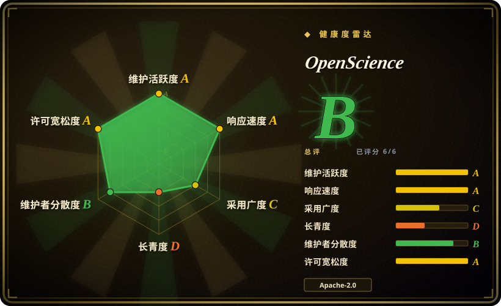
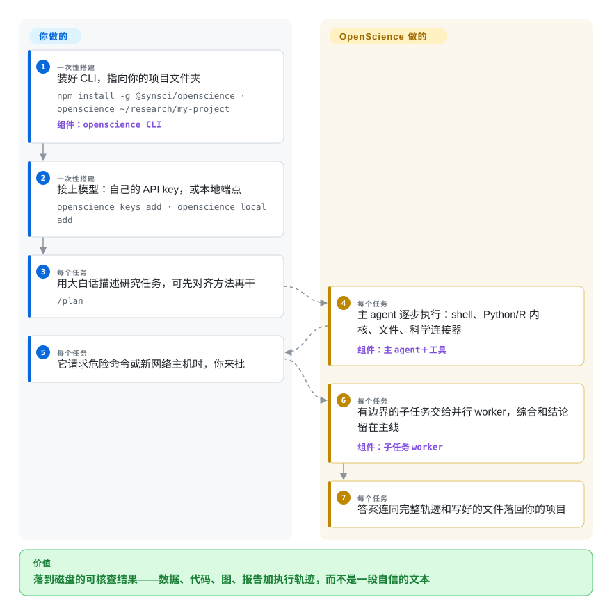

# OpenScience

让聊天工具复核一张图表或一个已发表的结论，它回你一段自信的文字——没有代码、没有文件，也看不出它到底做了什么。OpenScience 是一个在你自己机器上、对着项目文件夹干活的科研 agent：查文献、写代码、跑分析，每一次搜索、每条命令、每处改动都留在可逐轮审计的执行轨迹里，交回可复现的结果文件。

## 何时使用

你是课题组里那个承担“计算杂活”的人——引用某篇论文前想复核它的图、清洗 `samples.csv` 里同一标签的三种写法、在方法截止前扫一遍超参。通用聊天 agent 给你的是没有可执行内容支撑的合理文字；通用编码 agent 给你的是不带科学的循环——PubMed 检索、ChEMBL 查询、内核环境都得自己搭。把 OpenScience 指向一个项目文件夹（`openscience ~/research/my-project`），用大白话描述任务，它规划本轮、检索文献和科学数据库、写 Python 或 R 并在你机器上的内核里执行，再把报告、图和生产它们的代码放回文件夹——危险命令和新网络主机都会先经你批准。有边界的长任务交给并行的领域 worker，综合与结论留在主 agent。

和深研报告生成器相比，选它的理由是**答案需要对你的文件执行代码**，而不只是读网页——GPT Researcher 和 STORM 能引经据典，但不会跑任何分析。和自己在通用编码 agent 上搭科学环境相比，选它是因为领域是随产品发来的：372 个内置流程技能、ChEMBL/UniProt/PubMed/arXiv 等连接器、内核与集群派发、桌面端——代价是一个更年轻、更受厂商形状影响的框架。和全自动的“论文工厂”不同，它设计上就把想法和判断留给人。

## 怎么用起来

它的内核是 OpenCode 式的终端 agent——项目在 README 里致谢 OpenCode，自己的设计笔记把方案描述为“OpenCode 的 Build 路径，在三个地方加上科学”。科学从三个入口进来：技能库（372 个 `SKILL.md` 流程文件，多数改编公开社区合集，从数据清洗到蛋白结合剂设计）、只读的科学连接器（ChEMBL、UniProt、PubMed、arXiv、基因组与通路数据库），以及按模型家族区分的系统提示头——把编码指令换成证据、交付物与文稿要求。主 agent 用你看得见的工具逐步完成一轮：shell、Python 和 R 内核（在你机器上执行代码的交互式解释器）、一个项目文件夹之外的读写都需要显式授权的文件系统，以及经批准后可用的远程算力（Modal、SSH 主机、Slurm/PBS 集群）。有边界的子任务派给并行的 worker——explore、general 加五个领域专家——每个工具调用事后都留在轨迹里。你做的事：安装、接模型（自己的 API key，Ollama/LM Studio 之类的本地端点，或厂商“按量付费”的 Ace 钱包）、描述研究问题、批准高风险步骤。它做的事：检索、写码、执行、起草、记录。就像一位做一步就当场记一步实验记录的科研助理——你随时能审计全过程，不用事后听任何人解释。

<!-- flow-steps:begin (generated from flows/openscience.json by tools/flow_card.py — do not edit) -->

流程文字版

1. **你**（一次性搭建）：装好 CLI，指向你的项目文件夹 — `npm install -g @synsci/openscience · openscience ~/research/my-project` — 组件：`openscience CLI`
2. **你**（一次性搭建）：接上模型：自己的 API key，或本地端点 — `openscience keys add · openscience local add`
3. **你**（每个任务）：用大白话描述研究任务，可先对齐方法再干 — `/plan`
4. **OpenScience**（每个任务）：主 agent 逐步执行：shell、Python/R 内核、文件、科学连接器 — 组件：`主 agent＋工具`
5. **你**（每个任务）：它请求危险命令或新网络主机时，你来批
6. **OpenScience**（每个任务）：有边界的子任务交给并行 worker，综合和结论留在主线 — 组件：`子任务 worker`
7. **OpenScience**（每个任务）：答案连同完整轨迹和写好的文件落回你的项目

**价值**：落到磁盘的可核查结果——数据、代码、图、报告加执行轨迹，而不是一段自信的文本

<!-- flow-steps:end -->

## 何时不用

- **只要一份带引用的综述、不需要任何计算。** 桌面端、内核、权限系统全是为“执行”存在的，纯阅读型问题也要付这套安装与 token 成本。要文献综述，用 [GPT Researcher](gpt-researcher.zh.md) 或 [STORM](storm.zh.md)，或托管的深研服务（非仓库）。
- **你的日常是软件工程而不是科研。** 这套 harness 形似 OpenCode，但提示词、技能与连接器都往科研交付物上引，干仓库杂活纯属领域开销。要轻量通用的底座，用 [OpenCode](../agent-frameworks/coding-agents/terminal-agents/opencode.zh.md)。
- **你想要无人盯守的“想法到论文”闭环。** OpenScience 刻意把人留在判断位上、在风险步骤前征求批准。要研究自动流水线本身，看 [The AI Scientist](../ml-research/research-automation/ai-scientist.zh.md) 与 [Agent Laboratory](../ml-research/research-automation/agent-laboratory.zh.md)——但接受它们产品度更低（后者 2025 年初以来停摆，还挂着一个未答复的安全披露）。
- **每一次查询都必须留在自己的硬件上。** 本地模型只解决推理：交互式首启要登录 OpenScience 账号（README 称无头的 `openscience run` 不需要），桌面端从厂商基础设施自更新，连接器天生要调外部学术 API。要求数据绝不出机器的研究，用 [Local Deep Research](local-deep-research.zh.md)。
- **你要在稳定接口上盖楼。** 建库约三个月发了 141 个版本，changelog 显示用户可见的行为变化在补丁号上滚动。TypeScript SDK 由服务端 OpenAPI 契约生成，但契约本身只有三个月大——锁版本，每次升级先读 changelog。
- **环境涉密或受监管。** agent 跑的是真实 shell 和内核（完全授权模式不再询问），发布动作（`git push`、Hugging Face 上传）用这台机器上已有的 GitHub/HF 登录态执行。2026-09-28 有 issue 报告 GitHub 安全咨询表单和 `security@` 地址双双失效，当天关闭，修复未确认。
- **token 预算很紧。** 委托与长会话每轮都重发大上下文——项目自己的 changelog（2026-09）提到 Terminal-Bench 计算回环上 110–120k token 的上下文；成本治理是你的事。

## 横向对比

| 替代品 | 是否收录 | 我们的评价 | 取舍 |
|---|---|---|---|
| [OpenCode](../agent-frameworks/coding-agents/terminal-agents/opencode.zh.md) | ✅ | 想要轻量、MIT、自己配置的终端编码 agent，选 OpenCode；想要同一形态的 agent 出厂就装满科学流程、数据库连接器、内核和桌面端，选 OpenScience。 | OpenCode 更小、通用、形状由你定；OpenScience 领域开箱即用，但更年轻，且带账号登录和厂商钱包选项。 |
| [GPT Researcher](gpt-researcher.zh.md) | ✅ | 交付物是从网页和文档来的带引用报告、还要嵌进自己的 API 后端，选 GPT Researcher；研究问题要靠对自己的数据跑代码来回答，选 OpenScience。 | GPT Researcher 不绑模型、可嵌入、更轻，但没有对你文件的执行面；OpenScience 能执行并产出工件，但整个产品要你来装。 |
| [Local Deep Research](local-deep-research.zh.md) | ✅ | 查询与资料绝不能离开自己的机器，选 Local Deep Research；要一个有人监督、连着真实内核和集群派发的科研工作区，选 OpenScience。 | LDR 把本地化和零厂商依赖拉满；OpenScience 用账号门槛和外部学术 API 换算力触达与更完整的轨迹 UI。 |
| [The AI Scientist](../ml-research/research-automation/ai-scientist.zh.md) | ✅ | 研究对象是“想法到论文”的自动闭环本身，选 The AI Scientist；人在主导科研、只想要一个干活留痕的助理，选 OpenScience。 | AI Scientist 全自动但绑模板、许可变更后对发表产出有约束；OpenScience 交互式、在维护，科学判断留给你。 |
| [Scientific Agent Skills](../agent-skills/engineering/scientific-agent-skills.zh.md) | ✅ | 已经有 Claude Code 或其他 Agent Skills 宿主、只想要流程库，选 Scientific Agent Skills——OpenScience 内置技能里 180 个就来自它；想要围着这些技能把内核、连接器、轨迹 UI 都接线好的运行时，选 OpenScience。 | 技能包是可携带的内容资产，在自己 harness 里接入便宜；OpenScience 是维护中的产品界面，但整套形状你得一起接。 |

## 技术栈

Bun + turbo 的 TypeScript monorepo（GitHub 语言统计 2026-09-28：TypeScript 约 17.9 MB、Python 约 5.2 MB、TeX 约 0.8 MB 文稿模板）。`backend/cli` 是 CLI 兼本地服务器（Hono 加 OpenAPI 契约、AI SDK v5 做 provider 流式、Zod 全量校验），构建时内嵌 SolidJS 写的浏览器工作区；`frontend/desktop` 是 Electron 壳、带签名自更新。`tooling/sdk` 是从该 OpenAPI 契约生成的 TypeScript SDK；插件运行时与 MCP 客户端内置。科学层是 `backend/cli/skills/` 下约 370 个 `SKILL.md` 技能、`src/science/connectors/` 下分类型的连接器（chemistry、genomics、literature、omics、pathways、proteins）、`src/science/bionemo/` 的 NIM 派发，以及 shell/Python/R 内核工具（树内可见，如 `src/tool/rkernel.ts`）。

## 依赖

- **模型来源任选其一**：自己的 API key（`openscience keys add`）、本地端点（Ollama、LM Studio 或任何兼容服务，`openscience local add`）、或厂商按量付费的 Ace 钱包。
- **交互式首启需要 OpenScience 账号**（README 称无头 `openscience run` 不需要）；桌面端从厂商基础设施自更新。
- **没有必须自托管的东西**——会话、存储与工件都在你机器上，发布版给 Linux、macOS、Windows 的原生二进制。
- 连接器依赖外部学术 API（arXiv、PubMed、ChEMBL、UniProt 等）；NVIDIA BioNeMo 适配器需要你自己的 NVIDIA API key，并受 NVIDIA 服务条款约束。
- 可选远程算力自备：Modal、SSH 主机、Slurm/PBS 集群。

## 运维难度

**单人科研使用者低，实验室规模中等。** 装是 npm 或一行 curl，接上模型就能跑；没有你要运营的服务器、数据库或 worker 池。持续负担在变更与成本，不在可用性：版本一周发好几次、契约年轻，升级要过一遍 changelog；委托长跑要设 token 预算，并按用户定授权档位与权限级别；实验室接共享集群（Modal/SSH/Slurm）和逐用户模型 key 才是真正要搭的部分。

## 健康度与可持续性

- **维护（2026-09-28）**——异常活跃：自 2026-07-03 建库以来 141 个版本，最新 v2.0.141 于 2026-09-28 打 tag；抽查 tracker 见 issue 当天开、当天关。未归档。
- **治理与总线因子**——GitHub 组织 Synthetic Sciences 所有（2025-07 创建，自称“为科学超级智能建基础设施的 AI 研究实验室”，公开仓库仅 4 个）。人类提交约 970 次里前两名贡献者占 572＋339——路线图像是两人说了算 [推断]。
- **年龄与 Lindy（2026-09-28）**——建库约三个月，约 3.8k star、503 fork：年轻且热度高，没有 Lindy 先验可倚。这个年纪的 star 度量的是注意力而非寿命；这里更耐读的信号是工程纪律（每次发布前的端到端彩排、能力金丝雀、署名账本），而不是履历。
- **采用度（2026-09-28）**——健康度评分器读的是平台包 `@synsci/openscience-linux-x64`（月下载 56,016）；同日 npm API 查伞形包 `@synsci/openscience` 为 33,413——数字按平台包拆分统计，哪个都不能当独立安装量。每个版本发原生二进制；公开基准轨迹仓库 `synthetic-sciences/benchmarks-openscience`（2026-09-26 创建）。它同时大规模内置别家技能内容（K-Dense、Orchestra Research、Hugging Face、Anthropic、NVIDIA），整合者成分不亚于原创者。
- **风险标记**——代码 Apache-2.0，附 NOTICE 与逐技能 ATTRIBUTION 账本（上游条款混合：MIT、CC-BY-4.0、Apache-2.0、Anthropic 条款）；无重新授权历史。变现走开源应用之上的托管 Ace 钱包，路线图的经济学系于单一厂商；有 issue 报告安全上报渠道失效（2026-09-28 当天关闭，修复未验证）。

## 存疑（未验证）

- [未验证] 基准数字（Terminal-Bench Science 53/70、BiomniBench-DA 82.2、Terminal-Bench 4.0 科学子集 10/14）是作者自报的运行结果；轨迹仓库存在，但本页未复跑。
- [未验证] 基准运行引用的 “GPT-6 Astra / GPT-6 Sol” 模型身份无法独立证实，按作者标注处理。
- [未验证] 安全上报渠道失效（GitHub 咨询表单 + `security@` 地址，issue 2026-09-28 当天关闭）是否已修复；两条路径都未实测。
- [未验证] 账号登录、桌面自更新与 Ace 钱包的完整出网面。`backend/cli/src/session/telemetry.ts`（2026-09-28 已读）把上下文管理遥测发在本地事件总线上，不是上传分析——但其余网络面未审计。
- [未验证] Ace 定价（钱包显示价、默认 5.5% 的 OpenRouter 抽成、支付通道费）引自 README，未对照厂商定价页。
- [未验证] 数字都是 2026-09-28 的快照：3,779 star、503 fork、24 个 open issue；npm 月下载按包口径不同（平台包 56,016、伞形包 33,413），未折算成独立安装。
- [推断] 总线因子约为 2，依据 contributors API 的前两名占比；树内未见治理文档或 CODEOWNERS，决策结构未发布。
- [推断] “用户可见行为在补丁版本上滚动”来自 v2.0.x tag 下的 CHANGELOG 条目；跨版本兼容性未经系统实测。
- [未验证] 无头 `openscience run` 不需要账号登录，仅据 README 的 Models 一节；未实际在无账号状态下验证。
