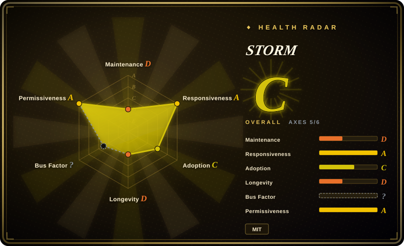
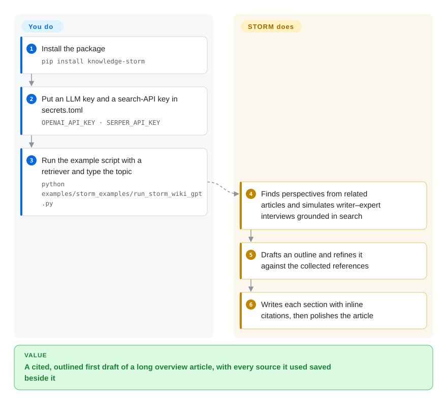

# STORM

You need a structured, sourced overview of a topic you barely know, and a chatbot gives you five confident bullet points with no citations and whole sub-areas missing. STORM, a Stanford research system, first has simulated writers with different viewpoints interview a search-backed "expert" to gather sources, then turns what they found into an outline and a long Wikipedia-style article with numbered citations.

## When to use

You're an analyst, researcher, or the person who keeps a team wiki, and you have to produce first drafts of overview articles on topics outside your expertise — "solid-state batteries", "EU AI Act enforcement", "the history of RISC-V". Asking a chat model gets you a 400-word answer with no sources, organized around whatever it happened to think of first; you can't tell what it skipped. You want a pipeline that goes *wide* before it writes: asks the topic from several angles, keeps every URL it read, builds an outline from what it found, and only then writes long sections you can check and edit. You install `knowledge-storm`, give it an LLM and a search API, type the topic, and get an outline, a full cited article, and the raw sources it used as separate files.

Pick STORM over [GPT Researcher](gpt-researcher.md) when the output you want is a *Wikipedia-style long article* built from a perspective-guided outline, and you want a Python library whose four stages (research, outline, article, polish) you can rerun or replace one at a time; GPT Researcher is the better-maintained choice when you just need a report from a question. Pick it over [deep-research](deep-research.md) or [node-DeepResearch](node-deepresearch.md) when you want a structured article rather than a list of learnings or a short answer. Its own README is candid that the output is a pre-writing aid that "often require[s] a significant number of edits", not a finished article.

## How it works

STORM splits writing into two stages, the way a journalist interviews before drafting. **Pre-writing**: it looks at existing articles on related topics to find *perspectives* — say, a battery chemist, a carmaker, a regulator — and for each one runs a simulated conversation in which a "writer" LLM asks questions and an "expert" LLM answers by querying your chosen search engine (the *retriever*, e.g. Serper, Brave, Tavily, SearXNG, or your own documents in a Qdrant vector store) and citing what came back. The snippets and URLs from all those conversations become the reference pool. **Writing**: it drafts an outline, refines it against the references, writes each section with inline citations, and finally polishes the article (adds a summary lead, optionally removes duplicated content). **It does the questioning, searching, organizing and writing for you; you choose the models and the search API** — a cheaper model for the many conversation turns and a stronger one for the article, as the README recommends — supply keys in `secrets.toml`, and run the example script or `STORMWikiRunner.run()` in your own code. Co-STORM, in the same package, is the alternative entry where you join the conversation and steer it yourself; it keeps a mind map of what has been found and writes the report at the end.

<!-- flow-steps:begin (generated from flows/storm.json by tools/flow_card.py — do not edit) -->

Text version of the flow

1. **You**: Install the package — `pip install knowledge-storm`
2. **You**: Put an LLM key and a search-API key in secrets.toml — `OPENAI_API_KEY · SERPER_API_KEY`
3. **You**: Run the example script with a retriever and type the topic — `python examples/storm_examples/run_storm_wiki_gpt.py`
4. **STORM**: Finds perspectives from related articles and simulates writer–expert interviews grounded in search
5. **STORM**: Drafts an outline and refines it against the collected references
6. **STORM**: Writes each section with inline citations, then polishes the article

**Value**: A cited, outlined first draft of a long overview article, with every source it used saved beside it

<!-- flow-steps:end -->

## When NOT to use

- **You need an actively maintained dependency.** The last commit on `main` is 2025-09-30 and the last PyPI release (`knowledge-storm` 1.1.1) is 2025-09-29 — over a year without merged changes as of 2026-10, while community PRs (Claude model support, new retrievers) keep arriving unmerged. Treat it as a reference implementation of the STORM method; for a maintained report agent use [GPT Researcher](gpt-researcher.md).
- **You want a short answer to a specific question.** STORM spends dozens of LLM and search calls building a whole article. For "what is X's context length?"-style questions use [node-DeepResearch](node-deepresearch.md), which loops until it has one referenced answer, or a cited answer engine like [Vane](vane.md).
- **You need publication-ready text.** The README states the output needs significant edits and is meant for the pre-writing stage. Budget for a human editor, or don't use it.
- **Your Python environment already uses a modern DSPy.** The package pins `dspy_ai==2.4.9` exactly and pulls `sentence-transformers` and Qdrant clients; installing it into a shared environment will fight other pins. Give it its own virtualenv or container, or choose [GPT Researcher](gpt-researcher.md), which does not depend on DSPy.
- **You plan to follow the default example verbatim.** The README's quick-start uses `--retriever bing`, and Microsoft retired the Bing Search APIs on 2025-08-11. Use the `serper`, `brave`, `tavily`, `searxng` or `duckduckgo` retriever instead.
- **You want a turnkey app with a UI, fully on your machine.** The repo ships a library, example scripts and a minimal Streamlit "demo light"; local runs mean wiring the Ollama + SearXNG example yourself. For a ready local research app use [Local Deep Research](local-deep-research.md).

## Comparison

| Alternative | In index | Our verdict | Tradeoff |
|---|---|---|---|
| [GPT Researcher](gpt-researcher.md) | ✅ | For a maintained agent that turns a question into a cited report, pick GPT Researcher; pick STORM only when you specifically want the perspective-guided outline and Wikipedia-style article. | GPT Researcher has active releases, a web UI and more report types; STORM has the more studied article-writing method (NAACL 2024 paper) but its code has been frozen since 2025-09. |
| [deep-research](deep-research.md) | ✅ | To understand or fork a minimal research loop, read deep-research; to get a long structured article, run STORM. | deep-research is ~500 lines of TypeScript you can read in one sitting, producing a learnings list; STORM is a larger Python package with four separable stages and a much longer output. |
| [node-DeepResearch](node-deepresearch.md) | ✅ | For one definitive, referenced answer to a hard question, pick node-DeepResearch; for a broad overview article, pick STORM. | node-DeepResearch is answer-oriented and budget-bounded and leans on Jina's APIs; STORM writes long-form and lets you pick from about ten retrievers. |
| [Local Deep Research](local-deep-research.md) | ✅ | When queries must stay on your own machine and you want an app with a UI, pick Local Deep Research; STORM can run locally only if you assemble it from its Ollama/SearXNG examples. | Local Deep Research is a maintained self-hosted app; STORM is a library you script, which is more flexible but more wiring. |
| [Open Deep Research](open-deep-research.md) | ✅ | Study Open Deep Research to see a LangGraph research graph; study STORM to see a perspective-and-interview pipeline — run neither as a long-term dependency. | Both are reference implementations whose upstreams went quiet (Open Deep Research archived in 2026); they differ in method, not in maintenance outlook. |
| OpenAI / Gemini Deep Research | not a repo | If you only need the reports and can send queries to a vendor, the hosted products need no setup; pick STORM when you need to see and change every stage. | Closed, hosted, paid; nothing to install or maintain, but no control over retrieval, prompts or models. |

## Tech stack

- **Language:** Python ≥3.10 (classifiers list 3.10 and 3.11), packaged on PyPI as `knowledge-storm` ("Development Status :: 3 - Alpha").
- **Pipeline framework:** DSPy (`dspy_ai==2.4.9`, pinned exactly) — the four STORM modules and the Co-STORM agents are DSPy programs behind interfaces in `knowledge_storm/interface.py`.
- **Models:** any chat or embedding model reachable through `litellm` (`LitellmModel`); example scripts cover GPT, Claude, Gemini, DeepSeek, Groq, Mistral and Ollama.
- **Retrieval:** `knowledge_storm/rm.py` — `YouRM`, `BingSearch`, `SerperRM`, `BraveRM`, `TavilySearchRM`, `SearXNG`, `DuckDuckGoSearchRM`, `GoogleSearch`, `AzureAISearch`, and `VectorRM` (Qdrant + `sentence-transformers`) for your own documents; `trafilatura` extracts page text.
- **UI:** a minimal Streamlit app in `frontend/demo_light`.

## Dependencies

- **An LLM API** (OpenAI, Azure, Anthropic, etc. via litellm) or a local model server such as Ollama — with per-stage model choice, since conversation turns are many and cheap while article generation needs a strong model.
- **A search source:** an API key for You.com, Serper, Brave, Tavily or Google, or a self-hosted SearXNG; or, for private corpora, a Qdrant collection plus an embedding model via `VectorRM`.
- **Python packages:** the pinned `dspy_ai==2.4.9` and `wikipedia==1.4.0`, plus `sentence-transformers`, `qdrant-client`, `langchain-qdrant`, `litellm` — a heavy install best kept in its own environment.
- **No server or database** for the basic STORM run: results land as files in the output directory (`storm_gen_outline.txt`, `storm_gen_article_polished.txt`, `url_to_info.json`, conversation logs).

## Ops difficulty

**Medium.** There is no service to keep running — a run is a script that writes files — but getting good results takes configuration: choosing a model per stage, picking a retriever that still exists (the default example's Bing API is gone), isolating the exact DSPy pin, and keeping the per-article cost in check, since every perspective × conversation turn is a mix of LLM and search calls. With upstream frozen since 2025-09, any breakage from newer model APIs or litellm changes is yours to patch, and the community PRs that fix such things are not being merged.

## Health & viability

- **Maintenance (2026-10): coasting toward abandoned.** Last commit 2025-09-30 (loosening requirement pins); last PyPI release 1.1.1 on 2025-09-29; last GitHub release v1.1.0 (2025-01). 111 open issues; new PRs through 2026-10 sit unmerged. The scorer grades maintenance and longevity D — the radar reflects a year of silence, not a lack of interest from users.
- **Governance / bus factor.** Owned by Stanford's OVAL lab; two PhD-student authors (shaoyijia, Yucheng-Jiang) wrote most of the code. The roadmap follows the research agenda, and the code is best treated as the artifact of two papers (NAACL 2024, EMNLP 2024). The scorer could not attribute governance (`?`).
- **Age × Lindy.** Created 2024-03 (~2.5 years) and quiet for the last year, so the Lindy prior does not help. The method will persist in the literature even if the repository does not.
- **Adoption.** ~31.6k stars and ~3k forks, but only 1,238 PyPI downloads in the last month — attention far exceeds package use. The scorer's adoption grade (C) rests on Docker pulls of `library/storm`, which is the official **Apache Storm** image, not this project; discount that grade.
- **Risk flags.** MIT license, no relicense history. Practical risks are the exact `dspy_ai` pin, an alpha classifier, and a quick-start built on a retired search API.

## Caveats (unverified)

- [未验证] Stars (~31.6k), forks (~3k) and PyPI downloads (~1.2k/month) are 2026-10 snapshots; date-sensitive and indicative only.
- [推断] "Dozens of LLM and search calls per article" is inferred from the pipeline shape (perspectives × conversation turns, plus outline/article/polish); per-run cost was not measured.
- [推断] Installing `sentence-transformers` normally pulls PyTorch, which is what makes the install heavy; not measured for this package.
- [未验证] Whether `knowledge-storm` 1.1.1 still works unpatched with current litellm releases and current model names was not tested; open issues and PRs (e.g. Claude model support, 2026-10) suggest friction.
- [推断] The adoption-grade misattribution (`library/storm` = Apache Storm, confirmed from the Docker Hub description) means the scorer's adoption axis for this page is unreliable until the scorer is fixed.
- [未验证] Co-STORM's claim that its mind map "reduce[s] the mental load" in long sessions is the authors' paper claim, not independently checked.
