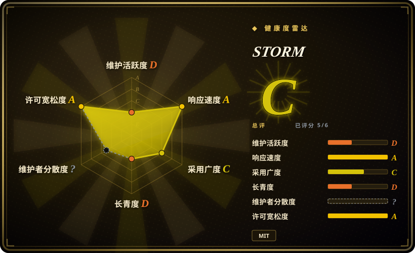
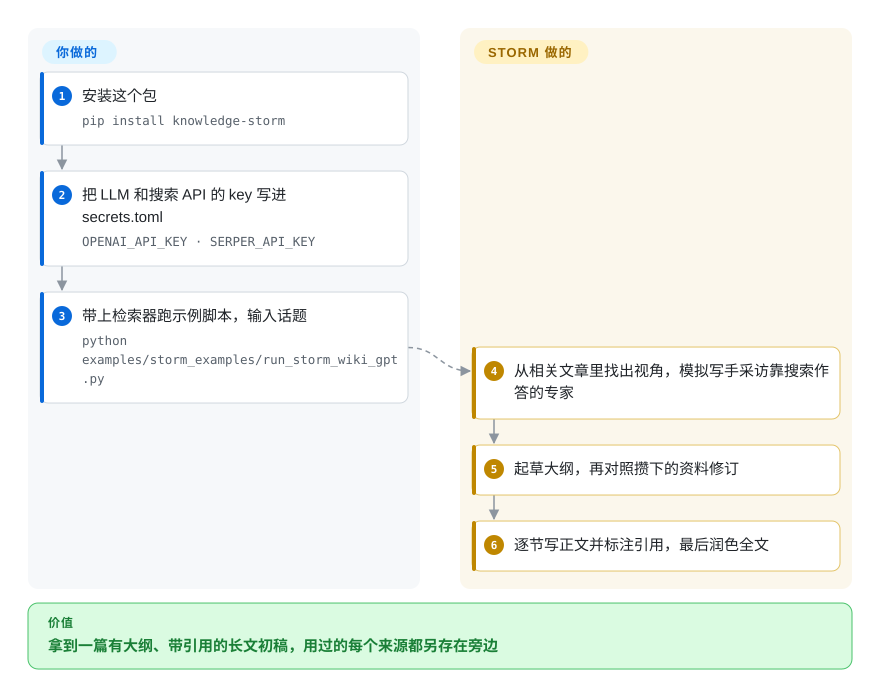

# STORM

你要摸清一个几乎不了解的话题，想要一篇像维基百科条目那样有结构、有出处的概览，可聊天机器人只给你五条自信满满的要点，没有引用，整块子领域都漏了。STORM 是斯坦福的研究系统：先让几个不同视角的“写手”去采访一个靠搜索结果作答的“专家”，把资料攒齐，再整理成大纲，写成一篇带编号引用的维基风长文。

## 何时使用

你是分析师、研究员，或者团队 wiki 的维护者，经常要给自己不熟的话题写概览初稿——“固态电池”“欧盟 AI 法案的执法”“RISC-V 的来龙去脉”。问聊天模型，你拿到四百字、零出处、按它碰巧先想到什么来组织的回答，根本看不出它漏了什么。你想要的流程是先铺开再动笔：从几个角度去问这个话题，留下读过的每个链接，按找到的东西搭大纲，最后才写出能逐段核对、修改的长章节。你装好 `knowledge-storm`，给它一个 LLM 和一个搜索 API，输入话题，就能分别拿到大纲、带引用的全文和它用过的原始来源文件。

如果你要的成品是一篇按多视角大纲组织的**维基风长文**，并且希望用一个能把四个阶段（调研、大纲、正文、润色）单独重跑或替换的 Python 库，就选 STORM 而不是 [GPT Researcher](gpt-researcher.zh.md)；如果只是要从一个问题得到一份报告，GPT Researcher 维护得更好。想要结构化文章、而不是一串要点或一句短答案时，选它而不是 [deep-research](deep-research.zh.md) 或 [node-DeepResearch](node-deepresearch.zh.md)。它的 README 自己也坦白：产出只是动笔前的辅助材料，“往往需要大量修改”，不是成稿。

## 怎么用起来

STORM 把写作拆成两个阶段，就像记者先采访、再成稿。**动笔前**：它先看相关话题的现有文章，找出若干*视角*——比如电池化学家、车企、监管者——再为每个视角模拟一场对话：一个扮演“写手”的 LLM 提问，一个扮演“专家”的 LLM 去查你选的搜索引擎（叫 *retriever*，检索器，比如 Serper、Brave、Tavily、SearXNG，或者放在 Qdrant 向量库里的你自己的文档），根据查到的内容回答并注明出处。所有对话里攒下的片段和链接就是参考资料池。**动笔**：它先起草大纲，再对照资料修订大纲，然后逐节写正文、带行内引用，最后润色（补一段总述，可选地删掉重复内容）。**提问、搜索、整理、写作都由它做；你负责选模型和搜索 API**——按 README 的建议，对话轮次多，用便宜模型；写正文用强模型——把 key 写进 `secrets.toml`，然后跑示例脚本，或在自己的代码里调用 `STORMWikiRunner.run()`。同一个包里的 Co-STORM 是另一种用法：你亲自加入对话、引导方向，它边聊边维护一张已发现内容的思维导图，最后再写报告。

<!-- flow-steps:begin (generated from flows/storm.json by tools/flow_card.py — do not edit) -->

流程文字版

1. **你**：安装这个包 — `pip install knowledge-storm`
2. **你**：把 LLM 和搜索 API 的 key 写进 secrets.toml — `OPENAI_API_KEY · SERPER_API_KEY`
3. **你**：带上检索器跑示例脚本，输入话题 — `python examples/storm_examples/run_storm_wiki_gpt.py`
4. **STORM**：从相关文章里找出视角，模拟写手采访靠搜索作答的专家
5. **STORM**：起草大纲，再对照攒下的资料修订
6. **STORM**：逐节写正文并标注引用，最后润色全文

**价值**：拿到一篇有大纲、带引用的长文初稿，用过的每个来源都另存在旁边

<!-- flow-steps:end -->

## 何时不用

- **你需要一个有人持续维护的依赖。** `main` 上最后一次提交是 2025-09-30，最后一个 PyPI 版本（`knowledge-storm` 1.1.1）发于 2025-09-29——截至 2026-10 已超过一年没有合入任何改动，而社区 PR（支持 Claude 模型、新增检索器）还在不断提交、无人合并。把它当作 STORM 方法的参考实现；要一个有人维护的报告 agent，用 [GPT Researcher](gpt-researcher.zh.md)。
- **你只想要一个具体问题的简短答案。** STORM 为了写一整篇文章要花几十次 LLM 和搜索调用。“X 的上下文长度是多少”这类问题，用 [node-DeepResearch](node-deepresearch.zh.md)（循环到拿到一个带出处的答案为止），或用 [Vane](vane.zh.md) 这类带引用的问答引擎。
- **你需要能直接发表的文字。** README 明说产出需要大量修改，定位是动笔前的阶段。要么留出人工编辑的时间，要么别用它。
- **你的 Python 环境已经在用新版 DSPy。** 这个包把 `dspy_ai==2.4.9` 钉死，还会拉进 `sentence-transformers` 和 Qdrant 客户端；装进共享环境会和别的版本约束打架。给它单独的虚拟环境或容器，或者改用不依赖 DSPy 的 [GPT Researcher](gpt-researcher.zh.md)。
- **你打算照抄默认示例。** README 的快速上手用的是 `--retriever bing`，而微软已在 2025-08-11 停用 Bing Search API。改用 `serper`、`brave`、`tavily`、`searxng` 或 `duckduckgo` 检索器。
- **你想要一个开箱即用、带界面、完全跑在本机的应用。** 仓库提供的是库、示例脚本和一个极简的 Streamlit “demo light”；本地运行意味着你自己把 Ollama + SearXNG 示例拼起来。要现成的本地研究应用，用 [Local Deep Research](local-deep-research.zh.md)。

## 横向对比

| 替代品 | 是否收录 | 我们的评价 | 取舍 |
|---|---|---|---|
| [GPT Researcher](gpt-researcher.zh.md) | 已收录 | 要一个有人维护、把问题变成带引用报告的 agent，选 GPT Researcher；只有明确想要多视角大纲加维基风长文时才选 STORM。 | GPT Researcher 持续发版、有网页界面、报告类型更多；STORM 的写作方法研究得更透（NAACL 2024 论文），但代码自 2025-09 起就冻结了。 |
| [deep-research](deep-research.zh.md) | 已收录 | 想读懂或 fork 一个极简研究循环，读 deep-research；想拿到一篇有结构的长文，跑 STORM。 | deep-research 是约 500 行、一口气能读完的 TypeScript，产出一串要点；STORM 是更大的 Python 包，四个阶段可拆开，产出长得多。 |
| [node-DeepResearch](node-deepresearch.zh.md) | 已收录 | 要给一个难问题拿到一个确定、带出处的答案，选 node-DeepResearch；要一篇面面俱到的概览文章，选 STORM。 | node-DeepResearch 以答案为目标、受 token 预算约束，依赖 Jina 的 API；STORM 写长文，可在约十种检索器里挑。 |
| [Local Deep Research](local-deep-research.zh.md) | 已收录 | 查询必须留在本机、又想要带界面的应用，选 Local Deep Research；STORM 只有把 Ollama／SearXNG 示例自己拼起来才能本地跑。 | Local Deep Research 是有人维护的自托管应用；STORM 是要写脚本调用的库，更灵活，但接线更多。 |
| [Open Deep Research](open-deep-research.zh.md) | 已收录 | 想看 LangGraph 研究图怎么搭，研究 Open Deep Research；想看“多视角加采访”式流水线，研究 STORM——两者都别当长期依赖来跑。 | 两者都是上游已沉寂的参考实现（Open Deep Research 已于 2026 年归档）；差别在方法，不在维护前景。 |
| OpenAI／Gemini Deep Research | 非仓库 | 只要报告、又能把查询交给厂商，托管产品零配置；需要看清并改动每个阶段时选 STORM。 | 闭源、托管、付费；不用安装维护，但检索、提示词和模型都无法控制。 |

## 技术栈

- **语言：** Python ≥3.10（分类器标注 3.10 和 3.11），以 `knowledge-storm` 发布在 PyPI，标注为“Development Status :: 3 - Alpha”。
- **流水线框架：** DSPy（`dspy_ai==2.4.9`，精确钉版本）——STORM 的四个模块和 Co-STORM 的各类 agent 都是 DSPy 程序，接口定义在 `knowledge_storm/interface.py`。
- **模型：** 任何能通过 `litellm` 调用的对话或嵌入模型（`LitellmModel`）；示例脚本覆盖 GPT、Claude、Gemini、DeepSeek、Groq、Mistral 和 Ollama。
- **检索：** `knowledge_storm/rm.py`——`YouRM`、`BingSearch`、`SerperRM`、`BraveRM`、`TavilySearchRM`、`SearXNG`、`DuckDuckGoSearchRM`、`GoogleSearch`、`AzureAISearch`，以及用于自有文档的 `VectorRM`（Qdrant + `sentence-transformers`）；网页正文由 `trafilatura` 抽取。
- **界面：** `frontend/demo_light` 里一个极简的 Streamlit 应用。

## 依赖

- **一个 LLM API**（经 litellm 调 OpenAI、Azure、Anthropic 等），或 Ollama 之类的本地模型服务——并且要按阶段选模型：对话轮次多而便宜，写正文需要强模型。
- **一个搜索来源：** You.com、Serper、Brave、Tavily 或 Google 的 API key，或自托管的 SearXNG；私有资料则用 `VectorRM` 配一个 Qdrant 集合加嵌入模型。
- **Python 包：** 钉死的 `dspy_ai==2.4.9` 和 `wikipedia==1.4.0`，外加 `sentence-transformers`、`qdrant-client`、`langchain-qdrant`、`litellm`——安装很重，最好放在独立环境里。
- **基础的 STORM 运行不需要服务或数据库：** 结果以文件形式落在输出目录（`storm_gen_outline.txt`、`storm_gen_article_polished.txt`、`url_to_info.json`、对话日志）。

## 运维难度

**中等。** 没有需要常驻的服务——跑一次就是一个写文件的脚本——但要出好结果得花心思配置：按阶段选模型，挑一个还活着的检索器（默认示例用的 Bing API 已经没了），把精确钉死的 DSPy 隔离开，并控制每篇文章的成本，因为每个视角 × 每轮对话都是 LLM 加搜索的调用。上游自 2025-09 起冻结，新版模型 API 或 litellm 变动造成的故障只能自己打补丁，而修这些问题的社区 PR 没人合并。

## 健康度与可持续性

- **维护（2026-10）：在吃老本，正滑向废弃。** 最后一次提交 2025-09-30（放宽依赖版本约束）；最后一个 PyPI 版本 1.1.1 发于 2025-09-29；最后一个 GitHub release 是 v1.1.0（2025-01）。111 个 open issue；直到 2026-10 仍有新 PR 提交、无人合并。评分器把维护和长寿度都评为 D——雷达反映的是一年的沉默，而不是用户不感兴趣。
- **治理／bus factor。** 归斯坦福 OVAL 实验室所有；大部分代码出自两位博士生作者（shaoyijia、Yucheng-Jiang）。路线图跟着研究议程走，代码最好看作两篇论文（NAACL 2024、EMNLP 2024）的产物。评分器无法归因治理轴（`?`）。
- **年龄 × Lindy。** 2024-03 创建（约 2.5 年），且最近一年没有动静，Lindy 先验帮不上忙。即使仓库不再活跃，这个方法也会留在文献里。
- **采用度。** 约 3.16 万 star、约 3 千 fork，但 PyPI 最近一个月下载只有 1,238 次——关注度远超实际装包量。评分器现在读的是 PyPI 上的 `knowledge-storm` 包，采用度给 D（2026-10-09），与这个落差一致。
- **风险标记。** MIT 许可，无改许可历史。实际风险是精确钉死的 `dspy_ai`、Alpha 分类标注，以及建在已停用搜索 API 上的快速上手示例。

## 存疑（未验证）

- [未验证] star（约 3.16 万）、fork（约 3 千）和 PyPI 月下载（约 1.2 千）均为 2026-10 的快照，随时间变化，仅供参考。
- [推断] “每篇文章几十次 LLM 和搜索调用”是从流水线结构（视角数 × 对话轮数，再加大纲／正文／润色）推出来的，单次运行成本没有实测。
- [推断] 安装 `sentence-transformers` 通常会拉进 PyTorch，这是安装沉重的原因；没有针对本包实测。
- [未验证] `knowledge-storm` 1.1.1 在当前 litellm 版本和当前模型名下能否不打补丁直接运行，没有测试；open issue 和 PR（如 2026-10 的 Claude 模型支持）显示存在摩擦。
- [未验证] Co-STORM 关于思维导图能在长对话中“减轻认知负担”的说法来自作者论文，没有独立核实。
