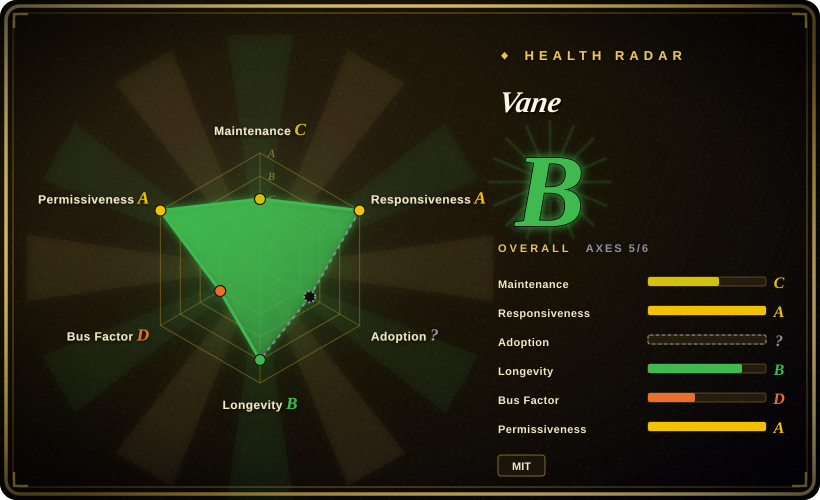
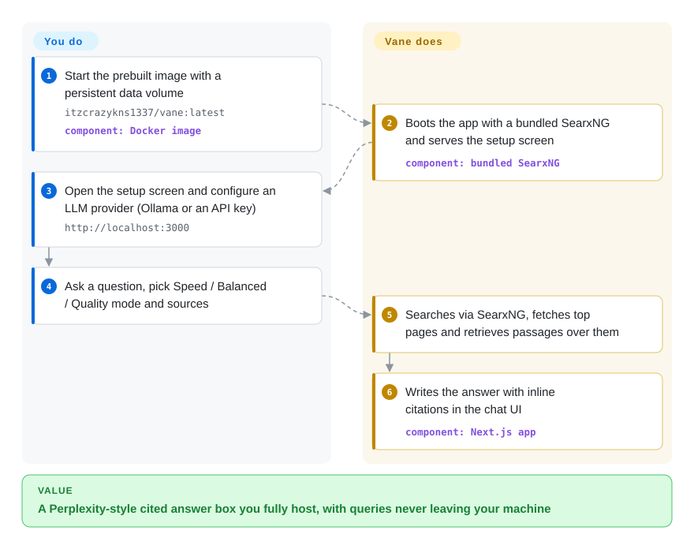

# Vane

Ask a self-hosted LLM a question about something recent and it answers from stale memory — confidently wrong, with no source to check. Vane looks the question up on the live web first (through a SearxNG meta-search that ships inside its own Docker image), then writes an answer with citations, using whichever LLM you point it at.

## When to use

You're a developer or a small team that wants a self-hosted "Perplexity-style" answer box you fully control — you type a question, it searches the live web, reads the top sources, and writes a cited answer instead of dumping ten blue links. Crucially, you don't want your queries leaving your machine or being tied to a single proprietary model: Vane runs as one Docker container, routes web search through SearxNG — **bundled in the default image since the 2026 releases**, so you no longer have to stand up a separate search service — and lets you point the LLM at local Ollama, an OpenAI-compatible endpoint, Claude, Gemini, or Groq. You pick a Speed / Balanced / Quality mode per query to trade latency for depth, scope sources to web vs. academic vs. discussions, restrict to specific domains, and upload a document to ask questions over it. The whole thing ships with a polished web UI, search history, widgets (weather, calculations, stocks) and a documented HTTP search API — it's a product you deploy, not a library you wire up.

You're also a good fit if you previously ran Perplexica and want the maintained continuation: Vane is the same author's evolution of that project (the GitHub topics still carry `perplexica`), so the mental model (SearxNG + RAG over results + an LLM that cites) carries over, with a refreshed UI, provider list, and the three-mode depth control on top.

## How it works

The single Docker image contains everything except the model: a Next.js web app plus its own SearxNG meta-search engine (meta-search = one service that queries many search engines and merges the results). What you do is once-only: start the container, then pick an LLM in the in-browser setup screen — a local Ollama endpoint or an API key for OpenAI / Claude / Gemini / Groq / an OpenAI-compatible server. What Vane does per question: it turns your query into web searches through the bundled SearxNG, fetches the top result pages, retrieves the passages relevant to your question, and has the LLM compose an answer with inline citations back to those pages. Upload a PDF or text file and the same retrieval step reads over your document instead of the web. If you already run a hardened SearxNG, the `slim` image drops the bundled one and points at yours (it needs JSON output and the Wolfram Alpha engine enabled).

<!-- flow-steps:begin (generated from flows/vane.json by tools/flow_card.py — do not edit) -->

Text version of the flow

1. **You**: Start the prebuilt image with a persistent data volume — `itzcrazykns1337/vane:latest` — component: `Docker image`
2. **Vane**: Boots the app with a bundled SearxNG and serves the setup screen — component: `bundled SearxNG`
3. **You**: Open the setup screen and configure an LLM provider (Ollama or an API key) — `http://localhost:3000`
4. **You**: Ask a question, pick Speed / Balanced / Quality mode and sources
5. **Vane**: Searches via SearxNG, fetches top pages and retrieves passages over them
6. **Vane**: Writes the answer with inline citations in the chat UI — component: `Next.js app`

**Value**: A Perplexity-style cited answer box you fully host, with queries never leaving your machine

<!-- flow-steps:end -->

## When NOT to use

- **You need a programmable research pipeline, not a chat app.** Vane does publish an HTTP API (`docs/API/SEARCH.md`) for search-and-answer calls, but there is no embeddable SDK and no tuning of the research loop itself. If you want deep-research as a library you call from code, with breadth/depth knobs, [deep-research](deep-research.md) fits better.
- **Your egress IP gets search engines throttled.** The core loop is only as good as live search results: the bundled SearxNG hits public engines, and when they rate-limit or block you, answer quality degrades — the README lists Tavily/Exa fallback support only as "coming soon". Budget for running your own SearxNG with your own engine config if you deploy beyond home use.
- **You want true offline / fully-local "deep research."** Even with local Ollama models, Vane still reaches the live web via SearxNG; it is not designed for the air-gapped, local-corpus-only workflow that [local-deep-research](local-deep-research.md) targets.
- **You need exhaustive, long-horizon iterative research.** Vane's "Quality" mode is deeper than its Speed mode, but it's still an interactive answering engine tuned for a fast cited answer — not a long autonomous loop that fans out dozens of sub-queries and recursively drills down over minutes. [推断] the per-mode iteration count is not documented.
- **You need multi-user auth / SaaS hosting out of the box.** Authentication is still on the README's "Upcoming Features" list as of 2026-09, not shipped; today it's a single-tenant self-hosted app. Treat any multi-tenant deployment as DIY.
- **You're allergic to a fast-moving single-maintainer rebrand.** Vane carries Perplexica's lineage and momentum, but it is effectively a recently-renamed project under primarily one author; API/UI churn and bus-factor risk apply.

## Comparison

| Alternative | In index | Our verdict | Tradeoff |
|---|---|---|---|
| [deep-research](deep-research.md) | ✅ | Choose deep-research when you need a minimal TypeScript engine/SDK you call from code. | Minimal TypeScript deep-research *engine/SDK* you call from code and tune (breadth/depth); Vane is a full self-hosted UI product, not a library to embed. |
| [local-deep-research](local-deep-research.md) | ✅ | Choose local-deep-research when local-first Python/offline corpus research matters. | Python, leans local-first and can research a local corpus offline; Vane always hits the live web via SearxNG and ships as a polished web app. |
| [Agent-Reach](agent-reach.md) | ✅ | Choose Agent-Reach when you mean reach/outreach-style automation rather than an answering engine. | Different niche (agent reach/outreach-style automation); not a SearxNG answering engine. Compare only if you conflated the two. |
| Perplexica | 未收录 | Choose Perplexica when you need Vane's direct predecessor by the same author. | Vane's direct predecessor by the same author; same SearxNG+RAG core. Choosing Vane = choosing the maintained continuation. |
| [GPT Researcher](gpt-researcher.md) | ✅ | Choose GPT Researcher when you need an autonomous Python research agent that writes long reports. | Python autonomous research agent that writes long reports; more report-generation, less interactive cited-answer UX, no built-in chat product. |
| Morphic | 未收录 | Choose Morphic when you want the same self-hosted answer-engine shape outside Vane's lineage. | Open-source answer-engine repos for the same niche; note we could not re-locate the canonical Morphic repo during this sync (see Caveats), so treat Vane as the verified option today. |
| Perplexity (hosted SaaS) | 非仓库 | Choose Perplexity only if you will not self-host at all. | Hosted/proprietary answer service; no self-hosting or provider choice, opposite of Vane's privacy/self-host pitch. |

## Tech stack

- **Language:** TypeScript (~98%+ of the repo per GitHub language stats).
- **Framework:** Next.js (handles both UI and API routes).
- **Search backend:** SearxNG (meta-search across many engines, queried for JSON results) — bundled in the default Docker image, replaceable via the `slim` image + `SEARXNG_API_URL`.
- **LLM integration:** pluggable providers — Ollama (local), OpenAI, Anthropic Claude, Google Gemini, Groq, and OpenAI-API-compatible servers (Lemonade also appears in the README troubleshooting section).
- **Retrieval:** RAG over fetched web results; embedding models used for semantic search over user-uploaded files.
- **Persistence:** local storage of chats/messages and uploaded files via a Docker volume; ORM is Drizzle. [推断] exact DB engine not confirmed from the README.
- **Styling:** Tailwind CSS.

## Dependencies

- **Runtime:** Docker (recommended) — single image `itzcrazykns1337/vane:latest` on port 3000 with a persistent `-v vane-data:/home/vane/data` volume. **The default image bundles SearxNG**; `itzcrazykns1337/vane:slim-latest` is for pointing at your own SearxNG (needs JSON format + Wolfram Alpha engine enabled).
- **Non-Docker:** Node.js + npm (`npm i` → `npm run build` → `npm run start`), plus a self-installed SearxNG with JSON output enabled.
- **Models:** at least one LLM provider configured — a local Ollama install, or an API key for OpenAI / Claude / Gemini / Groq / an OpenAI-compatible endpoint.
- **One-click hosts:** Sealos, RepoCloud, ClawCloud, Hostinger are listed as deploy targets.

## Ops difficulty

**Low.** The Docker happy path is one command, and because the default image bundles SearxNG there is no second service to stand up: configure an LLM API key (or a local Ollama URL) in the setup screen and you have a working answer engine in minutes. Difficulty rises slightly when you self-host at anything beyond home scale: public search engines will rate-limit your egress IP, so you may need the `slim` image plus your own tuned SearxNG; fully-local also means running and resourceing Ollama models (RAM/VRAM, model pulls). Releases are infrequent (v1.12.2 since 2026-04) while the default tag floats `:latest`, so pin a version for stability and back up the data volume — chats and history live there.

## Health & viability

- **Maintenance (2026-09):** commits on `master` through 2026-09-01 keep the project active, but the last tagged release is still v1.12.2 (2026-04-10) — a ~5-month release gap while development continues on the default branch. Active, coasting on releases.
- **Responsiveness:** the radar's measured issue/PR first-response grade — see the card; a solo-maintainer band applies.
- **Governance & bus factor:** personal repo (`ItzCrazyKns`) with ~36.9k stars — a **bus-factor flag**: very high visibility riding on essentially one maintainer (top-1 commit share 0.971 over the trailing 12 months). A recently-renamed project, so API/UI churn under a single owner is a live risk. [推断] from commit-share data.
- **Age & Lindy (~2.5yr, counting Perplexica lineage from 2024-04):** the *codebase* carries Perplexica's history and momentum even though "Vane" is a fresh name — that lineage is the Lindy signal here, not the rebrand date. Old-enough-and-active leans favorable, tempered by the solo-maintainer flag.
- **Risk flags:** multi-user auth is roadmap-not-shipped (treat as single-tenant); `:latest` floating tag over slow releases means pin versions and back up the data volume.

## Caveats (unverified)

- [未验证] v1.12.2 remains the latest *release* (2026-04-10) while `pushed_at` is 2026-09-01; whether post-release master commits ship only via the floating `:latest` image or unreleased tags was not checked.
- [未验证] The "Morphic" answer-engine repo named in the Comparison could not be located on GitHub during the 2026-09-28 sync (the previously-referenced owner/repo path 404s); kept as a backlog entry only.
- [未验证] Stars ~36.9k as of 2026-09 — GitHub stars are date-sensitive, treat as indicative only.
- [未验证] Exact provider list (esp. "Lemonade", which appears only in the README troubleshooting section) and one-click host list come from the README; verify against the current repo before relying on a specific provider.
- [推断] The persistence layer uses Drizzle ORM, but the README does not explicitly name the underlying database engine (likely SQLite given the single-file data volume, unconfirmed).
- [未验证] Authentication / multi-user support is listed under "Upcoming Features" in the 2026-09 README, not shipped; current deployments should be treated as single-tenant.
- [推断] Vane is the rebrand/successor of Perplexica by the same author (ItzCrazyKns); inferred from shared author, topics (`perplexica`), and architecture — the one-click deploy URLs still carry the `perplexica` template name.
- [推断] "Quality mode does deeper research" vs Speed/Balanced is the project's framing of a latency/depth tradeoff; the precise number of sub-queries or iterations per mode is not documented.
