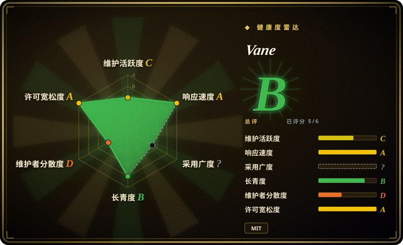
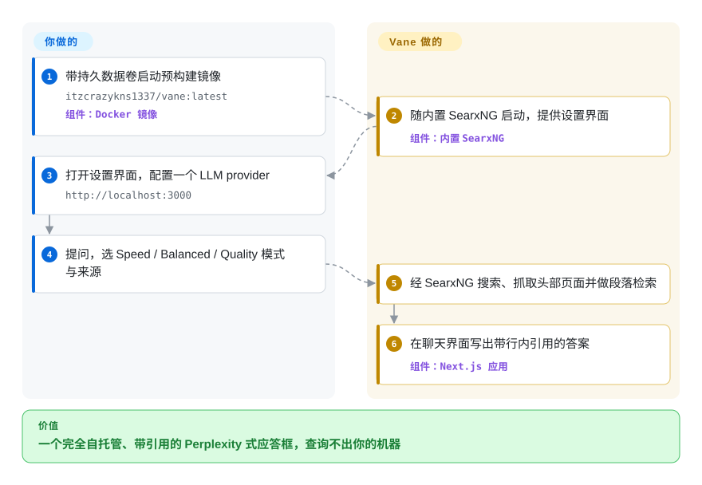

# Vane

问自托管的大模型一个时效性问题，它拿过时的训练记忆自信地胡说，还不给出处。Vane 先经 SearxNG 元搜索去实时网页查证——这个搜索引擎就打包在它自己的 Docker 镜像里——再用你指定的任何 LLM 写出带引用的答案。

## 何时使用

你是开发者或小团队，想要一个完全自己掌控的、自托管的「Perplexity 式」应答框：你输入一个问题，它去搜实时网页、读取头部来源、写出带引用的答案，而不是甩给你十条蓝色链接。关键是，你不希望查询离开自己的机器，也不想被绑死在某个闭源模型上：Vane 以单个 Docker 容器运行，联网搜索走 SearxNG——**2026 年起的默认镜像已内置 SearxNG，不必再单独搭一个搜索服务**——LLM 则可指向本地 Ollama、OpenAI 兼容端点、Claude、Gemini 或 Groq。你可以为每次查询选 Speed / Balanced / Quality 模式，在延迟和深度之间取舍，把来源限定为网页 / 学术 / 讨论或指定域名，还能上传文档对其提问。整套东西自带打磨过的 Web UI、搜索历史、小组件（天气、计算、股价）和一份有文档的 HTTP 搜索 API——它是你部署的产品，不是你接线的库。

如果你之前跑过 Perplexica、想要它的维护续作，那也很合适：Vane 是同一作者对该项目的演进（GitHub topics 里仍带着 `perplexica`），所以心智模型（SearxNG + 对结果做 RAG + 会引用来源的 LLM）可以直接迁移，只是叠加了刷新的 UI、provider 列表和三档深度控制。

## 怎么用起来

单个 Docker 镜像装下了除模型以外的一切：一个 Next.js Web 应用，外加它自带的 SearxNG 元搜索引擎（元搜索 = 一个同时查询多家搜索引擎并合并结果的中间服务）。你要做的是一次性的：启动容器，然后在浏览器里的设置界面选一个 LLM——本地 Ollama 端点，或 OpenAI / Claude / Gemini / Groq / OpenAI 兼容服务的 API key。Vane 对每个问题做的事：把你的提问转成经内置 SearxNG 的网页搜索，抓取头部结果页，检索与你问题相关的段落，再让 LLM 据此写出带行内引用的答案。上传 PDF 或文本文件后，同一步检索改为读你的文档而非网页。如果你已经有一套加固过的 SearxNG，`slim` 镜像会去掉内置引擎、指向你自己的实例（需要开启 JSON 输出与 Wolfram Alpha 引擎）。

<!-- flow-steps:begin (generated from flows/vane.json by tools/flow_card.py — do not edit) -->

流程文字版

1. **你**：带持久数据卷启动预构建镜像 — `itzcrazykns1337/vane:latest` — 组件：`Docker 镜像`
2. **Vane**：随内置 SearxNG 启动，提供设置界面 — 组件：`内置 SearxNG`
3. **你**：打开设置界面，配置一个 LLM provider — `http://localhost:3000`
4. **你**：提问，选 Speed / Balanced / Quality 模式与来源
5. **Vane**：经 SearxNG 搜索、抓取头部页面并做段落检索
6. **Vane**：在聊天界面写出带行内引用的答案 — 组件：`Next.js 应用`

**价值**：一个完全自托管、带引用的 Perplexity 式应答框，查询不出你的机器

<!-- flow-steps:end -->

## 何时不用

- **你要的是可编程的研究管线，而非聊天应用。** Vane 确实发布了 HTTP API（`docs/API/SEARCH.md`）可程序化调用搜索应答，但没有可嵌入的 SDK，研究环路本身也不可调控。如果你想把深度研究当作从代码里调用的库、可调 breadth/depth，选 [deep-research](deep-research.zh.md) 更合适。
- **你的出口 IP 会被搜索引擎限流。** 核心环路的质量完全取决于实时搜索结果：内置 SearxNG 打的是公共引擎，一旦被限流或封禁，答案质量随之劣化——README 把 Tavily/Exa 兜底列为「即将支持」。超出家用规模的部署，要预算自己维护一个配置过的 SearxNG。
- **你想要真正离线 / 完全本地的「深度研究」。** 即便用本地 Ollama 模型，Vane 仍会经 SearxNG 触达实时网页；它不是为 [local-deep-research](local-deep-research.zh.md) 那种气隙、仅本地语料的工作流设计的。
- **你需要穷尽式、长程的迭代研究。** Vane 的 Quality 模式比 Speed 更深，但它本质仍是为「快速给出带引用答案」调优的交互式应答引擎——不是那种扇出几十个子查询、连续几分钟递归下钻的长自治循环。[推断] 各模式的迭代次数未见文档。
- **你需要开箱即用的多用户鉴权 / SaaS 托管。** 截至 2026-09，鉴权仍列在 README 的 Upcoming Features 里、尚未交付；现在它是单租户自托管应用。任何多租户部署都按 DIY 对待。
- **你受不了快速演进的单一维护者改名项目。** Vane 承接了 Perplexica 的血统和势头，但它本质是近期改名、主要由一位作者维护的项目；API/UI 抖动和 bus-factor 风险都存在。

## 横向对比

| 替代品 | 是否收录 | 我们的评价 | 取舍 |
|---|---|---|---|
| [deep-research](deep-research.zh.md) | ✅ | 需要从代码里调用的极简 TypeScript 引擎/SDK 时，选 deep-research。 | 极简的 TypeScript 深度研究*引擎/SDK*，从代码里调用并调参（breadth/depth）；Vane 是完整的自托管 UI 产品，不是可嵌入的库。 |
| [local-deep-research](local-deep-research.zh.md) | ✅ | 需要 Python、本地优先、可离线研究本地语料时，选 local-deep-research。 | Python，偏本地优先，能离线对本地语料做研究；Vane 始终经 SearxNG 触达实时网页，并以打磨过的 Web 应用形态交付。 |
| [Agent-Reach](agent-reach.zh.md) | ✅ | 你其实需要 reach/触达式自动化而不是应答引擎时，选 Agent-Reach。 | 不同细分（agent reach / 触达式自动化）；不是 SearxNG 应答引擎。只有把两者混淆时才需对比。 |
| Perplexica | 未收录 | 需要 Vane 的同作者直接前身时，选 Perplexica。 | Vane 的直接前身，同一作者，同样的 SearxNG+RAG 内核。选 Vane = 选被维护的续作。 |
| [GPT Researcher](gpt-researcher.zh.md) | ✅ | 需要会写长报告的 Python 自治研究 agent 时，选 GPT Researcher。 | Python 自治研究 agent，产出长报告；更偏报告生成、少交互式带引用应答体验，无内建聊天产品。 |
| Morphic | 未收录 | 需要在 Vane 血统之外要一个同形态自托管应答引擎时，可看 Morphic。 | 同细分的开源应答引擎仓库；但 2026-09-28 重核时在 GitHub 上找不到其正主仓库（见存疑账本），今天可验证的选项是 Vane。 |
| Perplexity（托管 SaaS） | 非仓库 | 只有完全不打算自托管时，才选 Perplexity。 | 托管/闭源应答服务；无自托管、无 provider 选择，与 Vane 的隐私/自托管主张正相反。 |

## 技术栈

- **语言：** TypeScript（按 GitHub 语言统计约占仓库 98%+）。
- **框架：** Next.js（同时承载 UI 与 API 路由）。
- **搜索后端：** SearxNG（跨多引擎的元搜索，以 JSON 形式查询结果）——默认 Docker 镜像内置，可经 `slim` 镜像 + `SEARXNG_API_URL` 换成你自己的实例。
- **LLM 集成：** 可插拔 provider——Ollama（本地）、OpenAI、Anthropic Claude、Google Gemini、Groq，以及 OpenAI-API 兼容服务器（README 排障一节还提到 Lemonade）。
- **检索：** 对抓取的网页结果做 RAG；用嵌入模型对用户上传文件做语义搜索。
- **持久化：** 通过 Docker 卷在本地存储对话与上传文件；ORM 是 Drizzle。[推断] README 未明确底层数据库引擎。
- **样式：** Tailwind CSS。

## 依赖

- **运行时：** Docker（推荐）——单镜像 `itzcrazykns1337/vane:latest`，暴露 3000 端口并挂持久卷 `-v vane-data:/home/vane/data`。**默认镜像已内置 SearxNG**；`itzcrazykns1337/vane:slim-latest` 用于指向你自己的 SearxNG（需开启 JSON 格式与 Wolfram Alpha 引擎）。
- **非 Docker：** Node.js + npm（`npm i` → `npm run build` → `npm run start`），外加自行安装、开启 JSON 输出的 SearxNG。
- **模型：** 至少配置一个 LLM provider——本地 Ollama 安装，或 OpenAI / Claude / Gemini / Groq / OpenAI 兼容端点的 API key。
- **一键托管：** README 列出 Sealos、RepoCloud、ClawCloud、Hostinger 作为部署目标。

## 运维难度

**低。** Docker 顺路径确实是一行命令，且默认镜像内置 SearxNG，没有第二个服务要搭：在设置界面配一个云 LLM API key（或本地 Ollama 地址），几分钟就能得到可用的应答引擎。规模超出家用时难度略升：公共搜索引擎会限流你的出口 IP，可能要改用 `slim` 镜像加自己维护、调校过的 SearxNG；走全本地还要再跑并配资源给 Ollama 模型（内存/显存、模型拉取）。发布不频繁（v1.12.2 停在 2026-04）而默认标签是浮动的 `:latest`，所以要稳定就得 pin 版本；另外备份数据卷，对话与历史都在那里。

## 健康度与可持续性

- **维护（2026-09）：** `master` 分支有到 2026-09-01 的提交，项目仍在推进；但最近的带标签发布仍是 v1.12.2（2026-04-10）——发布停了约 5 个月、开发在默认分支继续。活跃，但发布节奏放缓。
- **响应速度：** 雷达测得的 issue/PR 首响档位见卡片；适用单人维护者档位。
- **治理与 bus factor：** 个人名下仓库（`ItzCrazyKns`），约 36.9k star——一个 **bus-factor 警示**：极高曝光，背后基本是一位维护者（近 12 个月 top-1 提交份额 0.971）。它又是近期改名的项目，单人主导下的 API/UI 抖动是现实风险。[推断] 依据提交份额数据。
- **年龄与 Lindy（约 2.5 年，含 Perplexica 血统，自 2024-04 起算）：** 尽管「Vane」是新名字，*代码库*承接了 Perplexica 的历史与势头——这份血统才是这里的 Lindy 信号，而非改名日期。够老且活跃，整体偏正面，但被单人维护这一点拉回一些。
- **风险标记：** 多用户鉴权仍在 roadmap、尚未交付（按单租户对待）；发布缓慢而 `:latest` 浮动标签意味着要 pin 版本并备份数据卷。

## 存疑（未验证）

- [未验证] v1.12.2 仍是最新*发布版本*（2026-04-10），而 `pushed_at` 为 2026-09-01；发布后的 master 提交是只经浮动的 `:latest` 镜像交付还是有未公开标签，未核实。
- [未验证] Comparison 中点名的 Morphic 应答引擎仓库，2026-09-28 重核时在 GitHub 上无法定位（先前引用的 owner/repo 路径 404）；仅作为 backlog 保留。
- [未验证] star 约 36.9k（截至 2026-09）——GitHub star 不可靠且对时间敏感，仅供参考。
- [未验证] 确切的 provider 列表（尤其 "Lemonade"，只出现在 README 排障一节）以及一键托管列表来自 README；依赖某具体 provider 前请对照当前仓库核实。
- [推断] 持久化层用 Drizzle ORM，但 README 未明确点名底层数据库引擎（从单文件数据卷推测可能是 SQLite，未确认）。
- [未验证] 鉴权 / 多用户支持在 2026-09 的 README 里列于 "Upcoming Features"，尚未交付；当前部署应按单租户对待。
- [推断] Vane 是同一作者（ItzCrazyKns）Perplexica 的改名/继任版；系据共享作者、topics（`perplexica`）与架构推断——一键部署 URL 里仍带 `perplexica` 模板名。
- [推断] 「Quality 模式做更深研究」相对 Speed/Balanced 是项目对延迟/深度取舍的表述；每个模式具体的子查询数或迭代次数未见文档说明。
