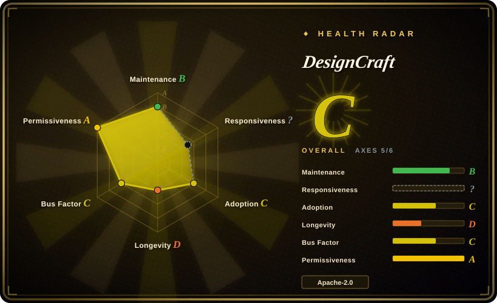
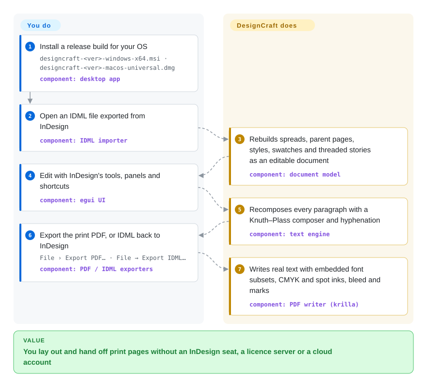

# DesignCraft

You lay out a magazine, a catalogue or a brochure, and the only tool your printer and your co-designers accept is InDesign — a per-seat Creative Cloud subscription, no Linux build, and `.indd` files nothing else opens. DesignCraft is a free desktop page-layout app that copies InDesign's tools, menus and shortcuts and trades files with it through IDML (InDesign's open XML exchange format) and print-ready PDFs.

## When to use

You are a designer or a small studio producing print pages — a quarterly magazine, a club newsletter, a price catalogue — and you are either leaving Creative Cloud or working on a machine it does not run on (Linux, FreeBSD, a Windows ARM laptop, a browser tab). Your problem is that the files arrive as InDesign exports and the deliverable is a PDF a print shop accepts: CMYK, spot inks, bleed, crop marks, fonts embedded. Scribus, the long-standing open-source option, works, but its interface is its own and it imports IDML without exporting it, so a hand-off back to an InDesign user is one-way.

That gap is where DesignCraft fits. It reproduces InDesign's workflow nearly menu for menu (parent pages, threaded stories, paragraph/character/object styles, swatches, text wrap, the Control panel), sets paragraphs with a Knuth–Plass composer — the "whole-paragraph" line-breaking algorithm TeX popularized — and reads *and* writes IDML. A second reason to pick it is automation: every menu command is also a CLI command and an MCP tool, so an agent or a shell script can build and export a layout headlessly. The deciding tradeoff against Scribus is InDesign familiarity, two-way IDML and an agent surface, paid for with a project that is days old; against InDesign it is no subscription and every platform, paid for with unproven print fidelity.

## How it works

DesignCraft is one Rust codebase in layered crates: a document model (spreads, frames, stories, styles), a text engine that breaks lines and hyphenates, a CPU renderer, importers/exporters (IDML, PDF, EPUB, HTML, Word/RTF import), and an InDesign-style UI built on egui, an immediate-mode GUI toolkit that also compiles to WebAssembly so the same app runs in a browser tab. You do the designing — open or create a document, draw frames, pour and style text — and the project owns the mechanics: recomposing every affected paragraph after an edit, keeping screen and PDF line breaks identical, embedding font subsets and colour spaces on export. Everything you can click is a named command (`frame.create`, `file.exportPdf`, …), and the same commands are reachable from `designcraft-cli` (one-shot runs and scripts), from an MCP server (`designcraft-cli mcp`, 25 tools that also return page renders as images), and from a JSON-lines control port on the running app — think of the GUI as just one of four remote controls on the same engine. The siblings in the ArtCraft "Crafting Apps" family (PhotoCraft, VectorCraft, PdfCraft and others) follow the same pattern for other Adobe products; this page covers only DesignCraft.

<!-- flow-steps:begin (generated from flows/designcraft.json by tools/flow_card.py — do not edit) -->

Text version of the flow

1. **You**: Install a release build for your OS — `designcraft-<ver>-windows-x64.msi · designcraft-<ver>-macos-universal.dmg` — component: `desktop app`
2. **You**: Open an IDML file exported from InDesign — component: `IDML importer`
3. **DesignCraft**: Rebuilds spreads, parent pages, styles, swatches and threaded stories as an editable document — component: `document model`
4. **You**: Edit with InDesign's tools, panels and shortcuts — component: `egui UI`
5. **DesignCraft**: Recomposes every paragraph with a Knuth–Plass composer and hyphenation — component: `text engine`
6. **You**: Export the print PDF, or IDML back to InDesign — `File › Export PDF… · File → Export IDML…` — component: `PDF / IDML exporters`
7. **DesignCraft**: Writes real text with embedded font subsets, CMYK and spot inks, bleed and marks — component: `PDF writer (krilla)`

**Value**: You lay out and hand off print pages without an InDesign seat, a licence server or a cloud account

<!-- flow-steps:end -->

## When NOT to use

- **Your source files are `.indd`.** DesignCraft cannot read InDesign's native format — its own roadmap lists INDD pages as "not readable clean-room", and a community INDD→IDML converter is only a proposal (issue #114). Open them in InDesign and export IDML first, or stay in InDesign.
- **A print job with a deadline and a certified prepress check.** PDF/X-4 export exists, but validation against a certified checker is still an open P0 item in the roadmap, and the project is eight days old. For press work you cannot re-run, use InDesign or Affinity Publisher, or Scribus if it must be open source — two decades of PDF/X output behind it.
- **You must round-trip IDML with InDesign users at layout fidelity.** Open reports show imported text frames going overset because DesignCraft computes a taller first line than InDesign (#193), IDML layer order inverted (#179) and optical kerning falling back to metrics (#181). If the file must come back to InDesign looking the same, keep InDesign on that seat.
- **The document is generated from data or markup** (reports, theses, books from Markdown). Use [Typst](../typesetting/typst.md) or [LaTeX](../typesetting/latex.md): the source is reviewable text in git, whereas DesignCraft's native file is a JSON document model you script command by command.
- **UI design, prototyping or multi-user editing.** DesignCraft has no prototypes, comments or real-time collaboration. Use [Penpot](penpot.md) for team-hosted design or [OpenPencil](open-pencil.md) for scripted Figma files.
- **You need a stable file format and command API for the next year.** It went v0.1.0 → v0.4.0 in six days (2026-10-02 → 10-08) with no deprecation policy and two 0.x minor bumps in one day. Pin a version or wait for 1.0; a script you write today may not run on next week's build. [推断]
- **Desktop machines with fragile GPU drivers, or the Linux AppImage.** Users report silent startup crashes inside the AMD OpenGL and Intel Vulkan drivers on Windows (#167, #192) and no clipboard or right-click in the Linux AppImage (#164). The web build or Scribus are the fallbacks until those close.
- **You plan to redistribute a rebranded build.** The code is MIT OR Apache-2.0, but the ArtCraft name and logos are trademarks excluded from that licence, and the README requires forks to remove them.

## Comparison

| Alternative | In index | Our verdict | Tradeoff |
|---|---|---|---|
| Adobe InDesign · Affinity Publisher | not a repo | Pick InDesign (or Affinity Publisher) when the job is a paid print run, `.indd` files must open, or a printer's preflight demands the industry tool; pick DesignCraft when the seat cost, the platform list or headless automation decides it. | Closed commercial apps: decades of prepress hardening and native `.indd` (InDesign), but subscription or per-licence cost and no Linux; DesignCraft is free and runs everywhere, with print fidelity not yet proven. |
| Scribus | not indexed | Pick Scribus when you need open-source DTP whose PDF/X output has years of production use behind it; pick DesignCraft when InDesign-identical menus, IDML *export* and an MCP/CLI surface matter more than a track record. | Real repository (`scribusproject/scribus`, a mirror of its SVN), not added in this tab batch. GPL-2.0-or-later, imports IDML but has no IDML exporter, Python scripting rather than MCP; its own UI rather than InDesign's. |
| [Typst](../typesetting/typst.md) | ✅ | Pick Typst when the document is written as text and compiled — reports, papers, books in git; pick DesignCraft when a designer places frames by hand on fixed pages. | Typst gives diffable source and reproducible builds but no WYSIWYG frame layout or IDML; DesignCraft gives InDesign-style direct manipulation but a JSON document you do not review line by line. |
| [Penpot](penpot.md) | ✅ | Pick Penpot when the output is screens — UI, prototypes, design systems — edited by a team on your servers; pick DesignCraft when the output is printed pages with CMYK, bleed and long text flow. | Penpot buys multiplayer and prototyping with a server fleet; DesignCraft is single-user and offline, with typographic depth (paragraph composer, hyphenation, footnotes, indexes) Penpot does not attempt. |

## Tech stack

- **Language:** Rust (edition 2024, `rust-version` 1.90), `unsafe_code = "forbid"` workspace-wide; ~259 `.rs` files, ~4.7 MB of Rust source (2026-10-09 tree).
- **Crates (enforced layering via `cargo xtask layers`):** `geom`, `color` → `doc`, `fonts` → `compose` (text engine) → `render` → `tools` → `engine` (commands, history) → `ui-egui`; plus `idml`, `pdf`, `epub`, `textimport`, `images`, `format`, `mcp`; apps `designcraft`, `designcraft-cli`, `designcraft-web`.
- **Rendering & text:** vello_cpu (multithreaded SIMD CPU rasterizer), skrifa + harfrust (font reading and shaping), resvg for SVG, hayro for reading placed PDFs.
- **Output:** krilla (PDF writer, incl. PDF/A and PDF/X-4 output intent), quick-xml + zip (IDML/EPUB), image/tiff crates.
- **UI:** egui/eframe 0.36 on wgpu; web build via trunk to `wasm32-unknown-unknown`, WebGPU with WebGL2 fallback.

## Dependencies

- **End users:** none beyond the app — signed MSI/portable zips (Windows x64/arm64/x86), a notarized universal DMG (macOS), AppImage/Flatpak/deb/rpm/tarball (Linux x86_64/aarch64), a FreeBSD tarball, and a static web build. A GPU driver that wgpu can use is needed for the desktop UI (see the crash reports above); the headless CLI renders on the CPU.
- **Fonts:** bundled Latin fonts (Source Sans 3/Serif 4, Inter, JetBrains Mono) plus installed system fonts; Japanese UI/document fonts come from `storytold/craft-fonts`, embedded in release builds only.
- **Agents:** the MCP server is the CLI binary itself (`designcraft-cli mcp`, stdio); driving the visible app needs it started with `--control <port>`.
- **Building from source:** a Rust toolchain ≥ 1.90; `trunk` and the wasm target for the web build; optionally `CRAFT_FONTS_DIR` pointing at a craft-fonts clone.

## Ops difficulty

**Low to run, medium to depend on.** Installing is a signed download with no server, account or licence check, and the CLI is one binary — in a 2026-10-09 run of the v0.4.0 macOS CLI, `run --sample --export sample.pdf` wrote a 4-page PDF with six embedded font subsets in about 0.4 s, and `--export sample.idml` then `--in sample.idml --export` round-tripped through IDML. The ongoing cost is churn and exposure: releases land every one to three days, so automation needs pinned versions, and the control port (`--control`) listens on `127.0.0.1` **without authentication** — any local process can drive the app while it is on, so enable it only when you use it (the web build has no control port).

## Health & viability

- **Maintenance (as of 2026-10-09):** extremely active — ~400 commits since the repository was created on 2026-10-01, five releases (v0.1.0 on 10-02 to v0.4.0 on 10-08), and community PRs merged in batches. Activity this intense in week one says nothing yet about week fifty.
- **Governance & bus factor:** one maintainer (`echelon`, Brandon Thomas) authored ~320 of ~400 commits; ~15 outside contributors have landed PRs. The org is `storytold` under the ArtCraft brand, and release binaries are signed by "Learning Machines LLC". No foundation, no CONTRIBUTING or governance file beyond `AGENTS.md`.
- **How it was built:** the roadmap estimates remaining parity work in "wall-clock hours of a single Claude Opus 5.5 agent", and `AGENTS.md`/`CLAUDE.md` are the development protocol — the codebase is agent-written at a pace no human team reviews line by line. The "clean-room" claim rests on that file's rules (InDesign observed black-box on the dev machine; no reading of its bundle; no GPL code), and the working notes live in a git-ignored `plan/` directory, so the claim cannot be audited from the repository.
- **Age & Lindy:** eight days old at verification — the weakest possible Lindy prior. The roadmap's self-score ("~99% breadth, ~83% overall parity") contrasts with week-one issues about basics (threading, clipboard, startup crashes); treat it as the project's own measurement.
- **Adoption:** ~2.0k stars and ~1.1k forks in eight days. The star timeline could not be checked (the stargazers API returned 404), but other signals look organic: v0.4.0 assets show ~18.1k Windows MSI and ~9.5k macOS DMG downloads by 2026-10-09, and 49 distinct users filed 82 issues, most of them specific and reproducible. [推断]
- **Risk flags:** dual MIT/Apache licence with trademarked branding carved out; GitHub's licence badge shows Apache-2.0 only, the files say "MIT OR Apache-2.0"; an IP dispute risk from cloning a commercial product's UI cannot be ruled out. [推断]

## Caveats (unverified)

- [未验证] The "clean-room" provenance claim: the rules are in `AGENTS.md`, but the observation notes (`plan/indesign/*.md`) and screenshots are git-ignored, so nothing in the repository proves how InDesign was studied. Cannot be checked without the maintainer's private working directory.
- [未验证] Star velocity: `gh api repos/storytold/designcraft/stargazers` returned HTTP 404 on 2026-10-09, so the star-by-date curve could not be inspected; the "looks organic" judgment rests on download counts, forks and issue authors instead.
- [推断] API/format churn risk is inferred from the release cadence (v0.1.0 → v0.4.0 in six days, 0.2.1 → 0.3.0 → 0.4.0 within one day) and the absence of a stated deprecation policy; no breaking change was traced command by command.
- [未验证] Print fidelity: the roadmap says "qpdf finds no errors" in PDF/X-4 output and lists certified-checker validation as open; no PDF/X validator was run here. Our own run only confirmed that the sample exports with embedded font subsets and real text.
- [未验证] IDML round-trips "verified opening in InDesign 2026" are the project's claims; InDesign was not available to check. The local test only round-tripped DesignCraft's own IDML.
- [推断] The organic-adoption judgment: ~18.1k + ~9.5k release downloads and 49 distinct issue authors are consistent with real use, but downloads can include automated fetches and do not count active users.
- [推断] The IP risk of reproducing a commercial product's UI and terminology is a general legal judgment, not a known dispute; the README carries an Adobe trademark disclaimer.
- [未验证] Platform-specific crashes (#164, #167, #192) were reported on 2026-10-08/09 and were open at verification; whether a release after v0.4.0 fixes them was not checked.
- [未验证] The radar's responsiveness axis is `?` (`no_window_signal`): the scorer skips the most recent 7 days and the repository is only 8 days old, so there is no qualifying issue window yet. Reruns gave the same result; this is a structural unknown, not rate limiting.
- [未验证] The README still says "PDF on the roadmap" while `ROADMAP.md` and the v0.4.0 binary both export PDF; the README line is stale, and other README statements may lag the code the same way.
