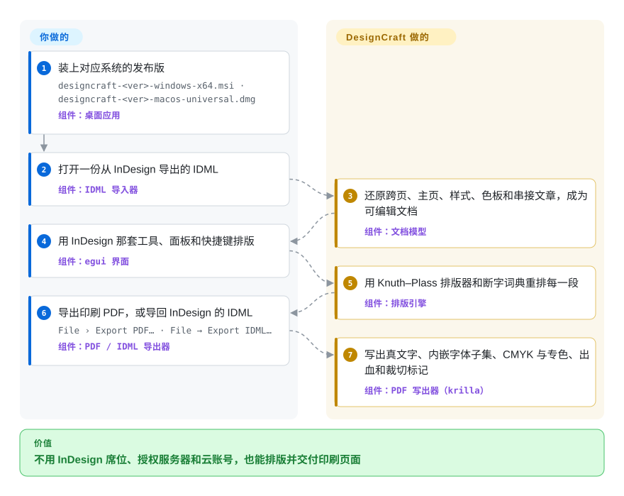

# DesignCraft

你在排一本杂志、一份产品目录或一张宣传折页，印厂和合作的设计师只认 InDesign：每个座位一份 Creative Cloud 订阅，没有 Linux 版，`.indd` 文件别的软件打不开。DesignCraft 是一个免费的桌面排版软件，照搬 InDesign 的工具、菜单和快捷键，并通过 IDML（InDesign 公开的 XML 交换格式）和可直接付印的 PDF 跟它互通文件。

## 何时使用

你是做印刷品的设计师或小工作室——季刊、社团通讯、价目册——要么正打算离开 Creative Cloud，要么手上的机器根本跑不了它（Linux、FreeBSD、Windows ARM 笔记本、一个浏览器标签页）。麻烦在于：稿件是从 InDesign 导出来的，交付物是印厂收的 PDF——CMYK、专色、出血、裁切标记、字体全部内嵌。老牌开源方案 Scribus 能干活，但界面是它自己的一套，而且 IDML 只能导入不能导出，交回给 InDesign 用户就成了单行道。

DesignCraft 正好补这个缺口。它几乎逐个菜单复刻 InDesign 的工作流（主页、串接文章、段落/字符/对象样式、色板、文本绕排、控制面板），用 Knuth–Plass 排版器（TeX 带火的“整段一起算断行”的算法）排段落，IDML 既能读也能写。另一个选它的理由是自动化：每个菜单命令同时是一条 CLI 命令和一个 MCP 工具，agent 或 shell 脚本不开界面就能搭版、导出。对 Scribus 的决定性取舍是：InDesign 式的熟悉感、双向 IDML 和 agent 接口，代价是项目才诞生几天；对 InDesign 的取舍是：不用订阅、全平台可用，代价是印刷保真度尚未经过检验。

## 怎么用起来

DesignCraft 是一份分层的 Rust 代码：文档模型（跨页、框架、文章、样式）、负责断行和断字的排版引擎、CPU 渲染器、各种导入导出器（IDML、PDF、EPUB、HTML，以及 Word/RTF 导入），再加一层基于 egui 的 InDesign 风格界面——egui 是一种“每帧重画”的即时模式 GUI 库，能编译成 WebAssembly，所以同一个应用也能在浏览器标签页里跑。排版由你来：打开或新建文档、画框、灌文字、套样式；机械活由它来：每次改动后重排受影响的段落、保证屏幕和 PDF 的断行完全一致、导出时内嵌字体子集和色彩空间。你能点的每个操作都是一条有名字的命令（`frame.create`、`file.exportPdf` 等），同一批命令也能从 `designcraft-cli`（一次性运行和脚本）、MCP 服务器（`designcraft-cli mcp`，25 个工具，还能把页面渲染成图片回传）以及运行中应用的 JSON 行控制端口调用——可以把图形界面看成同一台引擎上四个遥控器中的一个。ArtCraft“Crafting Apps”家族的兄弟项目（PhotoCraft、VectorCraft、PdfCraft 等）用同一套路对标其他 Adobe 产品，本页只讲 DesignCraft。

<!-- flow-steps:begin (generated from flows/designcraft.json by tools/flow_card.py — do not edit) -->

流程文字版

1. **你**：装上对应系统的发布版 — `designcraft-<ver>-windows-x64.msi · designcraft-<ver>-macos-universal.dmg` — 组件：`桌面应用`
2. **你**：打开一份从 InDesign 导出的 IDML — 组件：`IDML 导入器`
3. **DesignCraft**：还原跨页、主页、样式、色板和串接文章，成为可编辑文档 — 组件：`文档模型`
4. **你**：用 InDesign 那套工具、面板和快捷键排版 — 组件：`egui 界面`
5. **DesignCraft**：用 Knuth–Plass 排版器和断字词典重排每一段 — 组件：`排版引擎`
6. **你**：导出印刷 PDF，或导回 InDesign 的 IDML — `File › Export PDF… · File → Export IDML…` — 组件：`PDF / IDML 导出器`
7. **DesignCraft**：写出真文字、内嵌字体子集、CMYK 与专色、出血和裁切标记 — 组件：`PDF 写出器（krilla）`

**价值**：不用 InDesign 席位、授权服务器和云账号，也能排版并交付印刷页面

<!-- flow-steps:end -->

## 何时不用

- **源文件是 `.indd`。** DesignCraft 读不了 InDesign 原生格式——它自己的路线图把 INDD 列为“clean-room 方式无法读取”，社区的 INDD→IDML 转换器还只是一个提案（issue #114）。先用 InDesign 导出 IDML，或者干脆留在 InDesign。
- **有交期、要过认证印前检查的印刷活。** PDF/X-4 导出已经有了，但“用认证检查器验证”在路线图里还是未完成的 P0 项，项目本身也才八天大。不能重来的付印任务用 InDesign 或 Affinity Publisher；必须开源就用 Scribus——它的 PDF/X 输出有二十年的实际使用打底。
- **必须和 InDesign 用户按版式保真度来回传 IDML。** 现有 issue 显示：导入的文本框因为 DesignCraft 算出的首行比 InDesign 高而溢流（#193），IDML 图层顺序被颠倒（#179），视觉字偶距退回成度量字偶距（#181）。文件要原样回到 InDesign，那个座位就继续用 InDesign。
- **文档由数据或标记语言生成**（报告、论文、从 Markdown 出书）。用 [Typst](../typesetting/typst.zh.md) 或 [LaTeX](../typesetting/latex.zh.md)：源文件是能放进 git 审阅的文本，而 DesignCraft 的原生文件是一份 JSON 文档模型，只能一条条命令去改。
- **做 UI 设计、原型或多人协作。** DesignCraft 没有原型、评论和实时协作。团队自托管设计用 [Penpot](penpot.zh.md)，脚本化处理 Figma 文件用 [OpenPencil](open-pencil.zh.md)。
- **你需要一年内稳定的文件格式和命令 API。** 它六天里从 v0.1.0 走到 v0.4.0（2026-10-02 → 10-08），没有弃用政策，一天之内连跳两个 0.x 小版本。锁定版本，或者等 1.0；今天写的脚本下周的构建未必还能跑。[推断]
- **显卡驱动不稳的桌面机，或 Linux AppImage。** 有用户报告 Windows 上启动时在 AMD OpenGL 和 Intel Vulkan 驱动里静默崩溃（#167、#192），Linux AppImage 里剪贴板和右键都不工作（#164）。这些问题关掉之前，退路是网页版或 Scribus。
- **打算再分发一个换了品牌的构建。** 代码是 MIT OR Apache-2.0，但 ArtCraft 名称和标志是商标、不在许可证范围内，README 要求 fork 必须去掉它们。

## 横向对比

| 替代品 | 是否收录 | 我们的评价 | 取舍 |
|---|---|---|---|
| Adobe InDesign · Affinity Publisher | 非仓库 | 付费印刷活、必须打开 `.indd`、或印厂预检只认行业标准工具时，选 InDesign（或 Affinity Publisher）；座位费用、平台覆盖或无界面自动化是决定因素时，选 DesignCraft。 | 闭源商业软件：几十年的印前打磨和原生 `.indd`（InDesign），但要订阅或买授权、没有 Linux 版；DesignCraft 免费且全平台，印刷保真度还没被证明。 |
| Scribus | 未收录 | 需要一个 PDF/X 输出有多年生产使用记录的开源排版软件时，选 Scribus；InDesign 同款菜单、IDML **导出**和 MCP/CLI 接口比履历更重要时，选 DesignCraft。 | 真实仓库（`scribusproject/scribus`，其 SVN 的镜像），本批次未收录。GPL-2.0-or-later，能导入 IDML 但没有 IDML 导出器，脚本用 Python 而非 MCP；界面是它自己的，不是 InDesign 那套。 |
| [Typst](../typesetting/typst.zh.md) | ✅ | 文档以文本写成、编译出来——放在 git 里的报告、论文、书——选 Typst；设计师要在固定页面上手工摆框架时，选 DesignCraft。 | Typst 给你可 diff 的源文件和可复现的构建，但没有所见即所得的框架排版和 IDML；DesignCraft 给你 InDesign 式的直接操作，但文档是一份不会逐行审阅的 JSON。 |
| [Penpot](penpot.zh.md) | ✅ | 产出是屏幕——UI、原型、设计系统——且由团队在自己的服务器上协作编辑时，选 Penpot；产出是带 CMYK、出血和长文本流的印刷页面时，选 DesignCraft。 | Penpot 用一套服务器换来多人协作和原型；DesignCraft 单人离线，但有 Penpot 不碰的排版深度（段落排版器、断字、脚注、索引）。 |

## 技术栈

- **语言：** Rust（edition 2024，`rust-version` 1.90），整个工作区 `unsafe_code = "forbid"`；约 259 个 `.rs` 文件、约 4.7 MB Rust 源码（2026-10-09 的代码树）。
- **crate 分层（由 `cargo xtask layers` 强制）：** `geom`、`color` → `doc`、`fonts` → `compose`（排版引擎）→ `render` → `tools` → `engine`（命令、历史）→ `ui-egui`；另有 `idml`、`pdf`、`epub`、`textimport`、`images`、`format`、`mcp`；应用 `designcraft`、`designcraft-cli`、`designcraft-web`。
- **渲染与文字：** vello_cpu（多线程 SIMD 的 CPU 光栅器），skrifa + harfrust（读字体、做字形整形），resvg 处理 SVG，hayro 读取置入的 PDF。
- **输出：** krilla（PDF 写出，含 PDF/A 和 PDF/X-4 输出意图），quick-xml + zip（IDML/EPUB），image/tiff crate。
- **界面：** egui/eframe 0.36，跑在 wgpu 上；网页版用 trunk 编译到 `wasm32-unknown-unknown`，优先 WebGPU，退回 WebGL2。

## 依赖

- **最终用户：** 除了应用本身什么都不用——Windows 有签名的 MSI 和免安装 zip（x64/arm64/x86），macOS 有公证过的通用 DMG，Linux 有 AppImage/Flatpak/deb/rpm/tarball（x86_64/aarch64），另有 FreeBSD tarball 和静态网页版。桌面界面需要一个 wgpu 能用的显卡驱动（见上面的崩溃报告）；无界面的 CLI 在 CPU 上渲染。
- **字体：** 内置拉丁字体（Source Sans 3/Serif 4、Inter、JetBrains Mono）加系统已装字体；日文界面和正文字体来自 `storytold/craft-fonts`，只有发布版会内嵌。
- **Agent：** MCP 服务器就是 CLI 二进制本身（`designcraft-cli mcp`，走 stdio）；要驱动可见的应用窗口，需要用 `--control <port>` 启动它。
- **从源码构建：** Rust 工具链 ≥ 1.90；网页版要 `trunk` 和 wasm 目标；可选用 `CRAFT_FONTS_DIR` 指向 craft-fonts 的克隆。

## 运维难度

**运行低，长期依赖中等。** 安装就是一个签名下载，没有服务器、账号或授权校验，CLI 是一个二进制——2026-10-09 用 v0.4.0 macOS CLI 实测，`run --sample --export sample.pdf` 约 0.4 秒写出 4 页 PDF、内嵌 6 个字体子集，再用 `--export sample.idml` 加 `--in sample.idml --export` 走了一遍 IDML 往返。持续成本来自变动和暴露面：每一到三天就发一个版本，自动化必须锁版本；控制端口（`--control`）监听 `127.0.0.1` 且**没有认证**——开着的时候本机任何进程都能驱动这个应用，只在要用时打开（网页版没有控制端口）。

## 健康度与可持续性

- **维护（截至 2026-10-09）：** 极度活跃——仓库 2026-10-01 创建以来约 400 个提交，5 个版本（10-02 的 v0.1.0 到 10-08 的 v0.4.0），社区 PR 成批合并。第一周这么猛，并不能说明第五十周会怎样。
- **治理与巴士系数：** 一位维护者（`echelon`，Brandon Thomas）写了约 400 个提交里的约 320 个；约 15 位外部贡献者有 PR 被合并。组织是 ArtCraft 品牌下的 `storytold`，发布版二进制由 “Learning Machines LLC” 签名。没有基金会，除 `AGENTS.md` 外没有 CONTRIBUTING 或治理文件。
- **它是怎么写出来的：** 路线图用“单个 Claude Opus 5.5 agent 的墙钟小时数”估算剩余的对标工作量，`AGENTS.md`/`CLAUDE.md` 就是开发流程——代码由 agent 编写，速度快到没有人类团队能逐行审。“clean-room”说法靠的是该文件里的规则（在开发机上黑盒观察 InDesign；不读它的程序包；不用 GPL 代码），而工作笔记放在被 git 忽略的 `plan/` 目录里，所以从仓库本身无法审计这个说法。
- **年龄与 Lindy：** 核实时才八天大——Lindy 先验最弱的情形。路线图的自评（“广度约 99%、整体对标约 83%”）和第一周 issue 里的基础问题（串接、剪贴板、启动崩溃）对不上，把它当作项目方自己的测量。
- **采用度：** 八天约 2.0k star、约 1.1k fork。star 的时间曲线查不了（stargazers 接口返回 404），但其他信号看起来是自然增长：截至 2026-10-09，v0.4.0 的 Windows MSI 下载约 1.81 万、macOS DMG 约 9.5 千，49 位不同用户提了 82 个 issue，大多具体且可复现。[推断]
- **风险信号：** MIT/Apache 双许可，品牌商标被单独排除；GitHub 的许可证徽标只显示 Apache-2.0，文件写的是 “MIT OR Apache-2.0”；复刻商业产品界面带来的知识产权争议风险无法排除。[推断]

## 存疑（未验证）

- [未验证] “clean-room”来源说法：规则写在 `AGENTS.md` 里，但观察笔记（`plan/indesign/*.md`）和截图都被 git 忽略，仓库里没有任何东西能证明 InDesign 是怎么被研究的。没有维护者的私有工作目录就无法核实。
- [未验证] star 增速：2026-10-09 调用 `gh api repos/storytold/designcraft/stargazers` 返回 HTTP 404，看不到按日期的 star 曲线；“像是自然增长”的判断依据的是下载量、fork 和 issue 作者。
- [推断] API/格式变动风险是从发版节奏（六天内 v0.1.0 → v0.4.0，0.2.1 → 0.3.0 → 0.4.0 的版本号提升都在同一天）和没有弃用政策推出来的，没有逐条命令追查破坏性变更。
- [未验证] 印刷保真度：路线图称 PDF/X-4 输出“qpdf 查不出错误”，并把认证检查器验证列为未完成；这里没有跑 PDF/X 校验器。本地实测只确认了示例文档能导出、内嵌字体子集且是真文字。
- [未验证] IDML 往返“已验证能在 InDesign 2026 打开”是项目方的说法；手头没有 InDesign 可查。本地测试只往返了 DesignCraft 自己导出的 IDML。
- [推断] 自然采用的判断：约 1.81 万 + 约 9.5 千的发布版下载和 49 位不同的 issue 作者符合真实使用，但下载数可能包含自动抓取，也不等于活跃用户数。
- [推断] 复刻商业产品界面和术语的知识产权风险是一般性的法律判断，并非已知纠纷；README 附有 Adobe 商标免责声明。
- [未验证] 平台相关崩溃（#164、#167、#192）是 2026-10-08/09 报告的，核实时仍未关闭；v0.4.0 之后的版本是否修复没有查。
- [未验证] 雷达的响应度轴是 `?`（`no_window_signal`）：评分器跳过最近 7 天，而仓库才 8 天大，还没有合格的 issue 窗口。重跑结果相同；这是结构性未知，不是限流。
- [未验证] README 仍写着 “PDF on the roadmap”，而 `ROADMAP.md` 和 v0.4.0 二进制都能导出 PDF；README 这一行已过时，其他 README 描述也可能同样滞后于代码。
