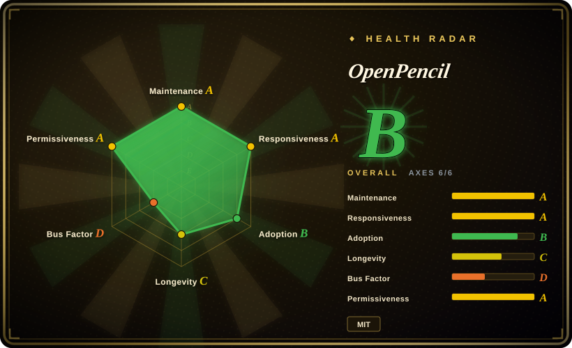
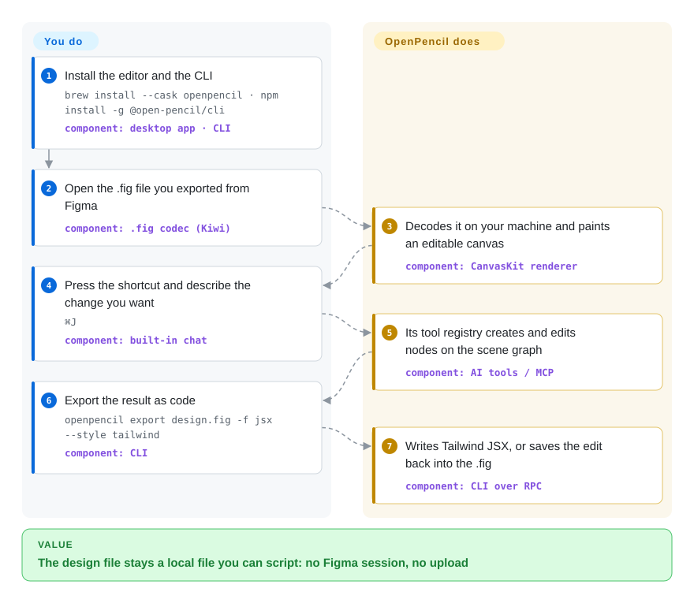

# OpenPencil

Your team's design files sit in a binary format only Figma fully reads, and Figma's own API and MCP server are read-only — so "export every icon", "lint the layer names", "turn the checkout flow into Tailwind" all end up as a human clicking in a GUI. OpenPencil opens those `.fig` files on your own machine and makes the document programmable: the same node tree is reachable from the editor, a CLI, an MCP server and an AI chat.

## When to use

You're the person who ends up owning the design file — a design-systems lead, a frontend engineer on a small team, or the one wiring agents into the product workflow. The work arrives as `.fig`: export the icons, lint the naming, find every button still on the deprecated purple, turn the checkout flow into JSX. Figma's REST API and MCP server only read, the read/write route people used to take (driving the desktop app over the Chrome DevTools protocol) is the kind of thing a point release can close, and the document itself is a proprietary binary you cannot grep.

OpenPencil is worth reaching for when that job should be a script instead of a Figma session. It is one of the few design editors that decodes Figma's `.fig` format natively and treats the file as data — the GUI, the `openpencil` CLI, the MCP server and an `eval` shell that implements the Figma Plugin API all act on the same local scene graph. Unlike Penpot, there is no server to deploy and no account to create: you install a ~15 MB Tauri app (or use the web build) and the file never leaves the machine. The deciding tradeoff against Penpot is local-first + native `.fig` I/O versus server-side multi-user accounts and permissions.

## How it works

A `.fig` file is a ZIP container of Kiwi-encoded binary records — the same serialization Figma uses internally — and OpenPencil decodes it into a flat map of typed scene nodes. You do the designing (draw, type, or press `⌘J` and describe the change); the app owns the mechanical parts: CanvasKit (Skia compiled to WebAssembly) paints the canvas, a Yoga fork computes auto layout, and the AI/MCP layer turns tool calls into edits on that same node map. The unusual part is the surface area: the same document is exposed four ways — GUI, CLI, MCP server, and an `eval` shell that speaks the Figma Plugin API — so a script, an agent and a human are all editing one file. Collaboration is peer-to-peer over WebRTC with a Yjs CRDT, so there is no relay server and therefore no accounts, access control or durable history behind it.

<!-- flow-steps:begin (generated from flows/open-pencil.json by tools/flow_card.py — do not edit) -->

Text version of the flow

1. **You**: Install the editor and the CLI — `brew install --cask openpencil · npm install -g @open-pencil/cli` — component: `desktop app · CLI`
2. **You**: Open the .fig file you exported from Figma — component: `.fig codec (Kiwi)`
3. **OpenPencil**: Decodes it on your machine and paints an editable canvas — component: `CanvasKit renderer`
4. **You**: Press the shortcut and describe the change you want — `⌘J` — component: `built-in chat`
5. **OpenPencil**: Its tool registry creates and edits nodes on the scene graph — component: `AI tools / MCP`
6. **You**: Export the result as code — `openpencil export design.fig -f jsx --style tailwind` — component: `CLI`
7. **OpenPencil**: Writes Tailwind JSX, or saves the edit back into the .fig — component: `CLI over RPC`

**Value**: The design file stays a local file you can script: no Figma session, no upload

<!-- flow-steps:end -->

## When NOT to use

- **You need prototyping, comments or version history.** Figma-style prototype flows, comment threads and version/branch history are listed as *not modeled* in OpenPencil's own Figma compatibility matrix. Use Penpot (which has prototyping and comments) or stay on Figma for those.
- **You need multi-user editing with accounts and permissions.** Collaboration here is P2P WebRTC with no server, no accounts and no access control, and the roadmap still lists a "durable collaboration relay" for restricted networks as future work. If several people must edit one file with roles and audit, self-host [Penpot](penpot.md) instead.
- **You need pixel-parity on Figma's hard cases.** Masks, pattern/noise/custom fills, variable fonts, boolean-operation editing and full component/slot authoring are marked partial in the project's own matrix, and it keeps a visual-diff report recording known divergences. Keep Figma for pixel-critical work and use OpenPencil for the file-level jobs.
- **You just need a sketch, a flowchart or a wireframe.** This is a high-fidelity design editor; use [Excalidraw](../diagramming/excalidraw.md) or [draw.io](../diagramming/drawio.md), which are the right size of tool for an informal sketch.
- **You cannot absorb pre-1.0 churn.** Every recent minor release has carried breaking changes — v0.15.0 reworked the MCP SDK types, the Vue SDK bindings and scene-graph fields. If you need a stable plugin/API contract today, build on Figma's or Penpot's plugin API instead and revisit this at 1.0; otherwise pin the `@open-pencil/*` versions. [推断]
- **You need a vendor, an SLA or a foundation.** Roadmap ownership is one person and there is no foundation or commercial backer; if procurement needs a contract, Penpot (Kaleidos-backed) or a commercial tool is the answer.

## Comparison

| Alternative | In index | Our verdict | Tradeoff |
|---|---|---|---|
| Figma | 非仓库 | Pick Figma when you need prototyping, comments, version history or Dev Mode, and hosted multiplayer that just works; pick OpenPencil when the file has to be readable, scriptable and local. | Tradeoff: you keep the mature platform and its ecosystem, but keep renting a closed binary format whose automation surface is read-only. |
| [Penpot](penpot.md) | ✅ | Pick Penpot when several people must edit one file on servers you control, with accounts, roles and prototypes; pick OpenPencil when you need to open existing `.fig` files and script the document locally. | Penpot buys server-side collaboration and an open file format with a Postgres + Valkey + object-storage deployment; OpenPencil buys native `.fig` I/O and zero-server local-first by giving up accounts, permissions and durable history. |
| Sketch | 非仓库 | Pick Sketch only if your team's macOS workflow is already invested in it; OpenPencil substitutes for it wherever you need automation, Windows/Linux or self-hosting. | Closed, macOS-only, subscription; no headless CLI or MCP surface to build batch workflows on. |
| Framer | 非仓库 | Pick Framer when a hosted design-to-live-site pipeline in one tool matters more than owning the document; pick OpenPencil when the artifact is a design file you must export or script. | Hosted publishing SaaS; fastest route from design to a published site, but no local file, no self-hosting, no `.fig` interoperability. |
| [Excalidraw](../diagramming/excalidraw.md) | ✅ | Pick Excalidraw for informal sketching and architecture flowcharts; OpenPencil is the wrong tool when the deliverable is a napkin sketch. | Excalidraw trades fidelity for speed and needs no install or account, but has no components/variants, auto layout or design-to-code output. |

## Tech stack

- **Language:** TypeScript throughout (Vue 3 UI); Rust only for the Tauri desktop shell. Monorepo package manager is Bun (pinned in `packageManager`). [未验证]
- **Rendering:** Skia via CanvasKit WASM; the org also maintains a CanvasKit build with a Skia Graphite/Dawn WebGPU backend.
- **Layout:** Yoga WASM (a project fork that adds CSS grid).
- **File formats:** Kiwi binary + Zstd + ZIP for `.fig`; it also reads `.pen`, the document format of Pencil.dev, though making `.pen` a first-class save target is still on the roadmap.
- **Collaboration:** Trystero (WebRTC P2P) + Yjs CRDT.
- **Desktop:** Tauri v2; also ships as a browser PWA.
- **AI/MCP:** Vercel AI SDK with per-provider BYOK (OpenRouter, Anthropic, OpenAI, Google, DeepSeek, Z.ai, MiniMax), MCP SDK, Hono for the HTTP transport.
- **Published packages:** `@open-pencil/{scene-graph,pen,kiwi,fig,core,dom-css,vue,cli,mcp,harness}` — the headless Vue SDK is the embeddable editor surface.

## Dependencies

- **End users:** nothing to run alongside it — a Tauri download, a Homebrew cask, or the web app. Needs macOS 13+, Windows 10+, or Linux with WebKitGTK 2.40+ (web app: Chrome/Edge 111+, Firefox 128+, Safari 16.4+).
- **CLI / MCP / agent skill:** Node or Bun plus `@open-pencil/cli` / `@open-pencil/mcp`; agents can also install the bundled skill (`npx skills add open-pencil/open-pencil`).
- **AI features:** a BYOK key for one of the supported providers — no bundled inference and no account.
- **Building from source:** Bun 1.4.2 and a Rust toolchain for the Tauri build; the repo ships a Dev Container for the web editor, packages, CLI and checks (not for native Tauri windows).
- **Optional:** an S3-compatible bucket for the local-first Storage Workspace.

## Ops difficulty

**Low to run, medium to build on.** End users have no server, no database and no account — install, open a file, export. The recurring cost is version churn: while the project is pre-1.0 every couple of releases carries breaking changes to the npm packages and the MCP tool surface, so anything you build against `@open-pencil/*` needs deliberate pinning. Building from source or producing desktop bundles adds the usual Tauri friction (Rust toolchain, per-platform WebView prerequisites). One structural wrinkle: the renderer and layout engine depend on forks the project itself maintains (CanvasKit WebGPU, Yoga grid), so renderer fixes may land there rather than upstream.

## Health & viability

- **Maintenance (as of 2026-09-23):** clearly active and fast — v0.15.1 released 2026-09-18, 30 releases in the repo's life, commits pushed the same day as this verification, and ten GitHub Actions workflows including a visual-regression E2E suite and a scheduled heavy-test job.
- **Governance & bus factor:** the main structural risk. One contributor holds ~89% of the last 12 months' commits, the org is personal rather than a foundation, and there is no CLA or funding file — so a single maintainer's free time owns the roadmap. [推断]
- **Age & Lindy verdict:** created 2026-02-27 — under a year old with ~8.6k stars and 840 forks. Per the Lindy prior this is a *young, fast-rising* project: the star count is a launch signal, not proof of durability, so weigh it as promising and unproven rather than settled (age × still-active cuts against it on age, for it on activity).
- **Backing & adoption:** no commercial backer today; the roadmap promises an *optional* OpenPencil Cloud and self-hosting, but there is no pricing page and nothing shipped. Measured adoption is real but modest: ~19k npm downloads/month for `@open-pencil/core` and ~3–4k for `cli`/`mcp` (2026-08-23 → 2026-09-21), and the two most-downloaded desktop assets on the latest release pulled 540 (Windows x64 installer) and 818 (macOS arm64 archive).
- **Risk flags:** it reads a format it does not control — `.fig` decoding means chasing Figma's Kiwi schema, and the repo carries live Figma-oracle fixtures and a visual-comparison report of known divergences; two dependencies are project-maintained forks (Skia CanvasKit WebGPU, Yoga grid) with no upstream equivalent keeping them alive.

## Caveats (unverified)

- [未验证] The tool count is inconsistent in upstream's own docs — the README says "100+ tools" while `packages/docs/overview/comparison.md` says "90 AI tools" (both read 2026-09-23). Do not quote a precise number.
- [未验证] The "Why" section's claims about the incumbent (read-only MCP server; a Figma release removing the remote debugging port that a third-party automation relied on) are the project's own framing and were not independently verified here.
- [推断] The ~89% top-contributor share is the health radar's 12-month window over GitHub's contributor stats; counted over the whole history it is slightly lower (~87% across 39 accounts), so treat the exact figure as window-dependent.
- [未验证] The ~15 MB desktop size and the performance/architecture comparisons against Penpot in `packages/docs/overview/comparison.md` are the project's own measurements; no independent benchmark was run.
- [未验证] `.fig` round-trip fidelity is asserted by upstream docs and exercised by their oracle fixtures; only real-file visual comparison would confirm it, and their own `tests/fixtures/figma-oracles/visual-comparison-report.json` records remaining diffs.
- [推断] "Optional OpenPencil Cloud and self-hosted deployments" is a roadmap statement, not a shipped product — no pricing page or backend repository exists as of 2026-09-23.
- [推断] Released-binaries-only usage is not measurable, so the npm and release-asset download counts understate (or misstate) real user numbers.
