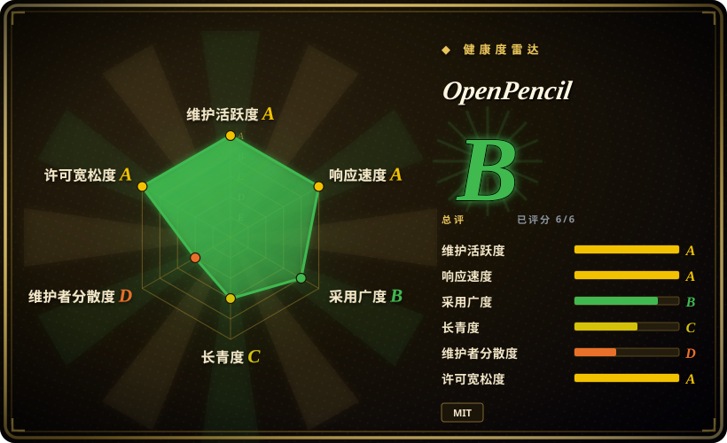
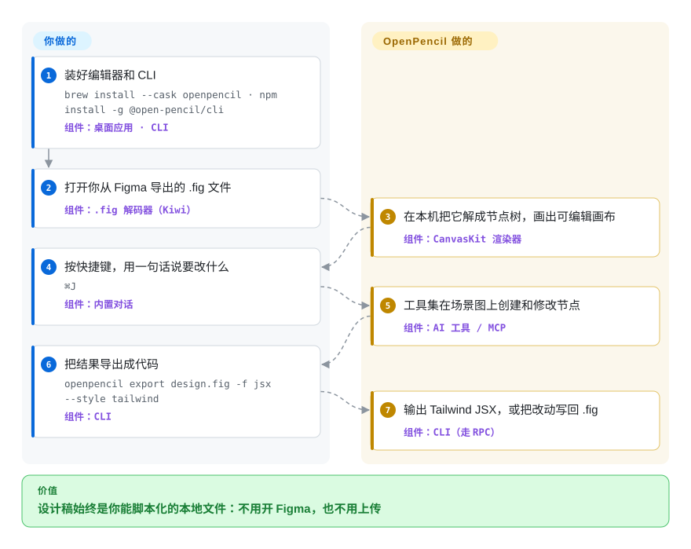

# OpenPencil

你们的设计稿躺在一种只有 Figma 能完整读的二进制格式里，而 Figma 自己的 API 和 MCP server 都只读——于是「把图标全导一遍」「查一遍图层命名」「把结账流程转成 Tailwind」最后都变成某个人坐在 GUI 里点。OpenPencil 在你本机打开这些 `.fig` 文件，并把文档变成可编程对象：同一份节点树，编辑器、CLI、MCP server 和 AI 对话都能操作。

## 何时使用

你是那个最终要对设计稿负责的人——设计系统负责人、小团队的前端工程师，或者把 agent 接进产品流程的人。活儿以 `.fig` 的形式送过来：导出图标、检查命名、找出所有还在用废弃紫色的按钮、把结账流程转成 JSX。Figma 的 REST API 和 MCP server 只读，曾经能读写的那条路（通过 Chrome DevTools 协议驱动桌面客户端）属于一次小版本更新就能关掉的东西，而文档本身是你 grep 不了的专有二进制。

当这件事本该是一个脚本、而不是一次 Figma 会话时，OpenPencil 值得考虑。它是少数原生解码 Figma `.fig` 格式、并把文件当数据处理的编辑器：GUI、`openpencil` CLI、MCP server，以及一个实现了 Figma Plugin API 的 `eval` 壳，操作的是同一份本地场景图。和 Penpot 不同，它没有服务器要部署、没有账号要建：装一个约 15 MB 的 Tauri 应用（或直接用网页版），文件不出本机。相对 Penpot 的决定性取舍就在这里——local-first 加原生 `.fig` 读写，换来的是没有服务端多人账号与权限。

## 怎么用起来

一个 `.fig` 文件是一个 ZIP 容器，里面是 Kiwi 编码的二进制记录——也就是 Figma 内部使用的同一套序列化格式——OpenPencil 把它解成一张扁平的类型化节点表。设计这件事你做（画、打字，或者按 `⌘J` 说一句要改什么）；机械的部分应用来做：CanvasKit（编译成 WebAssembly 的 Skia）负责绘制画布，一个 Yoga 分支负责自动布局，AI/MCP 层把工具调用翻译成对同一张节点表的编辑。不寻常的地方在暴露面：同一份文档有四个入口——GUI、CLI、MCP server，以及一个会讲 Figma Plugin API 的 `eval` 壳——所以脚本、agent 和人编辑的是同一个文件。协作走 WebRTC 点对点加 Yjs CRDT，因此没有中转服务器，也就没有账号、权限控制和持久历史。

<!-- flow-steps:begin (generated from flows/open-pencil.json by tools/flow_card.py — do not edit) -->

流程文字版

1. **你**：装好编辑器和 CLI — `brew install --cask openpencil · npm install -g @open-pencil/cli` — 组件：`桌面应用 · CLI`
2. **你**：打开你从 Figma 导出的 .fig 文件 — 组件：`.fig 解码器（Kiwi）`
3. **OpenPencil**：在本机把它解成节点树，画出可编辑画布 — 组件：`CanvasKit 渲染器`
4. **你**：按快捷键，用一句话说要改什么 — `⌘J` — 组件：`内置对话`
5. **OpenPencil**：工具集在场景图上创建和修改节点 — 组件：`AI 工具 / MCP`
6. **你**：把结果导出成代码 — `openpencil export design.fig -f jsx --style tailwind` — 组件：`CLI`
7. **OpenPencil**：输出 Tailwind JSX，或把改动写回 .fig — 组件：`CLI（走 RPC）`

**价值**：设计稿始终是你能脚本化的本地文件：不用开 Figma，也不用上传

<!-- flow-steps:end -->

## 何时不用

- **你需要原型交互、评论或版本历史。** Figma 式的 prototype flow、评论线程和版本/分支历史，在 OpenPencil 自己的 Figma 兼容性矩阵里被标为尚未建模。这类需求请用 Penpot（有原型和评论），或继续留在 Figma。
- **你需要带账号和权限的多人编辑。** 这里的协作是无服务器的 WebRTC 点对点，没有账号、没有权限控制，路线图里「可持久的中转协作」还把受限网络场景列为未来工作。如果必须多人编辑同一份文件且有角色和审计，请自托管 [Penpot](penpot.zh.md)。
- **你需要和 Figma 的难点像素级对齐。** 蒙版、图案/噪点/自定义填充、可变字体、布尔运算编辑、完整的组件/slot 作者能力，在项目自己的矩阵里都是部分支持，而且仓库里还留着一份记录已知差异的视觉对比报告。像素级关键的活儿留在 Figma，OpenPencil 用来做文件层面的批处理。
- **你只是要画草图、流程图或线框图。** 这是高保真设计编辑器；随手草图请用 [Excalidraw](../diagramming/excalidraw.zh.md) 或 [draw.io](../diagramming/drawio.zh.md)。
- **你无法承受 pre-1.0 的变更。** 近期每个 minor 版本都带破坏性变更——v0.15.0 重做了 MCP SDK 类型、Vue SDK 绑定和场景图字段。如果今天就需要稳定插件/API 契约，请改在 Figma 或 Penpot 的插件 API 上构建，等它到 1.0 再看；否则请锁死 `@open-pencil/*` 的版本。[推断]
- **你需要厂商、SLA 或基金会。** 路线图归属在一个人手上，既没有基金会也没有商业出资方；如果采购要合同，答案是 Kaleidos 支持的 Penpot，或商业工具。

## 横向对比

| 替代品 | 是否收录 | 我们的评价 | 取舍 |
|---|---|---|---|
| Figma | 非仓库 | 需要原型、评论、版本历史、Dev Mode，以及开箱即用的托管多人协作时选 Figma；需要文件可读、可脚本、留在本地时选 OpenPencil。 | 你保住了成熟平台和它的生态，但继续租用一套封闭二进制格式，其自动化面只有只读。 |
| [Penpot](penpot.zh.md) | ✅ | 需要多人在你自己控制的服务器上编辑同一份文件（含账号、角色、原型）时选 Penpot；需要打开已有 `.fig` 文件并在本地脚本化文档时选 OpenPencil。 | Penpot 用 Postgres + Valkey + 对象存储的部署成本，换来服务端协作与开放文件格式；OpenPencil 用放弃账号、权限和持久历史，换来原生 `.fig` 读写与零服务端 local-first。 |
| Sketch | 非仓库 | 只有当团队既有的 macOS 工作流已经投在它上面时才选 Sketch；只要需要自动化、Windows/Linux 或自托管，OpenPencil 就是它的替代。 | 闭源、仅 macOS、订阅制；没有可用来做批处理的 headless CLI 或 MCP 面。 |
| Framer | 非仓库 | 一个托管工具里从设计直达上线站点比拥有文档更重要时选 Framer；交付物是一份必须导出或脚本化的设计稿时选 OpenPencil。 | 托管发布型 SaaS；从设计到已发布站点最快，但无本地文件、不可自托管、不互通 `.fig`。 |
| [Excalidraw](../diagramming/excalidraw.zh.md) | ✅ | 随手草图与架构流程图选 Excalidraw；交付物只是一张餐巾纸草图时，OpenPencil 是用错工具。 | Excalidraw 速度优先、牺牲保真度，免安装免账号，但没有组件/变体、自动布局和设计转代码输出。 |

## 技术栈

- **语言：** 全仓库 TypeScript（UI 用 Vue 3）；Rust 只出现在 Tauri 桌面壳里。monorepo 的包管理器是 Bun（`packageManager` 字段固定版本）。[未验证]
- **渲染：** Skia，通过 CanvasKit WASM；该组织还维护一份带 Skia Graphite/Dawn WebGPU 后端的 CanvasKit 构建。
- **布局：** Yoga WASM（项目自己的分叉，加了 CSS grid）。
- **文件格式：** `.fig` 用 Kiwi 二进制 + Zstd + ZIP；它还能读 Pencil.dev 的 `.pen` 文档格式，不过让 `.pen` 成为一等保存目标仍在路线图上。
- **协作：** Trystero（WebRTC 点对点）+ Yjs CRDT。
- **桌面：** Tauri v2；同时以浏览器 PWA 形式发布。
- **AI/MCP：** Vercel AI SDK，逐 provider 的 BYOK（OpenRouter、Anthropic、OpenAI、Google、DeepSeek、Z.ai、MiniMax），MCP SDK，HTTP 传输用 Hono。
- **已发布包：** `@open-pencil/{scene-graph,pen,kiwi,fig,core,dom-css,vue,cli,mcp,harness}`——其中 headless Vue SDK 是可嵌入的编辑器面。

## 依赖

- **终端用户：** 无需并跑任何服务——下载 Tauri 版、用 Homebrew cask，或直接用网页版。需要 macOS 13+、Windows 10+，或带 WebKitGTK 2.40+ 的 Linux（网页版需要 Chrome/Edge 111+、Firefox 128+、Safari 16.4+）。
- **CLI / MCP / agent skill：** Node 或 Bun，加上 `@open-pencil/cli` / `@open-pencil/mcp`；agent 还可以安装它自带的 skill（`npx skills add open-pencil/open-pencil`）。
- **AI 功能：** 一个受支持 provider 的 BYOK key——不内置推理，也没有账号。
- **从源码构建：** Bun 1.4.2 加 Rust 工具链（Tauri）；仓库提供 Dev Container，覆盖网页编辑器、各包、CLI 和检查脚本（不含原生 Tauri 窗口）。
- **可选：** 一个 S3 兼容 bucket，供本地优先的 Storage Workspace 使用。

## 运维难度

**跑起来低，基于它构建中。** 终端用户没有服务器、没有数据库、没有账号——装上、打开文件、导出即可。反复出现的成本是版本变动：pre-1.0 阶段每隔一两个版本就会对 npm 包和 MCP 工具面做破坏性变更，凡是对着 `@open-pencil/*` 写的东西都需要刻意锁版本。从源码构建或自己出桌面安装包，则要承担 Tauri 的常规摩擦（Rust 工具链、各平台 WebView 前置依赖）。还有一个结构性细节：渲染器和布局引擎依赖项目自己维护的分叉（CanvasKit WebGPU、Yoga grid），所以渲染层的修复可能落在那儿而不是上游。

## 健康度与可持续性

- **维护（截至 2026-09-23）：** 明显活跃且节奏快——v0.15.1 发布于 2026-09-18，仓库生命周期内 30 个 release，commit 与本次核验同日，github 上有十个 Actions 工作流，含视觉回归 E2E 套件和定时跑的重测试任务。
- **治理与 bus factor：** 主要结构性风险。最近 12 个月的 commit 里一个人占约 89%；仓库归个人组织而非基金会，也没有 CLA 或资助文件，所以路线图由一个人的业余时间决定。[推断]
- **年龄与 Lindy 判断：** 建于 2026-02-27，不到一岁，约 8.6k star、840 fork。按 Lindy 先验这是典型**年轻且上升很快**的项目：star 数是发布信号而非耐久性证明，应按「有前景但未被证明」权衡（年龄 × 仍活跃：年龄这一侧不利，活跃度这一侧有利）。
- **出资与采用：** 目前没有商业出资方；路线图承诺**可选**的 OpenPencil Cloud 与自托管，但没有定价页，也还没发布任何东西。可测的采用是真的但不大：`@open-pencil/core` 每月约 19k 次下载，`cli`/`mcp` 约 3–4k（2026-08-23 至 2026-09-21）；最新 release 里下载量最高的两个桌面资产分别是 540 次（Windows x64 安装包）和 818 次（macOS arm64 归档）。
- **风险标记：** 它读的是一种自己无法控制的格式——解码 `.fig` 意味着追着 Figma 的 Kiwi schema 跑，仓库里带着实时的 Figma oracle 夹具和一份记录已知差异的视觉对比报告；另有两个依赖是项目自己维护的分叉（Skia CanvasKit WebGPU、Yoga grid），上游没有等价物在保活。

## 存疑（未验证）

- [未验证] 工具数量在上游自己的文档里就不一致——README 写 “100+ tools”，而 `packages/docs/overview/comparison.md` 写 “90 AI tools”（均为 2026-09-23 读取）。不要引用精确数字。
- [未验证] README「Why」一节对在位者的说法（MCP server 只读；某次 Figma 发布关掉了第三方自动化依赖的远程调试端口）是项目自己的表述，本文未独立核实。
- [推断] 约 89% 是健康雷达口径（近 12 个月，基于 GitHub contributor 统计）；按全历史看占比略低（39 个账号约 87%），具体数字随统计窗口变化。
- [未验证] 约 15 MB 桌面体积，以及 `packages/docs/overview/comparison.md` 里对 Penpot 的性能/架构比较，都是项目自己的测量；本文未做独立基准测试。
- [未验证] `.fig` 往返保真度由上游文档主张、并由其 oracle 夹具覆盖；只有真实文件的视觉对比才能确认，而且他们自己的 `tests/fixtures/figma-oracles/visual-comparison-report.json` 记录了仍未消除的差异。
- [推断]「可选的 OpenPencil Cloud 与自托管部署」是路线图表述而非已发布产品——截至 2026-09-23 既无定价页也无后台仓库。
- [推断] 只用发布版的情况无法测量，因此 npm 与 release 资产下载量会低估（或错估）真实用户规模。
