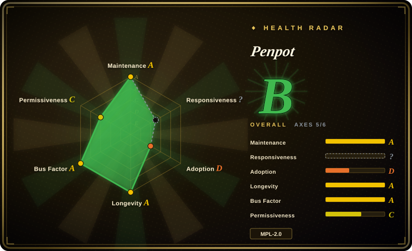
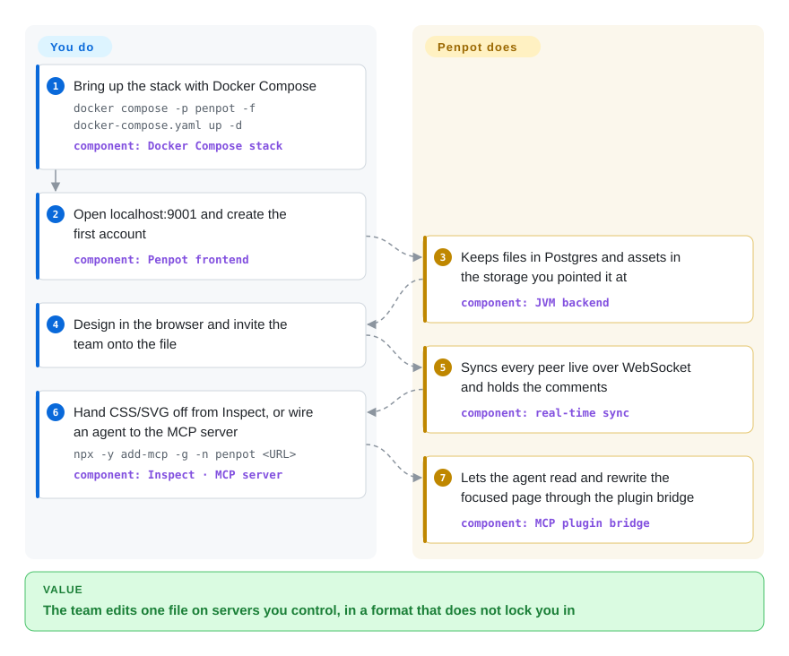

# Penpot

The design team wants Figma, but procurement wants the files to stay inside your network boundary and security wants to know who can read them — and a per-seat hosted tenant fails one of those tests. Penpot is that same class of product (browser editor, real-time multiplayer, components and variants, prototyping, comments, handoff code) shipped as an MPL-2.0 platform you deploy with one Docker Compose file, with documents in an open JSON/SVG-based format instead of a closed binary.

## When to use

You're the platform or IT engineer who has to answer "where do the design files live?". Security asks who can read a design and whether it can be bulk-exported, the legal team wants the data-processing question answered before anyone signs, and the design team's actual requirement is that the tool behaves like Figma: frames and auto layout, components and variants, prototyping, comments, multiplayer, and CSS/SVG handoff. A hosted SaaS fails one of those tests — usually the one about the file never leaving the building.

Penpot is the answer when the requirement is *a server you run*, not a local file. One Compose file brings up the browser editor, the JVM backend, Postgres, Valkey, an export service and an MCP server; designers open `localhost:9001` and collaborate the way they would on the hosted product, and every layer of it is open down to the Rust/WASM renderer. The deciding tradeoff against [OpenPencil](open-pencil.md) is exactly this: Penpot gives multi-user accounts, roles, link-sharing policies and enterprise SSO on your infrastructure, and gives up local-first simplicity and native `.fig` reading. Choose Penpot over Figma when control of the deployment outweighs having the newest design feature on day one.

## How it works

The deployment is a small service fleet, not a binary. `docker compose -p penpot -f docker-compose.yaml up -d` starts a ClojureScript frontend, a Clojure backend on the JVM, a separate exporter container (Node with a headless browser, used for server-side PNG/PDF/SVG rendering), Postgres for the documents and users, Valkey for pub/sub and caching, and — in the default Compose file — Mailpit standing in for an SMTP server. You do the designing in the browser; the backend owns persistence and multiplayer, broadcasting changes over WebSocket so everyone's canvas converges, and holding comments and versioned file state. Design tokens are first-class rather than exported, so the same token set is what a developer or an agent reads. If you want an agent in the loop, the MCP server plus an in-app plugin bridge lets a client read and rewrite the page that currently has focus — that is the same surface OpenPencil exposes, but here it runs against a server and one focused browser tab.

<!-- flow-steps:begin (generated from flows/penpot.json by tools/flow_card.py — do not edit) -->

Text version of the flow

1. **You**: Bring up the stack with Docker Compose — `docker compose -p penpot -f docker-compose.yaml up -d` — component: `Docker Compose stack`
2. **You**: Open localhost:9001 and create the first account — component: `Penpot frontend`
3. **Penpot**: Keeps files in Postgres and assets in the storage you pointed it at — component: `JVM backend`
4. **You**: Design in the browser and invite the team onto the file
5. **Penpot**: Syncs every peer live over WebSocket and holds the comments — component: `real-time sync`
6. **You**: Hand CSS/SVG off from Inspect, or wire an agent to the MCP server — `npx -y add-mcp -g -n penpot <URL>` — component: `Inspect · MCP server`
7. **Penpot**: Lets the agent read and rewrite the focused page through the plugin bridge — component: `MCP plugin bridge`

**Value**: The team edits one file on servers you control, in a format that does not lock you in

<!-- flow-steps:end -->

## When NOT to use

- **One designer, one machine, and the need is `.fig`.** Use [OpenPencil](open-pencil.md), which installs as a desktop/web app with no server, no accounts and native `.fig` I/O — Penpot's whole cost is the fleet.
- **You cannot own Postgres, Valkey, object storage, SMTP, TLS and upgrades.** Then do not self-host: use Penpot's hosted SaaS or Figma. Self-hosting is a real operational commitment (see Ops difficulty), and upstream ships images that lag the SaaS release.
- **You need Figma's newest features, FigJam or Slides.** Penpot has prototyping, comments and design tokens, but Figma's Dev Mode, FigJam boards and Slides product have no equivalent here — stay on Figma for those.
- **You need SSO, an admin console or advanced permissions but will not buy the Enterprise plan.** Those are the paid tier, not the MPL-2.0 edition; if that is a blocker, Figma's enterprise offering or Penpot's own hosted Enterprise subscription is the substitute.
- **You want to fork it and ship a closed derivative.** MPL-2.0 is file-level copyleft: modified MPL-covered files must stay MPL-licensed. If a permissive licence is a hard requirement, pick an MIT/Apache-licensed editor instead.
- **You just need a sketch or a flowchart.** Use [Excalidraw](../diagramming/excalidraw.md) or [draw.io](../diagramming/drawio.md); a self-hosted platform is wildly oversized for a wireframe.

## Comparison

| Alternative | In index | Our verdict | Tradeoff |
|---|---|---|---|
| Figma | 非仓库 | Pick Figma when the newest design features, Dev Mode and turnkey hosted multiplayer matter more than controlling the deployment; pick Penpot when the design files must live on infrastructure you own. | Tradeoff: you get the mature platform and its ecosystem without operating anything, but you keep a closed binary format and no data-residency answer you control. |
| [OpenPencil](open-pencil.md) | ✅ | Pick OpenPencil when a small team needs a local-first editor that opens existing `.fig` files and can be scripted through CLI/MCP; pick Penpot when several people must edit one file on your servers with accounts and permissions. | Penpot buys server-side collaboration, an open file format and a plugin ecosystem at the cost of a Postgres + Valkey + object-store deployment; OpenPencil buys zero-server local-first and native `.fig` I/O by giving up accounts, roles and durable history. |
| Sketch | 非仓库 | Pick Sketch only if the team is already committed to a macOS-only, subscription workflow; Penpot is the substitute as soon as you need Windows/Linux access or self-hosting. | Closed, macOS-only, per-seat; no self-hosted or browser path, and no headless API for batch work. |
| Adobe XD | 非仓库 | Treat Adobe XD as legacy, not a destination: development stopped in 2023 and it is no longer sold standalone (final release 2025-12), so teams still on it should migrate — to Figma for hosted convenience or Penpot when the files must stay in-house. | Maintenance-mode product with no feature investment; migrating to Penpot costs a redesign of complex prototypes but buys an actively developed, self-hostable successor. |
| [Excalidraw](../diagramming/excalidraw.md) | ✅ | Pick Excalidraw when the deliverable is an informal sketch; Penpot is the wrong weight of tool for a single wireframe. | Excalidraw needs no install and no server, but gives up components/variants, prototyping, design tokens and server-side multiplayer. |

## Tech stack

- **Languages:** Clojure (backend), ClojureScript (frontend and exporter, built with shadow-cljs + React), Rust (the WebAssembly renderer), with a shared `.cljc` common library.
- **Rendering:** shapes render as an SVG DOM tree by default; a Rust/Skia WASM renderer (`render-wasm/`) is available behind a server flag or `?wasm=true`. [未验证]
- **Backend:** JVM with ring/reitit, `next.jdbc` for Postgres, Lettuce for Redis/Valkey, Prometheus metrics endpoints.
- **Exporter:** a separate Node service that drives Playwright/Chromium for server-side rendering (PNG/PDF/SVG).
- **Agent surface:** an official MCP server (`mcp/`) plus an in-app plugin that bridges the focused page; a plugin API, webhooks and access-token API for integrations.
- **Deployment:** Docker Compose, Helm/Kubernetes, plus vendor-packaged options (Elestio, TrueNAS).

## Dependencies

- **Orchestration:** Docker with Compose, or Kubernetes with the official Helm chart. You also need a reverse proxy terminating TLS — the docs give nginx, Caddy and Traefik configs, and two WebSocket paths (`/ws/notifications`, `/mcp/ws`) must be proxied, not just `/`.
- **Datastores:** PostgreSQL (the default Compose file pins 15) and Valkey/Redis for pub-sub and caching.
- **Object storage:** the filesystem backend is the default; an S3-compatible endpoint (MinIO, rustfs, or a cloud bucket) is the production choice for a distributed deployment.
- **Email:** a real SMTP provider — the Compose file ships Mailpit only as a development stand-in.
- **Optional:** an MCP-capable AI client if you want agent workflows; the MCP server authenticates with a per-user MCP key.
- **Note:** self-hosted images are published shortly *after* the SaaS update, so a self-hosted instance trails the hosted release rather than tracking it.

## Ops difficulty

**High.** This is a multi-container platform you own end to end: Postgres backups and upgrades, Valkey, object-storage credentials, SMTP deliverability, a reverse proxy with WebSocket upgrade paths, and image-version bumps that must be sequenced with database migrations. Kubernetes/Helm makes the runtime declarative but does not remove any of that responsibility, and the enterprise-grade capabilities a large org will ask for (SSO, admin console, advanced permissions) sit behind the paid Enterprise plan. Budget real operator time, not a one-off install; the architecture deliberately trades a single-process local app for server-side multi-user collaboration.

## Health & viability

- **Maintenance (as of 2026-09-23):** very active — v2.18.0 released 2026-09-23, 27 releases in the preceding 12 months (roughly monthly), and commits landed by several core developers the same day as this verification.
- **Governance & bus factor:** strong compared with typical OSS. Ownership is a company (Kaleidos), not an individual; the contributor list runs to roughly 349 accounts with the top ten each holding hundreds to thousands of commits; contributions are covered by a DCO sign-off rather than a copyright-assigning CLA. The tradeoff is that the commercial owner sets the roadmap.
- **Backing & longevity:** the Lindy prior is favourable — the repo dates to 2015-12-29 (~10.7 years) and is *still active*, with a vendor that has funded it throughout; it also carries a Verified Digital Public Good listing. That is the opposite profile from a months-old hype repo, and it is the strongest reason to bet on it.
- **Adoption & ecosystem:** ~60k stars, ~4.1k forks, a public community forum, a plugin hub, templates/libraries, design-token support and packaged deployment options from third parties — a real ecosystem rather than a single repo.
- **Risk flags:** the project is **open-core** — the MPL-2.0 edition is complete for design work, but SSO, the admin console and advanced permissions are Enterprise-plan features, so feature gating across the licence line is a planning fact, not a possibility. MPL-2.0 is also file-level copyleft, which constrains how you can fork and relicense the frontend.

## Caveats (unverified)

- [未验证] The claim that the Rust/Skia WASM renderer is opt-in behind a server flag or `?wasm=true`, and that the SVG DOM renderer is the default, comes from OpenPencil's own comparison page and from Penpot's `render-wasm/` tree — I did not run an instance to confirm which path is active by default in v2.18.0.
- [未验证] "Roughly 349 contributors" is derived from the GitHub contributors endpoint's last-page index, which counts anonymized accounts and can over- or under-count; the DCO/no-CLA statement is from `CONTRIBUTING.md` (read 2026-09-23).
- [未验证] The exporter's use of Playwright is read from `exporter/package.json` (`playwright: 1.62.1`); which renderer core it drives was not traced.
- [推断] Enterprise-plan boundaries (SSO, admin console, advanced permissions) are taken from the upstream README's description of Penpot Enterprise; the exact feature split between the free and paid editions was not enumerated from the codebase.
- [推断] Ops-difficulty and backup/upgrade burden are inferred from the shipped Compose topology and the docs' reverse-proxy/migration guidance, not from operating a production instance.
- [未验证] Star and fork counts (~60k / ~4.1k as of 2026-09) are date-sensitive GitHub numbers, not adoption evidence.
- [推断] The health radar's adoption axis is measured from an npm package (`@penpot/mcp`); because the platform ships mainly as Docker images plus a hosted SaaS, that grade understates real adoption — read it as "the signal this measurement can see", not as low usage.
