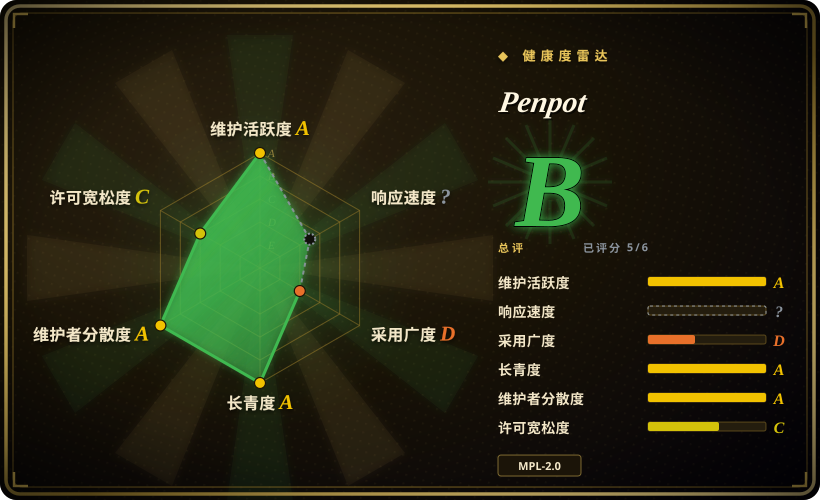
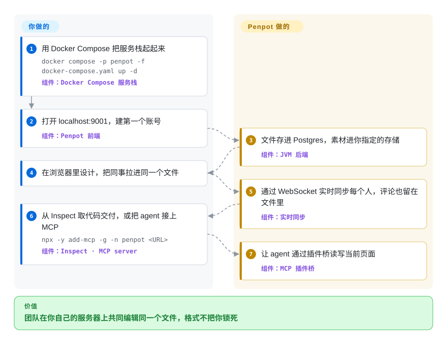

# Penpot

设计团队想要 Figma，但采购要求文件留在你们自己的网络边界内，安全团队要问谁读得到——而按席位租的托管租户总有一条过不了。Penpot 是同一类产品（浏览器编辑器、实时多人协作、组件与变体、原型、评论、交付代码），但以 MPL-2.0 平台的形式交付，用一个 Docker Compose 文件就能部署，文档存在开放的 JSON/SVG 格式里而不是封闭二进制。

## 何时使用

你是那个必须回答「设计文件到底存放在哪」的平台或 IT 工程师。安全问谁能读到设计稿、能不能批量导出，法务在任何人签字之前要先把数据处理的答案讲清楚，而设计团队真正的要求其实只有一条——这工具得像 Figma：画板与自动布局、组件与变体、原型、评论、多人协作、CSS/SVG 交付。托管 SaaS 总有一条过不了，通常是「文件不出楼」那条。

当需求是*一台你自己跑的服务器*、而不是一个本地文件时，Penpot 就是答案。一个 Compose 文件起浏览器编辑器、JVM 后端、Postgres、Valkey、导出服务和 MCP server；设计师打开 `localhost:9001`，像在托管版上一样协作，而且从最底层到 Rust/WASM 渲染器每一层都是开放的。相对 [OpenPencil](open-pencil.zh.md) 的决定性取舍正在这里：Penpot 给你跑在自己基础设施上的多用户账号、角色、链接分享策略和企业 SSO，代价是放弃 local-first 的简单性和原生 `.fig` 读取。当「控制部署」比「第一时间用上最新设计功能」更重要时，选 Penpot 而不是 Figma。

## 怎么用起来

这套部署是一小群服务，而不是一个二进制。`docker compose -p penpot -f docker-compose.yaml up -d` 会启动 ClojureScript 前端、跑在 JVM 上的 Clojure 后端、单独的导出容器（Node 加无头浏览器，用于服务端渲染 PNG/PDF/SVG）、存文档和用户的 Postgres、负责 pub/sub 与缓存的 Valkey，以及默认 Compose 文件里顶替 SMTP 的 Mailpit。设计这件事你在浏览器里做；后端负责持久化和多人协作，通过 WebSocket 广播变更让大家画布收敛，并保存评论与带版本的文件状态。design tokens 是一等公民而非导出产物，所以开发者或 agent 读到的是同一套 token。想把 agent 拉进来时，MCP server 加一个应用内插件桥，让客户端读写当前获得焦点的页面——这和 OpenPencil 暴露的表面类似，只是这里跑在服务器上，并且一次只服务一个聚焦的浏览器标签页。

<!-- flow-steps:begin (generated from flows/penpot.json by tools/flow_card.py — do not edit) -->

流程文字版

1. **你**：用 Docker Compose 把服务栈起起来 — `docker compose -p penpot -f docker-compose.yaml up -d` — 组件：`Docker Compose 服务栈`
2. **你**：打开 localhost:9001，建第一个账号 — 组件：`Penpot 前端`
3. **Penpot**：文件存进 Postgres，素材进你指定的存储 — 组件：`JVM 后端`
4. **你**：在浏览器里设计，把同事拉进同一个文件
5. **Penpot**：通过 WebSocket 实时同步每个人，评论也留在文件里 — 组件：`实时同步`
6. **你**：从 Inspect 取代码交付，或把 agent 接上 MCP — `npx -y add-mcp -g -n penpot <URL>` — 组件：`Inspect · MCP server`
7. **Penpot**：让 agent 通过插件桥读写当前页面 — 组件：`MCP 插件桥`

**价值**：团队在你自己的服务器上共同编辑同一个文件，格式不把你锁死

<!-- flow-steps:end -->

## 何时不用

- **只有一个人、一台机器，需求是 `.fig`。** 请用 [OpenPencil](open-pencil.zh.md)：桌面/网页应用，没有服务器、没有账号，原生读写 `.fig`——Penpot 的全部成本都在这群服务上。
- **你没法承担 Postgres、Valkey、对象存储、SMTP、TLS 和升级。** 那就别自托管：用 Penpot 的托管 SaaS 或 Figma。自托管是实打实的运维承诺（见运维难度），而且上游镜像会晚于 SaaS 发布。
- **你需要 Figma 的最新功能、FigJam 或 Slides。** Penpot 有原型、评论和 design tokens，但 Figma 的 Dev Mode、FigJam 白板、Slides 产品在这里没有对应物——这些请留在 Figma。
- **你需要 SSO、管理控制台或高级权限，但不愿买 Enterprise。** 那些属于付费层，不在 MPL-2.0 版本里；如果这是硬阻塞，替代品是 Figma 的企业方案或 Penpot 自家的托管 Enterprise 订阅。
- **你想 fork 之后闭源分发。** MPL-2.0 是文件级 copyleft：被 MPL 覆盖的修改文件必须保持 MPL 许可。如果宽松许可本身是硬要求，请换一个 MIT/Apache 许可的编辑器。
- **你只是要画草图或流程图。** 用 [Excalidraw](../diagramming/excalidraw.zh.md) 或 [draw.io](../diagramming/drawio.zh.md)；为一个线框图自托管一整套平台是严重过配。

## 横向对比

| 替代品 | 是否收录 | 我们的评价 | 取舍 |
|---|---|---|---|
| Figma | 非仓库 | 最新设计功能、Dev Mode 和开箱即用的托管多人协作比控制部署更重要时选 Figma；设计文件必须留在自有基础设施上时选 Penpot。 | 你不必自己运维任何东西就得到成熟平台与生态，但继续用封闭二进制格式，并且没有你说了算的数据驻留答案。 |
| [OpenPencil](open-pencil.zh.md) | ✅ | 小团队要一个能打开已有 `.fig`、可通过 CLI/MCP 脚本化的 local-first 编辑器时选 OpenPencil；多个人必须在你的服务器上带账号与权限编辑同一份文件时选 Penpot。 | Penpot 用 Postgres + Valkey + 对象存储的部署成本，换来服务端协作、开放文件格式和插件生态；OpenPencil 用放弃账号、角色与持久历史，换来零服务端 local-first 与原生 `.fig` 读写。 |
| Sketch | 非仓库 | 只有当团队已经绑在仅 macOS 的订阅工作流上时才选 Sketch；一旦需要 Windows/Linux 访问或自托管，替代品就是 Penpot。 | 闭源、仅 macOS、按席位收费；没有自托管或浏览器路径，也没有可做批处理的 headless API。 |
| Adobe XD | 非仓库 | 把 Adobe XD 当作遗留品而不是目的地：开发在 2023 年停止，也已不再单独售卖（最终版本 2025-12），仍在其上的团队应当迁移——要托管便利选 Figma，文件必须留在内部则选 Penpot。 | 处于维护模式、不再投入新功能的产品；迁到 Penpot 要重做复杂原型，但换来一个仍在积极开发、可自托管的继任者。 |
| [Excalidraw](../diagramming/excalidraw.zh.md) | ✅ | 交付物只是随手草图时选 Excalidraw；一张线框图用 Penpot 是用错了重量级。 | Excalidraw 免安装、免服务器，但放弃组件/变体、原型、design tokens 和服务端多人协作。 |

## 技术栈

- **语言：** Clojure（后端）、ClojureScript（前端与导出服务，用 shadow-cljs + React 构建）、Rust（WebAssembly 渲染器），另有共享的 `.cljc` 公共库。
- **渲染：** 默认把图形渲染成 SVG DOM 树；Rust/Skia 的 WASM 渲染器（`render-wasm/`）可通过服务端开关或 `?wasm=true` 启用。[未验证]
- **后端：** JVM，ring/reitit，用 `next.jdbc` 访问 Postgres，用 Lettuce 访问 Redis/Valkey，带 Prometheus 指标端点。
- **导出服务：** 独立的 Node 服务，驱动 Playwright/Chromium 做服务端渲染（PNG/PDF/SVG）。
- **Agent 面：** 官方 MCP server（`mcp/`）加一个桥接当前页面的应用内插件；面向集成还有插件 API、webhook 和访问令牌 API。
- **部署：** Docker Compose、Helm/Kubernetes，以及第三方打包方案（Elestio、TrueNAS）。

## 依赖

- **编排：** Docker 加 Compose，或 Kubernetes 配官方 Helm chart。还需要一个终止 TLS 的反向代理——文档给了 nginx、Caddy、Traefik 配置，并且除了 `/` 还必须代理两条 WebSocket 路径（`/ws/notifications`、`/mcp/ws`）。
- **数据存储：** PostgreSQL（默认 Compose 文件固定 15）和 Valkey/Redis 做 pub-sub 与缓存。
- **对象存储：** 默认走文件系统后端；分布式生产部署应换成 S3 兼容端点（MinIO、rustfs 或云上 bucket）。
- **邮件：** 真实的 SMTP provider——Compose 里的 Mailpit 只是开发替身。
- **可选：** 一个支持 MCP 的 AI 客户端，如果你要 agent 工作流；MCP server 用每用户一把 MCP key 认证。
- **注意：** 自托管镜像在 SaaS 更新*之后*才发布，所以自托管实例是滞后于托管版本，而非同步跟进。

## 运维难度

**高。** 这是一个你从头到尾拥有的多容器平台：Postgres 备份与升级、Valkey、对象存储凭据、SMTP 送达率、带 WebSocket 升级路径的反向代理，以及必须和数据库迁移排好顺序的镜像版本升级。Kubernetes/Helm 让运行时变成声明式的，但不会替你减掉任何一项责任；而大机构一定会问的企业能力（SSO、管理控制台、高级权限）在付费 Enterprise 层后面。请预留真实运维人力，而不是一次性安装：这套架构是有意用一个单进程本地应用去换服务端多人协作。

## 健康度与可持续性

- **维护（截至 2026-09-23）：** 非常活跃——v2.18.0 发布于 2026-09-23，此前 12 个月有 27 个 release（大致每月一次），且有数位核心开发者在本次核验当天提交了代码。
- **治理与 bus factor：** 相对典型开源项目更强。归属是一家公司（Kaleidos）而非个人；贡献者列表约有 349 个账号，前十里每位都有数百到数千次提交；贡献用 DCO sign-off 覆盖，而不是要求转让版权的 CLA。代价是路线图由商业所有者决定。
- **出资与耐久：** Lindy 先验是有利的——仓库始于 2015-12-29（约 10.7 年）且*至今活跃*，期间一直有厂商出资；还带有 Verified Digital Public Good 认证。这和一个几个月大的炒作仓库正好相反，也是押注它最有力的理由。
- **采用与生态：** 约 60k star、约 4.1k fork，有公开社区论坛、插件中心、模板/库、design token 支持，以及第三方打包的部署方案——是一个真实生态，而不是一个孤立仓库。
- **风险标记：** 项目是 **open-core**——MPL-2.0 版本对设计工作完整可用，但 SSO、管理控制台和高级权限是 Enterprise 层功能，所以跨许可线的功能分层是要提前规划的事实，而非可能性。MPL-2.0 同时是文件级 copyleft，会限制你如何 fork 并重新许可前端。

## 存疑（未验证）

- [未验证]「Rust/Skia 的 WASM 渲染器需服务端开关或 `?wasm=true` 才启用、SVG DOM 渲染器为默认」这一说法来自 OpenPencil 的对比页和 Penpot 的 `render-wasm/` 目录；本文没有实际跑起 v2.18.0 去确认默认走哪条路径。
- [未验证]「约 349 位贡献者」由 GitHub contributors 接口的末页序号推导，其中包含匿名账号，可能高估或低估；「DCO 而非 CLA」的说法取自 `CONTRIBUTING.md`（2026-09-23 读取）。
- [未验证] 导出服务使用 Playwright 是从 `exporter/package.json`（`playwright: 1.62.1`）读到的；它具体驱动哪个渲染内核未做追溯。
- [推断] Enterprise 层的边界（SSO、管理控制台、高级权限）取自上游 README 对 Penpot Enterprise 的描述；免费版与付费版的确切功能划分未从代码库中逐条枚举。
- [推断] 运维难度与备份/升级负担，是从随仓库发布的 Compose 拓扑和文档里的反向代理/迁移指引推断的，不是来自运营一个生产实例的经验。
- [未验证] star 与 fork 数（截至 2026-09 约 60k / 约 4.1k）是对时间敏感的 GitHub 数字，不能当作采用度证据。
- [推断] 健康雷达的「采用」轴是从 npm 包（`@penpot/mcp`）测的；由于该平台主要以 Docker 镜像加托管 SaaS 分发，这个档位低估了真实采用——请把它读作「这一口径能看到的信号」，而非「用得少」。
