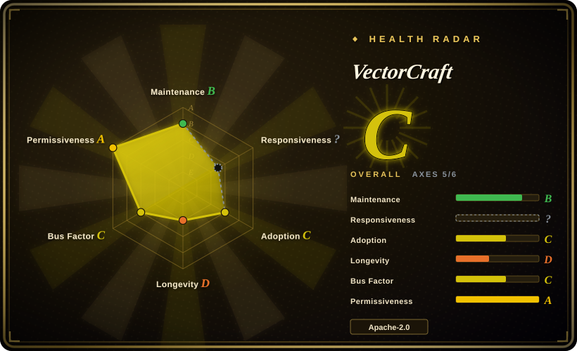
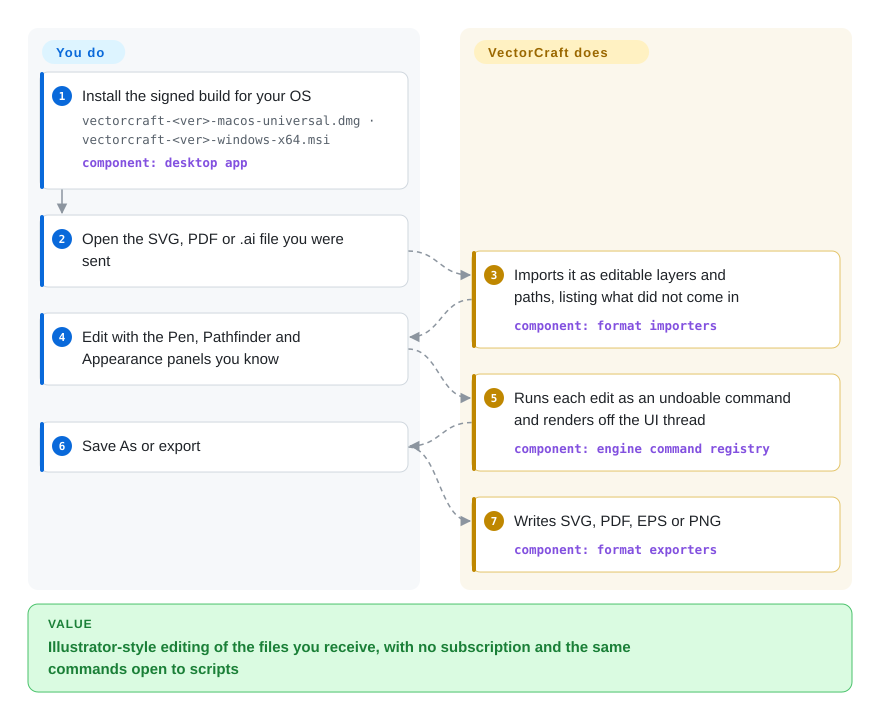

# VectorCraft

A client sends `brand-refresh.ai`, and the only tool that opens it the way you know how to work is an Illustrator subscription on Windows or macOS — and no script or agent can drive that app for you. VectorCraft is a from-scratch Rust editor that copies Illustrator's panels and shortcuts, opens SVG, PDF, `.ai`, EPS and Affinity files as editable layers, and exposes every menu command to a headless CLI and an MCP server.

## When to use

You're a freelance illustrator or a small studio's one designer, and Illustrator is the tool your hands know: Pen and Direct Selection, Pathfinder, the Appearance panel, the shortcuts you no longer think about. The subscription is the cost you want gone, or you moved to Linux, or you need the same app in a browser tab. Inkscape is the usual answer and it is free, but its panels, shortcuts and object model are its own; the first afternoon goes to relearning where things are while `logo-final.ai` waits. VectorCraft deliberately clones the Illustrator layout (menus, panels, shortcuts, the contextual task bar) and imports the files that workflow produces, so the switch costs less retraining.

The second reason to reach for it is automation. If you want Claude or a script to *make* vector art — "a 70-step blend between these two paths, then export PDF and PNG" — writing raw SVG gets you nowhere near a live blend or an exact Pathfinder union. VectorCraft runs every user-visible action as a named command (685 in the v0.7.0 catalogue), and the same commands are reachable from `vectorcraft-cli run`, a JSON control channel on a TCP port, and an MCP server. The deciding tradeoff against Inkscape is Illustrator-shaped UX plus a first-class agent surface, bought with a project that is days old; against Graphite it is a conventional layers-and-panels editor rather than a node-based procedural one.

## How it works

The app is a Rust workspace of about twenty crates: geometry, path booleans, text, effects, a CPU renderer, one importer/exporter per file format, an engine that holds the document and its undo history, and an egui front end on top. Every menu item, tool drag and dialog button becomes a *command* — a named, parameterised edit the engine applies and can undo — so the GUI, the `vectorcraft-cli` batch runner and the MCP server (Model Context Protocol, the plug-in standard coding agents use to call tools) all go through one door. Think of it as Illustrator with its own macro recorder always on: the buttons are just one way to press the commands. What it does for you is the file import (it reports what did not come in), exact curve booleans, off-thread rendering and export; what you do is the drawing, or telling an agent what to draw. Builds are the same codebase on macOS, Windows, Linux, FreeBSD and the web (WebAssembly).

<!-- flow-steps:begin (generated from flows/vectorcraft.json by tools/flow_card.py — do not edit) -->

Text version of the flow

1. **You**: Install the signed build for your OS — `vectorcraft-<ver>-macos-universal.dmg · vectorcraft-<ver>-windows-x64.msi` — component: `desktop app`
2. **You**: Open the SVG, PDF or .ai file you were sent
3. **VectorCraft**: Imports it as editable layers and paths, listing what did not come in — component: `format importers`
4. **You**: Edit with the Pen, Pathfinder and Appearance panels you know
5. **VectorCraft**: Runs each edit as an undoable command and renders off the UI thread — component: `engine command registry`
6. **You**: Save As or export
7. **VectorCraft**: Writes SVG, PDF, EPS or PNG — component: `format exporters`

**Value**: Illustrator-style editing of the files you receive, with no subscription and the same commands open to scripts

<!-- flow-steps:end -->

## When NOT to use

- **You ship client work on it next week.** The repository was created on 2026-09-30, shipped nine releases in seven days (v0.1.0 on 2026-10-02 to v0.7.0 on 2026-10-08), and its own ROADMAP grades it 69–75% of Illustrator's features and 40–55% of "a power user can't tell the difference", self-assessed by the agents that built the features. The interaction-fidelity pass (modifier keys, cursors, small behaviours) has not started. For deadline work stay on Illustrator, or use Inkscape, which has two decades of production use behind it.
- **You need 3D, the raster Effect Gallery, Variables/data merge, scripting or rich brush and symbol libraries.** The README lists all of these as missing; 3D & Materials is at 0% and about 4 of ~56 raster filters exist. Keep Illustrator or Affinity Designer for those jobs; for SVG filter effects on a free stack, Inkscape is further along.
- **Your files must round-trip with colleagues who stay on Illustrator.** VectorCraft reads `.ai` through its PDF-compatible part or the structure of its editing data; symbols, pattern fills and placed files arrive as drawn appearance. The README and ROADMAP say PDF-compatible `.ai` can be written too, but the v0.7.0 CLI refused (`document.formats` marks `.ai` read-only, 2026-10-09). It also opens Affinity files but cannot write them. If the other side edits natively, keep the native app in the loop instead of using this as a converter.
- **A team must co-edit UI designs, components and prototypes.** This is a single-user illustration editor with no accounts, sharing or real-time collaboration. Self-host [Penpot](penpot.md) for that.
- **You want node-based, non-destructive procedural graphics.** VectorCraft follows Illustrator's object-and-appearance model. Graphite (Apache-2.0, Rust, created 2020) is built around a node graph.
- **You want to embed a vector engine in your own app.** None of the `vectorcraft-*` crates is published on crates.io (checked 2026-10-09), and an open issue (#647) notes the sibling apps already carry drifted copies of the same code. Use a published library such as `usvg`/`resvg` or `kurbo`, which VectorCraft itself builds on.
- **Your organisation needs verifiable build and clean-room provenance.** No hosted CI runs the test suite on pull requests: the six GitHub workflows cover releases, packaging lint, FreeBSD, Windows arm64/7 and an Affinity corpus. The `cargo xtask cleanroom` gate that AGENTS.md and a maintainer reply (#371) say enforces the clean-room rule does not exist among the xtask subcommands on `main` (2026-10-09). Treat "clean-room" as the project's policy, not an audited fact, and wait for a third-party audit or stay on Inkscape (GPL, long public history) if that matters.
- **You draw with a pen tablet on KDE Plasma 6.3+ under Wayland.** The pen moves the cursor but the app does not respond (#491); you must start it under XWayland. Pressure beyond Windows and tilt/rotation brushes are still on the roadmap.

## Comparison

| Alternative | In index | Our verdict | Tradeoff |
|---|---|---|---|
| Adobe Illustrator | not a repo | Pick Illustrator when the job is paid production work, needs 3D, the Effect Gallery, Variables or scripting, or must round-trip native `.ai` with other Illustrator users; pick VectorCraft when you want the same layout without the subscription, on Linux or the web, or driven by an agent. | Closed, subscription-licensed desktop app — out of scope by shape. You keep full feature depth and the ecosystem; you give up cost control, Linux/browser builds and an agent-drivable command surface. |
| Inkscape | not indexed | Pick Inkscape when stability and a 20-year track record matter more than Illustrator muscle memory; pick VectorCraft when retraining cost or agent automation decides it and you can tolerate a days-old app. | Real repository (canonical on GitLab), not added in this tab batch. GPL, mature SVG-native editor with its own UI conventions; no MCP or first-class agent surface comparable to VectorCraft's command catalogue. |
| Graphite | not indexed | Pick Graphite when you want procedural, node-based non-destructive graphics in Rust; pick VectorCraft when you want a conventional Illustrator-style layers-and-panels editor that opens `.ai`/PDF/EPS. | Real repository (`GraphiteEditor/Graphite`, Apache-2.0, created 2020), not added in this tab batch. Older, larger community, different mental model; it does not aim at Illustrator file or UI compatibility. |
| [Penpot](penpot.md) | ✅ | Pick Penpot when a team edits UI designs, components and prototypes together on servers you control; pick VectorCraft for single-user illustration and print/vector file work. | Penpot costs a Postgres + Valkey + object-storage deployment and buys multiplayer, accounts and prototyping; VectorCraft is a local app with no server and no collaboration. |
| Affinity Designer | not a repo | Pick Affinity when you want a polished, mature commercial Illustrator alternative today; pick VectorCraft when open source, Linux, or agent automation is required. | Closed commercial app — out of scope by shape. VectorCraft opens Affinity documents but cannot write them, so it is a one-way exit, not a co-working peer. |

## Tech stack

- **Language:** Rust (edition 2024, `rust-version = 1.95`); about 15 MB of Rust across 1,040 `.rs` files on 2026-10-09. `unsafe_code = "deny"` and workspace clippy lints deny `unwrap`/`expect`/`panic!` in shipped code.
- **Workspace:** crates `geom, color, doc, pathops, text, effects, trace, brush, render, svg, pdf, eps, cad, metafile, format, tools, engine, ui-egui, mcp, plugins, affinity, testkit`; apps `vectorcraft` (desktop), `vectorcraft-cli`, `vectorcraft-web`.
- **Rendering:** `vello_cpu` (multithreaded CPU rasteriser) for the canvas; `wgpu` under egui/eframe for the window; `kurbo`/`peniko` for curves and paint; `linesweeper` for booleans.
- **Formats:** `usvg` (SVG in), `krilla` (PDF out), the `hayro-*` crates (PDF interpretation, CMaps, JBIG2/JPEG2000), `image`/`tiff`/`zune-jpeg`; own EPS PostScript interpreter, DXF, EMF/WMF and Affinity readers.
- **Text:** `skrifa` + `harfrust` (HarfBuzz port) shaping, bidirectional Hebrew/Arabic layout; CJK fonts come from the optional `storytold/craft-fonts` build input.
- **Plug-ins:** WebAssembly modules run in the `wasmi` interpreter.
- **Native format:** `.vectorcraft`, documented JSON.

## Dependencies

- **End users:** nothing alongside it. Signed and notarized macOS DMG and CLI zip (Developer ID "Learning Machines LLC", checked on the v0.7.0 CLI), code-signed Windows MSI/portable zips (x64, arm64, x86), Linux AppImage/Flatpak/deb/rpm/tarball (x86_64, aarch64), a FreeBSD tarball, and a static web build you host yourself.
- **Agents:** the `vectorcraft-cli` binary; `vectorcraft-cli mcp` speaks stdio MCP, either headless (in-process engine) or forwarding to a running app started with `--control 7979`.
- **GPU:** the desktop window needs a working GPU backend (Metal, DX12 then Vulkan, Vulkan/GL on Linux); the CLI renders on the CPU.
- **Building from source:** Rust ≥ 1.95 and `cargo`; `trunk` for the web build; optional `CRAFT_FONTS_DIR` checkout for Japanese/Chinese/Arabic faces. No network service is needed at runtime — the lockfile carries no HTTP client crate (checked 2026-10-09).

## Ops difficulty

**Low to install, high to depend on.** Installing is a signed package per OS and there is no server. The cost is churn: a new minor version every day or two, behaviour still converging on Illustrator's, and the maintainers' own notes that Windows/Linux packaging, accessibility and idle-machine performance budgets are not finished. Anyone automating against the command catalogue or MCP tools should pin a version and expect command ids and parameters (described in prose, not schema) to move. Building from source is a large Rust workspace with release LTO; the AGENTS.md notes each agent's target dir reaching ~30 GB.

## Health & viability

- **Maintenance (as of 2026-10-09):** extremely active — pushed the day of verification, 9 releases between 2026-10-02 and 2026-10-08, 489 merged pull requests and issue numbers past #770 in nine days, many reported issues closed the same day.
- **Governance & bus factor:** owned by the `storytold` organisation (ArtCraft, created 2021, 42 public repos); the maintainers defer project-level decisions to the owner account `echelon` (profile company: ArtCraft), and one account (`bflatastic`) holds ~1,000 of the commits. The ROADMAP prices remaining work in "hours of continuous Claude Opus 5.5 agent work", so the code is largely agent-written and the roadmap depends on the company keeping that budget going. [推断]
- **Age & Lindy verdict:** nine days old. Lindy gives essentially no prior; whatever the star count says, this is a launch, not a track record. Revisit after it has survived a quarter of maintenance after the launch wave.
- **Adoption:** ~4.7k stars and ~1.8k forks in nine days, ~173k release-asset downloads across nine releases (excluding checksum files), and dozens of distinct outside reporters and PR authors (10 accounts besides `bflatastic` and `echelon` with 3+ merged PRs among the last 300) — signals of real early use. The fork-to-star ratio is unusually high and the star timeline could not be sampled, so the velocity is not independently verified.
- **Risk flags:** the "clean-room" claim is policy plus a brand-name scanner (`cargo xtask brands`), not the CI gate the docs describe; it positions itself against Adobe's trademarks and reads Affinity's undocumented format; ArtCraft logos are under a separate brand licence that forks must strip; an open proposal (#647) would move it into a shared `artcraft-canvas` monorepo with the sibling apps, which would change the repo URL.

## Caveats (unverified)

- [未验证] The parity percentages (69–75% of features, 40–55% power-user parity) and the "20,000 shapes in about 27 ms" performance claim are self-assessed by the project; the ROADMAP itself says performance budgets have not been re-run on an idle machine. Not reproduced here beyond one headless export.
- [未验证] Whether the star velocity is organic: the stargazers REST endpoint returned 404 for this session's token and the GraphQL query was blocked by a local guard, so the star timeline was not sampled. Downloads and the issue tracker suggest real users, but that does not rule out promotion.
- [推断] "Largely agent-written" rests on the ROADMAP's agent-hour estimates, AGENTS.md's autonomous-operation protocol, and one account holding most commits; the exact human/agent split is not published.
- [未验证] The clean-room provenance itself (no Adobe code, binaries or outputs used) cannot be verified from outside; what was verified on 2026-10-09 is only that the documented `cargo xtask cleanroom` gate is absent from `xtask/src/main.rs` and no PR test workflow exists.
- [推断] Reading Affinity's private format and Illustrator's `AIPrivateData` streams may carry EULA or legal exposure for the project; no legal assessment was found or performed.
- [未验证] The README says Windows and Linux packaging is still missing while the releases already ship MSI/deb/rpm/AppImage/Flatpak builds; presumably "packaging" means store listings and polish, but the gap was not clarified upstream.
- [未验证] Inkscape's "two decades of production use" and GPL licence are general knowledge, not re-read from its canonical GitLab repository for this page (its GitHub mirror reports no licence and was last pushed in 2022).
- [未验证] Whether any build writes `.ai`: the README ("PDF-compatible `.ai` import and export") and ROADMAP (#526) say yes, the v0.7.0 CLI says "PDF-compatible .ai files can be opened but not written"; the desktop Save As path and post-0.7.0 `main` were not checked.
- [推断] The radar's responsiveness `?` (`no_window_signal`) is an artefact of age: the scorer samples a 90-day window ending up to 13 days before today, which for a nine-day-old repo contains no issues. The live tracker shows many same-day maintainer replies and closes; this is not a measured response time.
- [推断] Only the macOS CLI was exercised (v0.7.0: headless export of `examples/ribbons.vectorcraft` to PDF/SVG/PNG, MCP `initialize` + `tools/list` returning 25 tools, a 685-command catalogue); the desktop GUI and the Windows/Linux builds were not run.
