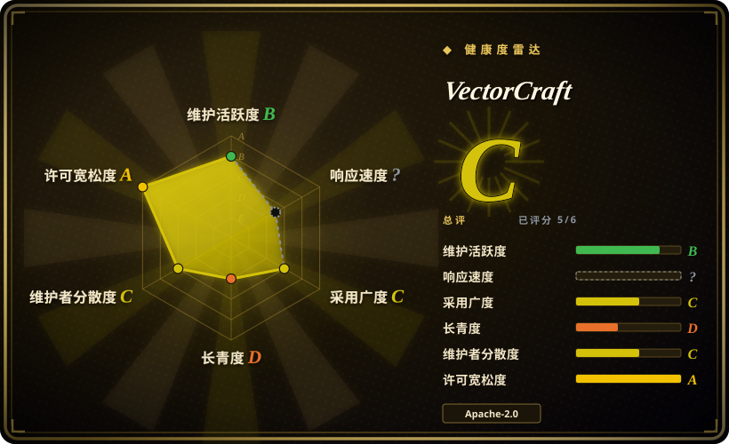
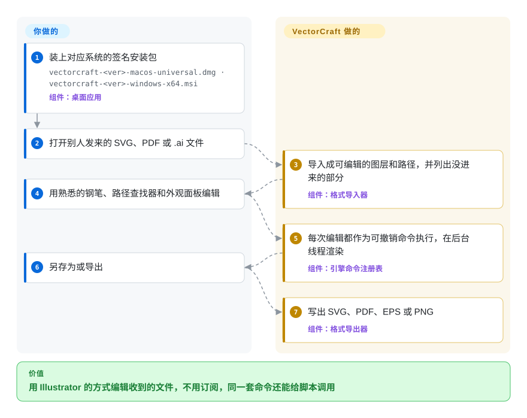

# VectorCraft

客户发来一个 `brand-refresh.ai`，能按你熟悉的方式打开它的只有 Windows 或 macOS 上按月付费的 Illustrator，而且没有任何脚本或 agent 能替你操作那个软件。VectorCraft 是用 Rust 从零写的矢量编辑器：面板和快捷键照着 Illustrator 摆，能把 SVG、PDF、`.ai`、EPS 和 Affinity 文件打开成可编辑的图层，每一条菜单命令都能从命令行和 MCP 服务里调用。

## 何时使用

你是自由插画师，或者小工作室里唯一的设计师，手上记住的是 Illustrator：钢笔和直接选择、路径查找器、外观面板，以及那些已经不用想的快捷键。你想甩掉的是订阅费，或者你换到了 Linux，或者你需要在浏览器标签页里用同一个软件。通常的答案是 Inkscape，它免费，但面板、快捷键和对象模型都是它自己的一套；第一个下午花在重新找东西在哪里，`logo-final.ai` 还在那儿等着。VectorCraft 刻意照抄 Illustrator 的布局（菜单、面板、快捷键、上下文任务栏），并导入这套工作流产出的文件，所以换过来要重新学的东西更少。

第二个理由是自动化。你想让 Claude 或一段脚本去“做”矢量图——“在这两条路径之间做 70 步混合，然后导出 PDF 和 PNG”——手写原始 SVG 离实时混合或精确的路径查找器合并差得很远。VectorCraft 把每一个用户可见的动作都做成一条有名字的命令（v0.7.0 的命令目录里有 685 条），同一批命令可以从 `vectorcraft-cli run`、一个 TCP 端口上的 JSON 控制通道和 MCP 服务调用。和 Inkscape 比，决定性的取舍是：Illustrator 式的操作习惯加上一等公民的 agent 接口，代价是项目只有几天大；和 Graphite 比，它是传统的图层加面板编辑器，而不是基于节点的程序化编辑器。

## 怎么用起来

整个软件是一个大约二十个 crate 的 Rust 工作区：几何、路径布尔运算、文字、效果、CPU 渲染器、每种文件格式各一个导入导出器，一个持有文档和撤销历史的引擎，最上面是 egui 界面。每一个菜单项、每一次工具拖动、每一个对话框按钮都会变成一条“命令”——一次有名字、带参数、引擎执行且可撤销的编辑——所以图形界面、`vectorcraft-cli` 批处理和 MCP 服务（Model Context Protocol，编程 agent 调用外部工具用的插件标准）都走同一道门。可以把它想成一个永远开着宏录制的 Illustrator：按钮只是按下这些命令的方式之一。它替你做的是文件导入（并告诉你哪些东西没进来）、精确的曲线布尔运算、不卡界面的后台渲染和导出；你做的是画，或者告诉 agent 画什么。macOS、Windows、Linux、FreeBSD 和网页（WebAssembly）用的是同一套代码。

<!-- flow-steps:begin (generated from flows/vectorcraft.json by tools/flow_card.py — do not edit) -->

流程文字版

1. **你**：装上对应系统的签名安装包 — `vectorcraft-<ver>-macos-universal.dmg · vectorcraft-<ver>-windows-x64.msi` — 组件：`桌面应用`
2. **你**：打开别人发来的 SVG、PDF 或 .ai 文件
3. **VectorCraft**：导入成可编辑的图层和路径，并列出没进来的部分 — 组件：`格式导入器`
4. **你**：用熟悉的钢笔、路径查找器和外观面板编辑
5. **VectorCraft**：每次编辑都作为可撤销命令执行，在后台线程渲染 — 组件：`引擎命令注册表`
6. **你**：另存为或导出
7. **VectorCraft**：写出 SVG、PDF、EPS 或 PNG — 组件：`格式导出器`

**价值**：用 Illustrator 的方式编辑收到的文件，不用订阅，同一套命令还能给脚本调用

<!-- flow-steps:end -->

## 何时不用

- **下周就要用它交客户的活。** 仓库创建于 2026-09-30，七天里发了九个版本（2026-10-02 的 v0.1.0 到 2026-10-08 的 v0.7.0）；它自己的 ROADMAP 给出的评分是 Illustrator 功能的 69–75%、“资深用户分辨不出差别”的 40–55%，而且是写这些功能的 agent 自评的。交互细节那一轮（修饰键、光标、各种小行为）还没开始。赶工期的活继续用 Illustrator，或者用背后有二十年生产使用的 Inkscape。
- **你需要 3D、栅格效果画廊、变量/数据合并、脚本，或者丰富的画笔和符号库。** README 把这些都列为缺失；3D 与材质为 0%，约 56 个栅格滤镜里只有 4 个左右。这些活留给 Illustrator 或 Affinity Designer；如果要在免费工具链上做 SVG 滤镜效果，Inkscape 走得更远。
- **文件要和继续用 Illustrator 的同事来回传。** VectorCraft 通过 `.ai` 的 PDF 兼容部分或其编辑数据的结构来读取它；符号、图案填充和置入文件进来时只是画出来的外观。README 和 ROADMAP 说也能写出 PDF 兼容的 `.ai`，但 v0.7.0 的 CLI 拒绝了（`document.formats` 把 `.ai` 标为只读，2026-10-09）。它能打开 Affinity 文件，但不能写回。对方用原生软件编辑时，让原生软件留在流程里，别拿它当转换器。
- **一个团队要协同编辑 UI 设计、组件和原型。** 这是单人用的插画编辑器，没有账号、分享和实时协作。这种需求自托管 [Penpot](penpot.zh.md)。
- **你要的是基于节点的非破坏性程序化图形。** VectorCraft 沿用 Illustrator 的对象加外观模型。Graphite（Apache-2.0、Rust、2020 年创建）是围绕节点图构建的。
- **你想把一个矢量引擎嵌进自己的应用。** `vectorcraft-*` 的 crate 都没有发布到 crates.io（2026-10-09 查过），一个未关闭的 issue（#647）还指出几个兄弟应用里已经各有一份分叉漂移的同类代码。用已发布的库，比如 VectorCraft 自己就依赖的 `usvg`/`resvg` 或 `kurbo`。
- **你的组织需要可核验的构建和 clean-room 来源证明。** 没有托管 CI 在 pull request 上跑测试：六个 GitHub workflow 覆盖的是发布、打包检查、FreeBSD、Windows arm64/7 和一个 Affinity 语料库。AGENTS.md 和维护者在 #371 里的回复都说有一个 `cargo xtask cleanroom` 关卡在执行 clean-room 规则，但 `main` 上的 xtask 子命令里根本没有它（2026-10-09）。把“clean-room”当作项目自己的政策，而不是审计过的事实；如果这一点要紧，等第三方审计，或者继续用 Inkscape（GPL，公开历史很长）。
- **你在 Wayland 下的 KDE Plasma 6.3+ 上用数位笔画画。** 笔能移动光标，但软件没有反应（#491），只能在 XWayland 下启动。Windows 之外的压感，以及倾斜和旋转画笔还在路线图上。

## 横向对比

| 替代品 | 是否收录 | 我们的评价 | 取舍 |
|---|---|---|---|
| Adobe Illustrator | 非仓库 | 正式的付费生产活、需要 3D、效果画廊、变量或脚本，或者必须和别的 Illustrator 用户来回传原生 `.ai` 时选 Illustrator；想要同一套布局却不要订阅、要在 Linux 或网页上用、或者要让 agent 来操作时选 VectorCraft。 | 闭源、按订阅授权的桌面软件，形态上不在收录范围。你保住完整的功能深度和生态，放弃的是成本控制、Linux/浏览器版本和可被 agent 驱动的命令接口。 |
| Inkscape | 未收录 | 稳定性和二十年的记录比 Illustrator 肌肉记忆更重要时选 Inkscape；重新学习的成本或 agent 自动化是决定因素、而且你能接受一个才几天大的软件时选 VectorCraft。 | 真实仓库（正本在 GitLab），本轮标签批次没有收录。GPL、成熟、以 SVG 为原生格式，有自己的一套界面习惯；没有能和 VectorCraft 命令目录相比的 MCP 或一等 agent 接口。 |
| Graphite | 未收录 | 想要 Rust 写的、基于节点的程序化非破坏性图形时选 Graphite；想要能打开 `.ai`/PDF/EPS 的传统 Illustrator 式图层加面板编辑器时选 VectorCraft。 | 真实仓库（`GraphiteEditor/Graphite`，Apache-2.0，2020 年创建），本轮标签批次没有收录。更老、社区更大、心智模型不同；它不追求 Illustrator 的文件或界面兼容。 |
| [Penpot](penpot.zh.md) | ✅ | 团队要在你控制的服务器上一起编辑 UI 设计、组件和原型时选 Penpot；单人插画、印刷和矢量文件处理选 VectorCraft。 | Penpot 要付出 Postgres + Valkey + 对象存储的部署成本，换来多人协作、账号和原型；VectorCraft 是本地应用，没有服务器也没有协作。 |
| Affinity Designer | 非仓库 | 想要今天就打磨成熟的商业版 Illustrator 替代品时选 Affinity；必须开源、跑在 Linux 上或要 agent 自动化时选 VectorCraft。 | 闭源商业软件，形态上不在收录范围。VectorCraft 能打开 Affinity 文档但不能写回，所以它是单向的出口，不是能一起干活的同伴。 |

## 技术栈

- **语言：** Rust（edition 2024，`rust-version = 1.95`）；2026-10-09 时约 15 MB 的 Rust 代码，分布在 1,040 个 `.rs` 文件里。工作区设了 `unsafe_code = "deny"`，clippy 规则在发布代码里禁止 `unwrap`/`expect`/`panic!`。
- **工作区：** crate 有 `geom, color, doc, pathops, text, effects, trace, brush, render, svg, pdf, eps, cad, metafile, format, tools, engine, ui-egui, mcp, plugins, affinity, testkit`；应用有 `vectorcraft`（桌面）、`vectorcraft-cli`、`vectorcraft-web`。
- **渲染：** 画布用 `vello_cpu`（多线程 CPU 光栅化器）；窗口在 egui/eframe 之下用 `wgpu`；曲线和颜料用 `kurbo`/`peniko`；布尔运算用 `linesweeper`。
- **格式：** `usvg`（读 SVG）、`krilla`（写 PDF）、`hayro-*` 系列 crate（PDF 解释、CMap、JBIG2/JPEG2000）、`image`/`tiff`/`zune-jpeg`；自带 EPS 的 PostScript 解释器，以及 DXF、EMF/WMF 和 Affinity 读取器。
- **文字：** `skrifa` + `harfrust`（HarfBuzz 的移植）做排版整形，支持希伯来文/阿拉伯文双向排版；中日文和阿拉伯文字体来自可选的构建输入 `storytold/craft-fonts`。
- **插件：** WebAssembly 模块跑在 `wasmi` 解释器里。
- **原生格式：** `.vectorcraft`，有文档的 JSON。

## 依赖

- **最终用户：** 不需要额外跑任何东西。macOS 有签名并公证过的 DMG 和 CLI 压缩包（v0.7.0 的 CLI 实测开发者 ID 为 “Learning Machines LLC”），Windows 有代码签名的 MSI 和便携 zip（x64、arm64、x86），Linux 有 AppImage/Flatpak/deb/rpm/tarball（x86_64、aarch64），还有 FreeBSD tarball 和一个自己托管的静态网页版。
- **agent：** `vectorcraft-cli` 这个二进制；`vectorcraft-cli mcp` 走 stdio 的 MCP，可以无界面运行（进程内引擎），也可以转发给一个用 `--control 7979` 启动的正在运行的应用。
- **GPU：** 桌面窗口需要能用的 GPU 后端（Metal；Windows 先 DX12 再 Vulkan；Linux 上 Vulkan/GL）；CLI 在 CPU 上渲染。
- **从源码构建：** Rust ≥ 1.95 和 `cargo`；网页版要 `trunk`；中日文/阿拉伯文字体可选地需要一份 `CRAFT_FONTS_DIR` 检出。运行时不需要任何网络服务——lockfile 里没有 HTTP 客户端 crate（2026-10-09 查过）。

## 运维难度

**装起来低，依赖它高。** 安装就是每个系统一个签名安装包，没有服务器。代价是变动：一两天一个小版本，行为还在向 Illustrator 靠拢，维护者自己的笔记也写着 Windows/Linux 打包、无障碍和空闲机器上的性能预算都没做完。任何基于命令目录或 MCP 工具做自动化的人都应该锁定版本，并预期命令 id 和参数（只有文字描述，没有 schema）会变。从源码构建是一个开 release LTO 的大型 Rust 工作区；AGENTS.md 提到每个 agent 的 target 目录会涨到约 30 GB。

## 健康度与可持续性

- **维护（截至 2026-10-09）：** 极其活跃——核实当天还在推送，2026-10-02 到 2026-10-08 之间发了 9 个版本，九天里合并了 489 个 pull request、issue 编号过了 #770，许多上报的问题当天就关闭。
- **治理与巴士系数：** 归 `storytold` 组织所有（ArtCraft，2021 年创建，42 个公开仓库）；项目级决定由维护者交给所有者账号 `echelon`（资料里的公司是 ArtCraft），一个账号（`bflatastic`）占了约 1,000 次提交。ROADMAP 用“Claude Opus 5.5 agent 连续工作的小时数”来估剩余工作量，所以代码大部分是 agent 写的，路线图取决于公司能不能一直维持这份投入。[推断]
- **年龄与 Lindy 判断：** 九天大。Lindy 基本给不出先验；不管星数怎么说，这是一次发布，不是一份记录。等它在发布热潮过后撑过一个季度的维护再回来看。
- **采用度：** 九天约 4.7k 星、约 1.8k fork，九个版本的发布资产累计下载约 17.3 万次（不含校验文件），还有几十个不同的外部报告者和 PR 作者（最近 300 个合并 PR 里，除 `bflatastic` 和 `echelon` 外有 10 个账号合并了 3 个以上）——这些是真实早期使用的信号。fork 与星数之比异常地高，星标时间线也没能抽样，所以增速没有独立核实。
- **风险信号：** “clean-room”声明靠的是政策加一个品牌名扫描器（`cargo xtask brands`），不是文档里说的那个 CI 关卡；它以 Adobe 的商标做定位，又读取 Affinity 未公开的格式；ArtCraft 的 logo 适用单独的品牌许可，fork 必须去掉；一个未关闭的提议（#647）想把它和兄弟应用一起搬进共享的 `artcraft-canvas` monorepo，那样仓库地址会变。

## 存疑（未验证）

- [未验证] 对标百分比（功能 69–75%、资深用户层面 40–55%）和“20,000 个形状约 27 ms”的性能说法都是项目自评；ROADMAP 自己也说性能预算还没在空闲机器上重跑过。本页除了一次无界面导出外没有复现。
- [未验证] 星数增速是否自然：本会话的 token 调 stargazers REST 接口返回 404，GraphQL 查询又被本地护栏拦下，所以没有抽样星标时间线。下载量和 issue 区显示有真实用户，但不能排除推广。
- [推断] “大部分由 agent 写成”依据的是 ROADMAP 的 agent 工时估算、AGENTS.md 的自主运行流程，以及一个账号占了大部分提交；人和 agent 的具体比例没有公开。
- [未验证] clean-room 来源本身（没有用到 Adobe 的代码、二进制或输出）无法从外部核实；2026-10-09 能核实的只有：文档里说的 `cargo xtask cleanroom` 关卡不在 `xtask/src/main.rs` 里，也没有 PR 测试 workflow。
- [推断] 读取 Affinity 的私有格式和 Illustrator 的 `AIPrivateData` 流，可能让项目面临 EULA 或法律风险；没有找到也没有做法律评估。
- [未验证] README 说 Windows 和 Linux 打包仍缺，但发布页已经有 MSI/deb/rpm/AppImage/Flatpak 构建；推测“打包”指的是应用商店上架和打磨，上游没有说明。
- [未验证] Inkscape 的“二十年生产使用”和 GPL 许可是常识，本页没有回到它在 GitLab 的正本仓库重新读取（它的 GitHub 镜像不报许可，最后推送在 2022 年）。
- [未验证] 到底有没有哪个版本能写 `.ai`：README（“PDF-compatible `.ai` import and export”）和 ROADMAP（#526）说能，v0.7.0 的 CLI 却报 “PDF-compatible .ai files can be opened but not written”；桌面版的另存为路径和 0.7.0 之后的 `main` 都没查。
- [推断] 雷达上响应度的 `?`（`no_window_signal`）是项目太年轻造成的：评分器抽样的 90 天窗口最多在今天之前 13 天结束，对一个九天大的仓库来说窗口里没有 issue。实际的 issue 区能看到许多当天的维护者回复和关闭，但这不是测出来的响应时间。
- [推断] 只实测了 macOS 的 CLI（v0.7.0：把 `examples/ribbons.vectorcraft` 无界面导出为 PDF/SVG/PNG，MCP 的 `initialize` + `tools/list` 返回 25 个工具，命令目录 685 条）；桌面图形界面和 Windows/Linux 构建都没有跑。
