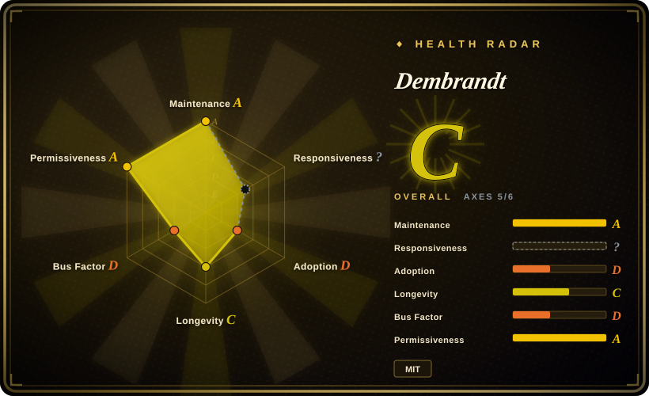
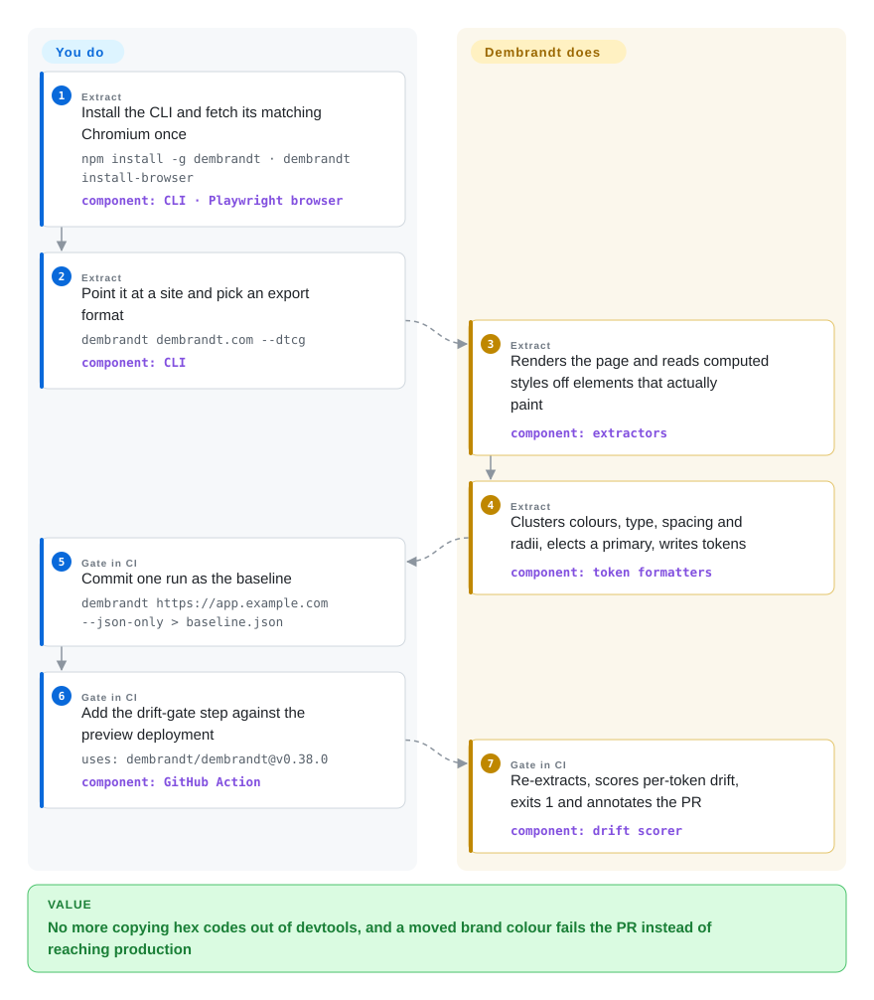

# Dembrandt

You need a site's real colours, fonts and spacing — a client who has no style guide, a competitor you are benchmarking, your own product whose CSS nobody can summarise — and the only way today is clicking through devtools copying hex codes, then finding out weeks later that someone changed the brand blue in production. Dembrandt opens the site in a real browser, reads the styles the page actually paints, and writes them out as token files you can feed to Tailwind, a design tool or an AI agent; run it again in CI and it fails the build when those values move.

## When to use

You're a frontend or design-systems engineer, or the developer an agency hands "rebuild this client's site in our stack". There is no Figma file and no token package — just a live URL. Opening devtools gets you `rgb(0, 0, 238)` off an unstyled link, three near-identical greys and a font stack with fallbacks, and turning that into a usable palette is an afternoon of guessing which of 40 colours is the brand. Or the opposite problem: you *do* own the design system, and a refactor quietly swapped `semantic.primary` from `#635bff` to magenta on one page, which nobody noticed until a customer screenshot.

Reach for Dembrandt when the source of truth is **the rendered site**, not a token file. One command drives Chromium through Playwright, reads computed styles only from elements that actually paint text or borders, clusters and ranks what it finds, and exports W3C DTCG tokens, a Google-format `DESIGN.md` for agents, a Tailwind v4 `@theme` block or a shadcn/ui theme. The same extraction becomes a CI gate: commit one run as a baseline and the bundled GitHub Action exits non-zero and annotates the PR when tokens drift. The deciding tradeoff against [Firecrawl](../web-scraping/crawling-tools/firecrawl.md)'s branding output is deterministic, local, MIT-licensed extraction with token-file and drift-gate outputs, versus a general scraping service that adds an LLM step to name a brand profile; against static CSS analyzers like Project Wallace, it reports what the page *paints*, not every value the stylesheet declares.

## How it works

Dembrandt is a Node CLI that drives a real headless browser (Chromium via `playwright-core`, or Firefox, or an existing browser over CDP — the Chrome DevTools Protocol, the remote-control socket a browser exposes). The browser renders the page, waits for client-side JavaScript to finish building it, and then Dembrandt's extractors walk the DOM — the live tree of elements — reading the *computed* style of each element: the final colour, font and spacing after every stylesheet has been applied, the values you would see in devtools. Its job is the judgement on top: discarding colours that are never painted, colour swatches inside documentation, and code samples; grouping near-duplicates; deciding which colour is the brand primary; and writing the result in the format you asked for. Your job is choosing the URL, the pages to crawl and the output format — and, for the CI gate, deciding when a change is intended and re-approving the baseline. Think of it as a colour-picker that samples every element on the page and then tells you which ten values matter. The same engine is exposed as an MCP server (`dembrandt-mcp`, the Model Context Protocol tool interface that Claude Code, Cursor and similar agents call), where extraction returns a job id the agent polls before asking for tokens, findings or a `DESIGN.md`.

<!-- flow-steps:begin (generated from flows/dembrandt.json by tools/flow_card.py — do not edit) -->

Text version of the flow

1. **You** (Extract): Install the CLI and fetch its matching Chromium once — `npm install -g dembrandt · dembrandt install-browser` — component: `CLI · Playwright browser`
2. **You** (Extract): Point it at a site and pick an export format — `dembrandt dembrandt.com --dtcg` — component: `CLI`
3. **Dembrandt** (Extract): Renders the page and reads computed styles off elements that actually paint — component: `extractors`
4. **Dembrandt** (Extract): Clusters colours, type, spacing and radii, elects a primary, writes tokens — component: `token formatters`
5. **You** (Gate in CI): Commit one run as the baseline — `dembrandt https://app.example.com --json-only > baseline.json`
6. **You** (Gate in CI): Add the drift-gate step against the preview deployment — `uses: dembrandt/dembrandt@v0.38.0` — component: `GitHub Action`
7. **Dembrandt** (Gate in CI): Re-extracts, scores per-token drift, exits 1 and annotates the PR — component: `drift scorer`

**Value**: No more copying hex codes out of devtools, and a moved brand colour fails the PR instead of reaching production

<!-- flow-steps:end -->

## When NOT to use

- **You already own the token source.** If your design tokens live in a JSON file or Figma variables, transform them with Style Dictionary instead — extracting them back out of a rendered site is a lossy round trip that loses names, aliases and intent. Use Dembrandt's drift gate only to check that production still matches.
- **You need to catch layout and visual regressions, not token changes.** Dembrandt compares extracted values (palette, type scale, spacing, radii, shadows); a broken grid, an overlapping modal or a missing image does not move a token. Use screenshot-diff visual regression testing such as BackstopJS or Playwright's own `toHaveScreenshot` for that.
- **The UI is drawn on a canvas.** The project's own limitations list says Canvas/WebGL-rendered sites cannot be analysed — there is no DOM to read. Figma-like web apps, games and map-heavy UIs need a different source (the design file, or [OpenPencil](../design-editors/open-pencil.md) when you have a `.fig`).
- **You want to clone someone else's brand.** The README's Intended Use limits it to sites you own or may analyse, and says not to reproduce third-party identities. Note that the robots.txt check only *warns* and proceeds unless you set `DEMBRANDT_ENFORCE_ROBOTS=1`, and a `--stealth` anti-detection flag exists — the tool will not stop you, so the legal judgement is yours. For a sanctioned rebuild of a site you are authorized to reproduce, [ai-website-cloner-template](../agent-skills/design/design-to-code/ai-website-cloner-template.md) covers screenshots, assets and visual QA; for "make it look like Linear" style briefs, a ready file from [Awesome DESIGN.md](../agent-skills/design/design-to-code/awesome-design-md.md) needs no crawling at all.
- **You need a frozen, audited extraction contract.** The tool is pre-1.0 and its heuristics change almost weekly — v0.34.0, v0.35.0, v0.36.0 and v0.37.0 (2026-09-19 → 09-29) each record values moving on unchanged sites — spacing scale, palette, `semantic.primary` — and the last three tell users to re-approve their baselines (v0.38.0 on 2026-10-03 is additive: churn 0 on its reference site, but the `frameworks` and `iconSystem` names change once). Pin the CLI version (the Action does this per tag) and budget for re-approving after upgrades; if you cannot, gate on a token file you author (Style Dictionary) rather than on extraction.
- **Extracted snapshots must not leave your network.** In the v0.37.0 and v0.38.0 source, a local run contacts only the target site (plus Google Fonts when rendering the brand-guide PDF), but `--key` (and the Action's `key` input) uploads the full extraction JSON to `dembrandt.com`, whose App backend is not public. For air-gapped or regulated environments, keep to local `--compare` against a committed baseline and never set the key.

## Comparison

| Alternative | In index | Our verdict | Tradeoff |
|---|---|---|---|
| [Firecrawl](../web-scraping/crawling-tools/firecrawl.md) | ✅ | Pick Firecrawl when a brand profile is one more field in a scraping pipeline you already run against many sites; pick Dembrandt when you need token files (DTCG, Tailwind, shadcn, DESIGN.md) and a CI drift gate from a local, permissive CLI. | Firecrawl's `branding` format enriches its browser snapshot with an LLM call and ships as an AGPL-3.0 service/API; Dembrandt is deterministic heuristics in an MIT CLI, but it is a single-maintainer pre-1.0 project rather than a funded platform. |
| Project Wallace css-analyzer | not indexed | Pick css-analyzer when you have the CSS source and want an audit of everything declared (200+ metrics, specificity, token usage) in-process with no browser; pick Dembrandt when you only have a URL and need what is actually painted. | css-analyzer is a light Node/browser library over CSS text, so it counts unused and overridden values too; Dembrandt needs a Chromium install and seconds per page but filters to rendered reality. Not added in this tab batch. |
| [Awesome DESIGN.md](../agent-skills/design/design-to-code/awesome-design-md.md) | ✅ | Pick the collection when the site you want to imitate is already one of its prebuilt files and you need nothing else; pick Dembrandt when the site is not in it, or when you need fresh values rather than a static snapshot. | Zero install and zero crawling, but frozen at write time and limited to the named sites; Dembrandt generates the same kind of `DESIGN.md` on demand at the cost of running a browser. |
| BackstopJS | not indexed | Pick BackstopJS when the regression you fear is visual — layout, overlap, missing assets; pick Dembrandt when the regression you fear is a design-system value quietly changing. | Pixel diffs catch everything that renders differently, including noise from dynamic content, and say nothing about which token moved; Dembrandt's per-token report is precise but blind to layout. Not added in this tab batch. |
| Style Dictionary | not indexed | Pick Style Dictionary when you author the tokens and need to build them into CSS, iOS, Android and docs; pick Dembrandt when the tokens exist only in a shipped site, or to verify the shipped site still matches. | Opposite directions: Style Dictionary goes source → platforms with names and aliases intact; Dembrandt goes rendered site → tokens and has to guess names and roles. Not added in this tab batch. |

## Tech stack

- **Language/runtime:** TypeScript compiled to ESM JavaScript; Node.js ≥ 18 (`engines` in `package.json`); the bundled GitHub Action runs it on Node 24 by default.
- **Browser automation:** `playwright-core` (pinned 1.62.1), driving Chromium by default, Firefox on request, or an existing browser via `BROWSER_CDP_ENDPOINT`.
- **CLI & MCP:** `commander`, `ora`, `chalk` for the CLI; `@modelcontextprotocol/sdk` + `zod` for the `dembrandt-mcp` stdio server (21 tool registrations in `mcp-server.ts` as of v0.38.0).
- **Output formats:** W3C DTCG token JSON (with its own validator), Google's DESIGN.md draft format, Tailwind v4 `@theme` CSS, shadcn/ui theme, self-contained HTML report, brand-guide PDF, raw JSON.
- **Optional ML:** `onnxruntime-node` (optional dependency) running a tiny bundled ONNX model for the experimental `--ai` brand-primary prediction.
- **Library entry points:** subpath exports such as `dembrandt/drift`, `dembrandt/dtcg`, `dembrandt/colors` for embedding the scorer or formatters in your own code.

## Dependencies

- **Node.js 18+** and npm (or `npx` for no-install runs).
- **A browser binary:** `playwright-core` ships none, so `dembrandt install-browser` must download the matching Chromium once (or, on bare Linux runners, `npx playwright install --with-deps chromium` for the system libraries). Without it the CLI fails with `browser engine not available`.
- **Network access to the target site.** No database, server or API key is needed for local extraction or a local `--compare` gate.
- **Optional:** `onnxruntime-node` for `--ai`; a `dembrandt.com` API key only if you want cloud snapshot history; `--no-sandbox` in Docker and most CI containers.

## Ops difficulty

**Low.** It is a CLI with no state of its own: install, fetch the browser, run. The real costs are (1) **browser-version coupling** — the downloaded Chromium must match the pinned `playwright-core`, so a mismatched cache fails with "Executable doesn't exist" and CI images need the right tag; (2) **slow, flaky targets** — JS-heavy sites need an 8 s initial wait plus stabilisation (`--slow` triples timeouts), and bot defences can block a headless browser; (3) **baseline churn** — each extraction-heuristic release can move tokens on unchanged sites, so a drift gate needs a pinned CLI version and an occasional `--compare <baseline> --approve`.

## Health & viability

- **Maintenance (as of 2026-10-08):** very active — 68 GitHub releases since the first on 2025-11-23, ten of them in September 2026 alone (latest v0.38.0 on 2026-10-03), about 130 commits since 2026-07-01, and a CHANGELOG that records measured baseline churn per release. Smoke, nightly, liveness and Action-smoke workflows run in CI.
- **Governance & bus factor:** effectively one person. The maintainer (`thevangelist`) has 351 commits; the next human contributors have one or two each, and almost every recent PR is self-authored. The `dembrandt` GitHub org is a personal brand, not a foundation or company with a team. [推断]
- **Age & Lindy verdict:** created 2025-11-22, about ten months old. By the Lindy prior this is young and unproven — ~3.6k stars and 321 forks in ten months say "noticed", not "durable". Activity is high, so age × still-active is favourable on activity and weak on age.
- **Adoption:** the health radar measured 16,064 npm downloads over the last month (2026-10-01; npm's own point API reports 18,304 for 2026-08-31 → 09-29, the windows differ) — real usage for a niche CLI. A companion `dembrandt-skills` agent-skill repo (65 stars) and a DTCG validator sit in the same org.
- **Risk flags:** MIT, no relicense. The commercial layer is a hosted App (snapshot history, team drift dashboards) whose backend repository is not public, and the README says sponsorship "funds the enforcement layer" — today local `--compare` is in the MIT CLI, but future gating of enforcement features behind the App is a plausible open-core drift to watch. [推断] Pre-1.0 with weekly heuristic changes means extraction output is not stable across versions.

## Caveats (unverified)

- [推断] "Effectively one person" rests on GitHub's contributor counts (351 vs ≤3 commits) and the recent PR list; private collaborators or the closed App's team are not visible.
- [推断] The App backend being closed is inferred from the `dembrandt-next` repository named in the 0.34.1 changelog returning 404 and from the org listing only five public repos (checked 2026-10-01).
- [推断] Open-core drift (moving drift enforcement behind the paid App) is a risk reading of the Sponsors paragraph, not an announced plan.
- [未验证] The `--ai` model's "68% vs 32%" brand-primary accuracy is the author's own figure in `docs/usage.md`; no dataset or evaluation was reproduced here, and the shipped `model.onnx` is under 1 KB, so treat it as a small learned scorer rather than a large model.
- [未验证] Baseline-churn numbers in the CHANGELOG (e.g. `stripe.com` stable 5 against threshold 10) are author-measured on two reference sites; churn on your own site after an upgrade was not measured.
- [未验证] Docs drift: `action.yml` still describes the `baseline` input as "a committed baseline JSON, or an App baseline id", and `lib/compare.ts` still posts non-file arguments to `/api/app/drift`, while the 0.36.0 changelog says that route was deleted — use a file baseline.
- [未验证] Firecrawl's branding output was compared from its source tree (`apps/api/src/lib/branding/`, including an LLM step); whether that format is available in a self-hosted Firecrawl deployment was not checked.
- [推断] The radar's responsiveness axis is `?` (no window signal): almost every issue and PR is opened by the maintainer himself, and the last outside issue in the API listing dates from 2026-08-06, so there is too little third-party traffic to time a response. The handful of outside issues (#149, #156) were closed with replies.
- [未验证] How well `--stealth` evades bot detection, and how often headless extraction is blocked on real sites, was not tested.
