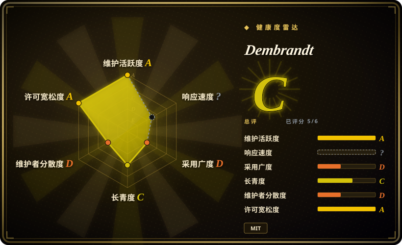
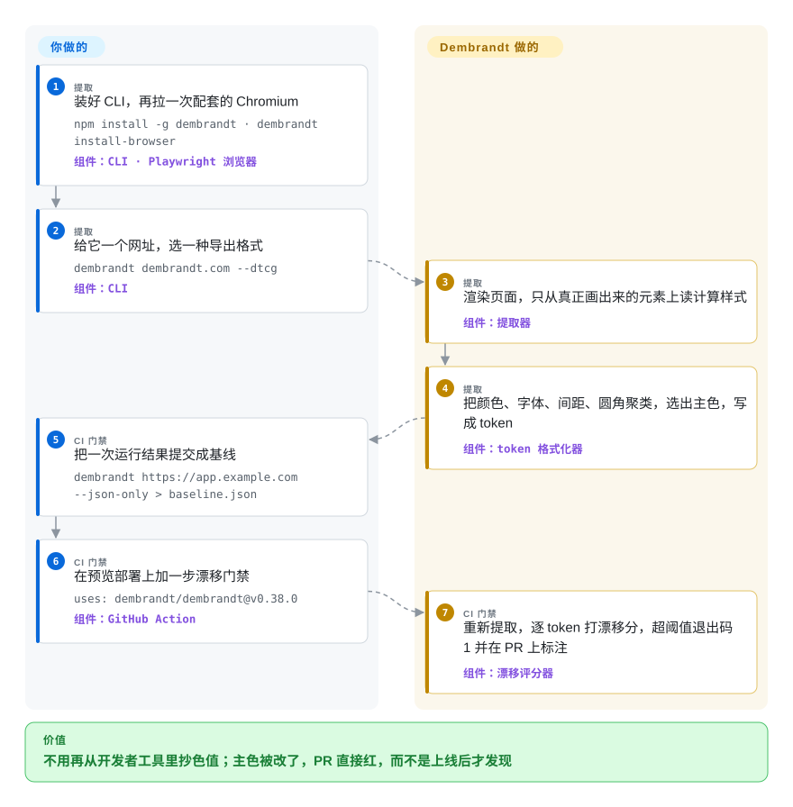

# Dembrandt

你想拿到一个网站真正在用的颜色、字体和间距——客户没有设计规范、要对标竞品、或者自家产品的 CSS 早就没人说得清——现在只能开着开发者工具一个个抄色值，几周后才发现有人在线上把品牌蓝改了。Dembrandt 用真浏览器打开网站，读出页面实际画出来的样式，写成 Tailwind、设计工具或 AI agent 能直接吃的 token 文件；放进 CI 再跑一遍，这些值一变就让构建失败。

## 何时使用

你是前端或设计系统工程师，或者是接到“把这个客户的网站用我们的技术栈重做一遍”的外包开发。手里没有 Figma 文件，也没有 token 包，只有一个线上网址。打开开发者工具，你先看到的是一个没写样式的链接上的 `rgb(0, 0, 238)`、三种几乎一样的灰、一串带兜底的字体栈；要从四十多种颜色里猜出哪个才是品牌色，得耗一下午。或者反过来：设计系统就是你的，一次重构悄悄把某个页面的 `semantic.primary` 从 `#635bff` 改成了洋红，直到客户发来截图才有人发现。

当事实来源是**渲染出来的网站**、而不是某个 token 文件时，就该想到 Dembrandt。一条命令通过 Playwright 驱动 Chromium，只从真正画了文字或边框的元素上读计算样式，聚类、排序，然后导出 W3C DTCG token、给 agent 用的 Google 格式 `DESIGN.md`、Tailwind v4 的 `@theme` 块或 shadcn/ui 主题。同一次提取还能变成 CI 门禁：把一次运行结果提交成基线，自带的 GitHub Action 发现 token 漂移就以非零码退出并在 PR 上标注。和 [Firecrawl](../web-scraping/crawling-tools/firecrawl.zh.md) 的品牌（branding）输出相比，决定性的取舍是：本地、确定性、MIT 许可的提取，直接产出 token 文件和漂移门禁；而 Firecrawl 是通用抓取服务，靠额外一次大模型调用来归纳品牌画像。和 Project Wallace 这类静态 CSS 分析器相比，它报告的是页面**画出来**的值，而不是样式表里声明过的每一个值。

## 怎么用起来

Dembrandt 是一个 Node 命令行工具，驱动一个真正的无头浏览器（默认是 `playwright-core` 带的 Chromium，也可以用 Firefox，或者通过 CDP——Chrome DevTools Protocol，浏览器对外暴露的远程控制接口——连一个已经开着的浏览器）。浏览器把页面渲染出来、等前端 JavaScript 把页面搭完，然后 Dembrandt 的提取器遍历 DOM（页面上活的元素树），读每个元素的**计算样式**：所有样式表叠加之后最终生效的颜色、字体和间距，也就是你在开发者工具里看到的那些值。它真正替你干的是后面的判断：扔掉从没画出来的颜色、文档里的色卡和代码示例里的颜色，合并几乎相同的值，判断哪个是品牌主色，再按你要的格式写出来。你要做的是选网址、选要爬哪几页、选输出格式——如果用 CI 门禁，还要判断哪次改动是有意的，然后重新批准基线。可以把它想成一支取色笔：把页面上每个元素都吸一遍，再告诉你哪十个值才算数。同一套引擎也以 MCP 服务器的形式提供（`dembrandt-mcp`，MCP 即 Model Context Protocol，是 Claude Code、Cursor 这类 agent 调用外部工具的接口）：提取返回一个任务 id，agent 轮询它，再拿这个 id 去要 token、问题清单或 `DESIGN.md`。

<!-- flow-steps:begin (generated from flows/dembrandt.json by tools/flow_card.py — do not edit) -->

流程文字版

1. **你**（提取）：装好 CLI，再拉一次配套的 Chromium — `npm install -g dembrandt · dembrandt install-browser` — 组件：`CLI · Playwright 浏览器`
2. **你**（提取）：给它一个网址，选一种导出格式 — `dembrandt dembrandt.com --dtcg` — 组件：`CLI`
3. **Dembrandt**（提取）：渲染页面，只从真正画出来的元素上读计算样式 — 组件：`提取器`
4. **Dembrandt**（提取）：把颜色、字体、间距、圆角聚类，选出主色，写成 token — 组件：`token 格式化器`
5. **你**（CI 门禁）：把一次运行结果提交成基线 — `dembrandt https://app.example.com --json-only > baseline.json`
6. **你**（CI 门禁）：在预览部署上加一步漂移门禁 — `uses: dembrandt/dembrandt@v0.37.0` — 组件：`GitHub Action`
7. **Dembrandt**（CI 门禁）：重新提取，逐 token 打漂移分，超阈值退出码 1 并在 PR 上标注 — 组件：`漂移评分器`

**价值**：不用再从开发者工具里抄色值；主色被改了，PR 直接红，而不是上线后才发现

<!-- flow-steps:end -->

## 何时不用

- **token 的源头本来就在你手里。** 如果设计 token 存在 JSON 文件或 Figma 变量里，就用 Style Dictionary 去做转换；从渲染后的网站再把它们提取回来是一次有损往返，名字、别名和意图都会丢。Dembrandt 的漂移门禁只适合用来核对线上是否还和源头一致。
- **你要抓的是布局和视觉回归，不是 token 变化。** Dembrandt 比较的是提取出的值（色板、字号阶梯、间距、圆角、阴影）；栅格错位、弹窗遮挡、图片丢失都不会让任何 token 变化。这类问题用截图比对的视觉回归测试，比如 BackstopJS 或 Playwright 自带的 `toHaveScreenshot`。
- **界面是画在 canvas 上的。** 项目自己的限制清单写明：Canvas/WebGL 渲染的网站无法分析——没有 DOM 可读。类 Figma 的网页应用、游戏、以地图为主的界面要换个来源（去拿设计稿；手里有 `.fig` 就用 [OpenPencil](../design-editors/open-pencil.zh.md)）。
- **你想克隆别人的品牌。** README 的“预期用途”把它限定在你拥有或获准分析的网站，并要求不得复制第三方的品牌形象。要注意：robots.txt 检查默认只**警告**然后照样继续，除非设置 `DEMBRANDT_ENFORCE_ROBOTS=1`；而且还有一个 `--stealth` 反检测开关——工具不会拦你，法律上的判断得你自己做。如果是获得授权、要整站重建，[ai-website-cloner-template](../agent-skills/design/design-to-code/ai-website-cloner-template.zh.md) 覆盖截图、素材和视觉验收；如果需求只是“做得像 Linear 那样”，[Awesome DESIGN.md](../agent-skills/design/design-to-code/awesome-design-md.zh.md) 里的现成文件根本不用爬。
- **你需要一份冻结、可审计的提取契约。** 它还在 1.0 之前，启发式规则几乎每周都在改——v0.34.0、v0.35.0、v0.36.0、v0.37.0（2026-09-19 → 09-29）都记录了未改动网站上的值发生移动（间距阶梯、色板、`semantic.primary`），后三个版本都要求用户重新批准基线。要么锁死 CLI 版本（Action 按 tag 自动锁）并预留升级后重新批准的工作量；做不到的话，就改为对你自己维护的 token 文件做门禁（Style Dictionary），而不是对提取结果做门禁。
- **提取快照不能离开你的网络。** 按 v0.37.0 源码，本地运行只访问目标网站（渲染品牌手册 PDF 时还会加载 Google Fonts）；但 `--key`（以及 Action 的 `key` 输入）会把完整的提取 JSON 上传到 `dembrandt.com`，而那个 App 的后端并不公开。隔离网络或强监管环境里，只用本地 `--compare` 对比已提交的基线，永远不要设置 key。

## 横向对比

| 替代品 | 是否收录 | 我们的评价 | 取舍 |
|---|---|---|---|
| [Firecrawl](../web-scraping/crawling-tools/firecrawl.zh.md) | ✅ | 如果品牌画像只是你对大量网站跑的抓取管线里多出的一个字段，选 Firecrawl；如果你要的是 token 文件（DTCG、Tailwind、shadcn、DESIGN.md）和 CI 漂移门禁，并且希望是本地、宽松许可的 CLI，选 Dembrandt。 | Firecrawl 的 `branding` 格式在浏览器快照之上再调一次大模型来补全，整体是 AGPL-3.0 的服务/API；Dembrandt 是 MIT 许可、纯确定性启发式的 CLI，但它是单人维护的 1.0 前项目，不是有资金支撑的平台。 |
| Project Wallace css-analyzer | 未收录 | 手里有 CSS 源码、想在进程内不开浏览器就审计所有声明（200 多项指标、选择器优先级、token 使用情况），选 css-analyzer；只有一个网址、需要的是实际画出来的值，选 Dembrandt。 | css-analyzer 是对 CSS 文本做分析的轻量 Node/浏览器库，没用到和被覆盖的值也会算进去；Dembrandt 要装 Chromium、每页要几秒，但只留下真正渲染出来的结果。本批未收录（not added in this tab batch）。 |
| [Awesome DESIGN.md](../agent-skills/design/design-to-code/awesome-design-md.zh.md) | ✅ | 你要模仿的网站恰好已经有现成文件、其他什么都不需要时，选这个合集；网站不在里面、或者你要的是最新的值而不是一份静态快照时，选 Dembrandt。 | 合集零安装、零爬取，但写完就冻结，而且只覆盖它点名的那些网站；Dembrandt 能按需生成同类 `DESIGN.md`，代价是要跑一个浏览器。 |
| BackstopJS | 未收录 | 你担心的回归是视觉上的——布局、遮挡、素材丢失——选 BackstopJS；你担心的是设计系统里某个值被悄悄改掉，选 Dembrandt。 | 像素比对能抓到所有渲染差异，也包括动态内容带来的噪声，却说不出是哪个 token 变了；Dembrandt 的逐 token 报告很精确，但看不到布局。本批未收录（not added in this tab batch）。 |
| Style Dictionary | 未收录 | token 是你自己写的、要构建成 CSS、iOS、Android 和文档时，选 Style Dictionary；token 只存在于已上线的网站里，或者要核对上线网站是否仍与源头一致时，选 Dembrandt。 | 方向正好相反：Style Dictionary 从源头到各平台，名字和别名都保留；Dembrandt 从渲染后的网站反推 token，名字和角色只能靠猜。本批未收录（not added in this tab batch）。 |

## 技术栈

- **语言与运行时：** TypeScript 编译为 ESM JavaScript；Node.js ≥ 18（见 `package.json` 的 `engines`）；自带的 GitHub Action 默认用 Node 24 运行。
- **浏览器自动化：** `playwright-core`（锁定 1.62.1），默认驱动 Chromium，可选 Firefox，或通过 `BROWSER_CDP_ENDPOINT` 连接已有浏览器。
- **CLI 与 MCP：** CLI 用 `commander`、`ora`、`chalk`；`dembrandt-mcp` 是基于 `@modelcontextprotocol/sdk` + `zod` 的 stdio 服务器（v0.37.0 的 `mcp-server.ts` 里有 21 处工具注册）。
- **输出格式：** W3C DTCG token JSON（自带校验器）、Google 的 DESIGN.md 草案格式、Tailwind v4 `@theme` CSS、shadcn/ui 主题、自包含 HTML 报告、品牌手册 PDF、原始 JSON。
- **可选机器学习：** 可选依赖 `onnxruntime-node`，运行仓库里自带的一个很小的 ONNX 模型，用于实验性的 `--ai` 主色预测。
- **库入口：** 提供 `dembrandt/drift`、`dembrandt/dtcg`、`dembrandt/colors` 等子路径导出，可以把漂移评分或格式化器嵌进你自己的代码。

## 依赖

- **Node.js 18+** 和 npm（或者用 `npx` 免安装运行）。
- **一个浏览器二进制：** `playwright-core` 不带浏览器，所以必须先跑一次 `dembrandt install-browser` 下载匹配版本的 Chromium（在裸 Linux 机器上还要用 `npx playwright install --with-deps chromium` 装系统库）。不装就会报 `browser engine not available`。
- **能访问目标网站的网络。** 本地提取或本地 `--compare` 门禁不需要数据库、服务端或 API key。
- **可选：** `--ai` 需要 `onnxruntime-node`；只有想要云端快照历史时才需要 `dembrandt.com` 的 API key；在 Docker 和大多数 CI 容器里要加 `--no-sandbox`。

## 运维难度

**低。** 它是一个自身不保存状态的命令行工具：安装、下浏览器、运行。真正的成本在三处：（1）**浏览器版本耦合**——下载的 Chromium 必须和锁定的 `playwright-core` 匹配，缓存版本不对会报 “Executable doesn't exist”，CI 镜像也要选对 tag；（2）**慢而不稳的目标站**——重 JavaScript 的网站要先等 8 秒再等页面稳定（`--slow` 把超时放大三倍），反爬措施也可能挡住无头浏览器；（3）**基线波动**——每次改提取启发式的版本都可能让未改动网站的 token 移动，所以漂移门禁要锁定 CLI 版本，并且时不时要跑一次 `--compare <baseline> --approve`。

## 健康度与可持续性

- **维护情况（截至 2026-10-01）：** 非常活跃——自 2025-11-23 首个版本以来共 67 个 GitHub release，仅 2026 年 9 月就有 10 个（最新 v0.37.0，2026-09-29）；2026-07-01 以来约 130 次提交；CHANGELOG 逐版本记录实测的基线波动。CI 里有冒烟、夜间、存活性和 Action 冒烟等工作流。
- **治理与巴士因子：** 实际上就是一个人。维护者（`thevangelist`）有 351 次提交，其后的人类贡献者每人只有一两次，最近的 PR 几乎都是他自己提的。`dembrandt` 这个 GitHub 组织是个人品牌，不是基金会，也不是有团队的公司。[推断]
- **年龄与林迪判断：** 创建于 2025-11-22，大约十个月。按林迪先验，这是一个年轻、未经时间检验的项目——十个月约 3.6k star、321 个 fork，说明“被注意到了”，不说明“能长久”。活跃度很高，所以“年龄 × 仍在活跃”这一组合在活跃上加分、在年龄上减分。
- **采用情况：** 健康度雷达测得最近一个月 npm 下载 16,064 次（2026-10-01；npm 自己的统计接口给出 2026-08-31 → 09-29 为 18,304 次，两者统计窗口不同）——对一个细分领域的 CLI 来说是真实使用。同一组织下还有配套的 agent skill 仓库 `dembrandt-skills`（65 star）和一个 DTCG 校验器。
- **风险信号：** MIT，没有改许可证的历史。商业层是托管的 App（快照历史、团队漂移看板），其后端仓库不公开；README 说赞助资金“用于门禁执行层”——目前本地 `--compare` 仍在 MIT 的 CLI 里，但未来把执行类功能收进 App 后面，是值得留意的开放核心（open-core）漂移。[推断] 1.0 之前、启发式每周都在变，意味着不同版本的提取输出并不稳定。

## 存疑（未验证）

- [推断] “实际上就是一个人”依据的是 GitHub 贡献者计数（351 对 ≤3 次提交）和近期 PR 列表；私有协作者或闭源 App 背后的团队看不到。
- [推断] App 后端闭源，是根据 0.34.1 changelog 提到的 `dembrandt-next` 仓库返回 404、以及该组织只有 5 个公开仓库推断的（2026-10-01 核对）。
- [推断] “开放核心漂移”（把漂移门禁搬到付费 App 后面）是对赞助段落的风险解读，不是官方宣布的计划。
- [未验证] `--ai` 模型“68% 对 32%”的主色准确率是作者在 `docs/usage.md` 里给出的数字，这里没有复现数据集或评测；仓库里的 `model.onnx` 不到 1 KB，应把它看作一个小型学习打分器，而不是大模型。
- [未验证] CHANGELOG 里的基线波动数字（例如 `stripe.com` 在阈值 10 下波动 5）是作者在两个参考网站上测的；你自己网站升级后的波动没有测过。
- [未验证] 文档不一致：`action.yml` 仍把 `baseline` 输入描述为“已提交的基线 JSON，或 App 基线 id”，`lib/compare.ts` 也仍会把非文件参数 POST 到 `/api/app/drift`，而 0.36.0 的 changelog 说那条路由已被删除——请用文件基线。
- [未验证] Firecrawl 的 branding 输出是从其源码树（`apps/api/src/lib/branding/`，含一次大模型调用）比较得出的；自托管的 Firecrawl 是否提供这个格式没有核对。
- [推断] 雷达的响应度轴是 `?`（没有可用的时间窗信号）：几乎所有 issue 和 PR 都是维护者自己开的，API 列表里最近一个外部 issue 是 2026-08-06，第三方流量太少，无法统计响应时间。少数外部 issue（#149、#156）都已回复并关闭。
- [未验证] `--stealth` 规避反爬的效果，以及无头提取在真实网站上被拦截的频率，都没有测试。
